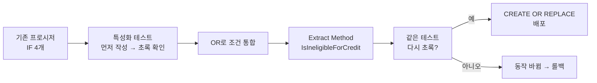

import { Callout, Steps, Step, Tabs, TabsList, TabsTrigger, TabsContent, Icon } from '@/components/writing-ui';

## 이게 뭔데

저장 프로시저를 까봤더니 이런 코드가 있다. 결과는 똑같은데, 거기로 가는 길이 세 갈래.

```sql
IF v_employment_status = 'TERMINATED' THEN
  RETURN 0;
END IF;
IF v_months_employed < 6 THEN
  RETURN 0;
END IF;
IF v_account_flagged = 'Y' THEN
  RETURN 0;
END IF;
```

세 개의 IF가 각각 다른 걸 검사하는데, 결말은 전부 `RETURN 0`. 즉 **"이 셋 중 하나라도 걸리면 대출 한도는 0"** 이라는 한 가지 규칙을, 굳이 세 토막으로 흩뿌려 놓은 거다.

조건식 통합(Consolidate Conditional Expression)은 이걸 한 줄로 묶는 리팩토링이다.

```sql
IF v_employment_status = 'TERMINATED'
   OR v_months_employed < 6
   OR v_account_flagged = 'Y' THEN
  RETURN 0;
END IF;
```

비유하자면 이렇다. 회사 입구에 보안 게이트가 세 개 줄지어 있는데, 셋 다 통과 못 하면 결국 똑같이 "출입 불가" 도장이 찍힌다. 그럼 게이트 세 개 세워둘 게 아니라 입구에 "사원증·방문증·임시패스 중 하나라도 없으면 출입 불가"라고 한 줄 써붙이는 게 낫잖아. 검사는 그대로 다 하되, **'무엇을 검사하느냐'가 아니라 '왜 검사하느냐'가 한눈에 보이게** 만드는 거다.

<Callout type="info" title="이 리팩토링의 좌표">
이건 책 10장 **내부 리팩토링(Internal Refactorings)** 에 속한다. 프로시저의 시그니처(이름·파라미터·반환 타입)를 건드리지 않으므로 **외부 프로그램에 영향이 0이다.** 전환 기간(Transition Period)도, drop date도 필요 없다. 마이그레이션 스크립트도 사실상 "프로시저 본문만 갈아끼우기" 한 줄. 그래서 DB 리팩토링 입문용으로 제일 만만하다.
</Callout>

이건 Martin Fowler가 『Refactoring』에서 정의한 코드 리팩토링을 그대로 PL/SQL에 옮겨온 것이다. 책의 메시지는 단순하다. 검증된 코드 리팩토링을 저장 프로시저라고 안 쓸 이유가 없다는 것.

## 언제 쓰나

발동 조건은 딱 하나다. **여러 조건 검사가 결과적으로 같은 곳으로 수렴할 때.**

- 여러 IF가 전부 같은 값을 `RETURN` 하거나, 같은 변수에 같은 값을 대입하거나, 같은 예외를 던질 때.
- "이 세 가지 중 하나라도 참이면 X"인데 코드는 IF 세 개로 쪼개져 있을 때.
- 반대로 "이 세 가지가 전부 참이어야 X"인데 IF가 중첩으로 줄줄이 들여쓰기 되어 있을 때(이건 `OR`이 아니라 `AND`로 묶는다).

핵심 신호는 **결과의 중복**이다. 분기 모양은 달라도 도착지가 같다면, 그건 사실 하나의 규칙이 변장하고 있는 거다.

<Callout type="warning" title="조건이 진짜로 같은 결과인지부터 확인">
함정이 하나 있다. 겉보기엔 다 `RETURN 0`인데, 중간에 **부수효과(side effect)** 가 끼어 있으면 합치는 순간 동작이 바뀐다. 예를 들어 두 번째 IF 블록 안에 `INSERT INTO audit_log(...)` 한 줄이 숨어 있다면, `OR`로 묶는 순간 그 로깅이 사라지거나 조건이 달라진다. 합치기 전에 "각 블록이 정말 RETURN 0 **그것만** 하는가"를 먼저 봐라. 순수하게 같은 결과일 때만 통합 대상이다.
</Callout>

### 현실 시나리오: 이런 적 있을 거임

은행 대출 한도 계산 프로시저 `CalculateCreditLimit`를 맡았다고 치자. 3년 전 누군가 처음 짤 땐 "퇴사자면 한도 0" 한 줄이었다. 그런데 요건이 야금야금 붙었다. 근속 6개월 미만도 추가, 계좌 플래그 걸린 사람도 추가, 보험(Insurance) 미가입자도 추가… 그때마다 사람들은 **제일 안전한 방식**으로 손댔다. 기존 코드는 안 건드리고, IF 블록 하나를 위에 툭 더 얹는 거다.

```sql
PROCEDURE CalculateCreditLimit(
  p_customer_id IN  NUMBER,
  p_limit       OUT NUMBER
) IS
  v_status   VARCHAR2(20);
  v_months   NUMBER;
  v_flagged  VARCHAR2(1);
  v_insured  VARCHAR2(1);
  v_balance  NUMBER;
BEGIN
  SELECT employment_status, months_employed, account_flagged,
         has_insurance, current_balance
    INTO v_status, v_months, v_flagged, v_insured, v_balance
    FROM customer_profile
   WHERE customer_id = p_customer_id;

  -- 2021: 퇴사자 거름
  IF v_status = 'TERMINATED' THEN
    p_limit := 0;
    RETURN;
  END IF;

  -- 2022: 신입은 위험
  IF v_months < 6 THEN
    p_limit := 0;
    RETURN;
  END IF;

  -- 2023: 사고 플래그
  IF v_flagged = 'Y' THEN
    p_limit := 0;
    RETURN;
  END IF;

  -- 2024: 보험 미가입 (Policy 변경)
  IF v_insured = 'N' THEN
    p_limit := 0;
    RETURN;
  END IF;

  -- 여기까지 살아남았으면 실제 한도 계산
  p_limit := v_balance * 0.3;
END;
```

코드만 보면 죄가 없어 보인다. 각자 자기 시점에선 가장 보수적인 선택을 했으니까. 근데 3년 누적된 결과물을 처음 보는 사람 입장에선, IF가 네 개 줄줄이 박혀 있고 다 `p_limit := 0; RETURN;`이다. **"이 네 개가 결국 같은 얘기인가? 아니면 각자 다른 처리를 하다가 우연히 같아 보이는 건가?"** 를 한 블록씩 눈으로 검증해야 한다. 이게 사람을 피곤하게 만든다.

그리고 더 무서운 시나리오. 다음 사람이 "VIP 고객은 한도 0 처리에서 예외" 라는 요건을 받았다. 그럼 IF 네 개를 다 찾아서 각각 `AND v_grade != 'VIP'`를 붙여야 한다. 하나라도 빠뜨리면? 특정 경로로 들어온 VIP만 조용히 한도 0이 되는, 재현 안 되는 버그가 태어난다. **흩어진 조건은 빠뜨리기 좋은 구조다.**

## 이렇게 한다

목표는 "결과가 같은 IF들"을 단일 조건식으로 합치는 것. 그리고 그 자체가 끝이 아니라 **Extract Method를 위한 발판**을 까는 거다. 조건이 한 줄로 모이면, 그 한 줄에 이름을 붙여 함수로 빼낼 수 있게 된다.

<Steps>
<Step title="결과가 같은 IF들을 식별한다">
위 코드에서 네 개의 IF는 전부 `p_limit := 0; RETURN;`으로 끝난다. 결과가 동일하다. 그리고 각 블록 안에 부수효과(로깅·다른 대입)가 없는지 확인했다. 통합 대상 확정.
</Step>
<Step title="OR로 묶어 단일 조건식으로 합친다">
각 IF의 조건만 떼어 `OR`로 연결한다. 검사 자체는 하나도 안 빠진다. 모양만 바뀐다.
</Step>
<Step title="조건식에 이름을 붙여 함수로 추출한다 (Extract Method)">
합친 조건이 "무엇을 뜻하는가"를 함수 이름으로 박는다. `OR ... OR ...` 덩어리가 `IsIneligibleForCredit(...)` 한 줄이 된다.
</Step>
<Step title="단위 테스트로 동작 보존을 증명하고 배포한다">
리팩토링의 정의상 **겉보기 동작은 안 바뀌어야** 한다. 그걸 말로 우기지 말고 테스트로 증명한 다음 프로시저를 교체한다.
</Step>
</Steps>

### 1단계 → 2단계: 조건 통합 (DDL은 프로시저 본문 교체)

먼저 IF 네 개를 `OR` 하나로 합친다. 이건 스키마 변경(테이블 구조)이 아니라 **메서드 본문 변경**이라, "마이그레이션"이라 해봐야 `CREATE OR REPLACE PROCEDURE` 한 방이다.

```sql
-- After (2단계): 결과가 같은 네 IF를 OR로 통합
CREATE OR REPLACE PROCEDURE CalculateCreditLimit(
  p_customer_id IN  NUMBER,
  p_limit       OUT NUMBER
) IS
  v_status   VARCHAR2(20);
  v_months   NUMBER;
  v_flagged  VARCHAR2(1);
  v_insured  VARCHAR2(1);
  v_balance  NUMBER;
BEGIN
  SELECT employment_status, months_employed, account_flagged,
         has_insurance, current_balance
    INTO v_status, v_months, v_flagged, v_insured, v_balance
    FROM customer_profile
   WHERE customer_id = p_customer_id;

  IF    v_status  = 'TERMINATED'
     OR v_months  < 6
     OR v_flagged = 'Y'
     OR v_insured = 'N' THEN
    p_limit := 0;
    RETURN;
  END IF;

  p_limit := v_balance * 0.3;
END;
```

벌써 읽기가 다르다. "이 중 하나라도 걸리면 한도 0"이 **시각적으로 한 덩어리**다. 그리고 아까 그 VIP 예외 요건? 이제 `AND v_grade != 'VIP'` 한 번만 붙이면 끝이다. 빠뜨릴 자리가 없다.

### 3단계: 이름 붙여 추출 (Extract Method)

조건식이 한 줄로 모였으니 이제 진짜 가치가 나온다. 이 `OR` 덩어리는 결국 **"신용 부적격 사유"** 라는 하나의 개념이다. 그럼 그렇게 부르자.

```sql
-- 부적격 판정을 별도 함수로 추출
FUNCTION IsIneligibleForCredit(
  p_status   IN VARCHAR2,
  p_months   IN NUMBER,
  p_flagged  IN VARCHAR2,
  p_insured  IN VARCHAR2
) RETURN BOOLEAN IS
BEGIN
  RETURN p_status  = 'TERMINATED'
      OR p_months  < 6
      OR p_flagged = 'Y'
      OR p_insured = 'N';
END;
```

```sql
-- 본 프로시저는 의도만 읽힌다
CREATE OR REPLACE PROCEDURE CalculateCreditLimit(
  p_customer_id IN  NUMBER,
  p_limit       OUT NUMBER
) IS
  v_status   VARCHAR2(20);
  v_months   NUMBER;
  v_flagged  VARCHAR2(1);
  v_insured  VARCHAR2(1);
  v_balance  NUMBER;
BEGIN
  SELECT employment_status, months_employed, account_flagged,
         has_insurance, current_balance
    INTO v_status, v_months, v_flagged, v_insured, v_balance
    FROM customer_profile
   WHERE customer_id = p_customer_id;

  IF IsIneligibleForCredit(v_status, v_months, v_flagged, v_insured) THEN
    p_limit := 0;
    RETURN;
  END IF;

  p_limit := v_balance * 0.3;
END;
```

이제 `CalculateCreditLimit` 본문은 "프로필 읽고 → 부적격이면 0 → 아니면 잔액의 30%"라는 **줄거리**로 읽힌다. 부적격 판정의 디테일(어떤 status가, 몇 개월이…)은 `IsIneligibleForCredit`라는 이름 뒤로 숨었다. 이게 조건식 통합이 Fowler의 책에서 "Extract Method의 발판"이라 불리는 이유다. **흩어진 IF로는 함수로 뺄 수가 없다. 한 줄로 모아야 이름을 붙일 수 있다.**

<Callout type="note" title="AND 버전도 똑같다">
여기선 `OR`(하나라도 걸리면 부적격) 예시를 들었지만, 반대 케이스도 흔하다. "근속 1년 이상 **그리고** 사고 플래그 없음 **그리고** 보험 가입"을 만족해야 우대 금리를 주는, 중첩 IF가 들여쓰기로 계단을 이루는 경우. 이건 `AND`로 묶어 `QualifiesForPreferredRate(...)` 같은 양성(positive) 함수로 빼면 된다. 방향만 반대지 동작은 같다.
</Callout>

### 4단계: 단위 테스트라는 안전망

여기가 2006년 책과 2026년 실무가 갈리는 지점이다. 책은 "리팩토링이니 동작이 보존된다"고 말하지만, **그걸 무엇으로 증명하는가**는 결국 테스트다. 부수효과 빠뜨림(앞의 경고), `OR` 연산자 우선순위 실수, 통합 과정의 단순 오타 — 이걸 사람 눈으로만 막으려는 게 사고의 시작이다.

핵심은 **리팩토링 전에 먼저 테스트를 깔고**, 리팩토링 후 그대로 통과하는지 보는 것이다(characterization test, 특성화 테스트). 빨강→초록이 아니라, **계속 초록**이어야 맞다.

<Tabs defaultValue="utplsql">
<TabsList>
<TabsTrigger value="utplsql">utPLSQL (DB 내부)</TabsTrigger>
<TabsTrigger value="app">앱 단 통합 테스트</TabsTrigger>
</TabsList>

<TabsContent value="utplsql">

Oracle이라면 `utPLSQL`로 프로시저 자체를 DB 안에서 테스트한다. 경계값(근속 5개월 vs 6개월), 각 사유별 0 처리, 그리고 "전부 통과 시 정상 계산"까지 케이스를 깐다.

```sql
CREATE OR REPLACE PACKAGE BODY test_credit_limit IS

  --%test(퇴사자는 한도 0)
  PROCEDURE terminated_gets_zero IS
    v_limit NUMBER;
  BEGIN
    -- given: 퇴사자 픽스처
    setup_customer(p_id => 1, p_status => 'TERMINATED');
    -- when
    CalculateCreditLimit(1, v_limit);
    -- then
    ut.expect(v_limit).to_equal(0);
  END;

  --%test(근속 6개월은 경계 통과)
  PROCEDURE tenure_six_months_passes IS
    v_limit NUMBER;
  BEGIN
    setup_customer(p_id => 2, p_status => 'ACTIVE',
                   p_months => 6, p_balance => 1000);
    CalculateCreditLimit(2, v_limit);
    ut.expect(v_limit).to_equal(300);   -- 1000 * 0.3
  END;

  --%test(보험 미가입은 한도 0)
  PROCEDURE uninsured_gets_zero IS
    v_limit NUMBER;
  BEGIN
    setup_customer(p_id => 3, p_status => 'ACTIVE',
                   p_months => 24, p_insured => 'N');
    CalculateCreditLimit(3, v_limit);
    ut.expect(v_limit).to_equal(0);
  END;

END;
```

이 패키지를 **리팩토링 전 코드에 대고** 먼저 돌려서 전부 초록인 걸 확인한다. 그게 "현재 동작"의 스냅샷이다. 그다음 통합·추출을 하고 다시 돌린다. 여전히 초록이면 동작 보존이 **증명된** 거다.

</TabsContent>

<TabsContent value="app">

DB에 테스트 프레임워크를 깔기 어려운 환경이면, 프로시저를 호출하는 애플리케이션 단에서 통합 테스트로 감싼다. 결국 외부 인터페이스가 안 바뀌었으니, 호출부 테스트가 그대로 통과하는 게 곧 동작 보존의 증거다.

```typescript
import { describe, it, expect } from 'vitest';
import { callCreditLimit } from './db';  // 프로시저 래퍼

describe('CalculateCreditLimit (리팩토링 전후 불변)', () => {
  it('퇴사자는 0', async () => {
    await seed({ id: 1, status: 'TERMINATED' });
    expect(await callCreditLimit(1)).toBe(0);
  });

  it('근속 6개월 + 정상이면 잔액의 30%', async () => {
    await seed({ id: 2, status: 'ACTIVE', months: 6, balance: 1000 });
    expect(await callCreditLimit(2)).toBe(300);
  });

  it('보험 미가입은 0', async () => {
    await seed({ id: 3, status: 'ACTIVE', months: 24, insured: 'N' });
    expect(await callCreditLimit(3)).toBe(0);
  });
});
```

</TabsContent>
</Tabs>

배포 흐름은 이렇게 그릴 수 있다. 테스트가 양쪽 경계를 잡고 있으니, 가운데서 본문을 갈아끼워도 안전하다.



<Callout type="success" title="버전 관리·배포 자동화 한 스푼">
프로시저 본문 교체도 엄연한 스키마 변경이다. SQL\*Plus에서 손으로 `CREATE OR REPLACE` 치지 말고, Flyway나 Liquibase 마이그레이션 파일(`V83__consolidate_credit_limit_conditions.sql`)로 버전에 박아라. 그래야 (1) 어떤 환경이 어떤 버전의 프로시저를 쓰는지 추적되고, (2) CI에서 테스트 DB에 마이그레이션을 올린 뒤 위 utPLSQL/통합 테스트를 자동으로 돌릴 수 있다. 내부 리팩토링이라 롤백도 단순하다 — 이전 버전 본문으로 다시 `CREATE OR REPLACE` 하면 끝(전환 기간 불필요).
</Callout>

## 주의할 점

<Callout type="warning" title="합치기 전에 이 셋을 확인">
1. **결과가 진짜로 동일한가** — 각 IF 블록이 같은 값을 반환/대입하는가. 미묘하게 다르면(0 vs NULL, RETURN vs 그냥 대입) 통합 불가.
2. **부수효과가 없는가** — 블록 안에 로깅·다른 테이블 변경·예외 처리가 섞여 있으면 `OR`로 합치는 순간 그 효과가 한 번만 일어나거나 사라진다.
3. **단락 평가(short-circuit)에 의존하는가** — PL/SQL의 `OR`는 왼쪽이 참이면 오른쪽을 평가 안 한다. 만약 오른쪽 조건이 함수 호출이고 그 함수에 부수효과가 있었다면(있으면 안 되지만), 통합 후 호출 횟수가 달라진다. 순수한 비교식만 묶어라.
</Callout>

그리고 **억지로 다 묶지 마라.** 조건이 6~7개씩 `OR`로 길어지면 그건 다시 읽기 어렵다. 그럴 땐 의미 단위로 2~3개씩 묶어 각각 함수로 빼는 게 낫다(`IsEmploymentRisk()`, `IsAccountRisk()` 식으로). 조건식 통합의 목적은 "한 줄로 욱여넣기"가 아니라 **의도를 드러내기**다. 한 줄이 의도를 가리면 그건 본말전도다.

## 정리

조건식 통합은 DB 리팩토링 중 가장 작고 가장 안전한 축에 든다. 인터페이스를 안 건드리니 외부 영향 0, 마이그레이션은 본문 교체 한 방, 전환 기간도 불필요.

> **결말이 같은 IF들이 흩어져 있으면, 그건 사실 하나의 규칙이다. 한 줄로 모으고 이름을 붙여라.**

흩어진 IF는 빠뜨리기 좋고, 읽는 사람을 한 블록씩 검증하게 만든다. `OR`(또는 `AND`)로 합치면 "왜 이 검사들을 하는가"가 한 덩어리로 보이고, 그제서야 `IsIneligibleForCredit` 같은 이름을 붙여 함수로 뺄 수 있다. 통합 자체보다 그 다음의 Extract Method가 진짜 보상이다.

단, 2006년 책이 당연시한 "동작은 보존된다"를 2026년엔 **테스트로 증명한다.** 리팩토링 전에 특성화 테스트를 먼저 깔고, 통합·추출 후 그대로 초록인지 확인하고, Flyway/Liquibase로 버전에 박아 배포한다. 그래야 "가독성 좋아졌어요"가 "동작도 그대로예요"의 보증을 동반한다.
