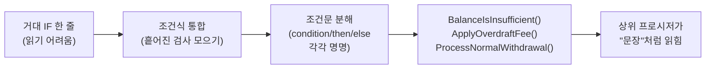

import { Callout, Steps, Step, Tabs, TabsList, TabsTrigger, TabsContent, Icon } from '@/components/writing-ui';

## 이게 뭔데

조건문 분해(Decompose Conditional)는 **복잡한 IF-THEN-ELSE에서 조건부(condition)·then·else 세 덩어리를 각각 이름 있는 메서드 호출로 갈아 끼우는** 리팩토링이다. 로직은 1도 안 바뀐다. 그냥 "이 IF가 대체 뭘 묻는 거냐", "맞으면 뭘 하냐", "틀리면 뭘 하냐"를 사람 말로 바꿔 붙이는 거다.

비유를 하나 들자면, 레시피 카드 같은 거다. 어떤 레시피는 이렇게 적혀 있다. "냄비에 물 200ml를 붓고 90도까지 가열한 뒤, 온도가 90도 이상이고 면이 풀어졌으며 동시에 스프 봉지를 뜯었다면 스프를 넣고 3분, 아니면 1분 더 끓인 다음..." 한 문장에 조건 세 개랑 분기 두 개가 다 들어가 있어서 한 번에 못 읽는다. 잘 쓴 레시피는 이렇게 적는다. "1. 물 끓이기 2. 면 익었는지 확인 3. 익었으면 스프 넣기, 아니면 더 끓이기." 똑같은 요리인데 후자는 한눈에 들어온다. 조건문 분해는 딱 이거다. **요리법을 안 바꾸고 카드만 다시 쓰는 일.**

<Callout type="info" title="한 줄 요약">
`IF balance - amount < minimumBalance AND account.type = 'CHECKING' THEN ...` 를 `IF BalanceIsInsufficient(account, amount) THEN ApplyOverdraftFee(account) ELSE ProcessWithdrawal(account, amount)` 로 바꾸는 일. 동작은 동일, 가독성만 폭발적으로 향상.
</Callout>

이건 책 분류상 **내부 리팩토링(Internal Refactoring)**이다. 저장 프로시저의 외부 인터페이스 — 파라미터 시그니처, 리턴 형태 — 를 1도 안 건드리고 내부 구현만 손본다는 뜻이다. 그래서 호출하는 앱·배치·리포트를 같이 안 고쳐도 된다. 마이그레이션 계획서도, 전환 기간(transition period)도 필요 없다. 위험도가 낮은 축에 속하는 리팩토링이라, 레거시 프로시저에 손댈 때 **제일 먼저 만만하게 집어 들기 좋은** 종류다.

## 언제 쓰나

증상은 명확하다. **저장 프로시저를 열었는데 IF 한 줄이 화면 너비를 넘어간다.** 그 한 줄 안에 `AND`가 세 개, `OR`가 두 개, 괄호가 다섯 겹 들어 있고, then 블록은 또 15줄짜리 계산이 박혀 있다. 그걸 읽다 보면 "이게 지금 무슨 조건을 검사하는 거지?"를 손가락으로 짚어가며 한참 풀어야 한다.

이 리팩토링이 답이 되는 냄새들:

- **조건식이 의도를 안 드러낸다.** `WHERE acct.bal - :amt < cbc.min_bal AND acct.type IN ('C','S')` 같은 식. 컴퓨터는 이해하지만 사람은 "그래서 이게 잔액 부족인가?"를 따로 번역해야 한다.
- **then/else 블록이 길고 무겁다.** 분기 안에 또 10~20줄짜리 계산이 들어앉아 있어서, IF 구조 자체가 코드 더미에 파묻혀 안 보인다.
- **같은 판단이 여기저기 복붙돼 있다.** "잔액 부족" 판정 로직이 출금 프로시저, 이체 프로시저, 야간 배치에 각각 미묘하게 다르게 박혀 있다. 하나만 고치면 나머지가 어긋난다.

세 번째가 특히 골치다. 조건을 이름 있는 함수로 빼두면 **판정 규칙이 한 군데로 모인다.** "잔액 부족의 정의가 바뀌었다"는 요건이 떨어지면 `BalanceIsInsufficient` 함수 하나만 고치면 끝난다. 흩어진 IF를 grep으로 사냥하지 않아도 된다.

<Callout type="note" title="조건식 통합과 짝꿍">
이 리팩토링은 보통 그 사촌인 **조건식 통합(Consolidate Conditional Expression)**과 같이 쓴다. 먼저 같은 결과를 내는 흩어진 조건 검사들을 하나의 식으로 합치고(통합), 그렇게 합쳐진 덩어리를 이름 있는 함수로 빼낸다(분해). 통합이 "흩어진 걸 모으기"라면, 분해는 "모은 걸 명명하기"다. 둘 다 결국 Extract Method로 가는 발판이다.
</Callout>

### 현실 시나리오: 이런 적 있을 거임

은행 출금 프로시저 `ProcessWithdrawal`을 인계받았다고 치자. 새벽에 출금이 이상하게 처리된다는 제보가 들어와서 코드를 까봤더니, 핵심 분기가 이렇게 생겼다.

```sql
-- 인계받은 레거시. 이게 무슨 조건인지 30초쯤 노려봐야 한다
IF (acct.balance - p_amount < cbc.min_balance
    AND acct.account_type IN ('CHECKING', 'SAVINGS')
    AND NOT EXISTS (SELECT 1 FROM overdraft_protection op WHERE op.account_id = acct.account_id))
THEN
    -- 17줄짜리 초과인출 수수료 계산과 알림 로직...
    fee := cbc.overdraft_fee;
    IF acct.customer_tier = 'VIP' THEN fee := fee * 0.5; END IF;
    UPDATE accounts SET balance = balance - fee WHERE account_id = acct.account_id;
    INSERT INTO notifications (...) VALUES (...);
    -- ...계속
ELSE
    -- 정상 출금 12줄...
    UPDATE accounts SET balance = balance - p_amount WHERE account_id = acct.account_id;
    INSERT INTO transactions (...) VALUES (...);
    -- ...계속
END IF;
```

여기서 진짜 무서운 건, **버그를 고치려는데 조건이 뭘 묻는지부터 해석해야 한다는 거다.** "초과인출 보호가 걸린 계좌인데도 수수료가 붙나?" 같은 질문에 답하려면, 저 `NOT EXISTS` 서브쿼리를 머릿속으로 다시 돌려봐야 한다. 게다가 똑같은 "잔액 부족" 판정이 이체 프로시저(`TransferFunds`)에도 살짝 다른 버전으로 박혀 있다. 한쪽만 고치면 두 곳의 정의가 갈라진다.

이 상태에서 곧바로 버그를 고치는 건 위험하다. **구조가 안 보이는 코드를 손대면 새 버그를 심기 십상이다.** 먼저 읽히게 만들고, 그다음에 고친다. 그 "읽히게 만드는" 첫 단계가 조건문 분해다.

## 주의할 점

<Callout type="warning" title="동작은 절대 안 바뀌어야 한다">
조건문 분해는 **행동 보존(behavior-preserving) 리팩토링**이다. 추출한 함수의 결과가 원래 인라인 식과 한 글자도 다르지 않아야 한다. 흔한 사고 포인트:

- **NULL 처리.** `balance - amount < min_balance`를 함수로 뺄 때, `balance`가 NULL이면 원래는 `UNKNOWN`이라 ELSE로 갔는데, 함수가 NULL을 false로 뭉개버리면 분기가 바뀐다. SQL의 3값 논리는 추출할 때 가장 잘 새는 부분이다.
- **부수 효과(side effect).** 조건식 안에 슬쩍 `seq.nextval`이나 카운터 증가가 끼어 있었다면, 그걸 순수 판정 함수로 빼는 순간 부수 효과가 사라지거나 호출 횟수가 달라진다. 판정 함수는 **읽기 전용·결정적(DETERMINISTIC)**이어야 한다.
- **단락 평가(short-circuit) 의존.** `a IS NOT NULL AND expensive_check(a)` 처럼 앞 조건이 뒤를 보호하던 구조를, 함수로 빼면서 평가 순서가 깨지면 에러가 터진다.
</Callout>

그리고 비용도 공짜는 아니다. 조건을 **저장 함수**로 빼면 행마다 함수 호출 오버헤드가 붙고, 옵티마이저가 그 함수 안을 못 들여다봐서 인덱스를 못 탈 수 있다. SELECT의 `WHERE` 절에 들어가는 핫한 조건이라면, 함수 추출이 풀스캔을 유발하지 않는지 실행 계획을 꼭 확인해야 한다. **"읽기 쉬운데 느린" 코드와 "읽기 어려운데 빠른" 코드 사이의 트레이드오프**는 핫 패스에서 실제로 존재한다. 대부분의 분기 로직(루프 안에서 한 번씩 평가)은 문제없지만, 수백만 행을 거르는 술어라면 신중해야 한다.

<Callout type="error" title="테스트 없이 손대지 마라">
이 리팩토링의 진짜 전제 조건은 **프로시저용 자동화 테스트**다. "동작이 안 바뀐다"를 보장하는 건 우리의 자신감이 아니라 회귀 테스트다. 테스트가 없으면, 추출 전에 **특성화 테스트(characterization test)**부터 깔아라. 입력 몇 개를 넣고 현재 동작(수수료가 붙는지, 잔액이 얼마가 되는지)을 그대로 스냅샷으로 박아두는 거다. 그게 깔려 있어야 추출 후 "초록불"로 동작 보존을 증명할 수 있다.
</Callout>

## 이렇게 한다

위 시나리오의 `ProcessWithdrawal`을 단계별로 분해해 보자.

<Steps>
<Step title="안전망부터: 특성화 테스트 작성">
추출 대상 프로시저의 현재 동작을 고정한다. 잔액 부족인 케이스, 정상 출금 케이스, 초과인출 보호가 걸린 케이스, VIP 케이스 — 분기를 가르는 입력마다 기대 결과(잔액·수수료·알림)를 박아둔다. 이게 초록불이어야 다음 단계로 간다.
</Step>
<Step title="조건부(condition)를 의미 있는 함수로">
긴 `IF (...)` 식 전체를 `BalanceIsInsufficient(acct, p_amount)` 한 줄로 바꾼다. NULL·부수 효과·단락 평가를 그대로 보존하는 게 핵심.
</Step>
<Step title="then 블록을 의미 있는 프로시저로">
초과인출 수수료 17줄을 `ApplyOverdraftFee(acct)`로 추출한다. VIP 할인 같은 내부 분기도 함께 들어간다.
</Step>
<Step title="else 블록을 의미 있는 프로시저로">
정상 출금 12줄을 `ProcessNormalWithdrawal(acct, p_amount)`로 추출한다.
</Step>
<Step title="회귀 테스트로 동작 보존 확인">
1단계의 특성화 테스트를 다시 돌린다. 전부 초록불이면 분해 완료. 이제야 비로소 버그를 고칠 차례다 — 읽히는 코드 위에서.
</Step>
</Steps>

### Before / After

분해 전후를 나란히 보자. 핵심은 **상위 프로시저가 "잘 주석된 코드"처럼 읽힌다는 것**이다.

<Tabs defaultValue="before">
<TabsList>
<TabsTrigger value="before">Before</TabsTrigger>
<TabsTrigger value="after">After</TabsTrigger>
</TabsList>
<TabsContent value="before">

```sql
-- 한 덩어리. 조건도 안 읽히고, 분기 본문이 IF 구조를 가린다
IF (acct.balance - p_amount < cbc.min_balance
    AND acct.account_type IN ('CHECKING', 'SAVINGS')
    AND NOT EXISTS (SELECT 1 FROM overdraft_protection op
                    WHERE op.account_id = acct.account_id))
THEN
    fee := cbc.overdraft_fee;
    IF acct.customer_tier = 'VIP' THEN fee := fee * 0.5; END IF;
    UPDATE accounts SET balance = balance - fee
        WHERE account_id = acct.account_id;
    INSERT INTO notifications (account_id, message, created_at)
        VALUES (acct.account_id, 'Overdraft fee applied', SYSTIMESTAMP);
ELSE
    UPDATE accounts SET balance = balance - p_amount
        WHERE account_id = acct.account_id;
    INSERT INTO transactions (account_id, amount, txn_type, created_at)
        VALUES (acct.account_id, p_amount, 'WITHDRAWAL', SYSTIMESTAMP);
END IF;
```

</TabsContent>
<TabsContent value="after">

```sql
-- 상위 프로시저가 문장처럼 읽힌다. "잔액 부족이면 수수료, 아니면 정상 출금"
IF BalanceIsInsufficient(acct, p_amount) THEN
    ApplyOverdraftFee(acct);
ELSE
    ProcessNormalWithdrawal(acct, p_amount);
END IF;
```

추출된 판정 함수. 읽기 전용이고 결정적이다. NULL 동작까지 원본과 동일하게 보존한다.

```sql
FUNCTION BalanceIsInsufficient(p_acct accounts%ROWTYPE, p_amount NUMBER)
    RETURN BOOLEAN
    DETERMINISTIC
IS
    v_min_balance NUMBER;
    v_has_protection NUMBER;
BEGIN
    SELECT min_balance INTO v_min_balance
        FROM corporate_business_constants;

    SELECT COUNT(*) INTO v_has_protection
        FROM overdraft_protection
        WHERE account_id = p_acct.account_id;

    RETURN p_acct.balance - p_amount < v_min_balance
        AND p_acct.account_type IN ('CHECKING', 'SAVINGS')
        AND v_has_protection = 0;
END;
```

</TabsContent>
</Tabs>

이제 `IF BalanceIsInsufficient(acct, p_amount) THEN ApplyOverdraftFee(acct) ELSE ...`만 봐도 흐름이 잡힌다. 디테일이 궁금하면 그때 함수 안으로 들어가면 된다. **요약과 상세가 계층으로 분리된 것.** 그리고 보너스로, `TransferFunds`에 박혀 있던 중복 판정도 이제 같은 `BalanceIsInsufficient`를 호출하게 통일할 수 있다. 판정 규칙이 단 한 군데로 모인다.

### 현대화: 어디까지 함수로 빼야 하나

2006년 책은 이걸 순수 PL/SQL 함수로 손코딩한다. 골격은 지금도 유효하지만, 2026년 관점에서 몇 가지 결정이 갈린다.

**1. DB 함수냐, 애플리케이션 코드냐.** 요즘은 비즈니스 로직을 저장 프로시저에 두느냐가 먼저 갈리는 질문이다. 마이크로서비스에서 데이터 소유권을 서비스가 갖는 구조라면, "잔액 부족" 같은 **도메인 판정은 애플리케이션 레이어의 도메인 모델**로 가는 게 자연스럽다. 그래도 원리는 동일하다 — 긴 조건식을 `account.isBalanceInsufficient(amount)` 같은 이름 있는 메서드로 빼는 것. 분해의 본질은 언어와 무관하다.

```typescript
// Before: 서비스 코드에 인라인된 거대 조건
if (
  account.balance - amount < constants.minBalance &&
  ['CHECKING', 'SAVINGS'].includes(account.type) &&
  !account.hasOverdraftProtection
) {
  // 초과인출 처리...
}

// After: 도메인 메서드로 분해. 의도가 드러난다
if (account.balanceIsInsufficient(amount)) {
  account.applyOverdraftFee();
} else {
  account.processWithdrawal(amount);
}
```

**2. 매직 넘버는 같이 끌어낸다.** 위 `min_balance`를 `corporate_business_constants`에서 읽어오는 건 우연이 아니다. 조건문 분해는 사촌 리팩토링인 **리터럴을 테이블 룩업으로 대체(Replace Literal with Table Lookup)**와 자주 함께 간다. 코드에 박힌 `< 500` 같은 매직 넘버를 판정 함수로 빼는 김에 테이블/설정으로 끌어내면, 최소 잔액이 바뀌어도 코드 배포 없이 운영 중에 바꿀 수 있다.

**3. 추출을 마이그레이션으로 관리.** 프로시저를 `CREATE OR REPLACE`로 바꾸는 변경도 결국 스키마 변경이다. Flyway·Liquibase·Alembic 같은 마이그레이션 도구로 버전 관리하라. 함수 추가(`V0083__add_balance_check_fn.sql`)와 프로시저 교체를 **각각의 마이그레이션 파일**로 나누면, 함수만 먼저 배포해 테스트하고 프로시저 교체는 그다음 릴리스로 미루는 expand-contract식 분할도 가능하다. 내부 리팩토링이라 인터페이스는 안 바뀌니 위험은 낮지만, 그래도 "운영 DB에서 손코딩으로 프로시저를 갈아끼우는" 짓은 2026년엔 하지 말자.



## 정리

조건문 분해는 화려한 기법이 아니다. **요리법을 안 바꾸고 레시피 카드만 다시 쓰는 일**이다. 거대한 IF 한 줄을 셋으로 쪼개 이름을 붙이는 것 — 조건은 "이게 뭘 묻는가", then은 "맞으면 뭘 하는가", else는 "틀리면 뭘 하는가".

> **읽히지 않는 코드는 고칠 수 없다. 고치기 전에 먼저 읽히게 만들어라.**

핵심은 세 가지다. 첫째, 이건 **내부 리팩토링**이라 외부 인터페이스를 안 건드린다 — 호출부를 같이 안 고쳐도 되니 위험이 낮고, 레거시에 처음 손댈 때 만만하다. 둘째, **행동 보존이 생명**이다 — NULL 3값 논리, 부수 효과, 단락 평가가 새지 않게, 그리고 그걸 증명할 특성화 테스트를 먼저 깔아야 한다. 셋째, **판정이 한 군데로 모인다** — 흩어져 복붙됐던 "잔액 부족"의 정의가 함수 하나로 통일되면, 규칙이 바뀌어도 한 곳만 고치면 된다. 거대한 IF가 화면 너비를 넘어가는 걸 봤다면, 그건 분해하라는 신호다.
