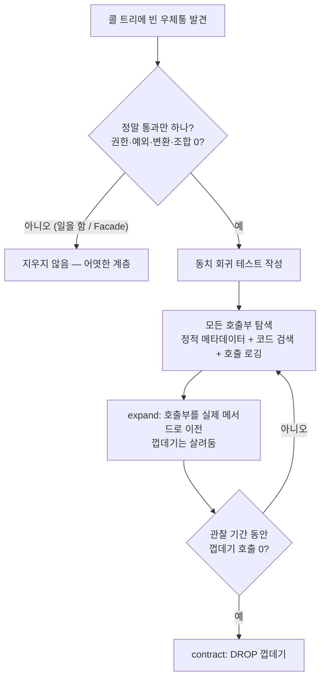

import { Callout, CodeBlock, Tabs, TabsList, TabsTrigger, TabsContent, Icon, Steps, Step } from '@/components/writing-ui';

## 이게 뭔데

**Remove Middle Man은, 자기 일은 하나도 안 하고 다른 프로시저로 호출만 떠넘기는 껍데기 메서드를 지우고, 호출부가 진짜 메서드를 직접 부르게 만드는 리팩토링이다.**

비유하자면 이렇다. 옆 팀에 뭔가 물어볼 게 있는데, 그 팀이랑 나 사이에 "전달 담당자"가 한 명 끼어 있다. 내가 "잔액 좀 알려줘"라고 하면, 이 사람은 자기가 답을 아는 게 아니라 그대로 옆 팀에 가서 "잔액 좀 알려달래요"라고 묻고, 받은 답을 나한테 그대로 가져다준다. 가공도 안 하고, 권한 체크도 안 하고, 캐싱도 안 한다. 그냥 말을 옮기기만 한다. 이 사람이 자리에 없으면 일이 안 된다는 것만 빼면, 있으나 없으나 결과가 똑같다.

DB로 옮기면 이 "전달 담당자"가 바로 통과 프로시저다. `GetAccountBalanceForCustomer`를 불렀더니, 그 안에서 하는 일이라곤 `GetAccountBalance`를 그대로 호출해서 그 결과를 `RETURN`하는 게 전부인 경우. 한 줄짜리 우체통이다.

<Callout type="info" title="한 줄 요약">
아무 일도 안 하고 다음 메서드로 패스만 하는 통과 프로시저는, 그 자체로 간접 비용일 뿐이다. 지우고 호출부가 실제 메서드를 직접 부르게 하면 코드가 짧아지고, 추적이 쉬워지고, 호출도 한 단계 빨라진다.
</Callout>

이 리팩토링은 책에서 "내부 리팩토링(Internal Refactorings)"으로 분류돼 있지만, 사실 한 발만 더 들어가면 인터페이스를 건드리게 된다. 껍데기를 지운다는 건 그 껍데기를 부르던 사람들의 호출 대상을 바꾼다는 뜻이니까. 그래서 진짜 안전하게 하려면 "내부 정리"라기보다 "호출부를 옮기는 작업"으로 보고 접근하는 게 맞다. 뒤에서 자세히 다룬다.

## 언제 쓰나 — 어떤 냄새에서 출발하나

이 껍데기들은 대부분 악의로 만들어지지 않는다. 거의 다 **과거에 한때는 뭔가를 했었다**. 시간이 흐르면서 내용물이 빠져나가고 껍데기만 남은 거다. 대표적인 경로가 셋이다.

**첫째, 이름 바꾸기의 잔재.** Rename Method를 했는데 구버전을 차마 못 지웠다. `GetAccountList`를 `GetAccountsForCustomer`로 바꾸면서, 옛날 호출부가 깨질까 봐 `GetAccountList`는 남겨두고 그 안에서 `GetAccountsForCustomer`를 부르게 했다. 전환 기간(Transition Period) 동안 호환을 유지하려는 정당한 패턴이다. 문제는 전환 기간이 *끝났는데도* 껍데기가 안 죽었을 때다. 6개월 전에 정리했어야 할 우체통이 아직도 서 있다.

**둘째, 위임이 다 빠진 래퍼.** 예전엔 `GetBalanceForUI` 안에서 권한 체크도 하고, 통화 포맷도 입히고, 로깅도 했다. 그런데 그 책임들이 하나씩 애플리케이션 레이어나 다른 프로시저로 이사 가면서, 정작 `GetBalanceForUI`에는 `GetAccountBalance` 호출 한 줄만 덩그러니 남았다. 살은 다 빠지고 뼈만 남은 래퍼.

**셋째, 미래를 위한 빈 방.** "나중에 여기서 검증 로직 넣을 거니까 일단 통과 메서드부터 만들어두자." 그 "나중"은 영영 오지 않았고, 빈 방만 남았다.

<Callout type="note" title="중개자가 비어 있는지 어떻게 아나">
판단 기준은 단순하다. **"이 메서드가 위임 말고 *자기 일*을 하는가?"** 권한 검사, 데이터 변환, 트랜잭션 경계, 로깅, 캐싱, 여러 호출 조합 — 이런 걸 하나라도 하면 중개자가 아니라 어엿한 어댑터 계층이다. 받은 인자를 그대로 넘기고 받은 결과를 그대로 돌려주기만 한다면, 그게 통과 메서드다. Martin Fowler가 같은 이름으로 객체 위임 메서드에 쓴 그 리팩토링의 DB 버전이다.
</Callout>

### 현실 시나리오: 우체통이 47개

은행 코어 시스템을 인수인계받았다고 치자. `Customer`, `Account`, `Balance` 테이블이 있고, 그 위에 PL/SQL 프로시저가 수백 개 깔려 있다. 어느 날 "고객 잔액 조회가 왜 이렇게 단계가 많냐"는 소리를 듣고 콜 트리를 따라가 본다.

```text
앱 → GetCustomerAccountBalance
       → FetchAccountBalanceForCustomer
            → GetAccountBalance
                 → SELECT balance FROM Account WHERE ...
```

진짜 SELECT를 하는 건 맨 아래 `GetAccountBalance` 하나뿐이다. 위의 두 개는 인자를 그대로 받아 그대로 넘기고, 결과를 그대로 받아 그대로 돌려주는 우체통이다. `git blame`을 찍어보니 `FetchAccountBalanceForCustomer`는 2009년에 만든 Rename Method의 구버전이고, `GetCustomerAccountBalance`는 "나중에 멀티 계좌 합산 넣으려고" 만든 빈 방이다. 둘 다 그 "나중"이 안 왔다.

전체를 훑으니 이런 껍데기가 47개다. 호출 한 번 할 때마다 의미 없는 스택을 두세 단 더 타고 내려가고, 새로 들어온 사람은 "진짜 일하는 코드가 어디냐"를 찾느라 우체통을 세 번 열어봐야 한다. 이게 중개자 제거가 필요한 전형적인 상황이다.

## 주의할 점 — 진짜로 비어 있는지부터

<Callout type="warning" title="지우기 전에 반드시 확인할 것">
중개자 제거에서 사고가 나는 건 **"비어 보이는데 안 비어 있던"** 경우다. 지우기 전에 이걸 확인해라.

- **정말 통과만 하나?** 인자를 살짝 바꿔 넘기진 않나(기본값 채우기, 타입 캐스팅, 컬럼 매핑). 받은 결과를 살짝 가공하진 않나. "거의 통과"는 통과가 아니다.
- **권한·감사 경계가 아닌가?** 이 껍데기가 사실은 "이 사용자만 호출 가능"이라는 GRANT 경계일 수 있다. 안쪽 `GetAccountBalance`엔 권한이 없고 바깥 껍데기에만 EXECUTE 권한이 걸려 있으면, 껍데기를 지우는 순간 호출부가 권한 없는 안쪽을 직접 못 부른다.
- **트랜잭션·예외 처리가 끼어 있나?** 껍데기에 `EXCEPTION` 블록이나 `COMMIT`이 있으면 그건 일을 하는 거다.
- **호출부를 전부 찾을 수 있나?** 동적 SQL이나 외부 배치·리포트에서 문자열로 프로시저 이름을 박아 부르면 정적 검색에 안 잡힌다. 못 찾은 호출부 하나가 배포 다음 날 "프로시저가 존재하지 않습니다" 에러로 돌아온다.
</Callout>

그리고 하나 더. 중개자가 "외부에 노출된 안정적 인터페이스" 역할을 의도적으로 하는 거라면 — 즉 안쪽 구현이 자주 바뀔 걸 알고 일부러 호출부와 분리해 둔 거라면 — 이건 중개자가 아니라 **Facade다. 지우면 안 된다.** 마이크로서비스에서 다른 팀이 소유한 스키마에 직접 손대지 않도록 일부러 끼워둔 접근 프로시저가 여기 해당한다. 비어 보여도 그건 "데이터 소유권 경계"라서 일부러 빈 거다. Remove Middle Man은 어디까지나 *우연히 비게 된 사내 껍데기*에 쓰는 거지, *경계를 지키려고 일부러 둔 계층*에 쓰는 게 아니다.

## 이렇게 한다

핵심은 "껍데기를 먼저 지우고 호출부를 고치는" 게 아니라, **호출부를 먼저 옮기고 아무도 안 부르게 된 뒤에 껍데기를 지우는" 것**이다. 순서를 뒤집으면 안 된다. 이게 현대의 expand-contract(parallel change) 패턴이고, 책이 말하는 전환 기간을 그대로 코드로 옮긴 모양이다.

먼저 before/after를 보자. 위 시나리오의 가운데 우체통 `FetchAccountBalanceForCustomer`를 걷어내는 경우다.

<Tabs defaultValue="before">
  <TabsList>
    <TabsTrigger value="before">Before — 우체통이 끼어 있음</TabsTrigger>
    <TabsTrigger value="after">After — 직접 호출</TabsTrigger>
  </TabsList>
  <TabsContent value="before">

```sql
-- 진짜 일하는 메서드
CREATE OR REPLACE FUNCTION GetAccountBalance(p_account_id NUMBER)
  RETURN NUMBER
IS
  v_balance NUMBER;
BEGIN
  SELECT balance INTO v_balance
    FROM Account
   WHERE account_id = p_account_id;
  RETURN v_balance;
END;

-- 통과 메서드(중개자): 받은 걸 그대로 넘기고 그대로 돌려준다. 자기 일 0.
CREATE OR REPLACE FUNCTION FetchAccountBalanceForCustomer(p_account_id NUMBER)
  RETURN NUMBER
IS
BEGIN
  RETURN GetAccountBalance(p_account_id);
END;
```

```sql
-- 호출부: 우체통을 부른다
SELECT FetchAccountBalanceForCustomer(:account_id) FROM dual;
```

  </TabsContent>
  <TabsContent value="after">

```sql
-- GetAccountBalance는 그대로. 중개자만 사라진다.

-- 호출부: 실제 메서드를 직접 부른다
SELECT GetAccountBalance(:account_id) FROM dual;
```

```sql
-- 아무도 안 부르게 된 뒤, 마지막에 껍데기를 제거
DROP FUNCTION FetchAccountBalanceForCustomer;
```

  </TabsContent>
</Tabs>

결과만 보면 "함수 하나 지우고 호출부에서 이름 바꾼 게 전부 아니냐" 싶다. 맞다. 어려운 건 *지우는 행위*가 아니라 *안전하게 지우는 순서*다. 단계로 풀면 이렇다.

<Steps>
  <Step title="진짜 비었는지 검증한다">
앞의 경고 박스 체크리스트를 통과해야 한다. 권한·예외·변환·조합이 하나라도 있으면 멈춘다. 자동화된 회귀 테스트로 "껍데기를 거친 결과 == 실제 메서드 결과"를 먼저 못 박아 둔다. 프로시저용 테스트가 없는 팀이라면 이 한 줄짜리 동치 테스트부터 만드는 게 안전망이다.
  </Step>
  <Step title="모든 호출부를 찾는다">
정적 메타데이터 + 코드베이스 검색을 같이 쓴다. Oracle이면 `ALL_DEPENDENCIES`, Postgres면 `pg_depend`/`pg_proc`를 훑어 DB 내부 참조를 잡고, 애플리케이션·배치·리포트 레포는 텍스트 검색으로 잡는다. 동적 SQL로 이름을 문자열로 부르는 곳은 검색이 누락할 수 있으니 의심되면 호출 로깅을 잠깐 켜서 실제 트래픽으로 확인한다.

```sql
-- Oracle: 누가 이 우체통을 참조하나
SELECT owner, name, type
  FROM all_dependencies
 WHERE referenced_name = 'FETCHACCOUNTBALANCEFORCUSTOMER';
```
  </Step>
  <Step title="호출부를 실제 메서드로 옮긴다 (expand)">
찾은 호출부를 하나씩 `FetchAccountBalanceForCustomer` → `GetAccountBalance`로 바꾼다. 이 동안 껍데기는 *아직 살아 있다.* 구버전 호출부와 신버전 호출부가 공존하는 전환 기간이고, 둘 다 정상 동작한다. 이게 parallel change의 expand 단계다. 못 찾은 호출부가 하나 있어도, 껍데기가 살아 있으니 깨지지 않는다.
  </Step>
  <Step title="아무도 안 부르는지 확인한다">
다시 `all_dependencies`/코드 검색을 돌려 참조가 0인지 본다. 더 확실히 하려면 껍데기에 호출 로깅이나 카운터를 심어 한 배포 주기(예: 1~2주) 동안 실제 호출이 0인지 운영에서 관찰한다. "정적 검색은 깨끗한데 운영에서 하루 3번 불린다"가 종종 나온다 — 그 3번이 못 찾은 동적 호출부다.
  </Step>
  <Step title="껍데기를 제거한다 (contract)">
호출이 진짜 0이면 `DROP`한다. 이게 contract 단계다. 마이그레이션 도구를 쓴다면 이 DROP을 별도 버전으로 분리해, "expand 배포"와 "contract 배포" 사이에 관찰 기간을 끼워라.

```sql
-- V231__remove_middleman_fetch_account_balance.sql
DROP FUNCTION FetchAccountBalanceForCustomer;
```
  </Step>
</Steps>

### 마이그레이션 도구에 올리기

2006년 책은 이 과정을 번호 매긴 SQL 스크립트와 손으로 정한 drop date로 관리했다. 골격은 똑같고, 요즘은 그 골격을 마이그레이션 툴이 강제해 준다. Flyway/Liquibase(또는 Alembic, ORM 마이그레이션)에서 핵심은 **expand와 contract를 별개의 버전으로 쪼개는 것**이다.

```text
V229__add_direct_calls_keep_middleman.sql   -- expand: 호출부 이전, 껍데기는 유지
                (관찰 기간: 1~2주, 호출 카운터 0 확인)
V231__drop_middleman_function.sql           -- contract: 껍데기 제거
```

이렇게 두면 (1) expand 배포 후 문제가 생겨도 contract를 안 했으니 롤백이 쉽고, (2) 변경 이력이 버전으로 남아 "이 우체통이 언제 왜 사라졌는지"가 추적되며, (3) 환경마다 같은 순서로 재현된다. 한 버전에 옮기기+지우기를 몰아넣으면 expand-contract의 안전망이 통째로 사라지니, 귀찮아도 쪼개라.

전체 흐름을 한 장으로 보면 이렇다.



<Callout type="success" title="앱 레이어에도 똑같이 적용된다">
이 패턴은 PL/SQL 우체통만의 얘기가 아니다. 리포지토리 계층에서 `findActiveCustomers()`가 안에서 그냥 `customerRepo.findByStatus('ACTIVE')` 한 줄만 부르고 있다면 그것도 같은 중개자다. 판단 기준(자기 일을 하나?)과 절차(호출부 먼저 옮기고, 안 부를 때 지우기)는 그대로다. ORM 마이그레이션이든 코드 리팩토링이든, expand-contract의 모양은 동일하다.
</Callout>

## 정리

Remove Middle Man은 카탈로그에서 가장 소박한 리팩토링 축에 든다. 하는 일은 "아무 일도 안 하는 껍데기를 지우는 것" 한 줄로 요약된다.

> **위임만 하는 메서드는 코드가 아니라 간접 비용이다. 자기 일이 없으면, 없어도 되는 거다.**

다만 소박하다고 만만한 건 아니다. 진짜 함정은 "비어 보이는데 권한·예외·경계를 쥐고 있던" 껍데기를 무심코 지우는 것, 그리고 "정적 검색엔 안 잡히는 동적 호출부"를 놓치는 것이다. 그래서 절차가 곧 안전이다. **자기 일을 하는지 먼저 검증하고, 호출부를 실제 메서드로 먼저 옮긴 다음, 아무도 안 부르는 게 확인된 뒤에 마지막으로 지운다.** expand 먼저, contract는 한 박자 뒤에. 이 순서만 지키면 우체통 47개도 하나씩 안전하게 헐 수 있다.
