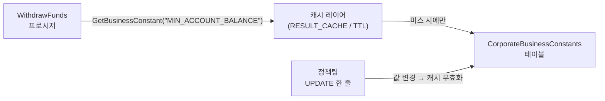

import { Callout, Steps, Step, Tabs, TabsList, TabsTrigger, TabsContent } from '@/components/writing-ui';

## 이게 뭔데

**Replace Literal With Table Lookup**은 코드 한복판에 박혀 있는 의미 있는 숫자(매직 넘버)를, 테이블에 넣어두고 필요할 때 조회하는 리팩토링이다. Fowler의 *Replace Magic Number With Symbolic Constant*의 DB 버전이라고 보면 된다. Fowler는 매직 넘버를 상수로 빼는 선에서 끝났지만, DB 세계에선 그 상수마저 **테이블 한 줄**로 만든다.

비유를 하나 들자. 매직 넘버는 벽에다 못을 박아 액자를 거는 것과 같다. 처음엔 편하다. 망치질 한 번이면 끝이니까. 근데 액자 위치를 바꾸려면? 못을 뽑고, 벽에 구멍 자국 메우고, 다시 박아야 한다. **상수를 테이블로 빼는 건 벽에 레일을 다는 것**이다. 처음 설치는 좀 귀찮지만, 그다음부턴 액자를 손으로 슥 밀기만 하면 된다. 못질(=배포) 없이.

<Callout type="info" title="한 줄 요약">
하드코딩된 업무 상수를 설정 테이블로 빼면, 그 값을 바꾸는 일이 "코드 수정 + 배포"에서 "UPDATE 한 줄"로 바뀐다. 자주 바뀌는 값일수록 이득이 크다.
</Callout>

## 언제 쓰나

핵심 트리거는 **"이 숫자, 업무가 정하는데 코드에 박혀 있네?"** 라는 냄새다.

은행 도메인으로 가보자. `WithdrawFunds`라는 저장 프로시저가 있다. 출금할 때 잔액이 최소 유지 잔액 밑으로 내려가면 막아야 한다. 그 최소 잔액이 \$500이다. 어느 개발자가 자연스럽게 이렇게 썼다.

```sql
-- WithdrawFunds 프로시저 내부 어딘가
IF (v_balance - p_amount) < 500 THEN
    RAISE_APPLICATION_ERROR(-20001, '최소 잔액 미달');
END IF;
```

`500`. 이게 매직 넘버다. 이 숫자가 위험한 이유는 컴파일이 안 되거나 버그가 나서가 아니다. 멀쩡히 잘 돈다. 위험한 건 **그 다음에 벌어지는 일**이다.

- 의미를 모른다. 다른 사람이 코드를 읽다 `500`을 보면 "이게 최소 잔액인가, 수수료인가, 무슨 코드값인가?" 한참 헤맨다.
- 흩어져 있다. 같은 \$500이 `WithdrawFunds`에도 있고, `TransferFunds`에도 있고, 야간 배치 리포트에도 있고, 백엔드 API의 validator에도 있다. 정책이 바뀌어 \$300으로 내리는 순간, 이 네 군데를 다 찾아 고쳐야 한다. **하나라도 놓치면 시스템이 자기 자신과 의견이 갈린다.**
- 못 바꾼다. 마케팅이 "이번 분기 프리미엄 고객은 최소 잔액 \$0" 캠페인을 친다. 근데 그 숫자가 코드에 있으면, 정책 한 번 바꾸려고 배포 파이프라인을 돌려야 한다. 새벽 점검에 릴리스 일정에 QA에... 숫자 하나 바꾸자고.

이 세 냄새 중 하나라도 났다면, 그 리터럴은 테이블로 내려갈 때가 된 거다. 특히 **자주 바뀌고**, **업무가 주인이고**(개발자가 아니라), **여러 곳에서 참조되는** 값이면 거의 100% 답은 테이블 룩업이다.

<Callout type="note" title="모든 숫자를 빼라는 건 아님">
배열 인덱스 `0`, 백분율 환산 `100`, 요일 `7` 같은 건 그냥 둬라. 이건 업무가 바꿀 수 있는 값이 아니라 수학적·구조적 상수다. 테이블로 빼면 오히려 읽기만 나빠진다. 빼야 할 건 **"업무 규칙이라서 언젠가 바뀔" 숫자**다. 최소 잔액, 수수료율, 이자율, 한도, 등급 컷오프 같은 것들.
</Callout>

## 주의할 점

좋은 리팩토링에도 청구서가 따라온다. 테이블 룩업은 공짜가 아니다.

<Callout type="warning" title="트레이드오프">
- **조회 비용이 생긴다.** `IF balance < 500`은 CPU에서 끝나는 비교지만, 테이블 룩업은 매번 SELECT가 나간다. 출금 프로시저가 초당 수천 번 호출되는데 매번 `CorporateBusinessConstants`를 긁으면, 그 테이블이 핫스팟이 된다. → **캐싱이 사실상 필수**다.
- **NULL/누락 위험.** 코드에 박힌 `500`은 항상 거기 있다. 테이블 값은 누가 행을 지우거나, 오타로 `name`을 잘못 넣으면 조회가 NULL을 뱉는다. 룩업이 NULL일 때 어떻게 할지(에러? 안전한 기본값?)를 **반드시** 정해둬야 한다. 잔액 한도가 조용히 NULL→0이 되면 통장이 다 털린다.
- **타입·정밀도.** 금액·비율을 `NUMBER`/`DECIMAL`로 정확히 잡아라. 수수료율을 `FLOAT`에 넣으면 0.1이 0.1이 아니게 되는 부동소수점 지옥이 열린다.
- **감사 추적(audit).** 이제 \$500을 누가 \$300으로 바꿨는지가 "git 커밋"이 아니라 "UPDATE 한 줄"이 됐다. 편해진 만큼 **추적이 사라진다.** 업무 상수일수록 변경 이력은 더 중요하다. 누가·언제·왜 바꿨는지 남길 장치가 필요하다.
</Callout>

요약하면, 리터럴을 테이블로 빼는 순간 "성능"과 "안전한 기본값"과 "변경 이력"이라는 세 가지 숙제가 따라온다. 이걸 안 풀면 매직 넘버보다 더 나쁜 상태가 된다.

## 이렇게 한다

세 단계로 간다. 책의 골격(스키마 변경 → 데이터 마이그레이션 → 접근 프로그램 수정)에 현대 도구를 얹는다.

<Steps>
<Step title="설정 테이블을 만든다 (스키마 변경)">

먼저 상수를 담을 테이블을 만든다. 책에선 `CorporateBusinessConstants`라고 부른다. 키-값 한 줄짜리 단순 테이블이면 충분하다.

```sql
-- 마이그레이션: V89__create_business_constants.sql (Flyway 컨벤션)
CREATE TABLE CorporateBusinessConstants (
    constant_name   VARCHAR2(100) PRIMARY KEY,
    constant_value  NUMBER(18, 4)  NOT NULL,
    description     VARCHAR2(400),
    effective_from  DATE          DEFAULT SYSDATE NOT NULL,
    updated_by      VARCHAR2(100),
    updated_at      TIMESTAMP     DEFAULT SYSTIMESTAMP
);
```

`constant_value`를 `NUMBER(18,4)`로 잡아 금액·비율 둘 다 정밀하게 담는다. `description`은 "이 숫자가 뭔지" 박아두는 칸 — 매직 넘버의 가장 큰 죄였던 "의미 실종"을 여기서 갚는다. `updated_by`/`updated_at`은 위에서 말한 **감사 추적** 숙제의 최소 해법이다.

</Step>
<Step title="값을 채운다 (데이터 마이그레이션)">

흩어져 있던 리터럴들을 한 줄씩 테이블로 옮긴다. 이게 데이터 마이그레이션이다.

```sql
INSERT INTO CorporateBusinessConstants (constant_name, constant_value, description)
VALUES ('MIN_ACCOUNT_BALANCE', 500, '계좌 최소 유지 잔액 (USD)');

INSERT INTO CorporateBusinessConstants (constant_name, constant_value, description)
VALUES ('WIRE_TRANSFER_FEE_RATE', 0.0015, '전신 송금 수수료율');

INSERT INTO CorporateBusinessConstants (constant_name, constant_value, description)
VALUES ('DAILY_WITHDRAWAL_LIMIT', 10000, '1일 출금 한도 (USD)');
COMMIT;
```

이 INSERT들은 마이그레이션 스크립트(Flyway의 `V89__...sql`, Liquibase의 changeSet)에 넣어 **코드와 함께 버전 관리**한다. "테이블에 값 채우는 건 운영에서 손으로" 하지 마라 — 그 순간 신규 환경(스테이징, 새 리전) 띄울 때마다 값이 빠져서 NULL 지옥이 시작된다.

</Step>
<Step title="조회하도록 고친다 (접근 프로그램 수정)">

이제 코드가 `500` 대신 테이블을 보게 한다. 룩업 함수 하나를 만들고, 매직 넘버를 그걸로 갈아끼운다.

```sql
-- 룩업 헬퍼 함수
CREATE OR REPLACE FUNCTION GetBusinessConstant(p_name VARCHAR2)
    RETURN NUMBER
IS
    v_value NUMBER;
BEGIN
    SELECT constant_value INTO v_value
    FROM CorporateBusinessConstants
    WHERE constant_name = p_name;
    RETURN v_value;
EXCEPTION
    WHEN NO_DATA_FOUND THEN
        -- 누락 시 조용히 0 반환 금지! 명시적으로 터뜨린다
        RAISE_APPLICATION_ERROR(-20099, '업무 상수 누락: ' || p_name);
END;
```

그리고 `WithdrawFunds`의 매직 넘버를 룩업으로 바꾼다.

```sql
-- Before: 매직 넘버
IF (v_balance - p_amount) < 500 THEN
    RAISE_APPLICATION_ERROR(-20001, '최소 잔액 미달');
END IF;

-- After: 테이블 룩업
v_min_balance := GetBusinessConstant('MIN_ACCOUNT_BALANCE');
IF (v_balance - p_amount) < v_min_balance THEN
    RAISE_APPLICATION_ERROR(-20001, '최소 잔액 미달');
END IF;
```

`NO_DATA_FOUND`에서 0을 반환하지 않고 **에러를 던지는** 게 핵심이다. 위 주의사항에서 말한 "잔액 한도가 조용히 0이 되면 통장이 털린다"를 여기서 막는다. 안전한 기본값이 진짜로 필요한 경우(예: 비핵심 표시용 값)에만 fallback을 쓰고, 돈이 걸린 한도엔 절대 쓰지 마라.

</Step>
</Steps>

### 캐싱: 핫스팟을 식힌다

출금 프로시저가 호출될 때마다 `CorporateBusinessConstants`를 SELECT하면 그 테이블이 병목이 된다. 상수는 거의 안 바뀌는데 읽기는 폭발하니까, **읽기를 메모리로 올리는** 게 정석이다. 어느 레이어에서 캐싱하느냐에 따라 방법이 갈린다.

<Tabs defaultValue="db">
<TabsList>
<TabsTrigger value="db">DB 레이어 (PL/SQL)</TabsTrigger>
<TabsTrigger value="app">앱 레이어 (TypeScript)</TabsTrigger>
</TabsList>
<TabsContent value="db">

Oracle이라면 패키지 변수에 캐싱하거나, 더 정석으로는 `RESULT_CACHE`를 쓴다. 테이블이 바뀌면 캐시가 자동 무효화돼서 따로 invalidation 코드를 안 짜도 된다.

```sql
CREATE OR REPLACE FUNCTION GetBusinessConstant(p_name VARCHAR2)
    RETURN NUMBER
    RESULT_CACHE RELIES_ON (CorporateBusinessConstants)
IS
    v_value NUMBER;
BEGIN
    SELECT constant_value INTO v_value
    FROM CorporateBusinessConstants
    WHERE constant_name = p_name;
    RETURN v_value;
EXCEPTION
    WHEN NO_DATA_FOUND THEN
        RAISE_APPLICATION_ERROR(-20099, '업무 상수 누락: ' || p_name);
END;
```

`RELIES_ON` 덕분에 누가 `UPDATE`로 \$500을 \$300으로 바꾸면, 다음 호출부터 자동으로 새 값이 캐시에 올라온다. 무중단 변경과 캐싱이 자연스럽게 맞물린다.

</TabsContent>
<TabsContent value="app">

상수를 애플리케이션에서 읽어 쓴다면, 짧은 TTL 캐시 한 겹이면 충분하다. 상수가 바뀌어도 TTL(예: 60초) 안에 전 인스턴스가 따라잡는다.

```typescript
const TTL_MS = 60_000;
const cache = new Map<string, { value: number; at: number }>();

async function getBusinessConstant(name: string): Promise<number> {
  const hit = cache.get(name);
  if (hit && Date.now() - hit.at < TTL_MS) return hit.value;

  const row = await db.oneOrNone(
    `SELECT constant_value FROM CorporateBusinessConstants WHERE constant_name = $1`,
    [name],
  );
  // 누락은 조용한 0이 아니라 명시적 에러로
  if (!row) throw new Error(`업무 상수 누락: ${name}`);

  cache.set(name, { value: Number(row.constant_value), at: Date.now() });
  return cache.get(name)!.value;
}
```

"즉시 반영"이 필요하면 TTL 대신 CDC(Debezium 등)로 `CorporateBusinessConstants` 변경 이벤트를 받아 캐시를 무효화하는 방법도 있다. 다만 대부분의 업무 상수는 60초 TTL로 충분하다 — 오버엔지니어링하지 마라.

</TabsContent>
</Tabs>

### 운영 중 무중단으로 바꾸기

이게 이 리팩토링의 진짜 보상이다. 정책팀이 "최소 잔액을 \$500에서 \$300으로 내린다"고 하면, 이제 배포가 필요 없다.

```sql
UPDATE CorporateBusinessConstants
SET constant_value = 300,
    updated_by = 'policy_team',
    updated_at = SYSTIMESTAMP
WHERE constant_name = 'MIN_ACCOUNT_BALANCE';
COMMIT;
```

`UPDATE` 한 줄, `COMMIT`. 캐시 TTL이 지나면(혹은 `RESULT_CACHE`가 즉시) 전 시스템이 새 값으로 동작한다. 코드 배포도, 점검 시간도, 프로시저 재컴파일도 없다. 매직 넘버였다면 4군데를 찾아 고치고 배포 파이프라인을 한 바퀴 돌려야 했을 일이다.

다만 무중단이라고 막 바꾸진 마라. 돈이 걸린 값은 **expand-contract(parallel change)** 의 사고방식이 그대로 들어맞는다.

<Callout type="success" title="안전하게 바꾸는 절차">
1. **검증** — 새 값(\$300)이 합법적인지 체크 제약이나 트리거로 막아둔다. 누가 실수로 음수나 \$3000000을 넣으면 거부.
2. **이력 남김** — `updated_by`/`updated_at`을 채우고, 더 엄격하면 별도 `BusinessConstantsHistory` 테이블에 변경 전후를 INSERT하는 트리거를 둔다. (git blame을 대신할 감사 추적)
3. **점진 반영** — `effective_from` 컬럼을 활용하면 "내일 0시부터 적용"처럼 예약 변경도 된다. 룩업 쿼리에 `WHERE effective_from <= SYSDATE`를 걸어 가장 최근 유효값을 고르면, 새 값과 옛 값이 잠깐 공존(parallel)하다 자연스럽게 전환된다.
</Callout>

이 구조까지 가면 사실상 작은 **설정 테이블(feature flag의 숫자 버전)** 을 갖게 된 거다. 수수료율 A/B 테스트, 등급별 차등 한도, 캠페인 기간 한정 정책 — 전부 코드 배포 없이 데이터로 돌린다.



## 정리

매직 넘버 \$500은 그 자체로 버그가 아니다. 잘 돌아간다. 문제는 그게 **변할 운명**인데 변하기 어려운 자리에 박혀 있다는 거다.

> **업무가 주인인 숫자는 코드가 아니라 데이터로 다스려라.**

리터럴을 테이블로 빼는 건 기능 추가가 아니라 **권한 이양**이다. "이 숫자를 바꿀 권리"를 개발 배포 파이프라인에서 떼어내, 정책팀의 `UPDATE` 한 줄에 넘기는 일. 대신 그 대가로 캐싱(성능), 명시적 NULL 처리(안전), 변경 이력(감사)이라는 세 숙제를 떠안는다. 이 셋만 챙기면, 자주 바뀌는 업무 상수는 더 이상 새벽 점검의 이유가 되지 않는다. 그게 이 작은 리팩토링이 주는 큰 자유다.
