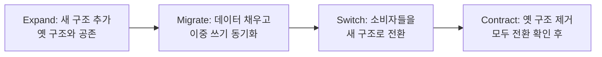

## 이게 왜 헷갈리는 단어 싸움처럼 보이냐면

"리팩토링이랑 변환이 뭐가 다른데? 어차피 둘 다 스키마 바꾸는 거잖아."

이 말, 회의실에서 백 번은 들어봤을 거다. 그리고 솔직히 처음 들으면 그냥 학자들 단어 놀음 같다. 컬럼 추가하면 추가하는 거지, 거기에 무슨 라틴어급 분류가 필요하냐는 거지.

근데 이 구분을 안 하면 진짜로 일이 터진다. 왜냐면 이 두 단어는 배포 전략을 다르게 요구하기 때문이다. 의미를 **보존하는** 변경(리팩토링)은 "조용히 끼워넣고 나중에 정리"가 되지만, 의미를 **바꾸는** 변경(변환)은 "이걸 쓰는 모든 애를 같이 바꿔야" 한다. 같은 `ALTER TABLE`처럼 보여도, 하나는 무해하고 하나는 폭탄일 수 있다.

이 편은 그 경계선이 어디인지, 그리고 그 경계가 왜 생각보다 흐릿한지를 본다.

<Callout type="info" title="핵심 요약">
- **리팩토링**: 스키마의 **동작 의미**와 **정보 의미**를 둘 다 보존하면서 설계를 개선하는 작은 변경. 새 기능도, 새 데이터도 안 더한다.
- **변환(transformation)**: 의미를 **바꿀 수도 있는** 스키마 변경. 새 컬럼·테이블·데이터를 더하는 게 보통 여기 속한다.
- **리팩토링 ⊂ 변환**. 리팩토링은 변환의 특수한 경우다. "의미를 안 바꾸는 변환".
- 경계가 애매하면 교과서 정의 말고 **실용성(practicality)**으로 판단한다.
</Callout>

## 의미를 보존한다는 게 뭔 소리냐

리팩토링의 정의에는 "의미를 보존한다"가 박혀 있다. 근데 의미라는 게 두 종류다. 이걸 갈라보면 머리가 맑아진다.

**정보 의미(informational semantics).** 데이터가 담고 있는 정보가 그대로냐는 거다. `Customer` 테이블에 들어 있던 고객 정보가, 스키마를 바꾼 뒤에도 같은 고객을 같은 정보로 표현하느냐. 행을 지우지도, 의미를 뒤바꾸지도 않았느냐.

**동작 의미(behavioral semantics).** 이 데이터를 다루는 기능이 블랙박스로 봤을 때 똑같이 동작하느냐는 거다. `Account` 테이블 구조를 바꿨으면, 그걸 읽고 쓰던 모든 코드가 **이전과 같은 결과를 내도록** 같이 손봐야 한다. 예를 들어 잔액 계산 로직이 저장 프로시저 세 군데에 복붙돼 있었는데, 그걸 한 메서드로 모으는(`Introduce Calculation Method`) 리팩토링을 했다고 치자. 계산 결과는 한 자리도 안 바뀌어야 한다. 로직이 한 곳에 모였을 뿐, 바깥에서 보면 똑같아야 리팩토링이다.

이 두 개를 **둘 다** 지키면 리팩토링이다. 하나라도 바꿨으면 그건 더 이상 리팩토링이 아니라 그냥 변환이다.

<Callout type="warning" title="의미 보존은 '확신'이 아니라 '최선'이다">
솔직한 얘기. 의미를 미묘하게 안 바꿨다고 **완벽히 증명**하는 건 불가능에 가깝다. Fowler의 "관찰 가능한 행위(observable behavior)" 개념을 빌려도 마찬가지다.

은행 예시로 가보자. 어떤 월말 보고서가 전화번호가 정확히 `(XXX) XXX-XXXX` 형식인 행에만 동작하도록 은근슬쩍 의존하고 있었다 치자. 우리가 `Apply Standard Format`으로 전화번호 형식을 통일하면, 우리 눈엔 "의미 보존"인데 그 보고서 입장에선 의미가 바뀐 거다. 그래서 우리가 할 수 있는 최선은 **충분한 테스트를 작성하고 돌려서** "내가 아는 한 의미는 안 바뀌었다"를 확인하는 것뿐이다. 그래서 마이그레이션마다 테스트가 그렇게 중요한 거다.
</Callout>

## 한 장으로 보는 차이

말로 빙빙 돌렸으니 표로 못박자.

| 구분 | 리팩토링 (Refactoring) | 변환 (Transformation) |
|------|----------------------|----------------------|
| 의미(semantics) | 동작·정보 의미 **둘 다 보존** | 의미를 **바꿀 수 있음** |
| 새 기능 / 새 데이터 | 추가하지 **않음** | **추가함** (새 컬럼·테이블·데이터 등) |
| 목적 | 설계 품질 개선 | 새 요구사항·기능 반영 |
| 둘의 관계 | 변환의 **부분집합** | 리팩토링을 **포함하는** 상위 개념 |
| 배포 부담 | 비교적 안전, 점진 적용 쉬움 | 소비자까지 같이 바꿔야 할 수 있음 |

핵심 한 줄: **리팩토링은 "의미를 보존하는 변환"이라는 특수 케이스**다. 모든 정사각형이 직사각형이듯, 모든 리팩토링은 변환이다. 근데 모든 변환이 리팩토링은 아니다.

## 둘은 따로 안 산다 — 리팩토링이 변환을 부른다

여기서 많이들 오해한다. "그럼 변환은 나쁜 거고 리팩토링이 착한 거냐?" 아니다. 둘은 적이 아니라 **레고 블록과 완성품** 관계다.

실무에서 큼직한 리팩토링은 거의 항상 내부 단계로 변환을 호출한다. 예를 들어 `Move Column`(컬럼을 다른 테이블로 옮기기)을 보자. 이건 의미 보존 리팩토링이다. 근데 이걸 한 방에 못 한다. 쪼개보면 이렇다.

<Steps>
<Step title="새 컬럼을 목적지 테이블에 추가한다 (Introduce Column)">
`Account` 테이블에 있던 `branch_code`를 `Customer`로 옮긴다고 하자. 먼저 `Customer`에 빈 `branch_code` 컬럼을 만든다. 이 단계 자체는 **변환**이다. (왜 변환인지는 바로 다음 절에서 본격적으로 깐다.)
</Step>
<Step title="기존 데이터를 채운다 (Update Data)">
`Account.branch_code`를 `Customer.branch_code`로 복사한다. 이것도 변환(데이터 갱신).
</Step>
<Step title="소비자 코드를 새 컬럼을 보도록 옮긴다">
이 컬럼을 읽던 모든 코드·뷰·프로시저를 새 위치로 전환한다. 전환기간 동안엔 양쪽이 동기화돼 있어야 한다.
</Step>
<Step title="옛 컬럼을 제거한다 (Drop Column)">
모두가 새 위치를 보게 되면 `Account.branch_code`를 떨군다. 여기까지 와서 **전체로 보면 의미가 보존**됐다. 그래서 묶음 전체는 리팩토링이다.
</Step>
</Steps>

보이나? 각 **단계**는 변환인데, 그 단계들을 묶어 끝까지 가면 **결과적으로 의미가 보존**돼서 전체가 리팩토링이 된다. 그래서 변환을 "리팩토링의 빌딩블록"이라고 부르는 거다. 동시에 변환은 그 자체로 "순수한 신규 기능 추가 수단"으로도 쓰인다. 새 요구사항 때문에 진짜로 새 컬럼이 필요하면, 그건 리팩토링이 아니라 그냥 변환으로 끝나는 거고.

11장이 다루는 대표 변환은 다섯 개다. **데이터 삽입(Insert Data)**, **새 컬럼 도입(Introduce New Column)**, **새 테이블 도입(Introduce New Table)**, **뷰 도입(Introduce View)**, **데이터 갱신(Update Data)**. 이름만 봐도 "새 거 더하는" 냄새가 나지? 그게 변환의 본질이다.

## 빈 컬럼 추가는 왜 리팩토링이 아니라 변환인가

자, 여기가 이 편의 진짜 알맹이다. 직관을 한 번 배신당해보자.

`Customer` 테이블에 `loyalty_tier`라는 **빈 컬럼**을 하나 추가한다. NULL만 들어 있다. 아무도 안 쓴다. 데이터도 없다.

상식적으로 이건 의미를 안 바꾼 것 같다. 새 정보를 더한 것도 아니고(전부 NULL), 기존 동작이 깨질 일도 없어 보인다. "이건 그냥 리팩토링 아냐?" 싶다. 근데 저자는 이걸 **변환으로 분류**한다. 직관을 거스른다. 왜?

이유 두 개가 있는데, 둘 다 2006년 냄새가 나지만 본질은 지금도 유효하다.

**1. 위치 기반 접근(positional access).** 컬럼을 이름이 아니라 **순서**로 참조하는 코드가 세상에 존재한다. "`SELECT *`로 가져온 결과의 17번째 컬럼"을 읽는 식이다. 이런 코드가 있으면, 컬럼을 중간에 삽입하는 순간 17번째가 18번째로 밀려서 코드가 엉뚱한 값을 읽는다. NULL만 든 빈 컬럼을 추가했을 뿐인데 멀쩡하던 리포트가 깨진다. 의미가 안 바뀐 게 아니다. 누군가에겐 바뀐 거다.

**2. 바인딩 문제.** 2006년의 DB2 + COBOL 조합에선, 컴파일된 프로그램이 특정 테이블 구조에 **바인딩**돼 있었다. 컬럼을 맨 끝에 추가해도 재바인딩(rebind)을 안 하면 프로그램이 깨졌다. 즉 "끝에 안전하게 붙였다"조차 그 환경에선 안전하지 않았다.

<Callout type="error" title="뭐가 문제냐면">
"의미를 안 바꿨다"는 건 **스키마만 보고 판단할 수 없다.** 의미가 바뀌었는지 아닌지는 스키마가 아니라 **그 스키마를 어떻게 소비하느냐**에 달려 있다. 빈 컬럼 추가가 무해한지 아닌지는, 그걸 읽는 코드가 컬럼을 이름으로 보느냐 위치로 보느냐, 바인딩이 있느냐 없느냐에 따라 갈린다. 그래서 같은 `ADD COLUMN`이 어떤 시스템에선 리팩토링이고 어떤 시스템에선 변환이다.
</Callout>

```sql
-- 똑같아 보이는 한 줄. 그런데 이게 안전한지는 스키마가 결정 못 한다.
ALTER TABLE Customer ADD COLUMN loyalty_tier VARCHAR(20) NULL;

-- 안전한 소비자: 컬럼을 '이름'으로 읽는다 → 새 컬럼이 끼어도 무관
SELECT customer_id, name, email FROM Customer;

-- 위험한 소비자: 위치로 읽는다 → 컬럼 순서 바뀌면 와장창
SELECT * FROM Customer;   -- 그리고 코드에서 row[16]을 'email'이라 믿는다
```

## 그래서 심판은 실용성이다

여기까지 오면 결론이 따라온다. 리팩토링이냐 변환이냐를 **교과서 정의로 100% 가르려고 하면 안 된다.** 빈 컬럼 추가 하나만 봐도 "의미 보존인가?"가 환경 따라 갈리잖아.

저자가 내놓는 판단 기준이 바로 **실용성(practicality)**이다. 풀어쓰면 이렇다.

> 이 변경이 "내가 통제하는 소비자들" 입장에서 관찰 가능한 행위를 바꾸는가? 안 바꾸면 리팩토링처럼 가볍게 다뤄도 되고, 바꿀 위험이 있으면 변환으로 취급해서 소비자까지 책임지고 같이 옮겨라.

이게 왜 현대 실무에서 더 중요해졌냐면, 요즘은 **DB를 여러 서비스가 공유**하거나, 컴파일 안 된 ORM이 런타임에 컬럼 메타데이터를 캐싱하거나, BI 도구가 컬럼 순서에 의존하는 등 "내가 모르는 소비자"가 사방에 깔려 있기 때문이다. 2006년의 COBOL 바인딩 문제가 2025년엔 "다른 팀 마이크로서비스가 같은 테이블을 직접 읽고 있더라"로 환생한 거다.

<Callout type="note" title="공유 DB라면 빈 컬럼도 변환으로 다뤄라">
마이크로서비스 환경에서 여러 서비스가 한 테이블을 직접 읽고 쓰는 **공유 데이터베이스 안티패턴**이 깔려 있으면, "무해한 빈 컬럼 추가"조차 변환으로 취급하는 게 안전하다. 누가 `SELECT *`로 읽어서 컬럼 순서나 개수에 의존하고 있을지 네가 다 알 수 없기 때문이다. 모르면 보수적으로 변환으로 분류하고, expand-contract로 천천히 깔아라.
</Callout>

### 실용적으로 가르는 체크리스트

말로만 하면 안 와닿으니 실제로 던질 질문들.

- **이 컬럼/테이블을 읽는 코드가 이름으로 접근하나, 위치로 접근하나?** 위치 접근(`SELECT *` + 인덱스)이 한 군데라도 있으면 변환으로 다뤄라.
- **내가 모르는 소비자가 있나?** 다른 팀, BI 대시보드, 리포트, 외부 ETL. 있으면 변환.
- **컴파일/바인딩/캐싱된 메타데이터가 끼어 있나?** ORM 스키마 캐시, prepared statement, 컴파일된 뷰. 있으면 변환.
- **롤백했을 때 데이터 손실이 나나?** 손실 나면 그건 의미를 건드린 거다 → 변환.

네 개 다 "아니오"면 그건 정말 가벼운 리팩토링이고, 하나라도 "예"면 변환의 무게로 다뤄라.

## 그래서 현대에선 이걸 expand-contract로 갚는다

판단을 했으면 배포를 해야 한다. 의미를 바꿀 위험이 있는 변환을 안전하게 까는 표준 무기가 **expand-contract(parallel change)** 패턴이다. 이게 위에서 본 `Move Column`의 단계 쪼개기와 정확히 같은 정신이다.



핵심은 **한 번에 안 바꾼다**는 거다. 옛 구조와 새 구조가 한동안 **공존**하고, 그 전환기간 동안 양쪽을 동기화해두면, 어느 소비자도 갑자기 깨지지 않는다. 빈 컬럼 추가가 변환이라는 깨달음이 여기서 실전이 된다 — "추가했으니 끝"이 아니라, "추가는 Expand의 첫 단계일 뿐이고 Contract까지 가야 진짜 끝"이라는 사고방식.

도구로 옮기면 이렇다.

<Tabs defaultValue="flyway">
<TabsList>
<TabsTrigger value="flyway">Flyway / Liquibase</TabsTrigger>
<TabsTrigger value="online">온라인 스키마 변경</TabsTrigger>
<TabsTrigger value="orm">ORM 마이그레이션</TabsTrigger>
</TabsList>

<TabsContent value="flyway">

버전 매겨진 마이그레이션을 **여러 릴리스에 걸쳐** 쪼개 넣는다. 한 마이그레이션에 expand부터 contract까지 다 때려넣지 마라.

```sql
-- V12__expand_add_loyalty_tier.sql  (릴리스 N: 추가만)
ALTER TABLE Customer ADD COLUMN loyalty_tier VARCHAR(20) NULL;

-- V18__contract_drop_old_grade.sql  (릴리스 N+2: 모두 전환 확인 후 제거)
ALTER TABLE Customer DROP COLUMN old_grade;
```

릴리스 N에서 추가, N+1에서 소비자 전환·데이터 백필, N+2에서 옛것 제거. 각 릴리스가 독립적으로 롤백 가능해야 한다.

</TabsContent>

<TabsContent value="online">

큰 테이블에 컬럼을 더하거나 인덱스를 만들 때, 테이블 잠그면 서비스가 멈춘다. 그래서 변환을 **잠금 없이** 깐다.

```sql
-- PostgreSQL: 인덱스를 락 없이
CREATE INDEX CONCURRENTLY idx_customer_tier ON Customer (loyalty_tier);

-- PostgreSQL: 제약을 먼저 NOT VALID로 붙이고, 나중에 검증
ALTER TABLE Account ADD CONSTRAINT fk_customer
  FOREIGN KEY (customer_id) REFERENCES Customer (id) NOT VALID;
ALTER TABLE Account VALIDATE CONSTRAINT fk_customer;
```

MySQL이면 gh-ost나 pt-online-schema-change로 섀도 테이블을 만들어 점진 복사한다. 의미를 바꿀 수 있는 변환일수록, 배포 자체가 서비스 의미(가용성)를 바꾸지 않도록 이런 도구가 필요하다.

</TabsContent>

<TabsContent value="orm">

Prisma·TypeORM·Alembic·Rails 마이그레이션도 똑같다. 자동 생성된 마이그레이션을 **그대로 믿지 말고** expand-contract로 손으로 쪼개라. 특히 컬럼 rename은 ORM이 종종 "drop + add"로 만들어버려서 데이터가 통째로 날아간다 — 그게 바로 의미를 바꾸는 변환인데 리팩토링인 척 자동 생성된 사례다.

```typescript
// Prisma 마이그레이션을 손봐서 expand 단계만:
// 1) 새 컬럼 추가 (nullable)
// 2) 백필 스크립트 별도 실행
// 3) 다음 릴리스에서 NOT NULL 승격 + 옛 컬럼 drop
// 한 마이그레이션에 다 넣지 말 것
```

</TabsContent>
</Tabs>

## 정리

단어 싸움처럼 보였지만, 이건 배포 안전의 문제다.

> **의미를 보존하면 리팩토링, 바꿀 수 있으면 변환. 그리고 그게 의미를 바꾸는지는 스키마가 아니라 소비자가 결정한다.**

세 가지만 들고 가자.

- **리팩토링 ⊂ 변환.** 리팩토링은 "의미를 안 바꾸는 변환"이라는 특수 케이스다. 큰 리팩토링은 내부에서 변환들을 단계로 호출한다.
- **빈 컬럼 추가조차 변환일 수 있다.** 위치 기반 접근, 바인딩, 캐시된 메타데이터, 모르는 소비자 — 이 중 하나라도 걸리면 무해해 보이는 변경도 누군가의 의미를 바꾼다.
- **교과서 말고 실용성으로 판단해라.** 내가 통제 못 하는 소비자가 있으면 보수적으로 변환으로 다루고, expand-contract로 천천히 깔아라. 추가는 끝이 아니라 시작이다.
