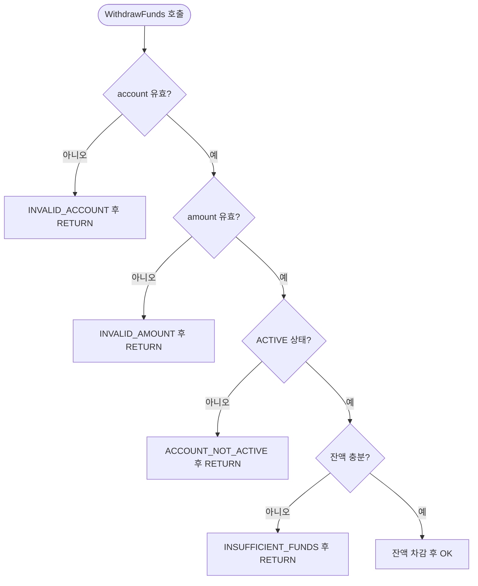

## 이게 뭔데

중첩 조건을 보호 절로 바꾸는 리팩토링. 한 문장으로 말하면 **"안 되는 케이스는 위에서 먼저 쳐내고 RETURN, 진짜 일은 들여쓰기 없는 평지에서 한다"**는 거다.

비유를 하나 들자. 클럽 입구에 보안요원이 서 있다고 치자. 일 잘하는 보안요원은 안 되는 사람을 입구에서 바로 돌려보낸다. "신분증 없으세요? 돌아가세요." "미성년자네요? 돌아가세요." "복장 안 되네요? 돌아가세요." 통과한 사람만 안으로 들어간다. 안쪽은 깔끔하다.

반대로 일 못하는 보안요원은 손님을 일단 다 안으로 들여보낸다. 그러고는 클럽 한가운데서 "어 잠깐, 신분증 있으세요? 있으면 그 안에서 또 나이 확인하고, 나이 되면 그 안에서 또 복장 보고..." 손님은 점점 안쪽으로, 더 안쪽으로 끌려 들어간다. 통과 조건이 다섯 개면 다섯 겹 안쪽까지 들어가야 입장 도장을 받는다. 코드로 치면 이게 바로 **중첩 IF**다. 정상 경로(happy path)가 가장 깊은 곳에, 들여쓰기 다섯 칸 안에 처박혀 있다.

보호 절(guard clause)은 그 일 잘하는 보안요원이다. **막아야 할 조건을 만나면 그 자리에서 바로 RETURN**해서 돌려보내고, 살아남은 정상 경로는 들여쓰기 없는 평지에서 처리한다.

<Callout type="info" title="한 줄 요약">
중첩 IF는 "되는 케이스를 안쪽으로" 몰고, 보호 절은 "안 되는 케이스를 바깥쪽에서" 쳐낸다. 같은 로직인데 후자가 압도적으로 읽기 쉽다.
</Callout>

## 언제 쓰나

이건 책에서 말하는 **내부 리팩토링(Internal Refactoring)**이다. 즉 프로시저의 **인터페이스(시그니처)는 한 글자도 안 바뀐다.** 파라미터도 그대로, 리턴 타입도 그대로, 호출하는 앱/배치/리포트도 손댈 필요 없다. 바꾸는 건 오직 프로시저 **본문 한 덩어리**다. 그래서 가장 안전하고, 가장 먼저 손대기 좋은 종류의 리팩토링이다.

언제 쓰냐면, 이런 냄새가 날 때다.

- 저장 프로시저를 여는데 `IF ... THEN` 안에 `IF ... THEN` 안에 또 `IF ... THEN`이 러시아 인형처럼 들어 있다.
- `END IF;`가 화면 맨 아래에 여섯 줄 연달아 붙어 있고, 어느 게 어느 IF의 짝인지 괄호 세듯 세야 한다.
- 진짜 중요한 계산 로직이 들여쓰기 한참 안쪽에 있어서, 그걸 읽으려면 화면을 오른쪽으로 스크롤해야 한다.
- "이 ELSE는 어느 조건의 ELSE지?" 하고 한참 위로 올라가서 짝을 맞춰야 한다.

특히 잔액 검증, 권한 검증, NULL/유효성 체크처럼 **"이 조건 안 맞으면 어차피 아무 일도 안 하고 끝"**인 로직이 줄줄이 있을 때가 보호 절의 무대다. 그런 건 본질적으로 "통과 못 하면 즉시 퇴장"이라, 굳이 중첩으로 안고 갈 이유가 없다.

### 현실 시나리오: 이런 적 있을 거임

은행 시스템의 출금 프로시저 `WithdrawFunds`를 유지보수하라는 티켓이 떨어졌다. 열어보니 이런 모양이다. 8년 전 누군가가 한 줄 한 줄 조건을 추가하면서 자란 코드다.

```sql
-- Before: 중첩 IF 지옥. happy path가 들여쓰기 5칸 안쪽에 있음
CREATE OR REPLACE PROCEDURE WithdrawFunds(
  p_account_id  IN  NUMBER,
  p_amount      IN  NUMBER,
  p_result      OUT VARCHAR2
) AS
  v_status   Account.Status%TYPE;
  v_balance  Account.Balance%TYPE;
BEGIN
  IF p_account_id IS NOT NULL THEN
    IF p_amount > 0 THEN
      SELECT Status, Balance INTO v_status, v_balance
      FROM Account WHERE AccountID = p_account_id;

      IF v_status = 'ACTIVE' THEN
        IF v_balance >= p_amount THEN
          -- ↓↓↓ 진짜 하고 싶은 일이 여기, 5칸 안쪽에 있음 ↓↓↓
          UPDATE Account
          SET Balance = Balance - p_amount
          WHERE AccountID = p_account_id;
          p_result := 'OK';
        ELSE
          p_result := 'INSUFFICIENT_FUNDS';
        END IF;
      ELSE
        p_result := 'ACCOUNT_NOT_ACTIVE';
      END IF;
    ELSE
      p_result := 'INVALID_AMOUNT';
    END IF;
  ELSE
    p_result := 'INVALID_ACCOUNT';
  END IF;
END;
```

이 코드 자체는 버그가 없다. 동작도 정상이다. 근데 읽어보라. 진짜 하고 싶은 일 — "잔액 차감" — 이 들여쓰기 다섯 칸 안쪽에 묻혀 있다. 그리고 그 짝인 `ELSE`들은 happy path에서 한참 떨어진 **저 아래**에 흩어져 있다. `INVALID_AMOUNT` 처리가 `p_amount > 0` 조건에서 무려 열 몇 줄 떨어진 곳에 있다. 조건과 그 실패 처리가 멀리 떨어져 있으니, 새 조건 하나 추가하려면 IF 한 겹을 더 까고 `END IF`를 한 줄 더 늘려야 한다. 이 코드는 손댈수록 더 깊어지게 설계돼 있다.

여기에 "최소 출금 한도" 조건 하나만 더 추가해 달라는 요청이 오면, 당신은 또 한 겹을 까고 `END IF` 하나를 어딘가 정확한 위치에 끼워 넣어야 한다. 그러다 `END IF` 짝을 한 칸 잘못 맞추면, 컴파일은 통과하는데 로직이 미묘하게 어긋난 채로 운영에 나간다. 이게 중첩 IF가 사람을 잡는 전형적인 방식이다.

## 주의할 점

좋은 리팩토링이지만, 무지성으로 적용하면 사고가 난다. 몇 가지 트레이드오프를 짚자.

<Callout type="warning" title="이건 동작을 바꾸면 안 되는 리팩토링이다">
보호 절 변환의 대전제는 **"겉보기 동작이 완전히 동일해야 한다"**는 것이다. 그런데 중첩을 평탄화하면서 조건의 순서·부정(NOT)·단락 평가가 미묘하게 어긋나기 쉽다.

- 원래 `IF v_status = 'ACTIVE'`를 보호 절로 뒤집으면 `IF v_status != 'ACTIVE' THEN RETURN`이 된다. 그런데 `v_status`가 **NULL이면?** 원래 중첩 코드에서는 `= 'ACTIVE'`가 false라 ELSE를 탔지만, 뒤집은 `!= 'ACTIVE'`도 SQL 3값 논리에서는 NULL이라 **THEN을 안 탄다.** 즉 보호 절을 못 빠져나가서 happy path로 새어 들어갈 수 있다. 이런 NULL 처리는 명시적으로 `IF v_status IS NULL OR v_status != 'ACTIVE'`로 막아야 한다.
- SELECT가 행을 못 찾으면 PL/SQL은 `NO_DATA_FOUND` 예외를 던진다. 원래 코드도 이 예외를 안 잡고 있었는지, 그 동작까지 그대로 보존하는지 확인해야 한다.

요점: **이건 "읽기 좋게 바꾸는" 리팩토링이지 "고치는" 작업이 아니다.** 동작이 바뀌면 그건 리팩토링이 아니라 그냥 변경(behavior change)이다.
</Callout>

그래서 이 리팩토링의 **진짜 전제 조건은 회귀 테스트**다. 프로시저 입력별로 기대 출력을 고정해 둔 테스트가 있어야, "평탄화 전후 동작이 같다"를 기계가 보장해 준다. 테스트 없이 눈으로만 "같겠지" 하고 평탄화하면, 그건 리팩토링이 아니라 도박이다. 특히 SI 현장의 수백~수천 라인짜리 프로시저는 테스트가 없는 경우가 흔한데, 그럴수록 손대기 전에 최소한의 특성화 테스트(characterization test, 현재 동작을 그대로 박제하는 테스트)부터 까는 게 순서다.

또 하나. **보호 절이 만능은 아니다.** 조건 분기가 "실패면 퇴장"이 아니라 "분기마다 서로 다른 일을 본격적으로 한다"면, 평탄화한 보호 절 행렬보다 차라리 `CASE`나 별도 메서드 추출이 더 맞다. 보호 절은 **early exit 성격의 검증**에 어울린다는 걸 기억하자.

## 이렇게 한다

같은 `WithdrawFunds`를 보호 절로 평탄화해 보자.

<Steps>
<Step title="실패 조건을 위로 끌어올린다">
중첩의 가장 바깥 IF부터, **그 조건이 거짓일 때 하던 일(ELSE 블록)**을 찾는다. 그걸 "조건이 거짓이면 즉시 그 처리를 하고 RETURN"하는 보호 절로 뒤집어 맨 위로 올린다. NULL 가능성이 있는 비교는 부정(NOT)으로 뒤집을 때 3값 논리를 반드시 챙긴다.
</Step>
<Step title="안쪽으로 한 겹씩 반복한다">
다음 겹의 IF도 똑같이 보호 절로 뽑아 올린다. 검증 순서(account → amount → status → balance)는 보존한다 — 순서를 바꾸면 NULL/예외 동작이 달라질 수 있다.
</Step>
<Step title="살아남은 happy path를 평지에 둔다">
모든 실패 케이스를 위에서 쳐내고 나면, 남는 건 "여기까지 왔으면 무조건 정상"인 코드뿐이다. 이걸 들여쓰기 없이, END IF 산더미 없이 깔끔하게 둔다.
</Step>
</Steps>

```sql
-- After: 보호 절로 평탄화. 안 되는 케이스는 위에서 즉시 퇴장
CREATE OR REPLACE PROCEDURE WithdrawFunds(
  p_account_id  IN  NUMBER,
  p_amount      IN  NUMBER,
  p_result      OUT VARCHAR2
) AS
  v_status   Account.Status%TYPE;
  v_balance  Account.Balance%TYPE;
BEGIN
  -- Guard 1: 계좌 ID 유효성
  IF p_account_id IS NULL THEN
    p_result := 'INVALID_ACCOUNT';
    RETURN;
  END IF;

  -- Guard 2: 금액 유효성
  IF p_amount IS NULL OR p_amount <= 0 THEN
    p_result := 'INVALID_AMOUNT';
    RETURN;
  END IF;

  SELECT Status, Balance INTO v_status, v_balance
  FROM Account WHERE AccountID = p_account_id;

  -- Guard 3: 계좌 상태 (NULL도 '비활성'으로 명시 처리)
  IF v_status IS NULL OR v_status != 'ACTIVE' THEN
    p_result := 'ACCOUNT_NOT_ACTIVE';
    RETURN;
  END IF;

  -- Guard 4: 잔액 충분 여부
  IF v_balance < p_amount THEN
    p_result := 'INSUFFICIENT_FUNDS';
    RETURN;
  END IF;

  -- Happy path: 여기까지 왔으면 전부 통과. 평지에서 본론만.
  UPDATE Account
  SET Balance = Balance - p_amount
  WHERE AccountID = p_account_id;
  p_result := 'OK';
END;
```

차이가 보일 거다. 정상 경로가 더 이상 다섯 칸 안쪽이 아니라 **맨 아래 평지**에 있다. 조건과 그 실패 처리(`INVALID_AMOUNT`)가 **딱 붙어** 있어서 둘을 따로 찾아 헤맬 필요가 없다. 새 조건 — 가령 "최소 출금 한도" — 을 추가하고 싶으면, 적절한 위치에 보호 절 블록 하나를 끼워 넣으면 끝이다. END IF 짝 맞추기도, 들여쓰기 한 겹 추가도 없다. **코드가 손댈수록 깊어지는 게 아니라, 옆으로 한 줄 늘어나기만 한다.**

여기서 책의 2006년식 골격을 현대 실무로 살짝 보강하자.

### DDL/DML이 아니라 "코드 배포"라는 점

대부분의 스키마 리팩토링은 테이블 구조(DDL)와 데이터(DML)를 건드린다. 그런데 이 리팩토링은 **데이터를 한 줄도 안 건드린다.** 바뀌는 건 프로시저 본문, 즉 `CREATE OR REPLACE PROCEDURE` 하나뿐이다. 그래서 "데이터 마이그레이션" 단계가 아예 없다. 대신 이건 **코드 변경**이고, 코드 변경의 안전망은 형상관리와 회귀 테스트다.

이걸 손코딩으로 운영 DB에 바로 `CREATE OR REPLACE` 때리면 안 된다. 프로시저 정의도 버전 관리되는 마이그레이션으로 다뤄야 한다. Flyway라면 이렇게 한 파일로 만든다.

```text
-- db/migration/V90__refactor_withdrawfunds_guard_clauses.sql
-- 동작 변경 없음. 중첩 IF → 보호 절 평탄화 (내부 리팩토링).
CREATE OR REPLACE PROCEDURE WithdrawFunds( ... ) AS
  ...
END;
```

`CREATE OR REPLACE`라 이전 버전을 덮어쓰는 거고, 인터페이스가 동일하니 **롤백도 직전 버전의 프로시저로 다시 `CREATE OR REPLACE`하면 끝**이다. Liquibase를 쓴다면 changeset에 `rollback`으로 구버전 정의를 명시해 두면 자동 롤백까지 챙길 수 있다. 데이터가 안 바뀌니 롤백 리스크가 스키마 리팩토링보다 훨씬 낮다는 게 내부 리팩토링의 큰 장점이다.

### 회귀 테스트로 "동작 동일"을 박제

위에서 강조한 회귀 테스트를 실제로 어떻게 까냐면, utPLSQL(PL/SQL용 단위 테스트 프레임워크) 같은 걸로 입력 조합별 기대값을 고정한다.

```sql
-- utPLSQL 예시: 평탄화 전후 모두 통과해야 함
CREATE OR REPLACE PACKAGE BODY test_withdraw AS
  PROCEDURE rejects_null_account IS
    v_result VARCHAR2(50);
  BEGIN
    WithdrawFunds(NULL, 100, v_result);
    ut.expect(v_result).to_equal('INVALID_ACCOUNT');
  END;

  PROCEDURE rejects_inactive_account IS
    v_result VARCHAR2(50);
  BEGIN
    -- 미리 'CLOSED' 상태 계좌를 셋업했다고 가정
    WithdrawFunds(1001, 100, v_result);
    ut.expect(v_result).to_equal('ACCOUNT_NOT_ACTIVE');
  END;

  PROCEDURE rejects_overdraw IS
    v_result VARCHAR2(50);
  BEGIN
    -- 잔액 50짜리 계좌에서 100 출금 시도
    WithdrawFunds(1002, 100, v_result);
    ut.expect(v_result).to_equal('INSUFFICIENT_FUNDS');
  END;
END;
```

핵심은 **이 테스트를 평탄화 전에 먼저 작성해서 Before 코드에서 통과시키는 것**이다. 그러면 After 코드에서도 똑같이 통과해야 하고, 안 통과하면 평탄화 과정에서 동작이 바뀐 거다. 특히 위에서 짚은 NULL 케이스(`v_status`가 NULL인 계좌)를 테스트에 꼭 넣어라. 보호 절로 뒤집을 때 3값 논리 때문에 새는 그 케이스를, 테스트가 잡아준다.

<Callout type="success" title="ORM/앱 레이어도 똑같다">
이건 PL/SQL만의 얘기가 아니다. 애플리케이션 서비스 메서드, 도메인 로직, 어디든 똑같다. 자바든 타입스크립트든, 검증 로직을 메서드 맨 위에서 `if (!valid) throw ...` / `return` 으로 쳐내고 본론을 평지에서 쓰는 게 보호 절이다. 린터(ESLint의 일부 규칙, SonarQube의 cognitive complexity 등)는 깊은 중첩을 냄새로 잡아주기까지 한다. DB 코드든 앱 코드든 원리는 하나다.
</Callout>

### 데이터 흐름으로 보면

평탄화의 본질은 "통과 못 하는 흐름을 일찍 끊는 것"이다. 그림으로 보면 차이가 명확하다.



각 보호 절은 "실패면 오른쪽으로 빠져 RETURN, 성공이면 아래로 직진"이다. 흐름이 일직선이라 머릿속에서 추적하기 쉽다. 중첩 IF는 이 일직선을 깊이 방향으로 접어 넣은 것과 같고, 보호 절은 그걸 다시 펴는 거다.

## 정리

중첩 IF는 죄가 없다. 그냥 조건을 하나씩 추가하다 보면 자연스럽게 깊어질 뿐이다. 하지만 깊어질수록 happy path는 안쪽으로 숨고, 실패 처리는 멀리 흩어진다.

> **보호 절은 "안 되는 케이스를 입구에서 쳐내고, 정상 경로는 평지에서 처리한다."**

이건 인터페이스를 안 건드리는 내부 리팩토링이라, 외부 영향 없이 가장 안전하게 손댈 수 있는 종류다. 데이터 마이그레이션도 없다. 다만 잊지 말 것은, 이게 **"읽기 좋게"가 목적이지 "고치기"가 목적이 아니라는 것**이다. 평탄화하면서 NULL·예외·조건 순서가 미묘하게 어긋나기 쉬우니, 회귀 테스트로 동작을 박제한 뒤에 손대고, 프로시저 정의도 Flyway/Liquibase 마이그레이션으로 버전 관리해서 롤백 가능하게 두자. 그러면 클럽 입구의 일 잘하는 보안요원처럼, 안 되는 사람은 입구에서 돌려보내고 안쪽은 늘 깔끔하게 유지할 수 있다.
