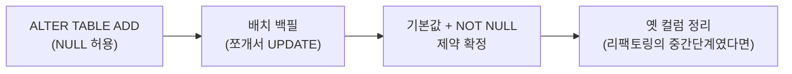

import { Callout, Steps, Step, Tabs, TabsList, TabsTrigger, TabsContent } from '@/components/writing-ui';

## 이게 뭔데

새 컬럼 도입. 정의는 한 줄이다. **기존 테이블에 컬럼 하나를 더한다.** `ALTER TABLE ... ADD`. 끝.

근데 이걸 "끝"이라고 생각하는 순간이 함정이다. 컬럼을 추가하는 DDL은 진짜로 한 줄이다. 문제는 그 컬럼이 **방금 텅 빈 채로 태어났다**는 거다. 600만 행짜리 `Account` 테이블에 `RiskTier` 컬럼을 붙였다고 치자. 컬럼은 생겼는데, 600만 행 전부 `RiskTier`가 `NULL`이다. 이 컬럼이 의미를 가지려면 누군가 저 600만 칸을 값으로 메꿔야 한다. 그게 진짜 일이다.

비유를 하나 들자면, 회사가 새 사무실로 이사 가서 책상을 600만 개 새로 들여놨다고 보면 된다. 책상 들이는 거(`ALTER TABLE`)는 트럭이 한 번 왔다 가면 끝이다. 근데 그 책상마다 누가 앉을지 명패를 다 붙이는 일(populate)이 남았다. 명패 안 붙은 책상은 그냥 빈 책상이지 자리가 아니다.

<Callout type="info" title="한 줄 요약">
새 컬럼 도입에서 `ALTER TABLE ADD`는 시작일 뿐이다. 이 변환의 90%는 컬럼을 채우는 일(populate, 요즘 말로 백필)이고, 그걸 안전하게 하려면 **NULL 허용으로 먼저 추가 → 값 채움 → NOT NULL 확정**의 3박자가 필요하다.
</Callout>

참고로 이건 책 분류로 치면 "리팩토링"이 아니라 **변환(transformation)**이다. 리팩토링은 스키마의 동작·정보 의미를 둘 다 보존하는 변경인데, 새 컬럼 도입은 없던 정보를 더하니까 의미가 바뀐다. 그래서 변환이다. 동시에 이건 다른 큰 리팩토링들의 **빌딩블록**이기도 하다. Move Column이든 Rename Column이든, 속을 까보면 거의 다 "일단 새 컬럼을 도입하고" 시작한다. 그러니 이거 하나 제대로 익혀두면 여러 리팩토링이 같이 풀린다.

## 언제 쓰나

크게 두 가지 상황에서 나온다.

**1. 새 속성을 영속화해야 할 때.** 제일 흔하다. 기획에서 "계좌마다 위험 등급을 매기고 싶어요"가 내려오면, `Account`에 `RiskTier` 같은 컬럼이 필요하다. 새 요구사항 = 새 데이터 = 새 컬럼. 가장 정직한 케이스다.

**2. 더 큰 리팩토링의 중간 단계로.** Move Column(컬럼을 다른 테이블로 옮기기), Rename Column(컬럼 이름 바꾸기) 같은 작업은 절대 "쾅" 하고 바꾸지 않는다. 일단 목적지에 **새 컬럼을 도입해놓고**, 양쪽을 한동안 같이 유지하다가, 다 옮겨지면 옛 컬럼을 버린다. 이 "새 컬럼을 도입해놓고"가 바로 이 변환이다. 요즘 expand-contract(또는 parallel change)라고 부르는 패턴의 'expand' 단계가 정확히 이거다.

### 현실 시나리오: 이런 적 있을 거임

은행 시스템. `Customer` 테이블에 고객이 800만 명 들어 있다. 어느 날 컴플라이언스 팀에서 요청이 온다. "각 고객한테 위험 등급(`RiskTier`: LOW / MEDIUM / HIGH)을 부여해서 보관해야 합니다. 규제 때문에요."

신입 시절의 나라면 이렇게 했을 거다. 마이그레이션 파일 하나 열고,

```sql
ALTER TABLE Customer ADD RiskTier VARCHAR2(10) NOT NULL;
```

엔터. 그리고 운영 배포. 결과는 둘 중 하나다.

- **DB가 에러를 뱉는다.** 기존 800만 행은 `RiskTier`가 없는데 갑자기 "NULL 금지"라니, 기본값도 없이 NOT NULL 컬럼을 추가하면 대부분의 DB가 "기존 행은 어쩌라고?" 하면서 거부한다.
- **(기본값을 줬다면) 테이블이 잠긴다.** `DEFAULT 'LOW' NOT NULL`을 붙였더니 이번엔 통과는 했는데, 엔진이 800만 행을 전부 다시 쓰면서 테이블에 락을 건다. 그 몇 분 동안 `Customer`를 읽고 쓰는 모든 거래가 줄을 선다. 새벽이면 다행이고, 낮이었으면 슬랙에 불난다.

두 경우 다, 원인은 같다. **"빈 컬럼을 추가하는 일"과 "그 컬럼을 채우는 일"을 한 방에 처리하려다 사고가 난 거다.** 이 둘은 성격이 완전히 다른 작업이라 분리해야 한다.

## 주의할 점

본격적으로 손대기 전에, 책이 콕 집어 경고하는 함정이 하나 있다.

<Callout type="warning" title="그 정보, 이미 어딘가에 있지 않나?">
새 컬럼을 만들기 전에 **같은 정보를 담은 컬럼이 다른 데 이미 있는지** 먼저 확인해라. 예를 들어 `Customer.RiskTier`를 만들려는데, 알고 보니 `Account` 쪽에 `risk_level`이 이미 있고 그게 사실상 같은 걸 의미한다면? 컬럼을 새로 파는 순간 같은 사실이 두 군데 적히는 **데이터 중복**이 생긴다. 그리고 중복은 곧 "두 값이 언젠가 어긋난다"는 뜻이다. 한쪽만 업데이트되고 다른 쪽은 옛날 값으로 남는 순간, 참조 무결성은 깨지고 "둘 중 뭐가 진짜야?"라는 질문이 시작된다. 새 컬럼은 **정말 새로운 사실일 때만** 만들어라.
</Callout>

또 하나, 백필 자체의 비용을 얕보지 마라. 컬럼 추가 DDL은 (요즘 엔진에선) 메타데이터만 건드려서 즉시 끝나는 경우가 많다. 하지만 800만 행을 `UPDATE`로 채우는 건 진짜 I/O다. 한 트랜잭션으로 `UPDATE Customer SET ...`을 통째로 날리면 거대한 락과 거대한 트랜잭션 로그/언두가 생기고, 운 나쁘면 그 자체로 장애가 된다. 백필은 "한 방"이 아니라 "나눠서"가 기본이다. 뒤에서 다룬다.

## 이렇게 한다

핵심 메커니즘은 책 그대로 단순하다. `ALTER TABLE ... ADD`로 추가하고, 채우고, 필요하면 제약을 건다. 다만 **순서**가 생명이다. 책이 권하는 안전한 3단계는 이렇다.

<Steps>
<Step title="NULL 허용 컬럼으로 먼저 추가한다">
처음부터 NOT NULL로 추가하지 않는다. 기존 행들은 아직 값이 없으니까, **NULL을 허용한 채로** 컬럼을 만든다. 이러면 기존 데이터와 안 싸우고, 테이블 전체를 다시 쓸 일도 없다.

```sql
-- 책의 예시(State.CountryCode)를 은행 도메인으로
ALTER TABLE Customer ADD RiskTier VARCHAR2(10) NULL;
```

이 시점에서 컬럼은 존재하지만 800만 행 전부 `RiskTier IS NULL`이다. 정상이다. 의도된 빈칸이다.
</Step>

<Step title="컬럼을 값으로 채운다 (populate / 백필)">
이게 이 변환의 본체다. 책은 세 가지를 챙기라고 한다.

1. **이해관계자와 함께 적절한 값을 정한다.** "위험 등급을 무슨 기준으로 매기지?"는 개발자가 혼자 정할 문제가 아니다. 컴플라이언스/현업과 규칙을 합의해야 한다. 신규 고객은 기본 `LOW`로 시작한다든지.
2. **수동 입력, 자동 채우기 스크립트, 또는 둘의 조합**으로 채운다.
3. 다 채워졌으면 그제서야 기본값·NOT NULL 같은 후속 리팩토링을 검토한다.

가장 단순한 형태는 책에 나온 그대로 `UPDATE` 한 방이다.

```sql
-- NULL인 행을 기본값으로 메꾼다 (책의 State 예시 패턴)
UPDATE Customer SET RiskTier = 'LOW' WHERE RiskTier IS NULL;
```

규칙이 있다면 규칙대로 채운다. 잔액(`Balance`)이 큰 VIP는 더 깐깐하게 본다든지.

```sql
UPDATE Customer c
SET RiskTier = CASE
                 WHEN (SELECT SUM(a.Balance) FROM Account a WHERE a.CustomerId = c.CustomerId) > 1000000 THEN 'HIGH'
                 WHEN (SELECT SUM(a.Balance) FROM Account a WHERE a.CustomerId = c.CustomerId) > 100000 THEN 'MEDIUM'
                 ELSE 'LOW'
               END
WHERE c.RiskTier IS NULL;
```

문제는 위 `UPDATE`를 **통째로** 800만 행에 날리면 안 된다는 거다. 이건 잠시 뒤 "백필은 나눠서" 절에서 제대로 다룬다.
</Step>

<Step title="제약을 확정한다 (기본값 / NOT NULL / FK)">
모든 행이 채워졌다는 걸 확인했으면, 그제서야 컬럼을 "진짜"로 만든다.

- 신규 행이 항상 값을 갖도록 **기본값**을 건다(Introduce Default Value).
- 빈칸을 더는 허용하지 않도록 **NOT NULL**로 굳힌다(Make Column Non-Nullable).
- 다른 테이블을 참조하는 컬럼이면 **외래 키 제약**을 건다(Add Foreign Key Constraint). 예컨대 `RiskTier`를 자유 문자열이 아니라 `RiskTierType` 룩업 테이블 참조로 만들 거라면 여기서 FK를 추가한다.

```sql
ALTER TABLE Customer MODIFY RiskTier DEFAULT 'LOW';
ALTER TABLE Customer MODIFY RiskTier NOT NULL;
```

순서를 거꾸로 하면(채우기 전에 NOT NULL) 위 시나리오처럼 터진다. 이 3단계의 존재 이유가 바로 그거다.
</Step>
</Steps>

### 백필은 "한 방"이 아니라 "나눠서"

책이 2006년에 `UPDATE ... WHERE CountryCode IS NULL` 한 줄로 끝낸 건, 예시가 작은 룩업 테이블(`State`)이었기 때문이다. 운영 규모 테이블에선 이 한 줄이 흉기가 된다. 800만 행을 한 트랜잭션으로 갱신하면:

- 갱신 대상 행(혹은 테이블)에 **락**이 오래 걸려서 다른 거래가 막힌다.
- 언두/리두(또는 WAL) 로그가 **폭발**한다. 디스크가 차거나 복제 지연이 난다.
- 중간에 실패하면 **전부 롤백**돼서 처음부터 다시.

그래서 현대 실무의 백필은 **배치로 쪼갠다**. PK 범위로 끊어서, 한 번에 수천~수만 행씩, 사이사이 숨 쉬게(슬립) 한다.

```sql
-- 의사코드 같은 배치 백필 (커서/PK 기반)
-- 한 번에 5,000행씩, 더 채울 게 없을 때까지 반복
UPDATE Customer
SET RiskTier = 'LOW'
WHERE RiskTier IS NULL
  AND CustomerId IN (
    SELECT CustomerId FROM Customer WHERE RiskTier IS NULL FETCH FIRST 5000 ROWS ONLY
  );
-- 커밋 → 잠깐 쉼 → 남은 행 있으면 다시
```

이걸 사람이 손으로 돌리진 않고, 보통 애플리케이션/배치 잡으로 감싼다.

```typescript
// 배치 백필 워커: 다 채울 때까지 작은 덩어리로 반복
const BATCH = 5_000;

async function backfillRiskTier(): Promise<void> {
  while (true) {
    const updated = await db.query(
      `UPDATE Customer
         SET RiskTier = 'LOW'
       WHERE CustomerId IN (
         SELECT CustomerId FROM Customer
         WHERE RiskTier IS NULL
         LIMIT $1
       )`,
      [BATCH],
    );

    if (updated.rowCount === 0) break; // 더 채울 게 없음 → 종료

    // 락·복제지연·부하를 위해 한 박자 쉰다
    await sleep(200);
  }
}
```

이렇게 하면 각 트랜잭션이 작아서 락이 짧고, 실패해도 그 덩어리만 다시 하면 되고, 운영 부하를 보면서 속도를 조절할 수 있다. 핵심은 **"전체를 한 번에"를 "조금씩 여러 번"으로 바꾸는 것**이다.

### 무중단으로 컬럼 추가하기 (DDL 단계)

채우기 전에 컬럼을 "추가하는" DDL 자체도, 큰 테이블에선 조심할 게 있다.

<Tabs defaultValue="pg">
<TabsList>
<TabsTrigger value="pg">PostgreSQL</TabsTrigger>
<TabsTrigger value="mysql">MySQL</TabsTrigger>
<TabsTrigger value="generated">생성 컬럼</TabsTrigger>
</TabsList>

<TabsContent value="pg">
NULL 허용 컬럼 추가는 메타데이터만 건드려서 사실상 즉시 끝난다(안전). 함정은 **NOT NULL 제약**이다. 그냥 `ALTER ... SET NOT NULL`을 걸면 테이블 전체를 풀스캔하며 검증하는 동안 락이 걸린다. 이걸 피하려면 먼저 `NOT VALID` 체크 제약으로 가볍게 걸어두고, 트래픽 적을 때 `VALIDATE`로 천천히 검증하는 트릭을 쓴다.

```sql
-- 1) NULL 허용으로 추가 (즉시)
ALTER TABLE customer ADD COLUMN risk_tier text;

-- 2) 배치 백필 (앞 절 참고)

-- 3) NOT NULL을 락 짧게 거는 트릭: NOT VALID로 먼저, 나중에 VALIDATE
ALTER TABLE customer ADD CONSTRAINT customer_risk_tier_notnull
  CHECK (risk_tier IS NOT NULL) NOT VALID;
ALTER TABLE customer VALIDATE CONSTRAINT customer_risk_tier_notnull; -- 풀 락 없이 검증
```
</TabsContent>

<TabsContent value="mysql">
요즘 MySQL(8.0+)은 `ADD COLUMN`을 상당 부분 인플레이스/즉시(instant)로 처리한다. 그래도 백필 `UPDATE`나 인덱스 추가가 무거운 테이블이면, **gh-ost**나 **pt-online-schema-change** 같은 온라인 스키마 변경 도구를 쓴다. 이 도구들은 그림자(shadow) 테이블을 만들어 데이터를 복제하고, 변경분을 따라잡은 뒤 원자적으로 이름을 바꿔치기한다 — 그동안 원본 테이블은 계속 서비스된다.

```bash
# pt-online-schema-change로 락 없이 컬럼 추가
pt-online-schema-change \
  --alter "ADD COLUMN risk_tier VARCHAR(10) NULL" \
  D=bank,t=customer --execute
```
</TabsContent>

<TabsContent value="generated">
값이 **다른 컬럼에서 계산 가능**하다면, 백필을 아예 안 하는 길도 있다. 생성 컬럼(generated/computed column)으로 정의하면 DB가 알아서 값을 만든다. 잔액 등급처럼 규칙이 고정돼 있고 원본 컬럼이 같은 테이블에 있을 때 잘 맞는다.

```sql
-- PostgreSQL 저장 생성 컬럼 예시
ALTER TABLE account
  ADD COLUMN balance_tier text
  GENERATED ALWAYS AS (
    CASE WHEN balance > 1000000 THEN 'HIGH'
         WHEN balance > 100000  THEN 'MEDIUM'
         ELSE 'LOW' END
  ) STORED;
```

이러면 populate 단계가 통째로 사라진다. 단, 규칙이 자주 바뀌거나 외부 데이터로 채워야 하면 생성 컬럼은 못 쓴다.
</TabsContent>
</Tabs>

### 접근 프로그램 수정 (코드 단계)

여기는 책이 "간단하다"고 한 부분이고, 실제로도 보통 그렇다. **그냥 앱에서 새 컬럼을 쓰면 된다.** 책은 Hibernate 매핑에 `<many-to-one>` 한 줄 추가하는 예를 들었는데, 현대 ORM도 똑같이 매핑에 필드 하나 더하는 정도다.

```typescript
// 엔티티에 새 필드 추가 (TypeORM 예시)
@Entity()
export class Customer {
  @PrimaryGeneratedColumn()
  id!: number;

  // 새로 도입한 컬럼. nullable로 시작했다가 백필 끝나면 false로
  @Column({ type: 'varchar', length: 10, nullable: true })
  riskTier!: string | null;
}
```

다만 현대 실무에서 진짜 챙길 건 "코드 한 줄"이 아니라 **배포 순서**다. 컬럼 추가/제거를 코드 배포와 엮을 땐 expand-contract로 간다.

<Callout type="note" title="expand-contract: 스키마와 코드를 따로 배포하기">
무중단을 지키려면 스키마 변경과 코드 변경이 동시에 일어나면 안 된다. 순서를 벌린다.

1. **expand** — NULL 허용 컬럼을 먼저 추가한다. 이 시점 코드는 새 컬럼을 몰라도 멀쩡하다(NULL 허용이라 INSERT가 안 깨짐).
2. **migrate** — 새 컬럼을 읽고 쓰는 코드를 배포하고, 백필을 돌린다. 한동안 옛 동작과 새 동작이 공존한다.
3. **contract** — 모든 데이터가 채워지고 모든 인스턴스가 새 코드로 갈렸음을 확인한 뒤, NOT NULL을 굳히고(필요하면 옛 컬럼을 버린다).

각 단계 사이에 롤백 여지가 있어서, 한 단계가 잘못돼도 전체가 무너지지 않는다.
</Callout>

마이그레이션 자체는 손으로 SQL을 적기보다 **마이그레이션 도구**로 버전 관리하는 게 표준이다. Flyway/Liquibase(JVM), Alembic(Python), Prisma Migrate나 TypeORM 마이그레이션(Node) 모두 "컬럼 추가" + "백필" + "제약 확정"을 각각의 버전 스크립트로 남긴다. 핵심은 **백필을 마이그레이션 안에 인라인으로 박지 말 것** — 거대 테이블 백필은 별도 배치 잡으로 빼고, 마이그레이션엔 DDL과 가벼운 제약만 두는 게 안전하다.



## 정리

새 컬럼 도입은 데이터베이스 리팩토링 중 제일 쉬워 보이는데, 그 "쉬워 보임"이 함정이다. `ALTER TABLE ADD`는 진짜 한 줄이지만, 그게 전부였던 적은 한 번도 없다.

> **컬럼을 만드는 건 트럭 한 번. 컬럼을 채우는 게 진짜 이사다.**

그래서 순서가 전부다. **NULL 허용으로 먼저 더하고 → 운영 부하를 보면서 배치로 채우고 → 다 채워진 걸 확인한 뒤에 NOT NULL을 굳힌다.** 2006년 책이 룩업 테이블에서 보여준 이 3박자는, 800만 행짜리 운영 테이블에선 expand-contract와 배치 백필, 온라인 스키마 변경 도구의 옷을 입고 그대로 살아 있다. 도구는 바뀌어도 원리는 같다. 빈 컬럼을 더하는 일과 그걸 채우는 일을 **분리하는 것** — 이거 하나만 지켜도 새 컬럼 도입은 사고가 아니라 루틴이 된다.
