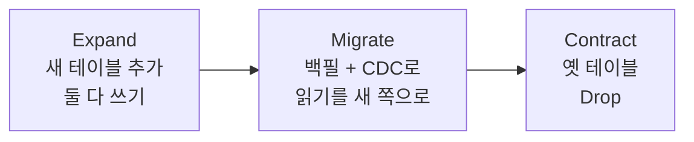

## 이게 뭔데

Introduce New Table. 이름 그대로다. **기존 데이터베이스에 새 테이블을 하나 만든다.** `CREATE TABLE` 한 줄. 끝.

…이렇게 적고 나니 글이 너무 짧아서 민망한데, 사실 이 변환의 진짜 알맹이는 `CREATE TABLE`이 아니다. 비유를 하나 들자. 이사 와서 수납장 하나가 부족하다 싶을 때, 다들 일단 새 수납장부터 지르려고 한다. 근데 베란다에 가 보면 이미 비슷한 수납장이 빈 채로 박스에 깔려 있는 경우가 태반이다. 새 테이블도 똑같다. **만드는 건 1초인데, "이거 이미 어디 있지 않나?"를 안 보고 질러서 똑같은 정보가 두 군데서 따로 노는 사고**가 진짜 비싸다.

그리고 테이블을 만들어 봤자 그건 **빈 깡통**이다. 컬럼 정의만 있고 행이 하나도 없다. 이걸 의미 있게 채우는 일 — 그게 이 변환의 8할이다.

<Callout type="warning" title="한 줄 요약">
Introduce New Table에서 `CREATE TABLE`은 가장 쉬운 1단계다. 진짜 일은 (1) 비슷한 테이블이 이미 없는지 확인하고, (2) 새 깡통을 무슨 값으로 채울지 정하는 거다.
</Callout>

엄밀히 말하면 이건 "리팩토링"이 아니라 **변환(transformation)**이다. 리팩토링은 스키마의 동작 의미와 정보 의미를 *둘 다 보존*하면서 설계만 다듬는 일이다. 반면 새 테이블 도입은 데이터베이스에 **없던 그릇을 더하는** 거라, 의미를 바꿀 수도 있다. 리팩토링이 변환의 부분집합이라고 보면 된다. 그래서 Split Table, Rename Table 같은 "진짜 리팩토링"들도 내부 단계에서 이 변환을 호출해서 쓴다. 빌딩블록인 셈이다.

## 언제 쓰나

새 테이블이 답이 되는 상황은 크게 네 갈래다.

**1. 새 속성을 영속화해야 할 때.** 가장 흔하다. 새 요구사항이 들어왔는데, 그게 기존 테이블에 컬럼 몇 개 더하는 걸로는 안 되고 아예 별개의 엔티티일 때. 은행 도메인으로 가 보자. `Customer` 테이블이 있는데, 갑자기 "고객 본인 확인용 여권 정보랑 증명사진을 보관해야 한다"는 컴플라이언스 요구가 떨어졌다. 이건 `Customer`에 컬럼 두어 개 붙이는 게 아니라 `CustomerIdentification`이라는 별도 테이블이 어울린다. (여권 없는 고객도 많고, 사진 BLOB을 고객 핵심 테이블에 박으면 그 테이블이 무거워지니까.)

**2. 다른 리팩토링의 중간 단계로.** Split Table은 큰 테이블 하나를 둘로 쪼개는데, 그 "둘 중 새 쪽"을 만드는 게 결국 Introduce New Table이다. Rename Table도 (안전하게 하려면) 새 이름의 테이블을 먼저 만들고 데이터를 흘려보낸 뒤 옛 테이블을 지운다. 그러니 이 변환은 단독으로도 쓰지만, 더 큰 작업의 부품으로 더 자주 등장한다.

**3. 공식 데이터 원천(official data source)을 세울 때.** 이게 좀 어른의 사정이다. 비슷한 정보가 여기저기 흩어져서 서로 안 맞는 상황. 예를 들어 고객 주소가 `Customer` 테이블에도 있고, 옛날 `Policy`(보험증권) 시스템에도 따로 박혀 있고, CRM이 또 자기 사본을 들고 있다. 셋이 미묘하게 다르고, 누구 말이 맞는지 아무도 모른다. 이럴 때 "주소의 단일 진실 원천(single source of truth)"이 될 새 테이블을 세우고, 시간을 두고 나머지 사본들을 Drop Table로 정리해 나간다. Use Official Data Source 리팩토링이 이 변환 위에 얹혀 있다.

**4. 데이터를 잠깐 보관해야 할 때 (백업).** Drop Table이나 Merge Tables처럼 데이터를 파괴적으로 건드리는 작업을 할 때, "혹시 모르니" 원본을 떠 둘 임시 테이블이 필요하다. 롤백 비상금 같은 거다.

<Callout type="info" title="컬럼이냐 테이블이냐">
"새 속성"이 들어왔을 때 컬럼으로 붙일지(Introduce New Column) 테이블로 뺄지(Introduce New Table)는 정규화 판단이다. 1:1이고 거의 항상 같이 조회되면 컬럼이 편하다. 옵셔널하거나(여권 없는 고객), 1:N이거나(고객 한 명의 여러 연락처), BLOB처럼 무거우면 테이블로 빼는 게 낫다. 사진을 `Customer`에 박으면 고객 목록 쿼리가 매번 BLOB을 끌고 다니게 된다.
</Callout>

## 지르기 전에: 이거 이미 없냐

본격적인 메커니즘 전에, 이 변환의 트레이드오프이자 가장 중요한 사전 점검 하나만 짚자. **도입하려는 테이블이 이미 다른 데 있는 거 아니냐.**

현실 시나리오. "고객 연락처를 따로 관리하자"는 티켓을 받았다. 시원하게 `CustomerContact` 테이블을 만들었다. 그런데 두 달 뒤 알게 된다. 옆 팀이 이미 `Customer_Comm_Info`라는 테이블을 운영 중이었고, 거기에 전화·이메일이 다 들어 있었다. 이제 같은 정보가 두 테이블에 따로 산다. 한쪽만 업데이트되는 일이 생기고, 둘이 어긋나고, 어느 게 맞는지 묻는 슬랙 스레드가 영원히 안 닫힌다. 처음 그 사고를 부른 건 코드가 아니라 **"일단 만들고 보자"는 그 순간의 손가락**이다.

정확히 같은 테이블은 없어도 **"비슷한" 테이블은 거의 항상 있다.** 그리고 이 경우 새 테이블을 추가하는 것보다 **기존 테이블을 리팩토링해서 재활용하는 편이 대개 더 싸다.** 컬럼 하나 추가(Introduce New Column)면 끝날 일을, 굳이 중복 테이블 만들어서 두 곳을 동기화하는 짐을 떠안지 말자는 거다.

<Callout type="warning" title="만들기 전에 의심부터">
- 같은/비슷한 정보를 담은 테이블이 **이미 있는가?** (스키마 검색, 데이터 카탈로그, 옆 팀에 한 번 물어보기)
- 있다면, 새 테이블 대신 **기존 테이블에 컬럼을 더하는** Introduce New Column으로 끝나지 않나?
- 마이크로서비스라면 이 데이터의 **소유권**은 누구 건가? 남의 서비스가 이미 소유한 데이터를 내 DB에 또 만들면, 그게 분산 환경의 "두 테이블이 어긋난다" 사고다.

중복 테이블은 만들 땐 1초, 동기화 부채는 영원하다.
</Callout>

## 이렇게 한다

세 단계로 본다. 스키마 변경(DDL), 데이터 채우기(DML), 접근 프로그램(코드) 수정. 2006년 책은 `CREATE TABLE`을 손으로 적고 수동 INSERT 스크립트를 짰다. 그 골격은 지금도 유효하지만, 도구는 갈아끼운다.

<Steps>

<Step title="테이블을 만든다 (DDL)">

본질은 `CREATE TABLE` 한 방이다. 여권/사진 보관용 테이블을 만든다.

```sql
-- 원본(책) 골격: 고객 본인확인 정보
CREATE TABLE CustomerIdentification (
  CustomerID  BIGINT      NOT NULL,
  Photo       BYTEA,
  PassportID  VARCHAR(20),
  CONSTRAINT PK_CustomerIdentification PRIMARY KEY (CustomerID),
  CONSTRAINT FK_CustomerIdentification_Customer
    FOREIGN KEY (CustomerID) REFERENCES Customer (CustomerID)
);
```

여기서 현대 실무 포인트 두 개.

**(a) 손 DDL 말고 마이그레이션 도구로.** 운영에서 이걸 손으로 친다는 건 형상 관리가 안 된다는 뜻이다. Flyway/Liquibase(JVM), Alembic(Python), ORM 마이그레이션(Prisma migrate, TypeORM, Django, Rails)으로 버전 관리하면, 누가 언제 무슨 스키마를 올렸는지 추적되고 모든 환경에 동일하게 적용된다.

```sql
-- Flyway 예: V42__create_customer_identification.sql
CREATE TABLE customer_identification (
  customer_id  BIGINT      NOT NULL PRIMARY KEY,
  photo        BYTEA,
  passport_id  VARCHAR(20),
  created_at   TIMESTAMPTZ NOT NULL DEFAULT now()
);
-- FK는 일부러 분리. 이유는 (b)에서.
```

**(b) FK 제약은 NOT VALID로 분리해 건다.** 새 테이블이 빈 깡통일 땐 FK가 부담 없지만, 이미 데이터가 든 테이블에 외래 키를 거는 상황(예: 공식 소스로 채운 뒤)에선 풀 테이블 스캔 락이 위험하다. PostgreSQL이라면 일단 `NOT VALID`로 빠르게 걸고, 트래픽 한가할 때 `VALIDATE`로 검증한다.

```sql
-- 1) 즉시. 기존 행 검사 안 하고 메타데이터만 추가 (짧은 락)
ALTER TABLE customer_identification
  ADD CONSTRAINT fk_ci_customer
  FOREIGN KEY (customer_id) REFERENCES customer (customer_id)
  NOT VALID;

-- 2) 나중에. 기존 행을 ShareUpdateExclusive 락으로 검증 (쓰기 막지 않음)
ALTER TABLE customer_identification VALIDATE CONSTRAINT fk_ci_customer;
```

</Step>

<Step title="깡통을 채운다 (DML) — 진짜 과제">

테이블을 만들어도 행이 없으면 아무 의미가 없다. 채우는 방식은 출처에 따라 갈린다.

**정적 조회 데이터 / 신규 입력**이면 그냥 스크립트로 INSERT한다. 소량이면 `INSERT`, 대량이면 벌크 로더(PostgreSQL `COPY`, MySQL `LOAD DATA`, 옛날 Oracle `SQLLDR`)를 쓴다. 한 줄씩 INSERT 백만 번 돌리면 밤새도 안 끝난다.

```sql
-- 소량: 그냥 INSERT
INSERT INTO customer_identification (customer_id, passport_id)
VALUES (1001, 'M12345678');
```

**기존 테이블에서 옮겨오는 경우**(공식 소스 세우기, 백업)는 `INSERT ... SELECT`로 한 번에 긁어온다.

```sql
-- 흩어진 주소를 공식 소스 테이블로 모은다
INSERT INTO customer_address (customer_id, line1, city, postal_code)
SELECT customer_id, addr_line1, city, zip
FROM   legacy_policy_holder
WHERE  addr_line1 IS NOT NULL;
```

여기서 책에 없는 현대 도구를 얹는다. **공식 데이터 원천을 세우는 건 일회성 복사로 안 끝난다.** 옛 테이블에 계속 쓰기가 들어오는 동안 새 테이블도 동기화돼야 컷오버할 수 있다. 그래서:

- **CDC(Debezium)/outbox 패턴** — 원본 테이블의 변경 로그(WAL/binlog)를 잡아 새 테이블로 흘려보낸다. 초기 백필(`INSERT ... SELECT`) 한 번 + 그 이후 변경분을 CDC로 따라잡으면, 두 테이블이 같아지는 순간 컷오버할 수 있다.
- **공식 소스가 읽기 요약용**이라면 애초에 테이블이 아니라 **materialized view**가 답일 수 있다. 여러 테이블의 합집합/요약을 물리화해서 들고, 주기적으로 `REFRESH`한다. "테이블을 만들자"가 본능이지만 출처가 전부 다른 테이블의 파생이라면 한 번 의심하자.

<Callout type="warning" title="채우기 전에는 NOT NULL을 함부로 걸지 마라">
빈 테이블에 `passport_id NOT NULL`을 걸어 두고 백필을 돌리면, 여권 없는 고객 행에서 죄다 터진다. 순서는 항상 (1) nullable로 만들고 → (2) 채우고 → (3) 데이터가 다 찼고 정말 필수일 때만 `SET NOT NULL`. PostgreSQL 11+는 `NOT NULL` 추가가 풀스캔이라 큰 테이블이면 체크 제약 `NOT VALID` 트릭으로 우회한다. 여러 기존 테이블을 대체하는 새 테이블은 데이터 의미가 미묘하게 달라서, 채우는 과정에서 값 매핑·정규화가 꼭 필요해진다.
</Callout>

</Step>

<Step title="접근 프로그램을 고친다 (코드)">

이상적으로는 제일 쉬운 단계다. 새 테이블이니 기존 코드가 깨질 일은 없고, **그냥 앱이 새 테이블을 쓰기 시작하면 된다.** ORM이라면 엔티티 하나 추가하고 관계 매핑만 걸면 끝.

```typescript
// TypeORM 예: 새 엔티티 추가 + Customer와 1:1
@Entity()
export class CustomerIdentification {
  @PrimaryColumn()
  customerId!: number;

  @Column({ type: "bytea", nullable: true })
  photo?: Buffer;

  @Column({ nullable: true })
  passportId?: string;

  @OneToOne(() => Customer)
  @JoinColumn({ name: "customerId" })
  customer!: Customer;
}
```

다만 "공식 소스로 여러 옛 테이블을 대체"하는 경우엔 이게 안 단순하다. 새 테이블의 스키마·데이터 의미가 옛 테이블들과 미묘하게 다를 수 있어서, 그걸 읽던 코드들을 다 같이 손봐야 한다. 이럴 때 한 방에 갈아끼우지 말고 **expand-contract(parallel change)**로 간다.

</Step>

</Steps>

### expand-contract: 한 방에 안 바꾼다

공식 소스 같은 대체성 작업에서 옛 테이블 읽기를 새 테이블 읽기로 한 번에 바꾸면, 뭐 하나 빠뜨린 코드가 운영에서 빈 데이터를 읽고 사고가 난다. 그래서 **늘리고(expand) → 옮기고(migrate) → 줄인다(contract)**.



<Steps>

<Step title="Expand">
새 테이블을 만들고(이 변환), 쓰기는 옛 테이블과 새 테이블 **양쪽에** 한다. 읽기는 아직 옛 테이블. 둘 중 하나만 봐도 정상 동작하는 안전한 상태.
</Step>

<Step title="Migrate">
초기 백필로 과거 데이터를 옮기고(`INSERT ... SELECT` 또는 CDC), 두 테이블이 같아지면 읽기를 새 테이블로 하나씩 옮긴다. 화면별·서비스별로 점진적으로.
</Step>

<Step title="Contract">
모든 읽기·쓰기가 새 테이블만 쓰는 게 확인되면, 옛 테이블에 Drop Table을 적용한다. 책이 말한 "시간이 지나면서 원본 테이블들을 정리"가 바로 이 단계다. 단, drop date를 명시하고 그날까지 아무도 안 읽는지 모니터링부터.
</Step>

</Steps>

이게 책의 "공식 데이터 원천 세우고 → 시간 두고 옛 테이블 Drop"을 현대 무중단 배포 어휘로 옮긴 그림이다.

## 정리

`CREATE TABLE`은 이 변환에서 제일 안 중요한 줄이다. 진짜 중요한 두 가지만 기억하면 된다.

> **만들기 전엔 "이미 비슷한 거 없냐"를 묻고, 만든 뒤엔 "이 깡통을 뭘로 채우냐"를 풀어라.**

전자를 건너뛰면 중복 테이블이 두 군데서 어긋나는 영원한 동기화 부채가 생긴다. 후자를 가볍게 보면 빈 테이블만 덩그러니 남는다. 그리고 단순한 신규 속성이면 마이그레이션 도구로 만들고 ORM 엔티티 하나 추가하면 끝이지만, 여러 옛 테이블을 대체하는 공식 소스라면 expand-contract와 CDC를 동원해 천천히 갈아끼우는 게 안전하다. 새 테이블을 더하는 일은 쉽다. 어려운 건 그 테이블이 **거짓말하지 않게** 만드는 일이다.
