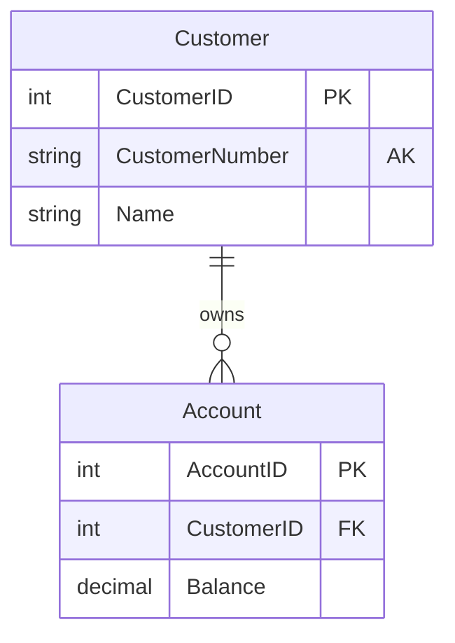
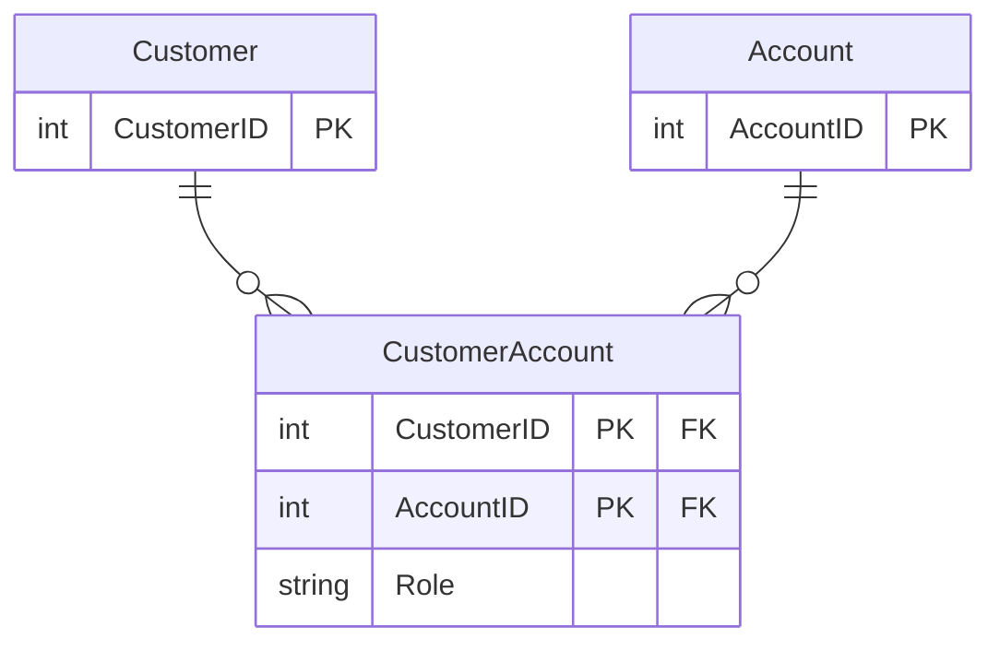
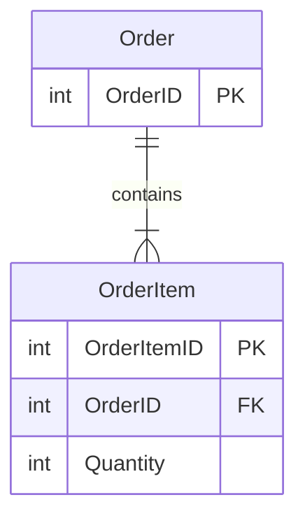

import { Callout, Tabs, TabsList, TabsTrigger, TabsContent, Icon } from '@/components/writing-ui';

## 이게 뭔데

데이터 모델 다이어그램의 표기법은, 한마디로 **그림 그릴 때 쓰는 맞춤법**이다. 테이블을 어떻게 그리고, 어느 컬럼이 키이고, 두 테이블이 1:N인지 N:M인지를 점·선·박스로 약속해 둔 거다.

비유하자면 악보다. "도레미"를 그냥 텍스트로 적어도 음악은 음악이지만, 오선지에 음표로 찍어두면 처음 보는 연주자도 똑같이 친다. 데이터 모델도 마찬가지다. `Customer 1 — 0..* Account`라고 글로 풀어 써도 되지만, 박스 두 개랑 선 하나로 그려두면 회의실에 있는 다섯 명이 같은 그림을 머릿속에 그린다.

이 책 전체가 쓰는 표기법은 거창한 표준 ER 다이어그램이 아니라, Scott Ambler의 *Agile Database Techniques*(2003)에서 나온 **UML 프로파일의 부분집합**이다. UML 클래스 다이어그램을 빌려와서 물리 테이블을 그리는 방식이라고 보면 된다. 부록이니까 여기선 "다이어그램을 보다가 막혔을 때 찾아보는 사전" 용도로 핵심만 추린다.

<Callout type="note" title="표기법은 도구지 종교가 아님">
세상엔 표기법이 여러 개 있다. UML, IE(까마귀발, Crow's Foot), IDEF1X, Barker... 어느 게 정답이라는 건 없다. 팀이 같은 걸 보고 같은 그림을 떠올릴 수 있으면 그게 좋은 표기법이다. 이 책은 UML 프로파일을 쓰니 그 문법만 알아두면 이 시리즈의 그림들이 다 읽힌다.
</Callout>

## 테이블은 박스 한두세 칸으로

가장 기본 단위는 테이블이고, **1~3개 칸을 가진 박스**로 그린다. 클래스 다이어그램 박스를 떠올리면 거의 똑같다.

- **1번째 칸(필수)** — 테이블 이름. 칸 하나만 그려도 일단 테이블이다.
- **2번째 칸(선택)** — 컬럼 목록. 컬럼은 **이름만 필수**다. 타입(`VARCHAR(50)`, `DECIMAL` 같은 거)은 그림이 지저분해지면 그냥 생략한다. 개념을 보여줄 땐 이름만, 구현을 박을 땐 타입까지.
- **3번째 칸(선택)** — 그 테이블에 걸린 **트리거** 목록. 예를 들어 `Policy` 테이블 박스 맨 아래 칸에 `DeletePolicyNotes { event = on delete }` 같은 식으로 적는다. "이 테이블 건드리면 뒤에서 뭐가 같이 도네"를 한눈에 보여주려는 거다.

여기서 한 가지 특수 표기. **계산 컬럼(derived column)** 은 이름 앞에 슬래시 `/` 를 붙인다. 가령 보험 도메인에서 `Policy` 테이블에 `/ ValueToDate`가 있으면, "이건 진짜 저장되는 컬럼이 아니라 다른 값들로 계산해서 나오는 파생값이다"라는 뜻이다.

```text
+------------------------+
|        Policy          |   <- 1칸: 테이블 이름
+------------------------+
| PolicyID  <<PK>>       |   <- 2칸: 컬럼 (키는 스테레오타입 붙음)
| CustomerID <<FK>>      |
| PolicyNumber <<AK>>    |
| / ValueToDate          |   <- 슬래시 = 계산 컬럼
+------------------------+
| DeletePolicyNotes      |   <- 3칸: 트리거
|   { event = on delete }|
+------------------------+
```

## 키는 컬럼 뒤에 꼬리표를 단다 — 스테레오타입

UML의 **스테레오타입(stereotype)**, 그러니까 꺾쇠 두 개로 감싼 `<<...>>` 라벨이 키 표기에 쓰인다. 컬럼이 어떤 키의 일부면 그 뒤에 꼬리표처럼 붙는다. 종류는 이렇다.

| 스테레오타입 | 의미 | 한 줄 메모 |
|------|------|------|
| `<<PK>>` | 기본 키의 일부 | 그 행을 유일하게 식별하는 그 키 |
| `<<FK>>` | 다른 테이블로의 외래 키의 일부 | "나 저쪽 테이블 가리킴" |
| `<<AK>>` | 대체 키(보조 유니크 키)의 일부 | PK는 아닌데 그래도 유니크 (이메일, 사번 같은 거) |
| `<<Natural>>` | 키가 엔티티의 자연 속성 | 거의 안 적음. surrogate라고 안 써 있으면 natural로 가정 |
| `<<Surrogate>>` | 인공(대리) 키 | `AccountID` 같은 의미 없는 일련번호. 자연 속성이 아님 |

`<<Natural>>`을 거의 안 적는다는 게 포인트다. 기본 가정이 "natural"이라서, **굳이 표시하는 건 surrogate일 때**다. 즉 다이어그램에서 `<<Surrogate>>`가 보이면 "아 이건 비즈니스 의미 없는 인조 ID구나" 하고 읽으면 된다.

복합 키에서 **컬럼 순서가 중요할 때**는 중괄호 명명값으로 적는다.

```text
CustomerID  <<PK>> <<AK>> { key = PK & order = 1, key = AK-1 & order = 2 }
```

근데 이거 다 적으면 그림이 금방 빡빡해진다. 그래서 **순서가 정말 중요할 때만** 표기하는 게 관례다. 안 적혀 있으면 "순서 신경 안 써도 되거나, 적기 귀찮았거나" 둘 중 하나다.

<Callout type="info" title="요즘 ORM에선 이게 데코레이터다">
이 키 스테레오타입들, 사실 지금 우리가 매일 쓰는 거다. TypeORM의 `@PrimaryGeneratedColumn()`이 `<<PK>> <<Surrogate>>`고, `@Column({ unique: true })`가 `<<AK>>`고, `@ManyToOne()`이 거는 조인 컬럼이 `<<FK>>`다. drizzle은 데코레이터 대신 빌더로 같은 걸 말한다 — `serial().primaryKey()`가 `<<PK>> <<Surrogate>>`, `.unique()`가 `<<AK>>`, `.references(() => ...)`가 `<<FK>>`다. 2006년엔 다이어그램에 손으로 꼬리표를 달았고, 지금은 코드에 데코레이터나 빌더 메서드로 단다. 문법만 바뀌었지 말하려는 건 똑같다.
</Callout>

## 관계와 카디널리티 — 선 하나에 담긴 정보

테이블 둘을 잇는 **실선**이 관계(연관, association)다. 이 선 하나에 생각보다 많은 정보가 실린다.

- **관계 이름(label)** — 왼→오, 위→아래로 읽었을 때 자연스럽게 붙인다. `Customer —owns— Account`처럼. 문장으로 읽힌다.
- **방향성 표시(directionality indicator)** — 읽는 방향이 헷갈릴 때만 쓰는 **선택적 화살표**. 안 헷갈리면 안 그린다.
- **카디널리티(다중성, multiplicity)** — 관계선 **양 끝**에 적는다. 이게 핵심이다. "한쪽 하나에 반대쪽 몇 개가 붙냐"를 말한다.

다중성 표기는 이렇게 읽는다.

| 다중성 | 의미 |
|------|------|
| `0..1` | 0 또는 1 (있을 수도, 없을 수도. 최대 하나) |
| `1` | 정확히 1 (필수, 딱 하나) |
| `0..*` | 0 이상 (없어도 되고 여러 개여도 됨) |
| `1..*` 또는 `*` | 1 이상 (최소 하나는 있어야 함) |
| `n` | 정확히 n (n은 1보다 큰 고정값) |
| `0..n` / `1..n` | 0~n / 1~n |

예를 들어 `Customer 1 —owns— 0..* Account`라고 그려져 있으면, "고객 하나는 계좌를 0개 이상 가질 수 있고, 계좌 하나는 정확히 고객 하나에 속한다"로 읽힌다. 양 끝 숫자를 같이 봐야 1:N인지 1:1인지 N:M인지 정확히 잡힌다.

<Callout type="warning" title="0이 붙냐 1이 붙냐가 NULL을 가른다">
카디널리티에서 제일 자주 흘려보는 게 최소값이다. `0..*`와 `1..*`는 그림상 한 글자 차이지만, 물리 스키마에서는 **외래 키가 NULL 허용이냐 NOT NULL이냐**를 가른다. `Account —has— 1 Customer`(계좌엔 반드시 주인이 있어야 함)면 `account.customer_id`는 NOT NULL이고, `0..1`이면 NULL 허용이다. 다이어그램의 0 하나가 나중에 마이그레이션의 제약조건으로 박힌다. 대충 보면 안 되는 숫자다.
</Callout>

Mermaid의 `erDiagram`으로 같은 걸 그리면 이렇게 된다. 까마귀발(Crow's Foot) 표기라 UML 다중성이랑 모양은 다르지만 말하는 건 똑같다.



`||--o{`를 풀어 읽으면, 왼쪽 `||`는 "정확히 1"(Customer 쪽), 오른쪽 `o{`는 "0 이상"(Account 쪽)이다. UML의 `1 —owns— 0..*`와 정확히 같은 말이다.

## 다대다는 직접 못 그린다 — 연관 테이블

여기서 관계형 DB의 현실이 끼어든다. **다대다(N:M) 관계는 관계형 DB에서 직접 구현할 수 없다.** 테이블 둘 사이에 그냥 선 하나로 N:M을 그릴 순 있어도, 실제 물리 모델에선 그게 안 된다. FK는 컬럼 하나가 행 하나를 가리키는 거라, "여러 개가 여러 개를 가리킴"을 한 컬럼으로 표현할 방법이 없다.

그래서 중간에 **연관 테이블(associative table)** 을 끼운다. 스테레오타입은 `<<Associative Table>>`. 은행 도메인에서 한 계좌를 여러 고객이 공동 명의로 갖고(공동 계좌), 한 고객이 여러 계좌를 가질 수 있다면, `Customer`와 `Account` 사이에 `CustomerAccount`를 끼워 N:M을 두 개의 1:N으로 쪼갠다.



`CustomerAccount`의 PK는 두 FK를 합친 복합 키다. 이게 N:M을 푸는 정석이다. 덤으로 이 중간 테이블엔 관계 자체의 속성(여기선 `Role` — 주 명의자/공동 명의자 같은 거)을 달 수도 있다. 관계에 데이터를 매달 수 있다는 게 연관 테이블의 숨은 장점이다.

## 집합(part-of)은 속 빈 다이아몬드

또 하나 자주 보이는 게 **집합(aggregation)**, 즉 "part-of" 관계다. "이건 저것의 부품이다"를 표현한다. 표기는 선 끝의 **속이 빈 다이아몬드(◇)**.

전형적인 예가 주문과 주문 항목이다. `Order ◇— OrderItem`. 다이아몬드가 `Order` 쪽에 붙고, `OrderItem`은 그 부품이다. "주문 항목은 주문의 일부다"가 읽힌다. 다이아몬드 옆에 다중성이 안 적혀 있으면 `1`로 가정한다(부품 하나는 전체 하나에 속한다).



<Callout type="note" title="속 빈 다이아몬드 vs 꽉 찬 다이아몬드">
UML엔 다이아몬드가 두 종류다. **속 빈 다이아몬드(◇, aggregation)** 는 느슨한 part-of — 부품이 전체보다 오래 살 수 있다. **꽉 찬 다이아몬드(◆, composition)** 는 강한 소유 — 전체가 죽으면 부품도 같이 죽는다. 물리 모델에선 이 차이가 보통 <strong>FK의 ON DELETE 동작</strong>으로 나타난다. composition이면 <code>ON DELETE CASCADE</code>로 부모 지우면 자식도 끌려가고, aggregation이면 그냥 NULL 처리하거나 막는 식이다. 이 책 표기법은 주로 속 빈 다이아몬드를 쓴다.
</Callout>

## 테이블 말고 다른 객체들

DB엔 테이블만 있는 게 아니다. 저장 프로시저, 인덱스, 뷰도 다이어그램에 올라온다. 각자 표기가 있다.

<Tabs defaultValue="proc">
  <TabsList>
    <TabsTrigger value="proc">저장 프로시저</TabsTrigger>
    <TabsTrigger value="index">인덱스</TabsTrigger>
    <TabsTrigger value="view">뷰</TabsTrigger>
  </TabsList>

  <TabsContent value="proc">

**저장 프로시저(stored procedure)** 는 2칸 박스다. 위 칸에 DB 이름과 `<<Stored Procedures>>` 스테레오타입, 아래 칸에 프로시저/함수 시그니처를 적는다.

```text
+-----------------------------------------+
|  BankDB                                 |
|  <<Stored Procedures>>                  |
+-----------------------------------------+
| GetAccountList(int CustomerID): Records |
| CalculateInterest(int AccountID): money |
+-----------------------------------------+
```

리턴 타입까지 시그니처에 박아두는 게 포인트다. "이 프로시저를 호출하면 뭐가 나오는지"를 그림만 보고 알 수 있게.

  </TabsContent>

  <TabsContent value="index">

**인덱스(index)** 는 `<<Index>>` 스테레오타입을 단 박스로 그리고, 그 인덱스가 **어떤 컬럼을 기반으로 하는지**를 점선 **의존(dependency) 관계**로 연결한다. 화살표가 테이블의 그 컬럼(들)을 가리킨다.

```text
+------------------+
|  <<Index>>       |
|  IX_Account_Cust |
+------------------+
        ¦  (dependency)
        v
   Account.CustomerID
```

"이 인덱스가 사라지면 어느 쿼리가 느려지나"를 추적할 때 이 의존선이 유용하다.

  </TabsContent>

  <TabsContent value="view">

**뷰(view)** 는 2칸 박스. 위 칸에 뷰 이름과 `<<View>>` 스테레오타입, 아래 칸(선택)에 뷰가 담는 컬럼 목록을 적는다. 읽기 전용 같은 속성은 명명값으로 표기한다.

```text
+---------------------------+
|  ActiveAccounts           |
|  <<View>>                 |
|  { access = read only }   |
+---------------------------+
| AccountID                 |
| CustomerName              |
| Balance                   |
+---------------------------+
```

`{ access = read only }`가 붙어 있으면 "이건 조회용이지 INSERT/UPDATE 대상이 아님"을 알려준다.

  </TabsContent>
</Tabs>

## 요즘은 이걸 손으로 안 그린다

여기까지가 책의 표기법인데, 솔직히 2006년 얘기다. 그때는 Visio나 Rational Rose 켜놓고 박스를 손으로 끌어다 그렸다. 지금은 이 역할을 다른 것들이 가져갔다.

- **dbdiagram.io / DBML** — 텍스트로 스키마를 적으면 ERD를 그려준다. `Ref: account.customer_id > customer.id` 한 줄이 위에서 본 관계선 하나다. 다이어그램이 코드라서 git에 올라가고 diff가 보인다.
- **Mermaid erDiagram** — 이 글에서 계속 쓴 그거다. 마크다운 안에 `erDiagram` 펜스를 박으면 GitHub README나 위키에서 바로 렌더된다. UML 다중성 대신 까마귀발을 쓰지만 정보량은 같다.
- **ORM 스키마 정의** — Prisma의 `schema.prisma`, TypeORM 엔티티 클래스, Django 모델, drizzle의 `schema.ts`. 이건 **그림이 아니라 진실의 원천**이다. 코드가 곧 모델이고, 거기서 ERD를 역으로 뽑아낸다(`prisma-erd-generator`, drizzle은 `drizzle-kit`/Drizzle Studio로 스키마를 시각화). 다이어그램이 코드를 따라가는 게 아니라 코드가 다이어그램을 낳는다.

<Callout type="info" title="그래서 표기법은 아직도 알아야 하나">
알아야 한다. 도구가 바뀌었어도 **개념은 그대로**다. PK/FK/AK가 뭔지, 1:N과 N:M을 어떻게 푸는지, 카디널리티의 0과 1이 NULL 제약을 가른다는 것 — 이건 Mermaid를 쓰든 Prisma를 쓰든 똑같이 굴러간다. 표기법은 결국 "데이터 모델을 어떻게 사고하느냐"의 문법이지, 특정 툴의 단축키가 아니다. 그림 도구는 5년마다 바뀌어도 이 문법은 안 바뀐다.
</Callout>

## 정리

표기법은 데이터 모델을 말하는 공통 언어다. 박스는 테이블, `<<PK>>`/`<<FK>>`/`<<AK>>`는 키의 역할, 선 양 끝 숫자는 카디널리티, 그 숫자의 0과 1은 NULL 제약, 다대다는 연관 테이블로 풀고, part-of는 속 빈 다이아몬드로 그린다. 저장 프로시저·인덱스·뷰도 각자 자리가 있다.

> **다이어그램의 점과 선은 장식이 아니라, 나중에 DDL이 될 제약조건이다.**

요즘은 Visio 대신 Mermaid와 Prisma가 이 일을 하지만, 읽는 법은 그대로다. 시리즈의 다이어그램을 보다가 "이 꼬리표가 뭐였더라" 싶으면 이 페이지로 돌아오면 된다.
