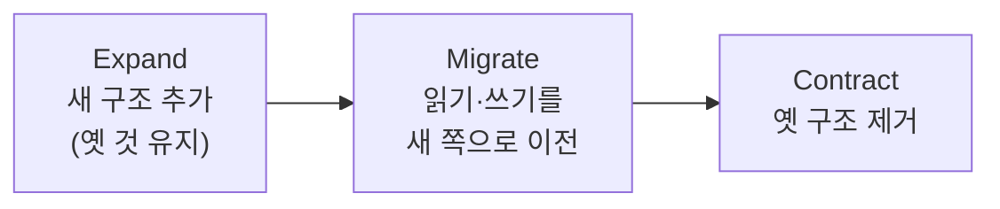

import { Callout, Steps, Step, Tabs, TabsList, TabsTrigger, TabsContent, Icon } from '@/components/writing-ui';

## 이게 뭔데

데이터베이스 리팩토링을 한 줄로 줄이면 이거다. **돌아가는 운영 DB를, 멈추지 않고, 의미를 안 바꾸면서, 작은 변경을 반복해서 좋게 만드는 일.**

비유를 하나 들자. 코드 리팩토링은 함수 이름 바꾸고, 거대한 메서드 쪼개고, 중복 빼내는 거잖아. 동작은 그대로인데 내부 구조만 깔끔해진다. 데이터베이스 리팩토링도 똑같다. `CustomerAddress` 컬럼 이름을 바꾸고, `Account` 테이블을 쪼개고, 중복 컬럼을 빼낸다. **잔액이 \$500이던 계좌는 리팩토링 후에도 \$500이어야 한다.** 의미가 바뀌면 그건 리팩토링이 아니라 그냥 사고다.

근데 코드 리팩토링이랑 결정적으로 다른 게 하나 있다. 코드는 IDE가 한 방에 다 바꿔준다. DB는 못 그런다. **그 안에 600만 건의 데이터가 살아 있고, 그걸 읽고 쓰는 애플리케이션이 다섯 개쯤 매달려 있고, 그 와중에도 24시간 트래픽이 들어온다.** 달리는 기차의 엔진을 바꾸는 것에 가깝다. 그래서 같은 "리팩토링"이라는 단어를 써도, DB 쪽은 훨씬 조심스러운 안무가 필요하다.

이 글은 카탈로그의 개별 리팩토링 하나를 파는 글이 아니다. 그 모든 리팩토링을 관통하는 **공통 골격과 행동요령**을 한 자리에 모은 종합편이다.

<Callout type="info" title="리팩토링 vs 변환(transformation)">
둘은 다른 거다. **변환은 의미를 바꿀 수 있는 상위 개념**이고(컬럼을 추가해 새 정보를 담는다든가), **리팩토링은 그중 "의미를 보존하는" 특수한 부분집합**이다. 실무에선 둘을 섞어 쓰지만, "지금 내가 하는 게 의미를 바꾸는 일인가 아닌가"는 항상 의식하고 있어야 한다. 바꾸는 거면 롤백 전략과 검증이 훨씬 무거워진다.
</Callout>

## 의미 보존: 두 종류의 "안 바뀜"

"의미를 보존한다"는 말이 막연한데, 책은 이걸 두 갈래로 쪼갠다.

- **정보 의미(informational semantics)** — DB가 담고 있는 정보가 그대로여야 한다. 리팩토링 전에 `Customer 42`의 등급이 VIP였으면, 후에도 VIP다. 데이터의 내용이 안 바뀐다.
- **동작 의미(behavioral semantics)** — 그 데이터를 읽고 쓰는 동작의 결과가 그대로여야 한다. `GetAccountBalance(42)`가 전에 \$500을 돌려줬으면, 컬럼을 옮기든 테이블을 쪼개든 후에도 \$500을 돌려줘야 한다.

둘 다 지켜야 진짜 리팩토링이다. 컬럼 이름만 바꿨는데 어떤 뷰가 깨져서 잔액이 NULL로 나오기 시작하면, 정보는 멀쩡해도 동작 의미가 깨진 거다. 그래서 **회귀 테스트**가 코드 리팩토링보다 DB 리팩토링에서 더 중요하다. 동작이 안 바뀌었다는 걸 증명할 방법이 그것밖에 없거든.

```sql
-- 회귀 테스트의 핵심 아이디어:
-- 리팩토링 전후로 이 쿼리의 결과가 동일해야 한다
SELECT CustomerID, SUM(Balance) AS TotalBalance
FROM Account
GROUP BY CustomerID;
```

## 세 가지 메커니즘: 진짜 비용은 DDL이 아니다

카탈로그의 모든 리팩토링은, 크든 작든, 똑같이 **세 조각**으로 분해된다. 이걸 머리에 박아두면 어떤 리팩토링을 보든 "아, 이건 세 조각 중 어디가 무겁겠다"가 바로 보인다.

<Steps>
<Step title="스키마 갱신 (schema update)">
DDL. 컬럼을 추가하고, 테이블을 쪼개고, 제약을 건다. `ALTER TABLE`, `CREATE TABLE` 같은 거. 보통 **이게 제일 짧고 쉽다.** 한 줄짜리도 많다.
</Step>
<Step title="데이터 마이그레이션 (data migration)">
DML. 기존 데이터를 새 구조로 채운다. `UPDATE`, `INSERT ... SELECT`, 벌크 로더, ETL. 600만 건을 옮긴다면 여기가 배포 윈도를 잡아먹는 주범이다.
</Step>
<Step title="접근 프로그램 갱신 (access program update)">
코드. 그 스키마를 읽고 쓰는 모든 것 — `WHERE` 절, 검증 로직, 뷰, 저장 프로시저, ORM 매핑, 리포트 쿼리. **여기가 진짜 지옥이다.** 누가 이 컬럼을 참조하는지 다 안다고 자신할 수 있나?
</Step>
</Steps>

<Callout type="warning" title="DDL 한 줄에 속지 마라">
`ALTER TABLE Customer DROP COLUMN MiddleName;` 이 한 줄은 1초면 끝난다. 그래서 다들 이게 "쉬운 리팩토링"이라고 생각한다. 근데 진짜 일은 그게 아니다. **그 컬럼을 누가 읽고 있었나**를 추적하는 일, 그리고 그 데이터를 안전하게 어딘가로 옮기는 일이다. 스키마 변경은 빙산의 일각이고, 데이터 마이그레이션과 접근 코드 갱신이 물밑의 90%다. 작업을 추정할 때 DDL만 보고 "한나절이면 되겠네" 하면 다음 날 새벽까지 야근한다.
</Callout>

## 전환 기간: expand-contract의 원형

운영 DB 리팩토링이 어려운 진짜 이유는 **여러 애플리케이션이 한 DB에 매달려 있어서**다. 은행 도메인으로 치면, `Account` 테이블을 코어뱅킹 시스템도 쓰고, 모바일 앱 백엔드도 쓰고, 야간 정산 배치도 쓰고, 데이터 분석팀 리포트도 쓴다. 이 다섯 개를 **같은 순간에 전부 바꿀 방법은 없다.** 누구는 배포 주기가 2주고, 누구는 분기에 한 번 나간다.

그래서 책이 내놓은 답이 **전환 기간(transition / deprecation period)**이다. 옛 스키마와 새 스키마를 **일정 기간 둘 다 살려둔다.** 모든 소비자가 새 쪽으로 넘어올 때까지 기다렸다가, 다 넘어온 게 확인되면 그때 옛 쪽을 치운다.

이게 바로 오늘날 우리가 **expand-contract** 또는 **parallel change**라고 부르는 패턴의 원형이다. 2006년 책이 "전환 기간"이라 부른 걸, 지금은 더 또렷한 3단계로 부른다.



<Steps>
<Step title="Expand — 새 구조를 더한다">
새 컬럼/테이블을 추가한다. 이때 **옛 것은 손대지 않는다.** 옛 코드는 아무것도 모르고 그대로 잘 돈다. 그리고 두 구조를 동기화하는 장치(트리거, 또는 CDC, 또는 애플리케이션 이중 쓰기)를 건다.
</Step>
<Step title="Migrate — 소비자를 하나씩 옮긴다">
애플리케이션들을 자기 배포 주기대로 하나씩 새 구조로 갈아탄다. 급할 거 없다. 두 구조가 동기화돼 있으니 누가 먼저 넘어오든 상관없다.
</Step>
<Step title="Contract — 옛 구조를 치운다">
모든 소비자가 새 쪽으로 넘어온 게 확인되면, 동기화 장치와 옛 컬럼/테이블을 제거한다. 여기서 **확인을 게을리하면** 아직 옛 컬럼을 읽던 분석 배치가 다음 달 1일에 조용히 깨진다.
</Step>
</Steps>

은행에서 `Customer` 테이블의 통짜 `Name` 컬럼을 `FirstName` / `LastName`으로 쪼갠다고 해보자. 책의 트리거식 안무는 이렇다.

<Tabs defaultValue="expand">
<TabsList>
<TabsTrigger value="expand">1. Expand</TabsTrigger>
<TabsTrigger value="sync">2. 동기화</TabsTrigger>
<TabsTrigger value="contract">3. Contract</TabsTrigger>
</TabsList>

<TabsContent value="expand">
```sql
-- 새 컬럼을 더한다. 옛 Name은 그대로 둔다.
ALTER TABLE Customer ADD FirstName VARCHAR(50);
ALTER TABLE Customer ADD LastName  VARCHAR(50);

-- 기존 데이터 한 번 채워준다 (데이터 마이그레이션)
UPDATE Customer
SET FirstName = SUBSTRING_INDEX(Name, ' ', 1),
    LastName  = SUBSTRING_INDEX(Name, ' ', -1)
WHERE FirstName IS NULL;
```
</TabsContent>

<TabsContent value="sync">
```sql
-- 전환 기간 동안 옛 컬럼과 새 컬럼을 양방향으로 동기화.
-- 옛 코드가 Name에 쓰면 새 컬럼도 따라 갱신.
CREATE TRIGGER sync_customer_name
BEFORE UPDATE ON Customer
FOR EACH ROW
SET NEW.FirstName = SUBSTRING_INDEX(NEW.Name, ' ', 1),
    NEW.LastName  = SUBSTRING_INDEX(NEW.Name, ' ', -1);
```

현대 실무에선 이 트리거 대신 **애플리케이션 이중 쓰기**, 혹은 더 깔끔하게는 **PostgreSQL의 GENERATED 컬럼**으로 대체하기도 한다. 동기화 로직을 DB가 알아서 유지해 주니까.

```sql
-- 단순 파생이면 트리거 대신 생성 컬럼 (Postgres)
ALTER TABLE Customer
  ADD COLUMN FirstName TEXT
  GENERATED ALWAYS AS (split_part(Name, ' ', 1)) STORED;
```
</TabsContent>

<TabsContent value="contract">
```sql
-- 모든 소비자가 FirstName/LastName으로 넘어온 걸 확인한 뒤에만!
DROP TRIGGER sync_customer_name;
ALTER TABLE Customer DROP COLUMN Name;
```
</TabsContent>
</Tabs>

<Callout type="note" title="트리거는 골격일 뿐">
책이 손코딩한 트리거는 "전환 기간 동안 두 구조를 동기화한다"는 아이디어의 골격이다. 트리거 자체가 정답은 아니다. 트리거는 숨어 있어서 디버깅이 괴롭고, 대량 마이그레이션 중엔 성능을 잡아먹는다. 그래서 현대엔 ① 애플리케이션 레이어 이중 쓰기, ② 생성 컬럼(파생값일 때), ③ CDC 기반 동기화(아래 참조) 같은 더 관측 가능한 수단으로 갈아탄다. 핵심 아이디어 — "둘을 잠깐 같이 살린다" — 만 가져가면 된다.
</Callout>

## 행동요령 체크리스트

여기까지가 원리다. 이제 실제로 운영 DB에 손대기 전에 머릿속으로 한 번씩 돌려볼 체크리스트로 압축한다.

<Callout type="success" title="운영 DB 리팩토링 전 체크리스트">
- **의미를 바꾸나, 보존하나?** — 보존이면 리팩토링, 바꾸면 변환. 변환이면 롤백·검증을 훨씬 무겁게 잡아라.
- **회귀 테스트가 있나?** — 동작이 안 바뀌었다는 걸 증명할 쿼리/테스트를 먼저 짜라. 없으면 "안 바뀌었다"는 건 그냥 느낌이다.
- **세 메커니즘으로 쪼갰나?** — 스키마 / 데이터 / 접근 코드. 데이터와 접근 코드가 진짜 일이다. DDL 한 줄에 속지 마라.
- **이 컬럼/테이블, 누가 쓰나?** — 소비자 목록을 끝까지 추적했나. 분석 배치, 리포트, 다른 팀 서비스까지.
- **전환 기간을 둘 수 있나?** — 한 방 빅뱅 대신 expand-contract로 쪼개라. 소비자가 둘 이상이면 거의 항상 이게 정답이다.
- **"이미 있는가"를 확인했나?** — 새 컬럼을 만들기 전에, 같은 정보가 다른 데 이미 있는지 봐라. 있으면 중복을 만들지 말고 기존 걸 리팩토링해라.
- **참조 무결성·결합도를 점검했나?** — FK가 깨지지 않나. 새 구조가 중복·결합도를 키우지 않나. 뷰는 결합을 숨기기도, 새로 만들기도 한다.
- **이 로직, DB에 둘 일이 맞나?** — 비즈니스 로직(파생 계산·필터·조건)이라면 단일 소유 서비스에선 코드가 낫고, 모든 SQL 클라이언트가 공유할 불변식이라면 DB가 맞다. "누가 이 DB를 보는가"로 가른다(아래 참조).
- **버전 관리·자동화됐나?** — 모든 변경은 스크립트로, 형상 관리 안에. 손으로 콘솔에서 친 ALTER는 어디에도 기록되지 않는다.
- **배포 윈도 안에 끝나나?** — 마이그레이션 시간을 실제로 측정했나. 600만 건 UPDATE가 30분 락을 잡으면 그건 무중단이 아니다.
</Callout>

특히 **"이미 있는가" 먼저**는 의외로 자주 까먹는다. `Customer`에 등급 컬럼을 추가하려는데, 알고 보니 `Policy` 테이블에 비슷한 등급 정보가 이미 있더라 — 이런 일이 흔하다. 그럴 땐 새 컬럼을 만들어 중복을 늘리기보다, **기존 구조를 리팩토링해서 한 군데로 모으는** 편이 거의 항상 낫다. 중복은 언젠가 두 값이 어긋나는 날 폭발한다.

## 현대화 총정리: 2006년의 손코딩을 무엇으로 대체하나

책의 골격은 2006년 그대로 유효하다. 다만 그때 손으로 짜던 번호 매긴 SQL과 트리거를, 지금은 더 안전하고 관측 가능한 도구로 갈아끼운다. 매핑을 한 번에 정리하면 이렇다.

- **형상 관리 + 버전드 마이그레이션** — 책의 "모든 변경 스크립트는 버전 관리한다"는 원칙은 이제 **Flyway / Liquibase / Alembic / ORM 마이그레이션**(Prisma Migrate, TypeORM, Rails)으로 구현된다. `V1__split_customer_name.sql` 같은 순번 스크립트가 형상 관리에 들어가고, 어느 환경이 어느 버전까지 적용됐는지 도구가 추적한다. 콘솔에서 손으로 ALTER 치는 시대는 끝났다.

- **전환 기간 = expand-contract / parallel change** — 위에서 본 그대로. 책의 "전환 기간"이 패턴 이름을 얻은 게 expand-contract다. 마이크로서비스·CI/CD 환경의 무중단 스키마 변경은 사실상 전부 이 패턴 위에서 돈다.

- **온라인 DDL — 락 없이 바꾸기** — 책이 "배포 윈도 안에 끝나는지 시간을 재라"고 한 그 고민의 현대적 해법. 대용량 테이블을 락 없이 바꾸는 도구들이다.

```text
gh-ost / pt-online-schema-change   → MySQL 대용량 ALTER를 락 없이 (그림자 테이블 + 트리거/binlog)
CREATE INDEX CONCURRENTLY          → Postgres 인덱스를 테이블 락 없이 생성
ADD CONSTRAINT ... NOT VALID
  → VALIDATE CONSTRAINT             → Postgres FK/CHECK를 2단계로, 긴 락 회피
GENERATED 컬럼                      → 파생 컬럼 동기화를 DB가 자동 유지
```

- **CDC / outbox — 동기화의 현대판** — 전환 기간의 양방향 동기화를, 트리거 대신 **Debezium 같은 CDC**로 한다. binlog/WAL을 읽어 변경을 스트림으로 흘려보내니, 옛 테이블의 변경을 새 테이블로(혹은 다른 서비스로) 비동기 전파할 수 있다. 트리거처럼 쓰기 경로에 끼어들지 않아서 성능·관측성이 낫다. **outbox 패턴**은 여기에 "DB 변경과 이벤트 발행을 한 트랜잭션으로 묶는" 안전장치를 더한 거고.

- **결합도 낮추기 — 뷰, materialized view, 마이크로서비스 데이터 소유권** — 책의 "결합도를 의식하라"는 원칙은 아키텍처 차원으로 확장됐다. **뷰**로 기반 테이블을 캡슐화하고, 무거운 집계는 **materialized view**로 떼어내고, 조건부 인덱스는 **partial index**로 가볍게 가져간다. 더 크게는 **마이크로서비스 데이터 소유권** — "하나의 테이블은 하나의 서비스만 직접 쓴다"는 규율 — 이 애초에 "한 DB에 다섯 애플리케이션이 매달려서 같이 못 바꾼다"는 그 고통의 근본 처방이다. 소유권이 명확하면 전환 기간을 그 서비스 안에서 통제할 수 있다.

<Callout type="success" title="로직은 코드로, 무결성 제약은 DB로 — 누가 보는가로 가른다">
2006년 책은 ORM이 미성숙하고 한 DB를 여러 앱이 공유하던 시절에 쓰였다. 그래서 파생 계산은 [트리거/계산 컬럼](/docs/dev/database/refactoring-database/58.add-trigger-calculated-column)으로, 공통 조회는 [뷰](/docs/dev/database/refactoring-database/96.introduce-view)로, 책임을 DB에 내리는 게 기본이었다. 지금은 drizzle 같은 타입 안전 서비스가 DB를 단독 소유하는 경우가 흔하고, 그러면 손익이 갈린다.

- **비즈니스 로직**(활성 고객의 정의, 소프트 삭제 필터, 파생 합계) → 단일 소유 서비스면 **코드**로 모아라. 타입이 흐르고, 단일 배포, DB 왕복 없는 테스트. 흩어진 SQL은 뷰가 아니라 재사용 가능한 조건절/쿼리 함수로 통일한다.
- **무결성 제약**(FK 존재 검사, NOT NULL, 단순 CHECK) → 소비자가 하나여도 **DB**에 둬라. 쓰기당 비용이 거의 없고, 동시성 틈 없이 모든 경로를 막는 최후 방어선이다.
- **경계가 프로세스 밖으로 새면**(리포팅 툴·타 팀·polyglot·DB 보안) → 그 로직조차 DB(뷰·제약)로 내려야 모두에게 강제된다. 뷰는 코드 경계가 아니라 데이터 경계에 놓는 계약이다.

한 문장으로: **"누가 이 DB를 보는가"가 로직을 코드에 둘지 DB에 둘지를 정한다.** 도구가 성숙했다고 무작정 코드로 끌어오는 것도, 2006년처럼 무작정 DB에 내리는 것도 아니다.
</Callout>

<Callout type="info" title="도구가 원칙을 대체하진 않는다">
Flyway를 깔았다고 의미 보존이 저절로 되는 게 아니다. gh-ost를 쓴다고 접근 코드 추적을 안 해도 되는 게 아니다. 도구는 **세 메커니즘을 더 안전하게 실행하는 수단**일 뿐, 세 메커니즘이 무엇인지 모르면 도구도 못 쓴다. 원칙이 먼저고 도구가 나중이다.
</Callout>

## 정리

운영 DB를 무중단으로 진화시키는 일을, 결국 네 문장으로 줄일 수 있다.

> **작게 바꾼다. 의미는 보존한다. 옛 것과 새 것을 잠깐 같이 살린다(전환 기간). 그리고 스키마·데이터·접근 코드 세 조각을 다 챙긴다.**

2006년에 이걸 트리거와 번호 매긴 SQL로 손코딩했다면, 지금은 Flyway로 버전 관리하고, expand-contract로 안무하고, online DDL로 락을 피하고, CDC로 동기화한다. 도구는 화려해졌지만 **밑에 깔린 원리는 한 글자도 안 바뀌었다.** 의미를 보존하는 작은 변경. 그게 전부다.

그리고 마지막으로, 가장 자주 까먹는 한 가지. 컬럼 하나 지우기 전에 항상 스스로에게 물어라 — **"이거 진짜 아무도 안 읽나?"** 그 질문을 끝까지 추적하는 사람과 안 하는 사람의 차이가, 평온한 배포와 다음 달 1일 새벽 3시의 차이를 만든다.
