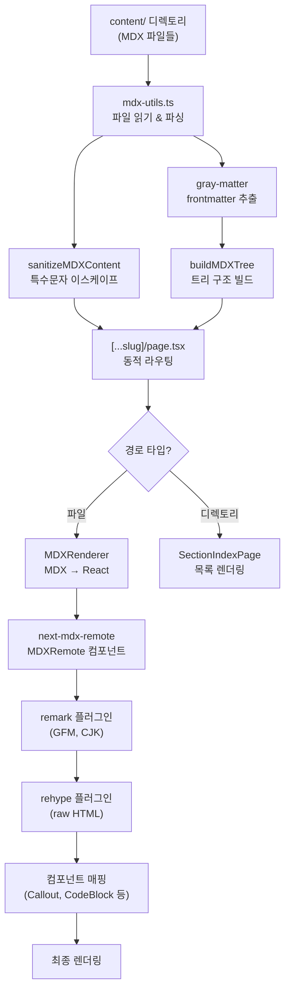

import { Callout, CodeBlock, Tabs, TabsList, TabsTrigger, TabsContent } from '@/components/writing-ui';

# MDX 렌더링 파이프라인 구현기

이 글은 mdx-express 프로젝트에서 MDX 기반 문서 렌더링 시스템을 설계하고 구현한 과정을 정리한 기술 문서입니다. Next.js와 next-mdx-remote를 조합해 파일 시스템 기반의 문서 사이트를 만들면서 마주친 설계 결정, 문제 해결, 트레이드오프를 공유합니다.

## 왜 MDX인가?

일반 Markdown은 텍스트 기반 문서 작성에는 충분하지만, 기술 문서에서 요구하는 인터랙티브한 요소를 표현하기 어렵습니다. MDX는 Markdown 안에서 JSX 컴포넌트를 직접 사용할 수 있어 이 한계를 해결합니다.

<Callout type="info" title="MDX를 선택한 핵심 이유">
- **Markdown의 편의성 유지**: 글 작성은 여전히 Markdown 문법으로 할 수 있다
- **React 컴포넌트 삽입**: Callout, 탭, Mermaid 다이어그램 등을 문서 안에서 직접 사용 가능
- **타입 안전성**: TypeScript 기반의 컴포넌트를 그대로 활용할 수 있다
- **풍부한 생태계**: remark/rehype 플러그인으로 파싱과 변환 과정을 세밀하게 제어 가능
</Callout>

예를 들어, 일반 Markdown에서는 경고 박스를 표현하려면 HTML을 직접 작성하거나 특수 문법에 의존해야 합니다. MDX에서는 미리 만들어둔 `Callout` 컴포넌트를 문서 안에서 바로 사용할 수 있습니다.

```mdx
<!-- Markdown에서는 이렇게 해야 하지만... -->
> ⚠️ **주의**: 이 설정은 프로덕션에서 사용하지 마세요.

<!-- MDX에서는 이렇게 쓸 수 있습니다 -->
<Callout type="warning" title="주의">
이 설정은 프로덕션에서 사용하지 마세요.
</Callout>
```

## 전체 아키텍처

MDX 파일이 브라우저에 렌더링되기까지의 전체 흐름을 살펴보겠습니다.



이 파이프라인은 크게 세 레이어로 나뉩니다:

1. **파일 시스템 레이어** — MDX 파일 읽기, frontmatter 파싱, 디렉토리 트리 구축
2. **라우팅 레이어** — URL 경로를 파일/디렉토리에 매핑하고 적절한 페이지 컴포넌트를 선택
3. **렌더링 레이어** — MDX 소스를 React 컴포넌트로 변환하고 커스텀 컴포넌트를 주입

## 파일 시스템 레이어

`lib/mdx-utils.ts`는 이 프로젝트의 데이터 레이어 역할을 합니다. 파일 시스템에서 MDX 컨텐츠를 읽고, 파싱하고, 구조화된 데이터로 변환하는 모든 로직이 여기에 있습니다.

### 핵심 인터페이스

MDX 파일과 디렉토리를 표현하는 두 가지 인터페이스가 시스템의 기반입니다:

```typescript
// 개별 MDX 파일
interface MDXFile {
  slug: string;
  title: string;
  description?: string;
  order?: number;
  path: string;
  content: string;
}

// 중첩 디렉토리를 지원하는 트리 노드
interface MDXFileNode {
  type: 'file' | 'directory';
  name: string;
  slug: string;
  title: string;
  description?: string;
  order?: number;
  path: string;
  content?: string;
  children?: MDXFileNode[];
  fullPath: string[];
}
```

`MDXFile`은 단일 문서를, `MDXFileNode`는 파일과 디렉토리 모두를 표현할 수 있는 재귀적 트리 노드입니다. `fullPath` 배열은 URL 라우팅에서 직접 사용됩니다.

### 파일 읽기와 frontmatter 파싱

개별 MDX 파일을 읽는 `getMDXFile` 함수는 `gray-matter`를 사용해 frontmatter를 분리하고, 내용을 sanitize한 뒤 반환합니다:

```typescript
export async function getMDXFile(filePath: string): Promise<MDXFile | null> {
  const fullPath = path.join(CONTENT_DIR, filePath);

  if (!(await pathExists(fullPath))) {
    return null;
  }

  const fileContents = await fs.readFile(fullPath, 'utf8');
  const { data, content } = matter(fileContents);
  const frontmatter = data as MDXFrontmatter;

  return {
    slug: path.basename(filePath, '.mdx'),
    title: frontmatter.title || path.basename(filePath, '.mdx'),
    description: frontmatter.description,
    order: frontmatter.order || 0,
    path: filePath,
    content: await sanitizeMDXContent(content),
  };
}
```

<Callout type="note" title="frontmatter 규칙">
- `title`이 없으면 파일명을 제목으로 사용합니다
- `order` 필드로 문서 정렬 순서를 제어합니다 (기본값 0)
- `tags`는 배열 형태로, 문서 분류와 검색에 활용됩니다
</Callout>

### 재귀적 트리 빌드

`buildMDXTree`는 `content/` 디렉토리를 재귀적으로 순회하면서 `MDXFileNode` 트리를 구축합니다. 이 트리는 사이드바 네비게이션 생성과 정적 페이지 생성에 모두 사용됩니다.

```typescript
export async function buildMDXTree(
  basePath: string,
  currentPath: string[] = []
): Promise<MDXFileNode[]> {
  const fullPath = path.join(CONTENT_DIR, ...currentPath);
  const dirents = await fs.readdir(fullPath, { withFileTypes: true });
  const nodes: MDXFileNode[] = [];

  // MDX 파일 처리
  const files = dirents.filter(
    (d) => d.isFile() && d.name.endsWith('.mdx')
  );
  for (const file of files) {
    const mdxFile = await getMDXFile([...currentPath, file.name].join('/'));
    if (mdxFile) {
      nodes.push({
        type: 'file',
        slug: path.basename(file.name, '.mdx'),
        // ... 나머지 필드
      });
    }
  }

  // 하위 디렉토리 재귀 처리
  const directories = dirents.filter((d) => d.isDirectory());
  for (const dir of directories) {
    const children = await buildMDXTree(basePath, [...currentPath, dir.name]);
    const indexFile = await getMDXFile(
      [...currentPath, dir.name, 'index.mdx'].join('/')
    );
    nodes.push({
      type: 'directory',
      title: indexFile?.title || formatTitle(dir.name),
      children,
      // ... 나머지 필드
    });
  }

  return sortByOrderAndName(nodes);
}
```

디렉토리에 `index.mdx`가 있으면 그 frontmatter에서 제목과 설명을 가져옵니다. 없으면 디렉토리명에서 자동으로 제목을 생성합니다. 정렬은 `order` 필드를 우선하고, 같은 order일 경우 자연스러운 숫자 정렬(natural sort)을 적용합니다.

### 컨텐츠 Sanitization

MDX 파서는 `<`, `>`, `{`, `}` 같은 문자를 JSX 문법으로 해석합니다. 코드 블록 안에 이런 문자가 있으면 파싱 에러가 발생하므로, JSX 컴포넌트 내부의 특수문자를 HTML 엔티티로 이스케이프하는 전처리가 필요합니다.

정규식으로 JSX 코드 블록 태그의 열고 닫는 패턴을 찾아, 내부 내용에 대해 다음 치환을 수행합니다:

```typescript
// sanitizeMDXContent 핵심 로직
// 정규식으로 코드 블록 JSX 태그 내부를 매칭한 후:
const htmlEscaped = codeContent
  .replace(/&/g, '&amp;')   // & → &amp;
  .replace(/</g, '&lt;')    // < → &lt;
  .replace(/>/g, '&gt;')    // > → &gt;
  .replace(/\{/g, '&#123;') // { → &#123;
  .replace(/\}/g, '&#125;') // } → &#125;
```

<Callout type="warning" title="왜 템플릿 리터럴이 아닌 HTML 엔티티인가">
초기에는 코드 내용을 JavaScript 템플릿 리터럴로 감싸는 방식을 시도했습니다. 하지만 코드 안의 백슬래시 시퀀스(`\x`, `\[` 등)가 JavaScript 이스케이프로 해석되는 문제가 있었습니다. HTML 엔티티 방식은 이런 부작용 없이 안정적으로 동작합니다.
</Callout>

## 동적 라우팅

`app/docs/[...slug]/page.tsx`는 Next.js의 catch-all 라우트를 활용해 모든 문서 경로를 하나의 페이지 컴포넌트로 처리합니다.

### 파일과 디렉토리 판별

URL 경로가 파일인지 디렉토리인지에 따라 완전히 다른 페이지를 렌더링해야 합니다:

```typescript
export default async function DocsPage({ params }: PageProps) {
  const { slug } = await params;

  if (!slug || slug.length === 0) {
    notFound();
  }

  const pathType = await getPathType(slug);

  if (pathType === null) {
    notFound();
  }

  if (pathType === 'file') {
    const mdxContent = await getMDXContentByPath(slug);
    if (!mdxContent) notFound();
    return <DocumentPage mdxContent={mdxContent} />;
  }

  if (pathType === 'directory') {
    const tree = await buildMDXTree('', slug);
    const files = tree.filter(node => node.type === 'file').map(/* ... */);
    const directories = tree.filter(node => node.type === 'directory');
    return (
      <SectionIndexPage
        section={slug[slug.length - 1]}
        files={files}
        directories={directories}
        currentPath={slug}
      />
    );
  }

  notFound();
}
```

`getPathType` 함수는 파일 시스템을 직접 확인합니다. 먼저 `{path}.mdx` 파일이 존재하는지 확인하고, 없으면 디렉토리인지 확인합니다:

```typescript
export async function getPathType(
  pathArray: string[]
): Promise<'file' | 'directory' | null> {
  const filePath = path.join(CONTENT_DIR, ...pathArray);

  if (await pathExists(`${filePath}.mdx`)) return 'file';
  if (await pathExists(filePath)) {
    const s = await fs.stat(filePath);
    if (s.isDirectory()) return 'directory';
  }

  return null;
}
```

### 정적 페이지 생성

`generateStaticParams`는 빌드 타임에 모든 문서 경로를 수집하여 정적 페이지를 미리 생성합니다:

```typescript
export async function generateStaticParams() {
  const nestedSections = await getAllMDXNestedSections();
  const params: Array<{ slug: string[] }> = [];

  function collectPaths(nodes: any[], currentPath: string[] = []): void {
    for (const node of nodes) {
      const nodePath = [...currentPath, node.slug];
      params.push({ slug: nodePath });

      if (node.type === 'directory' && node.children?.length > 0) {
        collectPaths(node.children, nodePath);
      }
    }
  }

  for (const section of nestedSections) {
    params.push({ slug: [section.section] });
    collectPaths(section.tree, [section.section]);
  }

  return params;
}
```

이 함수가 트리를 재귀적으로 순회하면서 파일과 디렉토리 모두의 경로를 수집하기 때문에, 디렉토리 인덱스 페이지도 정적으로 생성됩니다.

## MDX 렌더러

`components/mdx-renderer.tsx`는 MDX 소스 문자열을 React 컴포넌트로 변환하는 핵심 모듈입니다. `next-mdx-remote`의 `MDXRemote` 컴포넌트를 중심으로 플러그인 설정과 컴포넌트 매핑을 조합합니다.

### MDXRemote 설정

```typescript
export function MDXRenderer({ content }: { content: string }) {
  const components = { /* 컴포넌트 매핑 */ };

  return (
    <div className="mdx-content prose prose-slate dark:prose-invert max-w-none">
      <MDXRemote
        source={content}
        components={components}
        options={{
          blockJS: false,
          mdxOptions: {
            remarkPlugins: [remarkCjkFriendly, remarkGfm],
            rehypePlugins: [
              [rehypeRaw, {
                passThrough: [
                  'mdxFlowExpression',
                  'mdxJsxFlowElement',
                  'mdxJsxTextElement',
                  'mdxTextExpression',
                  'mdxjsEsm'
                ]
              }]
            ],
            development: false,
            format: 'mdx',
          },
        }}
      />
    </div>
  );
}
```

<Callout type="info" title="주요 옵션 설명">
- **blockJS: false** — MDX 파일 내의 import/export 문을 허용합니다. 이를 통해 문서에서 직접 컴포넌트를 import할 수 있습니다.
- **remarkPlugins** — Markdown AST(mdast) 단계에서 동작하는 플러그인. GFM 테이블, CJK 문자 처리 등을 담당합니다.
- **rehypePlugins** — HTML AST(hast) 단계에서 동작하는 플러그인. `rehype-raw`는 Markdown 안의 raw HTML을 파싱하되, MDX 노드들은 그대로 통과시킵니다.
- **format: 'mdx'** — MDX 포맷으로 파싱합니다 (일반 Markdown이 아닌 JSX가 포함된 Markdown).
</Callout>

### remark/rehype 플러그인 체인

MDX 처리 과정에서 플러그인들이 순서대로 적용됩니다:


`rehype-raw`의 `passThrough` 옵션이 중요합니다. MDX의 JSX 노드 타입들을 명시적으로 통과시켜야 rehype-raw가 이들을 일반 HTML로 파싱하지 않고 그대로 보존합니다.

### 컴포넌트 매핑 전략

컴포넌트 매핑은 세 가지 카테고리로 구성됩니다:

<Tabs defaultValue="writing-ui">
<TabsList>
<TabsTrigger value="writing-ui">Writing UI 컴포넌트</TabsTrigger>
<TabsTrigger value="html-elements">HTML 요소 스타일링</TabsTrigger>
<TabsTrigger value="code-handling">코드 블록 처리</TabsTrigger>
</TabsList>

<TabsContent value="writing-ui">

MDX 문서에서 직접 사용할 수 있는 커스텀 컴포넌트들입니다:

```typescript
const components = {
  // Writing UI 컴포넌트들
  Callout,
  CodeBlock,
  Mermaid,
  Steps, Step,
  Tabs, TabsList, TabsTrigger, TabsContent,
  Card: WritingCard,
  Badge: WritingBadge,
  Blockquote,
  Reference, ReferenceList,
  Icon,
  MathCodeBridge,

  // Lucide 아이콘 (동적 매핑)
  ...LUCIDE_ICONS,

  // Shadcn UI 컴포넌트
  Button,
  ShadcnCard: Card,
  // ...
};
```

같은 이름의 컴포넌트가 충돌하는 경우(예: Card, Badge), Writing UI 버전에 우선순위를 두고 Shadcn UI 버전은 접두사를 붙여 구분합니다.

</TabsContent>

<TabsContent value="html-elements">

Markdown에서 생성되는 기본 HTML 요소들을 Tailwind CSS로 스타일링합니다:

```tsx
h2: (props: any) => (
  <h2 className="scroll-m-20 border-b-2 pb-3 text-3xl font-semibold
    tracking-tight mt-12 mb-6 first:mt-0 border-slate-200
    dark:border-slate-700 relative after:content-['']
    after:absolute after:bottom-0 after:left-0 after:w-16
    after:h-0.5 after:bg-gradient-to-r after:from-blue-500
    after:to-purple-500"
    {...props}
  />
),
```

`h2`에는 하단 보더 아래 그라데이션 언더라인이, `h1`에는 텍스트 그라데이션이 적용되어 시각적 계층 구조를 강화합니다. 모든 요소에 다크 모드 대응이 포함되어 있습니다.

</TabsContent>

<TabsContent value="code-handling">

`pre` 요소의 매핑이 코드 블록 처리의 핵심입니다. Markdown의 코드 펜스가 파싱되면 `pre > code` 구조의 HTML이 생성되는데, 이를 가로채서 적절한 컴포넌트로 라우팅합니다:

```typescript
pre: (props: any) => {
  // Mermaid 다이어그램 감지
  if (props.children?.props?.className?.includes('language-mermaid')) {
    const codeContent = props.children.props.children;
    return <Mermaid>{codeContent}</Mermaid>;
  }

  // 일반 코드 블록 → 구문 강조 컴포넌트로 전달
  if (props.children?.props?.className?.includes('language-')) {
    const language = className.replace('language-', '');
    const codeContent = props.children.props.children;
    // highlight.js 기반 구문 강조 코드 블록으로 렌더링
    return renderCodeBlock(language, codeContent);
  }

  // 언어 미지정 → plaintext로 처리
  if (props.children?.type === 'code') {
    return renderCodeBlock('plaintext', props.children.props.children);
  }

  // 순수 pre 태그
  return <pre className="..." {...props} />;
},
```

이 패턴 덕분에 문서 작성자는 표준 Markdown 코드 펜스만 사용해도 자동으로 구문 강조와 Mermaid 렌더링이 적용됩니다.

</TabsContent>
</Tabs>

## 커스텀 컴포넌트

`components/writing-ui/` 디렉토리에는 MDX 문서에서 사용하는 모든 커스텀 컴포넌트가 정의되어 있습니다.

| 컴포넌트 | 용도 | 주요 props |
|----------|------|-----------|
| `Callout` | 정보/경고/에러/성공 박스 | `type`, `title` |
| `CodeBlock` | 구문 강조 코드 블록 | `language`, `title` |
| `Mermaid` | 다이어그램 렌더링 | `title`, `className` |
| `Steps` / `Step` | 단계별 가이드 | `title` |
| `Tabs` | 탭 기반 컨텐츠 전환 | `defaultValue` |
| `Card` | 카드 형태 컨텐츠 | `title`, `description` |
| `Badge` | 인라인 뱃지/태그 | `variant` |
| `Reference` | 참고 자료 링크 | `url`, `title` |
| `Icon` | Lucide 아이콘 삽입 | `name`, `size` |
| `MathCodeBridge` | 수식-코드 연결 | - |

### Mermaid 다이어그램 컴포넌트

Mermaid 컴포넌트는 클라이언트 사이드에서 동작하며, 다이어그램 정의 문자열을 받아 SVG로 렌더링합니다:

```typescript
// mermaid.tsx (클라이언트 컴포넌트)
"use client";

let mermaidInitialized = false;
function ensureMermaidInit() {
  if (mermaidInitialized) return;
  mermaid.initialize({
    startOnLoad: false,
    theme: 'default',
    securityLevel: 'loose',
    fontFamily: 'ui-sans-serif, system-ui, sans-serif',
  });
  mermaidInitialized = true;
}
```

모듈 레벨 플래그로 초기화를 한 번만 수행하고, 각 인스턴스에서는 `mermaid.render()`로 SVG를 생성합니다. 줌(확대/축소), 패닝, 전체화면 기능이 내장되어 있어 복잡한 다이어그램도 편리하게 볼 수 있습니다.

### Callout 컴포넌트

Callout은 문서에서 가장 자주 사용되는 컴포넌트입니다. 5가지 타입을 지원합니다:

<Callout type="info" title="info 타입">
일반적인 정보나 배경지식을 전달할 때 사용합니다.
</Callout>

<Callout type="warning" title="warning 타입">
주의가 필요한 사항이나 잠재적 문제를 알릴 때 사용합니다.
</Callout>

<Callout type="success" title="success 타입">
성공적인 결과나 권장 사항을 강조할 때 사용합니다.
</Callout>

<Callout type="note" title="note 타입">
부가적인 설명이나 팁을 전달할 때 사용합니다.
</Callout>

각 타입은 아이콘, 배경색, 테두리 색상이 다르게 적용되며, 다크 모드에서도 적절한 대비를 유지합니다.

### 아이콘 매핑

Lucide React 아이콘을 MDX에서 사용하기 위해, `icon.tsx`에서 사용할 아이콘들을 미리 매핑해둡니다. 이 매핑 객체(`LUCIDE_ICONS`)는 `MDXRenderer`의 컴포넌트 맵에 스프레드되어 MDX 안에서 아이콘 이름으로 직접 참조할 수 있게 됩니다.

```typescript
// MDX 문서에서의 사용 예시
<Icon name="AlertTriangle" size={20} />
```

## CJK 호환성

한글 문서를 MDX로 작성하면서 마주친 가장 큰 문제는 **볼드 마크다운이 CJK 문자와 함께 렌더링되지 않는 현상**이었습니다.

### 문제

표준 Markdown 파서(remark)는 `**볼드**` 구문을 처리할 때 좌우에 공백이나 구두점이 있어야 강조 구문의 경계로 인식합니다. 영어에서는 단어 사이에 공백이 있으므로 문제가 없지만, 한글은 조사가 바로 붙기 때문에 파서가 경계를 인식하지 못합니다.

```markdown
<!-- 영어: 정상 동작 -->
This is **bold** text.

<!-- 한글: 렌더링 실패 -->
이것은 **굵은** 텍스트입니다.

<!-- 한글: 이렇게 공백을 넣어야 동작하지만 어색함 -->
이것은 **굵은** 텍스트 입니다.
```

### 해결: remark-cjk-friendly

`remark-cjk-friendly` 플러그인이 이 문제를 해결합니다. 이 플러그인은 CJK 유니코드 범위의 문자를 강조 구문의 유효한 경계로 인식하도록 remark 파서를 확장합니다.

```typescript
// mdx-renderer.tsx
import remarkCjkFriendly from 'remark-cjk-friendly';

// remarkPlugins 배열에서 remarkGfm보다 먼저 적용
remarkPlugins: [remarkCjkFriendly, remarkGfm],
```

<Callout type="success" title="적용 결과">
`remark-cjk-friendly`를 추가한 후, 한글 문서에서 `**볼드**`, `*이탤릭*`, `~~취소선~~` 등 모든 인라인 강조 구문이 정상 동작합니다. 플러그인 순서에서 `remarkGfm`보다 앞에 위치시키는 것이 중요합니다.
</Callout>

## 설계 결정과 트레이드오프

### 런타임 vs 빌드타임 MDX 컴파일

MDX를 처리하는 방식은 크게 두 가지가 있습니다:

| | 빌드타임 (next-mdx-remote/serialize) | 런타임 RSC (next-mdx-remote/rsc) |
|---|---|---|
| **처리 시점** | `getStaticProps`에서 직렬화 | React Server Component에서 직접 렌더링 |
| **번들 크기** | 클라이언트에 직렬화된 결과 전송 | MDX 런타임이 서버에만 존재 |
| **유연성** | 빌드 캐시 활용 가능 | ISR/동적 렌더링과 자연스럽게 통합 |
| **제약** | 직렬화 가능한 데이터만 props로 전달 | 서버 컴포넌트에서만 사용 가능 |

이 프로젝트에서는 **런타임 RSC 방식**(next-mdx-remote/rsc)을 선택했습니다. Next.js App Router와의 호환성이 좋고, `generateStaticParams`와 함께 사용하면 빌드타임 장점도 취할 수 있기 때문입니다.

### Sanitization 전략

MDX 파서에서 JSX 문법과 코드 블록 내용이 충돌하는 문제를 해결하기 위해 여러 접근을 시도했습니다:

1. **템플릿 리터럴 래핑** — 코드를 `` {`...`} ``로 감싸는 방식. 백슬래시 이스케이프 문제로 실패.
2. **MDX v2 expression 문법** — `{expression}` 안에 코드를 넣는 방식. 복잡한 코드에서 파싱 에러 발생.
3. **HTML 엔티티 이스케이프** (현재 방식) — `<`, `>`, `{`, `}`를 HTML 엔티티로 치환. 안정적이고 예측 가능.

<Callout type="note" title="Sanitization의 범위">
sanitization은 `<CodeBlock>` 컴포넌트 태그 안의 내용에만 적용됩니다. 표준 Markdown 코드 펜스(`` ``` ``)로 작성된 코드는 Markdown 파서가 자체적으로 처리하므로 별도의 sanitization이 필요하지 않습니다.
</Callout>

### 아이콘 지연 로딩

Lucide React는 수천 개의 아이콘을 제공하지만, 전부 import하면 번들 크기가 크게 증가합니다. 이 프로젝트에서는 `icon.tsx`에서 문서에서 사용할 아이콘만 선별적으로 import하고, 하나의 매핑 객체로 관리합니다:

```typescript
// icon.tsx
import { AlertTriangle, Info, CheckCircle, /* ... */ } from 'lucide-react';

export const LUCIDE_ICONS = {
  AlertTriangle,
  Info,
  CheckCircle,
  // ... 필요한 아이콘만 포함
};
```

이 방식은 사용하지 않는 아이콘이 번들에 포함되지 않도록 보장하면서도, MDX 문서에서 아이콘을 간편하게 사용할 수 있게 합니다.

### rehype-raw의 passThrough 설정

`rehype-raw` 플러그인 없이는 MDX 안의 raw HTML이 처리되지 않습니다. 하지만 `rehype-raw`를 그냥 사용하면 MDX의 JSX 노드까지 HTML로 파싱하려고 시도하여 오류가 발생합니다:

```typescript
rehypePlugins: [
  [rehypeRaw, {
    passThrough: [
      'mdxFlowExpression',
      'mdxJsxFlowElement',
      'mdxJsxTextElement',
      'mdxTextExpression',
      'mdxjsEsm'
    ]
  }]
],
```

`passThrough` 배열에 MDX 전용 노드 타입 5가지를 명시하여, 이 노드들은 rehype-raw가 건드리지 않고 그대로 통과시키도록 설정합니다. 이 설정이 없으면 MDX의 import문이나 JSX 컴포넌트가 깨집니다.

## 마무리

이 프로젝트의 MDX 렌더링 파이프라인은 세 가지 원칙을 중심으로 설계되었습니다:

1. **문서 작성자의 편의**: 표준 Markdown 문법으로 작성하면서 필요할 때 React 컴포넌트를 사용할 수 있어야 한다
2. **확장 가능한 구조**: 새로운 컴포넌트를 추가하거나 플러그인을 교체하기 쉬워야 한다
3. **안정적인 렌더링**: CJK 문자, 특수문자가 포함된 코드, 복잡한 다이어그램 등 다양한 컨텐츠를 오류 없이 처리해야 한다

각 레이어가 명확한 책임을 가지도록 분리한 덕분에, 새로운 문서를 추가하거나 기존 컴포넌트를 수정할 때 영향 범위를 쉽게 파악할 수 있습니다.
