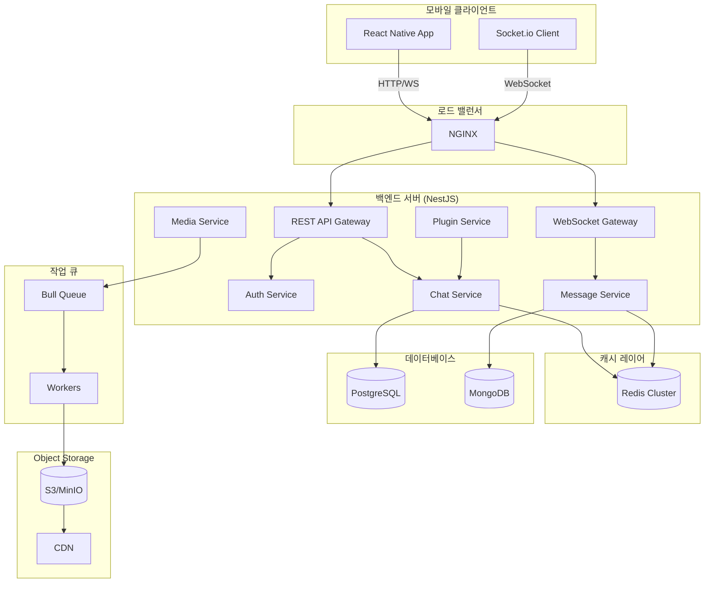

import {
  Callout,
  Steps,
  Step,
  Tabs,
  TabsList,
  TabsTrigger,
  TabsContent,
  Card,
  Badge,
  Reference,
  ReferenceList,
} from '@/components/writing-ui';
import {
  Server,
  Database,
  MessageSquare,
  Image,
  FileText,
  Zap,
} from 'lucide-react';

# Node 기반 실시간 채팅 앱 아키텍처 설계 가이드

<Callout type='info' title='이 가이드의 목적'>
  모바일 중심의 대규모 채팅 서비스를 구축하기 위한 종합 아키텍처 가이드입니다.
  React Native 기반 프론트엔드와 NestJS 기반 백엔드를 활용하여 확장 가능하고
  성능이 우수한 시스템을 설계하는 방법을 다룹니다.
</Callout>

## 1. 전체 아키텍처 개요

### 핵심 기술 스택

<div className='grid grid-cols-1 md:grid-cols-2 gap-4 my-6'>
  <Card title='Frontend' description='모바일 중심 UI/UX'>
    <ul className='list-disc list-inside space-y-1 text-sm'>
      <li>React Native (iOS/Android)</li>
      <li>React Query (상태 관리 & 캐싱)</li>
      <li>Socket.io Client (실시간 통신)</li>
      <li>Zustand (로컬 상태)</li>
    </ul>
  </Card>

  <Card title='Backend' description='고성능 API & WebSocket'>
    <ul className='list-disc list-inside space-y-1 text-sm'>
      <li>NestJS (Node.js Framework)</li>
      <li>Socket.io (WebSocket)</li>
      <li>Prisma/TypeORM (ORM)</li>
      <li>Bull (작업 큐)</li>
    </ul>
  </Card>
</div>

### 아키텍처 다이어그램



<Callout type='warning' title='아키텍처 설계 원칙'>
  - **분리된 관심사**: 각 서비스는 단일 책임을 가짐 - **수평 확장성**: 모든
  컴포넌트는 stateless 설계 - **비동기 처리**: 무거운 작업은 큐를 통해
  백그라운드 처리 - **데이터 일관성**: 이벤트 소싱 패턴 활용
</Callout>

## 2. Backend 아키텍처 심화

### 2.1 NestJS 모듈 구조

<Steps>
  <Step title="계층화된 모듈 설계">
    NestJS의 모듈 시스템을 활용하여 도메인별로 분리합니다.

```typescript
// src/app.module.ts
@Module({
  imports: [
    ConfigModule.forRoot({ isGlobal: true }),
    DatabaseModule,
    RedisModule,
    AuthModule,
    ChatModule,
    MessageModule,
    MediaModule,
    PluginModule,
    WebSocketModule,
  ],
})
export class AppModule {}
```

  </Step>

  <Step title="WebSocket Gateway 구성">
    실시간 메시징을 위한 Socket.io 게이트웨이를 설정합니다.

```typescript
// src/websocket/websocket.gateway.ts
@WebSocketGateway({
  cors: { origin: '*' },
  namespace: '/chat',
  transports: ['websocket', 'polling'],
})
export class WebSocketGateway
  implements OnGatewayConnection, OnGatewayDisconnect
{
  @WebSocketServer()
  server: Server;

  constructor(
    private readonly redisService: RedisService,
    private readonly messageService: MessageService
  ) {}

  async handleConnection(client: Socket) {
    const userId = this.extractUserId(client);
    await this.redisService.addUserConnection(userId, client.id);

    // 사용자를 채팅방에 자동 재참여
    const rooms = await this.redisService.getUserRooms(userId);
    rooms.forEach((room) => client.join(room));
  }

  async handleDisconnect(client: Socket) {
    const userId = this.extractUserId(client);
    await this.redisService.removeUserConnection(userId, client.id);
  }

  @SubscribeMessage('sendMessage')
  async handleMessage(
    @MessageBody() data: SendMessageDto,
    @ConnectedSocket() client: Socket
  ) {
    const userId = this.extractUserId(client);

    // 메시지 저장 (비동기)
    const message = await this.messageService.create({
      ...data,
      senderId: userId,
    });

    // 실시간 전송
    this.server.to(data.roomId).emit('newMessage', message);

    // 읽지 않은 메시지 카운트 업데이트
    await this.updateUnreadCount(data.roomId, userId);
  }
}
```

  </Step>

  <Step title="Redis 활용 전략">
    Redis를 다층적으로 활용하여 성능을 최적화합니다.

```typescript
// src/redis/redis.service.ts
@Injectable()
export class RedisService {
  constructor(@Inject('REDIS_CLIENT') private readonly redis: Redis) {}

  // 1. 사용자 온라인 상태 관리
  async setUserOnline(userId: string, socketId: string) {
    await this.redis.sadd(`user:${userId}:sockets`, socketId);
    await this.redis.set(`user:${userId}:status`, 'online', 'EX', 300);
  }

  async getUserStatus(userId: string): Promise<'online' | 'offline'> {
    const status = await this.redis.get(`user:${userId}:status`);
    return status === 'online' ? 'online' : 'offline';
  }

  // 2. 채팅방 멤버 캐싱
  async getChatRoomMembers(roomId: string): Promise<string[]> {
    const cacheKey = `room:${roomId}:members`;
    const cached = await this.redis.smembers(cacheKey);

    if (cached.length > 0) return cached;

    // DB에서 조회 후 캐싱 (TTL 1시간)
    const members = await this.fetchMembersFromDB(roomId);
    await this.redis.sadd(cacheKey, ...members);
    await this.redis.expire(cacheKey, 3600);
    return members;
  }

  // 3. 읽지 않은 메시지 카운트
  async incrementUnreadCount(roomId: string, userId: string) {
    return this.redis.hincrby(`unread:${userId}`, roomId, 1);
  }

  async getUnreadCounts(userId: string): Promise<Record<string, number>> {
    return this.redis.hgetall(`unread:${userId}`);
  }

  async resetUnreadCount(roomId: string, userId: string) {
    return this.redis.hdel(`unread:${userId}`, roomId);
  }

  // 4. 메시지 임시 저장 (쓰기 버퍼)
  async bufferMessage(message: Message) {
    await this.redis.lpush(
      `msg_buffer:${message.roomId}`,
      JSON.stringify(message)
    );

    // 100개 쌓이면 배치 처리 트리거
    const count = await this.redis.llen(`msg_buffer:${message.roomId}`);
    if (count >= 100) {
      await this.flushMessageBuffer(message.roomId);
    }
  }
}
```

  </Step>
</Steps>

### 2.2 데이터베이스 전략

<Tabs defaultValue="postgres">
  <TabsList>
    <TabsTrigger value="postgres">PostgreSQL</TabsTrigger>
    <TabsTrigger value="mongodb">MongoDB</TabsTrigger>
    <TabsTrigger value="hybrid">Hybrid 전략</TabsTrigger>
  </TabsList>
  
  <TabsContent value="postgres">
    **PostgreSQL 사용 영역**: 관계형 데이터 및 트랜잭션이 중요한 데이터

```sql
-- 사용자 테이블
CREATE TABLE users (
  id UUID PRIMARY KEY DEFAULT gen_random_uuid(),
  username VARCHAR(50) UNIQUE NOT NULL,
  email VARCHAR(100) UNIQUE NOT NULL,
  password_hash TEXT NOT NULL,
  created_at TIMESTAMP DEFAULT CURRENT_TIMESTAMP
);

-- 채팅방 테이블
CREATE TABLE chat_rooms (
  id UUID PRIMARY KEY DEFAULT gen_random_uuid(),
  name VARCHAR(100),
  type VARCHAR(20) CHECK (type IN ('direct', 'group', 'channel')),
  created_by UUID REFERENCES users(id),
  created_at TIMESTAMP DEFAULT CURRENT_TIMESTAMP
);

-- 채팅방 멤버 (다대다 관계)
CREATE TABLE room_members (
  room_id UUID REFERENCES chat_rooms(id) ON DELETE CASCADE,
  user_id UUID REFERENCES users(id) ON DELETE CASCADE,
  role VARCHAR(20) DEFAULT 'member',
  joined_at TIMESTAMP DEFAULT CURRENT_TIMESTAMP,
  PRIMARY KEY (room_id, user_id)
);

-- 인덱스 최적화
CREATE INDEX idx_room_members_user ON room_members(user_id);
CREATE INDEX idx_room_members_room ON room_members(room_id);
```

<Callout type="success" title="PostgreSQL 장점">
- 강력한 일관성 보장 (ACID)
- 복잡한 조인 쿼리 지원
- 유저/채팅방 관계 관리에 최적
</Callout>
  </TabsContent>
  
  <TabsContent value="mongodb">
    **MongoDB 사용 영역**: 대량의 메시지 데이터 및 비정형 데이터

```typescript
// Message 스키마 (Mongoose)
import { Prop, Schema, SchemaFactory } from '@nestjs/mongoose';
import { Document } from 'mongoose';

@Schema({
  collection: 'messages',
  timestamps: true,
  // 샤딩을 위한 설정
  shardKey: { roomId: 1, createdAt: 1 },
})
export class Message extends Document {
  @Prop({ required: true, index: true })
  roomId: string;

  @Prop({ required: true, index: true })
  senderId: string;

  @Prop({ required: true })
  content: string;

  @Prop({ type: String, enum: ['text', 'image', 'video', 'file', 'plugin'] })
  type: string;

  @Prop({ type: Object })
  metadata?: {
    fileName?: string;
    fileSize?: number;
    mimeType?: string;
    thumbnailUrl?: string;
    pluginData?: any;
  };

  @Prop({ type: [String], default: [] })
  readBy: string[];

  @Prop({ type: String, ref: 'Message' })
  replyTo?: string;

  @Prop({ default: false })
  isDeleted: boolean;
}

export const MessageSchema = SchemaFactory.createForClass(Message);

// 복합 인덱스 생성
MessageSchema.index({ roomId: 1, createdAt: -1 });
MessageSchema.index({ senderId: 1, createdAt: -1 });
MessageSchema.index({ 'metadata.pluginData.type': 1 });
```

<Callout type="success" title="MongoDB 장점">
- 빠른 쓰기 성능 (대량 메시지 처리)
- 유연한 스키마 (다양한 메시지 타입)
- 샤딩을 통한 수평 확장
- TTL 인덱스로 자동 데이터 삭제
</Callout>
  </TabsContent>
  
  <TabsContent value="hybrid">
    **Hybrid 접근법**: 각 데이터베이스의 강점을 활용

```typescript
@Injectable()
export class MessageService {
  constructor(
    @InjectModel(Message.name) private messageModel: Model<Message>,
    @InjectRepository(ChatRoom) private roomRepo: Repository<ChatRoom>,
    private redisService: RedisService
  ) {}

  async sendMessage(dto: SendMessageDto) {
    // 1. PostgreSQL: 채팅방 검증 및 권한 확인
    const room = await this.roomRepo.findOne({
      where: { id: dto.roomId },
      relations: ['members'],
    });

    if (!room.members.some((m) => m.userId === dto.senderId)) {
      throw new ForbiddenException('채팅방 멤버가 아닙니다.');
    }

    // 2. MongoDB: 메시지 저장
    const message = await this.messageModel.create({
      roomId: dto.roomId,
      senderId: dto.senderId,
      content: dto.content,
      type: dto.type,
      metadata: dto.metadata,
    });

    // 3. Redis: 실시간 캐싱 및 카운트 업데이트
    await Promise.all([
      this.redisService.cacheRecentMessage(dto.roomId, message),
      this.redisService.incrementUnreadCount(dto.roomId, dto.senderId),
    ]);

    return message;
  }

  async getMessages(roomId: string, page: number = 1, limit: number = 50) {
    // 1. Redis: 최근 메시지 캐시 확인
    if (page === 1) {
      const cached = await this.redisService.getRecentMessages(roomId, limit);
      if (cached.length > 0) return cached;
    }

    // 2. MongoDB: 페이지네이션 조회
    const messages = await this.messageModel
      .find({ roomId, isDeleted: false })
      .sort({ createdAt: -1 })
      .skip((page - 1) * limit)
      .limit(limit)
      .lean();

    // 3. 첫 페이지는 캐싱
    if (page === 1) {
      await this.redisService.cacheRecentMessages(roomId, messages);
    }

    return messages;
  }
}
```

<Callout type="info" title="데이터 흐름">
- **쓰기**: PostgreSQL (메타데이터) → MongoDB (메시지) → Redis (캐시)
- **읽기**: Redis (캐시) → MongoDB (히스토리) → PostgreSQL (관계 데이터)
</Callout>
  </TabsContent>
</Tabs>

## 3. 미디어 리소스 처리 전략

### 3.1 Object Storage 아키텍처

<Callout type='warning' title='미디어 트래픽 최적화의 중요성'>
  채팅 앱의 대역폭 비용 중 70~80%는 이미지/비디오입니다. 효율적인 스토리지 및
  전송 전략이 필수입니다.
</Callout>

<Steps>
  <Step title="S3 호환 스토리지 선택">
    **옵션 비교**
    
    | 서비스 | 장점 | 단점 | 추천 케이스 |
    |--------|------|------|-------------|
    | AWS S3 | 안정성, CDN 통합 | 높은 비용 | 글로벌 서비스 |
    | MinIO | 오픈소스, 저렴 | 직접 관리 | 온프레미스 |
    | Cloudflare R2 | 무료 egress | 제한적 기능 | 스타트업 |

```typescript
// src/media/storage.service.ts
import { S3Client, PutObjectCommand } from '@aws-sdk/client-s3';
import { getSignedUrl } from '@aws-sdk/s3-request-presigner';

@Injectable()
export class StorageService {
  private s3Client: S3Client;

  constructor(private configService: ConfigService) {
    this.s3Client = new S3Client({
      region: this.configService.get('AWS_REGION'),
      endpoint: this.configService.get('S3_ENDPOINT'), // MinIO 등 커스텀 endpoint
      credentials: {
        accessKeyId: this.configService.get('AWS_ACCESS_KEY'),
        secretAccessKey: this.configService.get('AWS_SECRET_KEY'),
      },
    });
  }

  // Presigned URL 생성 (클라이언트 직접 업로드)
  async getUploadUrl(
    fileName: string,
    fileType: string,
    userId: string
  ): Promise<string> {
    const key = `uploads/${userId}/${Date.now()}-${fileName}`;

    const command = new PutObjectCommand({
      Bucket: this.configService.get('S3_BUCKET'),
      Key: key,
      ContentType: fileType,
    });

    const url = await getSignedUrl(this.s3Client, command, { expiresIn: 300 });

    // URL 정보를 Redis에 임시 저장 (검증용)
    await this.redisService.set(
      `upload:${key}`,
      JSON.stringify({ userId, fileType, expiresAt: Date.now() + 300000 }),
      'EX',
      600
    );

    return url;
  }
}
```

  </Step>

  <Step title="이미지 최적화 파이프라인">
    **Sharp 라이브러리를 활용한 자동 최적화**

```typescript
// src/media/image-processor.service.ts
import * as sharp from 'sharp';

@Injectable()
export class ImageProcessorService {
  constructor(@InjectQueue('media-processing') private mediaQueue: Queue) {}

  async processImage(
    file: Buffer,
    metadata: { userId: string; roomId: string }
  ) {
    const imageId = uuidv4();

    // 비동기 작업 큐에 추가
    await this.mediaQueue.add('process-image', {
      imageId,
      file,
      metadata,
    });

    return { imageId, status: 'processing' };
  }
}

// src/media/media-processor.consumer.ts
@Processor('media-processing')
export class MediaProcessorConsumer {
  @Process('process-image')
  async handleImageProcessing(job: Job) {
    const { file, imageId, metadata } = job.data;

    // 1. 원본 저장
    const originalKey = `images/${imageId}/original.jpg`;
    await this.storageService.upload(originalKey, file);

    // 2. 썸네일 생성 (여러 사이즈)
    const sizes = [
      { name: 'thumbnail', width: 150, height: 150 },
      { name: 'medium', width: 800, height: 600 },
      { name: 'large', width: 1920, height: 1080 },
    ];

    const variants = await Promise.all(
      sizes.map(async ({ name, width, height }) => {
        const resized = await sharp(file)
          .resize(width, height, { fit: 'inside', withoutEnlargement: true })
          .webp({ quality: 85 })
          .toBuffer();

        const key = `images/${imageId}/${name}.webp`;
        await this.storageService.upload(key, resized);

        return { name, key, width, height };
      })
    );

    // 3. 메타데이터 저장
    await this.mediaRepo.save({
      id: imageId,
      userId: metadata.userId,
      roomId: metadata.roomId,
      originalUrl: this.getCdnUrl(originalKey),
      variants: variants.map((v) => ({
        ...v,
        url: this.getCdnUrl(v.key),
      })),
    });

    // 4. WebSocket으로 완료 알림
    this.wsGateway.server
      .to(metadata.roomId)
      .emit('mediaProcessed', { imageId, status: 'completed' });
  }

  @Process('process-video')
  async handleVideoProcessing(job: Job) {
    const { file, videoId, metadata } = job.data;

    // FFmpeg를 사용한 비디오 트랜스코딩
    const outputPath = `/tmp/${videoId}`;

    await ffmpeg(file)
      .output(`${outputPath}/playlist.m3u8`)
      .videoCodec('libx264')
      .audioCodec('aac')
      .format('hls')
      .outputOptions([
        '-hls_time 6',
        '-hls_playlist_type vod',
        '-hls_segment_filename',
        `${outputPath}/segment%03d.ts`,
      ])
      .on('end', async () => {
        // HLS 파일들을 S3에 업로드
        const files = await fs.readdir(outputPath);
        await Promise.all(
          files.map((file) =>
            this.storageService.uploadFile(
              `videos/${videoId}/${file}`,
              `${outputPath}/${file}`
            )
          )
        );

        // 썸네일 추출
        await this.extractVideoThumbnail(file, videoId);
      })
      .run();
  }
}
```

  </Step>

  <Step title="CDN 통합 및 캐싱 전략">
```typescript
// src/media/cdn.service.ts
@Injectable()
export class CdnService {
  private readonly cdnDomain: string;

constructor(private configService: ConfigService) {
this.cdnDomain = this.configService.get('CDN_DOMAIN');
}

// 이미지 URL에 최적화 파라미터 추가
getOptimizedImageUrl(
imageKey: string,
options: { width?: number; quality?: number; format?: 'webp' | 'avif' } = {}
): string {
const params = new URLSearchParams();

    if (options.width) params.set('w', options.width.toString());
    if (options.quality) params.set('q', options.quality.toString());
    if (options.format) params.set('f', options.format);

    return `${this.cdnDomain}/${imageKey}?${params.toString()}`;

}

// 비디오 스트리밍 URL
getVideoStreamUrl(videoId: string): string {
return `${this.cdnDomain}/videos/${videoId}/playlist.m3u8`;
}

// 파일 다운로드 URL (임시 접근)
async getDownloadUrl(fileKey: string, expiresIn: number = 3600): Promise<string> {
// CloudFront Signed URL 또는 Presigned URL 생성
return this.generateSignedUrl(fileKey, expiresIn);
}
}

````

<Callout type="success" title="CDN 최적화 팁">
- **이미지**: WebP/AVIF 포맷 우선, 동적 리사이징
- **비디오**: HLS 스트리밍, Adaptive Bitrate
- **캐싱**: `Cache-Control: public, max-age=31536000, immutable`
- **압축**: Brotli/Gzip 압축 활성화
</Callout>
  </Step>
</Steps>

### 3.2 Progressive Upload 전략

모바일 네트워크를 고려한 업로드 전략:

```typescript
// React Native 클라이언트 예시
import { upload } from 'react-native-background-upload';

const uploadMedia = async (uri: string, type: 'image' | 'video') => {
  // 1. 서버로부터 Presigned URL 획득
  const { uploadUrl, mediaId } = await api.getUploadUrl(type);

  // 2. 백그라운드 업로드 (앱 종료 시에도 계속)
  const uploadId = await upload({
    url: uploadUrl,
    path: uri,
    method: 'PUT',
    type: 'multipart',
    // 네트워크 변경 시 자동 재시도
    network: 'any',
    maxRetries: 3,
    notification: {
      enabled: true,
      onProgressTitle: '업로드 중...',
      onCompleteTitle: '업로드 완료',
    },
  });

  // 3. 진행률 모니터링
  upload.addListener('progress', uploadId, (data) => {
    console.log(`Progress: ${data.progress}%`);
    updateProgress(data.progress);
  });

  upload.addListener('completed', uploadId, async (data) => {
    // 4. 서버에 업로드 완료 알림
    await api.confirmUpload(mediaId);
  });

  return mediaId;
};
````

## 4. 확장 기능 플러그인 아키텍처

<Callout type='info' title='플러그인 시스템의 필요성'>
  채팅 앱에 문서 뷰어, 업무 프로세스(Toolbox Meeting, Permit to Work 등)를
  추가할 때 확장 가능한 아키텍처가 필요합니다.
</Callout>

### 4.1 플러그인 아키텍처 설계

<Steps>
  <Step title="추상화 레이어 정의">
```typescript
// src/plugins/plugin.interface.ts
export enum PluginType {
  DOCUMENT_VIEWER = 'document_viewer',
  TOOLBOX_MEETING = 'toolbox_meeting',
  PERMIT_TO_WORK = 'permit_to_work',
  POLL = 'poll',
  TASK = 'task',
}

export interface PluginMessage {
  type: PluginType;
  data: any;
  metadata?: {
    canEdit?: boolean;
    expiresAt?: Date;
    permissions?: string[];
  };
}

export abstract class BasePlugin {
  abstract readonly type: PluginType;
  abstract readonly name: string;
  abstract readonly version: string;

// 메시지 렌더링 데이터 생성
abstract render(data: any): Promise<PluginRenderData>;

// 플러그인 액션 처리
abstract handleAction(action: string, payload: any, userId: string): Promise<any>;

// 검증 로직
abstract validate(data: any): Promise<boolean>;

// 권한 확인
abstract canUserAccess(userId: string, data: any): Promise<boolean>;
}

````
  </Step>

  <Step title="문서 뷰어 플러그인 구현">
```typescript
// src/plugins/document-viewer/document-viewer.plugin.ts
@Injectable()
export class DocumentViewerPlugin extends BasePlugin {
  readonly type = PluginType.DOCUMENT_VIEWER;
  readonly name = 'Document Viewer';
  readonly version = '1.0.0';

  constructor(
    private storageService: StorageService,
    private conversionService: DocumentConversionService,
  ) {
    super();
  }

  async render(data: DocumentViewerData): Promise<PluginRenderData> {
    const { fileId, fileType } = data;

    // 문서를 이미지/PDF로 변환
    const previewUrl = await this.conversionService.convertToPreview(fileId, fileType);

    return {
      component: 'DocumentViewer',
      props: {
        fileId,
        fileName: data.fileName,
        fileType,
        previewUrl,
        downloadUrl: await this.storageService.getDownloadUrl(fileId),
        pageCount: data.pageCount,
      },
    };
  }

  async handleAction(action: string, payload: any, userId: string): Promise<any> {
    switch (action) {
      case 'download':
        return this.handleDownload(payload.fileId, userId);

      case 'getPage':
        return this.getPage(payload.fileId, payload.pageNumber);

      default:
        throw new Error(`Unknown action: ${action}`);
    }
  }

  private async handleDownload(fileId: string, userId: string) {
    // 다운로드 권한 확인
    const hasPermission = await this.canUserAccess(userId, { fileId });
    if (!hasPermission) {
      throw new ForbiddenException();
    }

    return {
      downloadUrl: await this.storageService.getDownloadUrl(fileId, 3600),
    };
  }

  async validate(data: DocumentViewerData): Promise<boolean> {
    const supportedTypes = ['.pdf', '.docx', '.xlsx', '.pptx', '.txt'];
    return supportedTypes.some(type => data.fileName.endsWith(type));
  }

  async canUserAccess(userId: string, data: any): Promise<boolean> {
    // 파일 권한 확인 로직
    const file = await this.storageService.getFileMetadata(data.fileId);
    return file.uploadedBy === userId || file.isPublic;
  }
}

// src/plugins/document-viewer/document-conversion.service.ts
@Injectable()
export class DocumentConversionService {
  @InjectQueue('document-processing')
  private docQueue: Queue;

  async convertToPreview(fileId: string, fileType: string): Promise<string> {
    const job = await this.docQueue.add('convert-to-preview', {
      fileId,
      fileType,
    });

    const result = await job.finished();
    return result.previewUrl;
  }
}

// Worker
@Processor('document-processing')
export class DocumentProcessor {
  @Process('convert-to-preview')
  async handleConversion(job: Job) {
    const { fileId, fileType } = job.data;
    const file = await this.downloadFile(fileId);

    if (fileType === '.pdf') {
      return this.convertPdfToImages(file, fileId);
    } else if (['.docx', '.xlsx', '.pptx'].includes(fileType)) {
      // LibreOffice를 사용한 변환
      return this.convertOfficeDocument(file, fileId, fileType);
    }
  }

  private async convertOfficeDocument(file: Buffer, fileId: string, fileType: string) {
    const inputPath = `/tmp/${fileId}${fileType}`;
    const outputDir = `/tmp/${fileId}_output`;

    await fs.writeFile(inputPath, file);
    await fs.mkdir(outputDir, { recursive: true });

    // LibreOffice 커맨드라인으로 PDF 변환
    await exec(
      `libreoffice --headless --convert-to pdf --outdir ${outputDir} ${inputPath}`
    );

    // PDF를 이미지로 변환
    const pdfPath = `${outputDir}/${fileId}.pdf`;
    return this.convertPdfToImages(await fs.readFile(pdfPath), fileId);
  }

  private async convertPdfToImages(pdf: Buffer, fileId: string): Promise<any> {
    const outputDir = `/tmp/${fileId}_pages`;
    await fs.mkdir(outputDir, { recursive: true });

    // pdf2image 또는 ghostscript 사용
    await exec(
      `gs -dNOPAUSE -sDEVICE=jpeg -r150 -sOutputFile=${outputDir}/page_%03d.jpg -dBATCH ${inputPath}`
    );

    // 생성된 이미지들을 S3에 업로드
    const files = await fs.readdir(outputDir);
    const uploadPromises = files.map(file =>
      this.storageService.uploadFile(
        `documents/${fileId}/pages/${file}`,
        `${outputDir}/${file}`
      )
    );

    await Promise.all(uploadPromises);

    return {
      previewUrl: this.cdnService.getUrl(`documents/${fileId}/pages/page_001.jpg`),
      pageCount: files.length,
    };
  }
}
````

  </Step>

  <Step title="업무 프로세스 플러그인 (Toolbox Meeting)">
```typescript
// src/plugins/toolbox-meeting/toolbox-meeting.plugin.ts
interface ToolboxMeetingData {
  id: string;
  title: string;
  meetingDate: Date;
  location: string;
  attendees: string[];
  topics: {
    id: string;
    title: string;
    description: string;
    discussedBy: string;
  }[];
  hazards: {
    id: string;
    description: string;
    controlMeasures: string;
    riskLevel: 'low' | 'medium' | 'high';
  }[];
  signatures: {
    userId: string;
    signedAt: Date;
    signature: string; // base64 이미지
  }[];
  status: 'draft' | 'in_progress' | 'completed';
}

@Injectable()
export class ToolboxMeetingPlugin extends BasePlugin {
readonly type = PluginType.TOOLBOX_MEETING;
readonly name = 'Toolbox Meeting';
readonly version = '1.0.0';

constructor(
@InjectRepository(ToolboxMeeting) private tbmRepo: Repository<ToolboxMeeting>,
private notificationService: NotificationService,
) {
super();
}

async render(data: ToolboxMeetingData): Promise<PluginRenderData> {
return {
component: 'ToolboxMeeting',
props: {
meeting: data,
canEdit: data.status !== 'completed',
requiresSignature: !data.signatures.some(s => s.userId === 'current_user'),
},
};
}

async handleAction(action: string, payload: any, userId: string): Promise<any> {
switch (action) {
case 'addTopic':
return this.addTopic(payload.meetingId, payload.topic, userId);

      case 'addHazard':
        return this.addHazard(payload.meetingId, payload.hazard, userId);

      case 'sign':
        return this.signMeeting(payload.meetingId, payload.signature, userId);

      case 'complete':
        return this.completeMeeting(payload.meetingId, userId);

      default:
        throw new Error(`Unknown action: ${action}`);
    }

}

private async signMeeting(meetingId: string, signature: string, userId: string) {
const meeting = await this.tbmRepo.findOne({ where: { id: meetingId } });

    if (meeting.status === 'completed') {
      throw new BadRequestException('이미 완료된 회의입니다.');
    }

    // 서명 추가
    meeting.signatures.push({
      userId,
      signedAt: new Date(),
      signature,
    });

    await this.tbmRepo.save(meeting);

    // 모든 참석자가 서명했는지 확인
    const allSigned = meeting.attendees.every(attendee =>
      meeting.signatures.some(s => s.userId === attendee)
    );

    if (allSigned) {
      await this.completeMeeting(meetingId, userId);
    }

    return { success: true, allSigned };

}

private async completeMeeting(meetingId: string, userId: string) {
const meeting = await this.tbmRepo.findOne({ where: { id: meetingId } });

    // 권한 확인 (회의 주최자만 완료 가능)
    if (meeting.createdBy !== userId) {
      throw new ForbiddenException('회의를 완료할 권한이 없습니다.');
    }

    meeting.status = 'completed';
    meeting.completedAt = new Date();
    await this.tbmRepo.save(meeting);

    // PDF 보고서 생성 (백그라운드)
    await this.generatePdfReport(meetingId);

    // 관련자들에게 알림
    await this.notificationService.notifyMeetingCompleted(meeting);

    return { success: true, pdfGenerating: true };

}

async validate(data: ToolboxMeetingData): Promise<boolean> {
return (
data.title?.length > 0 &&
data.attendees?.length > 0 &&
data.meetingDate instanceof Date
);
}

async canUserAccess(userId: string, data: ToolboxMeetingData): Promise<boolean> {
// 참석자 또는 생성자만 접근 가능
return data.attendees.includes(userId) || data.createdBy === userId;
}
}

````
  </Step>

  <Step title="플러그인 레지스트리 및 팩토리">
```typescript
// src/plugins/plugin.registry.ts
@Injectable()
export class PluginRegistry {
  private plugins = new Map<PluginType, BasePlugin>();

  constructor(
    private documentViewerPlugin: DocumentViewerPlugin,
    private toolboxMeetingPlugin: ToolboxMeetingPlugin,
    private permitToWorkPlugin: PermitToWorkPlugin,
    // ... 다른 플러그인들
  ) {
    this.register(documentViewerPlugin);
    this.register(toolboxMeetingPlugin);
    this.register(permitToWorkPlugin);
  }

  private register(plugin: BasePlugin) {
    this.plugins.set(plugin.type, plugin);
  }

  getPlugin(type: PluginType): BasePlugin {
    const plugin = this.plugins.get(type);
    if (!plugin) {
      throw new Error(`Plugin not found: ${type}`);
    }
    return plugin;
  }

  getAllPlugins(): BasePlugin[] {
    return Array.from(this.plugins.values());
  }
}

// src/plugins/plugin.service.ts
@Injectable()
export class PluginService {
  constructor(
    private pluginRegistry: PluginRegistry,
    private messageService: MessageService,
  ) {}

  async sendPluginMessage(
    roomId: string,
    userId: string,
    pluginType: PluginType,
    data: any,
  ) {
    const plugin = this.pluginRegistry.getPlugin(pluginType);

    // 1. 데이터 검증
    const isValid = await plugin.validate(data);
    if (!isValid) {
      throw new BadRequestException('Invalid plugin data');
    }

    // 2. 렌더링 데이터 생성
    const renderData = await plugin.render(data);

    // 3. 메시지로 저장
    const message = await this.messageService.create({
      roomId,
      senderId: userId,
      type: 'plugin',
      content: `[${plugin.name}] ${data.title || ''}`,
      metadata: {
        pluginType: plugin.type,
        pluginData: data,
        renderData,
      },
    });

    return message;
  }

  async handlePluginAction(
    messageId: string,
    action: string,
    payload: any,
    userId: string,
  ) {
    const message = await this.messageService.findOne(messageId);

    if (message.type !== 'plugin') {
      throw new BadRequestException('Not a plugin message');
    }

    const plugin = this.pluginRegistry.getPlugin(message.metadata.pluginType);

    // 권한 확인
    const canAccess = await plugin.canUserAccess(userId, message.metadata.pluginData);
    if (!canAccess) {
      throw new ForbiddenException();
    }

    // 액션 처리
    return plugin.handleAction(action, payload, userId);
  }
}
````

  </Step>
</Steps>

### 4.2 React Native 플러그인 렌더링

<Tabs defaultValue="registry">
  <TabsList>
    <TabsTrigger value="registry">컴포넌트 레지스트리</TabsTrigger>
    <TabsTrigger value="document">문서 뷰어</TabsTrigger>
    <TabsTrigger value="toolbox">Toolbox Meeting</TabsTrigger>
  </TabsList>

  <TabsContent value="registry">
```typescript
// src/plugins/PluginRegistry.tsx
import React from 'react';
import { DocumentViewerComponent } from './DocumentViewer';
import { ToolboxMeetingComponent } from './ToolboxMeeting';
import { PermitToWorkComponent } from './PermitToWork';

const PLUGIN_COMPONENTS = {
DocumentViewer: DocumentViewerComponent,
ToolboxMeeting: ToolboxMeetingComponent,
PermitToWork: PermitToWorkComponent,
};

export const PluginRenderer: React.FC<{
  message: Message;
  onAction: (action: string, payload: any) => void;
}> = ({ message, onAction }) => {
  const { component, props } = message.metadata.renderData;
  
  const Component = PLUGIN_COMPONENTS[component];
  
  if (!Component) {
    return <Text>Unknown plugin: {component}</Text>;
  }

return <Component {...props} onAction={onAction} />;
};

````
  </TabsContent>

  <TabsContent value="document">
```typescript
// src/plugins/DocumentViewer.tsx
import React, { useState } from 'react';
import { View, Image, ScrollView, TouchableOpacity, Text } from 'react-native';
import { Download, ZoomIn, ZoomOut } from 'lucide-react-native';

export const DocumentViewerComponent: React.FC<{
  fileId: string;
  fileName: string;
  previewUrl: string;
  downloadUrl: string;
  pageCount: number;
  onAction: (action: string, payload: any) => void;
}> = ({ fileId, fileName, previewUrl, downloadUrl, pageCount, onAction }) => {
  const [currentPage, setCurrentPage] = useState(1);
  const [zoom, setZoom] = useState(1);

  const handleDownload = () => {
    onAction('download', { fileId });
  };

  const loadPage = (pageNumber: number) => {
    onAction('getPage', { fileId, pageNumber })
      .then(({ url }) => {
        // 페이지 이미지 로드
      });
  };

  return (
    <View className="bg-gray-100 rounded-lg p-4">
      <View className="flex-row justify-between items-center mb-3">
        <Text className="font-semibold text-lg">{fileName}</Text>
        <TouchableOpacity onPress={handleDownload}>
          <Download size={24} color="#3b82f6" />
        </TouchableOpacity>
      </View>

      <ScrollView horizontal pagingEnabled>
        <Image
          source={{ uri: previewUrl }}
          style={{ width: 300 * zoom, height: 400 * zoom }}
          resizeMode="contain"
        />
      </ScrollView>

      <View className="flex-row justify-between items-center mt-3">
        <Text className="text-gray-600">
          {currentPage} / {pageCount}
        </Text>
        <View className="flex-row gap-2">
          <TouchableOpacity onPress={() => setZoom(z => Math.max(0.5, z - 0.25))}>
            <ZoomOut size={20} />
          </TouchableOpacity>
          <TouchableOpacity onPress={() => setZoom(z => Math.min(3, z + 0.25))}>
            <ZoomIn size={20} />
          </TouchableOpacity>
        </View>
      </View>
    </View>
  );
};
````

  </TabsContent>

  <TabsContent value="toolbox">
```typescript
// src/plugins/ToolboxMeeting.tsx
import React, { useState } from 'react';
import { View, Text, ScrollView, TouchableOpacity } from 'react-native';
import SignatureCanvas from 'react-native-signature-canvas';

export const ToolboxMeetingComponent: React.FC<{
  meeting: ToolboxMeetingData;
  canEdit: boolean;
  requiresSignature: boolean;
  onAction: (action: string, payload: any) => void;
}> = ({ meeting, canEdit, requiresSignature, onAction }) => {
  const [showSignature, setShowSignature] = useState(false);

const handleSign = (signature: string) => {
onAction('sign', {
meetingId: meeting.id,
signature,
});
setShowSignature(false);
};

const getRiskColor = (level: string) => {
switch (level) {
case 'high': return 'bg-red-100 text-red-800';
case 'medium': return 'bg-yellow-100 text-yellow-800';
case 'low': return 'bg-green-100 text-green-800';
}
};

return (

<View className="bg-white rounded-lg p-4 border border-gray-200">
<Text className="text-xl font-bold mb-2">{meeting.title}</Text>
<Text className="text-gray-600 mb-4">
{new Date(meeting.meetingDate).toLocaleDateString()} · {meeting.location}
</Text>

      {/* Topics */}
      <View className="mb-4">
        <Text className="font-semibold text-lg mb-2">논의 주제</Text>
        {meeting.topics.map(topic => (
          <View key={topic.id} className="bg-gray-50 p-3 rounded mb-2">
            <Text className="font-medium">{topic.title}</Text>
            <Text className="text-gray-600 text-sm">{topic.description}</Text>
          </View>
        ))}
      </View>

      {/* Hazards */}
      <View className="mb-4">
        <Text className="font-semibold text-lg mb-2">확인된 위험 요소</Text>
        {meeting.hazards.map(hazard => (
          <View key={hazard.id} className="mb-3">
            <View className="flex-row items-center mb-1">
              <Text className={`px-2 py-1 rounded text-xs ${getRiskColor(hazard.riskLevel)}`}>
                {hazard.riskLevel.toUpperCase()}
              </Text>
              <Text className="ml-2 font-medium">{hazard.description}</Text>
            </View>
            <Text className="text-gray-600 text-sm ml-2">
              통제 방안: {hazard.controlMeasures}
            </Text>
          </View>
        ))}
      </View>

      {/* Signatures */}
      <View className="mb-4">
        <Text className="font-semibold text-lg mb-2">
          서명 ({meeting.signatures.length}/{meeting.attendees.length})
        </Text>
        <View className="flex-row flex-wrap gap-2">
          {meeting.signatures.map(sig => (
            <View key={sig.userId} className="bg-green-50 px-3 py-1 rounded">
              <Text className="text-sm">✓ {sig.userId}</Text>
            </View>
          ))}
        </View>
      </View>

      {/* Actions */}
      {requiresSignature && canEdit && (
        <TouchableOpacity
          className="bg-blue-500 py-3 rounded-lg"
          onPress={() => setShowSignature(true)}
        >
          <Text className="text-white text-center font-semibold">서명하기</Text>
        </TouchableOpacity>
      )}

      {showSignature && (
        <SignatureCanvas
          onOK={handleSign}
          onEmpty={() => alert('서명을 작성해주세요')}
          descriptionText="위 내용을 확인했습니다"
          clearText="지우기"
          confirmText="완료"
        />
      )}
    </View>

);
};

````
  </TabsContent>
</Tabs>

## 5. 스케일링 및 성능 최적화

### 5.1 수평 확장 전략

<Callout type="warning" title="Stateless 설계 원칙">
모든 서버 인스턴스는 상태를 가지지 않아야 하며, 세션 정보는 Redis에 저장합니다.
</Callout>

<Steps>
  <Step title="Socket.io 멀티 인스턴스 설정">
```typescript
// src/websocket/websocket.module.ts
import { RedisIoAdapter } from './redis-io.adapter';

@Module({
  providers: [WebSocketGateway],
})
export class WebSocketModule implements NestModule {
  configure(consumer: MiddlewareConsumer) {
    // Redis adapter를 통한 Socket.io 클러스터링
    const app = consumer.app;
    app.useWebSocketAdapter(new RedisIoAdapter(app));
  }
}

// src/websocket/redis-io.adapter.ts
import { IoAdapter } from '@nestjs/platform-socket.io';
import { ServerOptions } from 'socket.io';
import { createAdapter } from '@socket.io/redis-adapter';
import { createClient } from 'redis';

export class RedisIoAdapter extends IoAdapter {
  private adapterConstructor: ReturnType<typeof createAdapter>;

  async connectToRedis(): Promise<void> {
    const pubClient = createClient({ url: process.env.REDIS_URL });
    const subClient = pubClient.duplicate();

    await Promise.all([pubClient.connect(), subClient.connect()]);

    this.adapterConstructor = createAdapter(pubClient, subClient);
  }

  createIOServer(port: number, options?: ServerOptions): any {
    const server = super.createIOServer(port, options);
    server.adapter(this.adapterConstructor);
    return server;
  }
}
````

<div className="mt-4">
  **동작 원리**: 
  - 사용자 A가 서버 1에 연결
  - 사용자 B가 서버 2에 연결
  - A가 메시지 전송 → Redis Pub/Sub → 서버 2도 이벤트 수신 → B에게 전달
</div>
  </Step>

  <Step title="로드 밸런서 설정 (NGINX)">
```nginx
# /etc/nginx/nginx.conf
upstream websocket_backend {
    # IP 해시를 사용한 sticky session (선택사항)
    ip_hash;
    
    server backend1:3000;
    server backend2:3000;
    server backend3:3000;
}

upstream api_backend {
least_conn; # 최소 연결 방식

    server backend1:3000;
    server backend2:3000;
    server backend3:3000;

}

server {
listen 80;
server_name chat.example.com;

    # WebSocket 업그레이드
    location /socket.io/ {
        proxy_pass http://websocket_backend;
        proxy_http_version 1.1;
        proxy_set_header Upgrade $http_upgrade;
        proxy_set_header Connection "upgrade";
        proxy_set_header Host $host;
        proxy_set_header X-Real-IP $remote_addr;
        proxy_set_header X-Forwarded-For $proxy_add_x_forwarded_for;

        # WebSocket 타임아웃 설정
        proxy_read_timeout 86400;
        proxy_send_timeout 86400;
    }

    # REST API
    location /api/ {
        proxy_pass http://api_backend;
        proxy_set_header Host $host;
        proxy_set_header X-Real-IP $remote_addr;

        # Rate limiting
        limit_req zone=api_limit burst=20 nodelay;
    }

}

# Rate limiting zone 정의

limit_req_zone $binary_remote_addr zone=api_limit:10m rate=100r/s;

````
  </Step>

  <Step title="Auto Scaling 설정 (Kubernetes)">
```yaml
# k8s/deployment.yaml
apiVersion: apps/v1
kind: Deployment
metadata:
  name: chat-backend
spec:
  replicas: 3
  selector:
    matchLabels:
      app: chat-backend
  template:
    metadata:
      labels:
        app: chat-backend
    spec:
      containers:
      - name: nestjs
        image: chat-backend:latest
        ports:
        - containerPort: 3000
        env:
        - name: REDIS_URL
          valueFrom:
            configMapKeyRef:
              name: app-config
              key: redis-url
        resources:
          requests:
            cpu: 500m
            memory: 512Mi
          limits:
            cpu: 1000m
            memory: 1Gi
        livenessProbe:
          httpGet:
            path: /health
            port: 3000
          initialDelaySeconds: 30
          periodSeconds: 10
        readinessProbe:
          httpGet:
            path: /ready
            port: 3000
          initialDelaySeconds: 10
          periodSeconds: 5

---
apiVersion: autoscaling/v2
kind: HorizontalPodAutoscaler
metadata:
  name: chat-backend-hpa
spec:
  scaleTargetRef:
    apiVersion: apps/v1
    kind: Deployment
    name: chat-backend
  minReplicas: 3
  maxReplicas: 20
  metrics:
  - type: Resource
    resource:
      name: cpu
      target:
        type: Utilization
        averageUtilization: 70
  - type: Resource
    resource:
      name: memory
      target:
        type: Utilization
        averageUtilization: 80
  - type: Pods
    pods:
      metric:
        name: websocket_connections
      target:
        type: AverageValue
        averageValue: 1000  # 서버당 1000 동시 연결
````

  </Step>
</Steps>

### 5.2 데이터베이스 최적화

<Tabs defaultValue="indexing">
  <TabsList>
    <TabsTrigger value="indexing">인덱싱 전략</TabsTrigger>
    <TabsTrigger value="sharding">샤딩</TabsTrigger>
    <TabsTrigger value="caching">캐싱 레이어</TabsTrigger>
  </TabsList>

  <TabsContent value="indexing">
**MongoDB 인덱스 최적화**

```javascript
// 메시지 조회 패턴에 최적화된 인덱스
db.messages.createIndex(
  { roomId: 1, createdAt: -1 },
  { name: 'room_timeline' }
);

// 사용자별 메시지 검색
db.messages.createIndex(
  { senderId: 1, createdAt: -1 },
  { name: 'user_messages' }
);

// 플러그인 메시지 필터링
db.messages.createIndex(
  { 'metadata.pluginData.type': 1, createdAt: -1 },
  { name: 'plugin_messages', sparse: true }
);

// 전문 검색 (Full-text search)
db.messages.createIndex(
  { content: 'text', 'metadata.fileName': 'text' },
  { name: 'message_search', default_language: 'korean' }
);

// TTL 인덱스 (자동 삭제)
db.messages.createIndex(
  { createdAt: 1 },
  {
    name: 'auto_delete',
    expireAfterSeconds: 7776000, // 90일
    partialFilterExpression: { isDeleted: true },
  }
);
```

**PostgreSQL 인덱스**

```sql
-- 채팅방 멤버 조회 최적화
CREATE INDEX idx_room_members_composite ON room_members(room_id, user_id)
  INCLUDE (role, joined_at);

-- 사용자의 채팅방 목록
CREATE INDEX idx_room_members_user_joined ON room_members(user_id, joined_at DESC);

-- 부분 인덱스 (활성 채팅방만)
CREATE INDEX idx_active_rooms ON chat_rooms(created_at DESC)
  WHERE deleted_at IS NULL;
```

  </TabsContent>

  <TabsContent value="sharding">
**MongoDB 샤딩 전략**

```javascript
// 1. Shard key 설정: roomId + createdAt
sh.shardCollection('chat.messages', { roomId: 'hashed', createdAt: 1 });

// 2. Zone sharding (지역별 분산)
sh.addShardToZone('shard0000', 'US');
sh.addShardToZone('shard0001', 'EU');
sh.addShardToZone('shard0002', 'ASIA');

// 3. Tag aware sharding
sh.updateZoneKeyRange(
  'chat.messages',
  { roomId: MinKey, createdAt: MinKey },
  { roomId: 'us_', createdAt: MaxKey },
  'US'
);
```

**PostgreSQL 파티셔닝**

```sql
-- 시간 기반 파티셔닝 (채팅방 데이터)
CREATE TABLE chat_rooms (
    id UUID,
    name VARCHAR(100),
    created_at TIMESTAMP,
    -- ...
) PARTITION BY RANGE (created_at);

-- 월별 파티션 생성
CREATE TABLE chat_rooms_2024_10 PARTITION OF chat_rooms
    FOR VALUES FROM ('2024-10-01') TO ('2024-11-01');

CREATE TABLE chat_rooms_2024_11 PARTITION OF chat_rooms
    FOR VALUES FROM ('2024-11-01') TO ('2024-12-01');

-- 자동 파티션 생성 (pg_partman 사용)
SELECT create_parent(
    'public.chat_rooms',
    'created_at',
    'native',
    'monthly'
);
```

  </TabsContent>

  <TabsContent value="caching">
**다층 캐싱 전략**

```typescript
@Injectable()
export class CachingService {
  constructor(
    @Inject('REDIS_CLIENT') private redis: Redis,
    @InjectModel(Message.name) private messageModel: Model<Message>
  ) {}

  async getMessages(roomId: string, page: number, limit: number) {
    const cacheKey = `messages:${roomId}:${page}:${limit}`;

    // L1: In-memory cache (서버 로컬)
    const localCache = this.getFromLocalCache(cacheKey);
    if (localCache) return localCache;

    // L2: Redis cache
    const redisCache = await this.redis.get(cacheKey);
    if (redisCache) {
      const data = JSON.parse(redisCache);
      this.setLocalCache(cacheKey, data, 60); // 1분 TTL
      return data;
    }

    // L3: Database
    const messages = await this.messageModel
      .find({ roomId })
      .sort({ createdAt: -1 })
      .skip((page - 1) * limit)
      .limit(limit)
      .lean();

    // 캐시에 저장
    await this.redis.setex(cacheKey, 600, JSON.stringify(messages)); // 10분 TTL
    this.setLocalCache(cacheKey, messages, 60);

    return messages;
  }

  // Write-through 캐싱
  async createMessage(data: CreateMessageDto) {
    const message = await this.messageModel.create(data);

    // 캐시 무효화
    await this.invalidateCache(`messages:${data.roomId}:*`);

    // 최근 메시지 캐시 업데이트
    await this.redis.lpush(`recent:${data.roomId}`, JSON.stringify(message));
    await this.redis.ltrim(`recent:${data.roomId}`, 0, 49); // 최근 50개만 유지

    return message;
  }

  private localCacheMap = new Map<string, { data: any; expiry: number }>();

  private getFromLocalCache(key: string): any | null {
    const item = this.localCacheMap.get(key);
    if (!item) return null;

    if (Date.now() > item.expiry) {
      this.localCacheMap.delete(key);
      return null;
    }

    return item.data;
  }

  private setLocalCache(key: string, data: any, ttlSeconds: number) {
    this.localCacheMap.set(key, {
      data,
      expiry: Date.now() + ttlSeconds * 1000,
    });
  }

  private async invalidateCache(pattern: string) {
    const keys = await this.redis.keys(pattern);
    if (keys.length > 0) {
      await this.redis.del(...keys);
    }

    // 로컬 캐시도 무효화
    for (const key of this.localCacheMap.keys()) {
      if (this.matchPattern(key, pattern)) {
        this.localCacheMap.delete(key);
      }
    }
  }
}
```

<Callout type="success" title="캐싱 전략 요약">
- **L1 (In-memory)**: 서버 로컬, 1분 TTL, 초고속 읽기
- **L2 (Redis)**: 분산 캐시, 10분 TTL, 일관성 보장
- **L3 (Database)**: 영구 저장소, 최종 진실의 원천
</Callout>
  </TabsContent>
</Tabs>

### 5.3 성능 모니터링

```typescript
// src/monitoring/metrics.service.ts
import * as promClient from 'prom-client';

@Injectable()
export class MetricsService {
  private readonly register: promClient.Registry;

  // 메트릭 정의
  private readonly messageCounter: promClient.Counter;
  private readonly wsConnectionsGauge: promClient.Gauge;
  private readonly messageLatencyHistogram: promClient.Histogram;
  private readonly dbQueryDuration: promClient.Histogram;

  constructor() {
    this.register = new promClient.Registry();

    // 메시지 전송 카운터
    this.messageCounter = new promClient.Counter({
      name: 'chat_messages_total',
      help: 'Total number of messages sent',
      labelNames: ['room_type', 'message_type'],
      registers: [this.register],
    });

    // WebSocket 연결 수
    this.wsConnectionsGauge = new promClient.Gauge({
      name: 'websocket_connections',
      help: 'Current number of WebSocket connections',
      registers: [this.register],
    });

    // 메시지 레이턴시
    this.messageLatencyHistogram = new promClient.Histogram({
      name: 'message_latency_seconds',
      help: 'Message delivery latency',
      buckets: [0.01, 0.05, 0.1, 0.5, 1, 2, 5],
      registers: [this.register],
    });

    // DB 쿼리 성능
    this.dbQueryDuration = new promClient.Histogram({
      name: 'db_query_duration_seconds',
      help: 'Database query duration',
      labelNames: ['operation', 'collection'],
      buckets: [0.001, 0.01, 0.05, 0.1, 0.5, 1],
      registers: [this.register],
    });

    // 기본 메트릭 수집
    promClient.collectDefaultMetrics({ register: this.register });
  }

  incrementMessageCount(roomType: string, messageType: string) {
    this.messageCounter.inc({ room_type: roomType, message_type: messageType });
  }

  setWebSocketConnections(count: number) {
    this.wsConnectionsGauge.set(count);
  }

  observeMessageLatency(latency: number) {
    this.messageLatencyHistogram.observe(latency);
  }

  observeDbQuery(operation: string, collection: string, duration: number) {
    this.dbQueryDuration.observe({ operation, collection }, duration);
  }

  getMetrics(): string {
    return this.register.metrics();
  }
}

// 메트릭 엔드포인트
@Controller('metrics')
export class MetricsController {
  constructor(private metricsService: MetricsService) {}

  @Get()
  getMetrics() {
    return this.metricsService.getMetrics();
  }
}
```

**Grafana 대시보드 예시**

- 실시간 메시지 처리량 (msg/s)
- WebSocket 연결 수
- 평균/P95/P99 레이턴시
- 데이터베이스 쿼리 성능
- 에러율 및 재시도 횟수

## 6. React Native Frontend 구현

### 6.1 실시간 메시징 구현

```typescript
// src/hooks/useChat.ts
import { useEffect, useState } from 'react';
import { io, Socket } from 'socket.io-client';
import { useQueryClient, useMutation, useQuery } from '@tanstack/react-query';

export const useChat = (roomId: string) => {
  const [socket, setSocket] = useState<Socket | null>(null);
  const queryClient = useQueryClient();

  // WebSocket 연결
  useEffect(() => {
    const newSocket = io('wss://api.example.com/chat', {
      transports: ['websocket'],
      auth: {
        token: getAuthToken(),
      },
    });

    newSocket.on('connect', () => {
      console.log('Connected to chat server');
      newSocket.emit('joinRoom', { roomId });
    });

    newSocket.on('newMessage', (message: Message) => {
      // React Query 캐시 업데이트
      queryClient.setQueryData(['messages', roomId], (old: Message[] = []) => [
        message,
        ...old,
      ]);
    });

    newSocket.on('userTyping', ({ userId, isTyping }) => {
      queryClient.setQueryData(['typing', roomId], (old: string[] = []) => {
        if (isTyping) {
          return [...old, userId];
        } else {
          return old.filter((id) => id !== userId);
        }
      });
    });

    setSocket(newSocket);

    return () => {
      newSocket.disconnect();
    };
  }, [roomId]);

  // 메시지 전송
  const sendMessage = useMutation({
    mutationFn: (content: string) => {
      return new Promise((resolve, reject) => {
        socket?.emit(
          'sendMessage',
          { roomId, content, type: 'text' },
          (response: any) => {
            if (response.error) reject(response.error);
            else resolve(response);
          }
        );
      });
    },
    onSuccess: () => {
      queryClient.invalidateQueries({ queryKey: ['messages', roomId] });
    },
  });

  // 타이핑 표시
  const setTyping = (isTyping: boolean) => {
    socket?.emit('typing', { roomId, isTyping });
  };

  return {
    sendMessage: sendMessage.mutate,
    setTyping,
    isConnected: socket?.connected ?? false,
  };
};
```

### 6.2 최적화된 메시지 리스트

```typescript
// src/components/MessageList.tsx
import React, { useCallback } from 'react';
import { FlashList } from '@shopify/flash-list';
import { useInfiniteQuery } from '@tanstack/react-query';

export const MessageList: React.FC<{ roomId: string }> = ({ roomId }) => {
  const { data, fetchNextPage, hasNextPage, isFetchingNextPage } =
    useInfiniteQuery({
      queryKey: ['messages', roomId],
      queryFn: ({ pageParam = 1 }) => fetchMessages(roomId, pageParam),
      getNextPageParam: (lastPage, pages) => {
        return lastPage.hasMore ? pages.length + 1 : undefined;
      },
      staleTime: 60000, // 1분간 fresh 유지
    });

  const messages = data?.pages.flatMap((page) => page.messages) ?? [];

  const renderMessage = useCallback(({ item }: { item: Message }) => {
    if (item.type === 'plugin') {
      return <PluginRenderer message={item} />;
    }
    return <MessageBubble message={item} />;
  }, []);

  return (
    <FlashList
      data={messages}
      renderItem={renderMessage}
      estimatedItemSize={80}
      inverted // 최신 메시지가 아래에
      onEndReached={() => {
        if (hasNextPage && !isFetchingNextPage) {
          fetchNextPage();
        }
      }}
      onEndReachedThreshold={0.5}
      keyExtractor={(item) => item.id}
    />
  );
};
```

## 7. 보안 고려사항

<Callout type='error' title='보안은 필수입니다'>
  채팅 앱은 민감한 개인 정보를 다루므로 강력한 보안 조치가 필요합니다.
</Callout>

<Steps>
  <Step title="End-to-End 암호화 (선택사항)">
```typescript
// Signal Protocol 기반 E2EE
import { SignalProtocolStore } from '@privacyresearch/libsignal-protocol-typescript';

@Injectable()
export class E2EEService {
async encryptMessage(message: string, recipientId: string): Promise<EncryptedMessage> {
const recipientAddress = new SignalProtocolAddress(recipientId, 1);
const sessionCipher = new SessionCipher(this.store, recipientAddress);

    const ciphertext = await sessionCipher.encrypt(Buffer.from(message));

    return {
      type: ciphertext.type,
      body: ciphertext.body.toString('base64'),
      registrationId: await this.store.getLocalRegistrationId(),
    };

}

async decryptMessage(encrypted: EncryptedMessage, senderId: string): Promise<string> {
const senderAddress = new SignalProtocolAddress(senderId, 1);
const sessionCipher = new SessionCipher(this.store, senderAddress);

    const plaintext = await sessionCipher.decryptPreKeyWhisperMessage(
      encrypted.body,
      'binary'
    );

    return plaintext.toString();

}
}

````
  </Step>

  <Step title="인증 및 권한 관리">
```typescript
// JWT + Refresh Token
@Injectable()
export class AuthService {
  async login(username: string, password: string) {
    const user = await this.validateUser(username, password);

    const accessToken = this.jwtService.sign(
      { sub: user.id, username: user.username },
      { expiresIn: '15m' }
    );

    const refreshToken = this.jwtService.sign(
      { sub: user.id, tokenType: 'refresh' },
      { expiresIn: '7d' }
    );

    // Refresh token을 Redis에 저장
    await this.redis.setex(
      `refresh:${user.id}`,
      604800,  // 7일
      refreshToken
    );

    return { accessToken, refreshToken };
  }
}

// WebSocket 인증 가드
@Injectable()
export class WsAuthGuard implements CanActivate {
  constructor(private jwtService: JwtService) {}

  canActivate(context: ExecutionContext): boolean {
    const client = context.switchToWs().getClient<Socket>();
    const token = client.handshake.auth.token;

    try {
      const payload = this.jwtService.verify(token);
      client.data.userId = payload.sub;
      return true;
    } catch {
      throw new WsException('Unauthorized');
    }
  }
}
````

  </Step>

  <Step title="Rate Limiting 및 DDoS 방어">
```typescript
// Redis 기반 Rate Limiting
@Injectable()
export class RateLimitGuard implements CanActivate {
  constructor(@Inject('REDIS_CLIENT') private redis: Redis) {}

async canActivate(context: ExecutionContext): Promise<boolean> {
const request = context.switchToHttp().getRequest();
const userId = request.user?.id || request.ip;

    const key = `ratelimit:${userId}:${Date.now() / 60000 | 0}`;  // 분 단위
    const count = await this.redis.incr(key);

    if (count === 1) {
      await this.redis.expire(key, 60);
    }

    if (count > 100) {  // 분당 100 요청 제한
      throw new ThrottlerException('Too many requests');
    }

    return true;

}
}

// WebSocket 메시지 제한
@WebSocketGateway()
export class WebSocketGateway {
private messageRateLimiter = new Map<string, number[]>();

@SubscribeMessage('sendMessage')
async handleMessage(@ConnectedSocket() client: Socket, @MessageBody() data: any) {
const userId = client.data.userId;
const now = Date.now();

    // 최근 1분간 메시지 기록
    const recentMessages = this.messageRateLimiter.get(userId) || [];
    const validMessages = recentMessages.filter(time => now - time < 60000);

    if (validMessages.length >= 30) {  // 분당 30개 제한
      throw new WsException('Rate limit exceeded');
    }

    validMessages.push(now);
    this.messageRateLimiter.set(userId, validMessages);

    // 메시지 처리...

}
}

````
  </Step>
</Steps>

## 8. 모니터링 및 로깅

```typescript
// src/logging/logger.service.ts
import * as winston from 'winston';
import { ElasticsearchTransport } from 'winston-elasticsearch';

@Injectable()
export class LoggerService {
  private logger: winston.Logger;

  constructor() {
    this.logger = winston.createLogger({
      level: 'info',
      format: winston.format.combine(
        winston.format.timestamp(),
        winston.format.errors({ stack: true }),
        winston.format.json()
      ),
      transports: [
        // Elasticsearch로 로그 전송
        new ElasticsearchTransport({
          level: 'info',
          clientOpts: { node: process.env.ELASTICSEARCH_URL },
          index: 'chat-logs',
        }),
        // 로컬 파일 저장
        new winston.transports.File({
          filename: 'logs/error.log',
          level: 'error'
        }),
        new winston.transports.File({
          filename: 'logs/combined.log'
        }),
      ],
    });
  }

  logMessage(data: {
    userId: string;
    roomId: string;
    messageType: string;
    duration: number;
  }) {
    this.logger.info('MESSAGE_SENT', {
      ...data,
      timestamp: new Date().toISOString(),
    });
  }

  logError(error: Error, context: any) {
    this.logger.error('ERROR', {
      message: error.message,
      stack: error.stack,
      context,
      timestamp: new Date().toISOString(),
    });
  }
}
````

## 결론

<Callout type='success' title='핵심 요약'>
  - **Backend**: NestJS + WebSocket (Socket.io) + Redis Adapter로 확장 가능한
  실시간 통신 - **Database**: PostgreSQL (관계 데이터) + MongoDB (메시지) +
  Redis (캐싱/세션) - **Media**: S3 호환 스토리지 + CDN + 자동 최적화 파이프라인
  (Sharp, FFmpeg) - **Plugins**: 추상화된 플러그인 시스템으로 확장 기능 구현
  (문서 뷰어, 업무 프로세스 등) - **Scaling**: Stateless 설계 + Redis Pub/Sub +
  Kubernetes HPA
</Callout>

이 아키텍처는 다음과 같은 특징을 가집니다:

1. **확장성**: 수평 확장을 통해 수백만 사용자 지원 가능
2. **성능**: 다층 캐싱과 최적화된 인덱싱으로 빠른 응답 속도
3. **유연성**: 플러그인 시스템으로 다양한 비즈니스 요구사항 대응
4. **안정성**: 모니터링, 로깅, Rate Limiting으로 서비스 품질 보장

<ReferenceList title='참고자료'>
  <Reference
    title='NestJS Official Documentation'
    description='NestJS 프레임워크 공식 문서'
    href='https://docs.nestjs.com'
    type='documentation'
    author='NestJS Team'
  />
  <Reference
    title='Socket.io Documentation'
    description='실시간 양방향 통신 라이브러리'
    href='https://socket.io/docs/v4/'
    type='documentation'
  />
  <Reference
    title='Redis Pub/Sub Pattern'
    description='Redis를 활용한 메시징 패턴'
    href='https://redis.io/docs/manual/pubsub/'
    type='tutorial'
  />
  <Reference
    title='MongoDB Sharding Guide'
    description='MongoDB 샤딩 전략 가이드'
    href='https://www.mongodb.com/docs/manual/sharding/'
    type='documentation'
  />
  <Reference
    title='React Native Performance'
    description='React Native 성능 최적화 가이드'
    href='https://reactnative.dev/docs/performance'
    type='tutorial'
  />
</ReferenceList>
