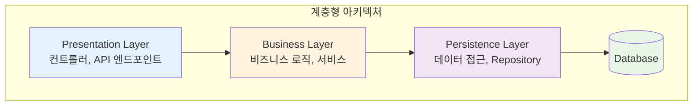
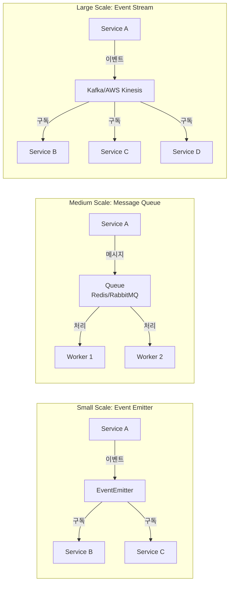
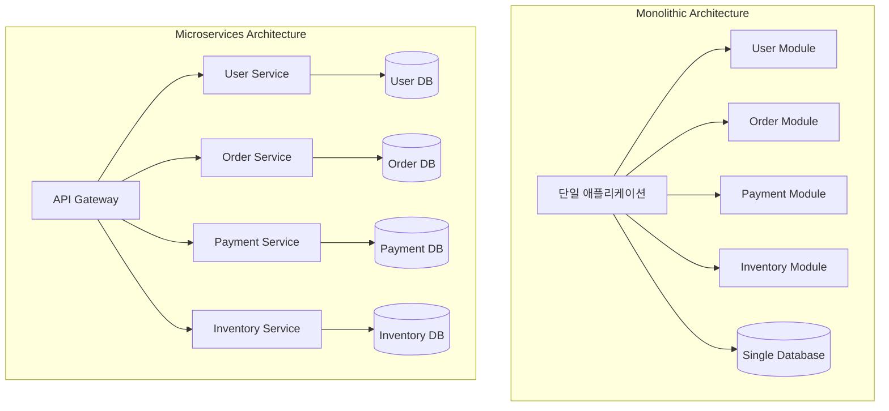
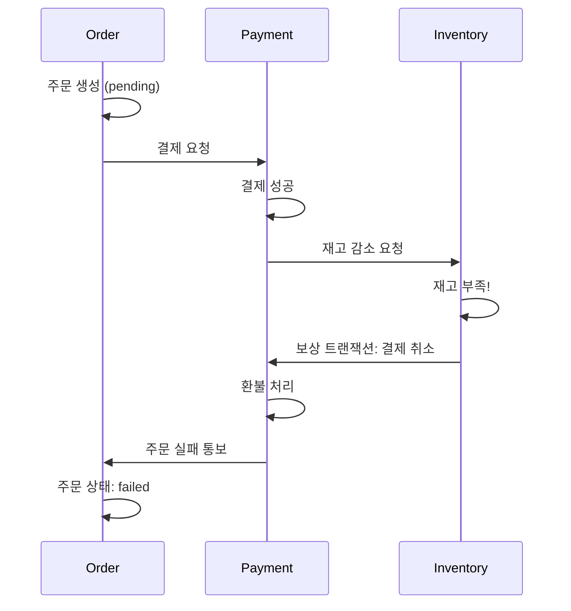
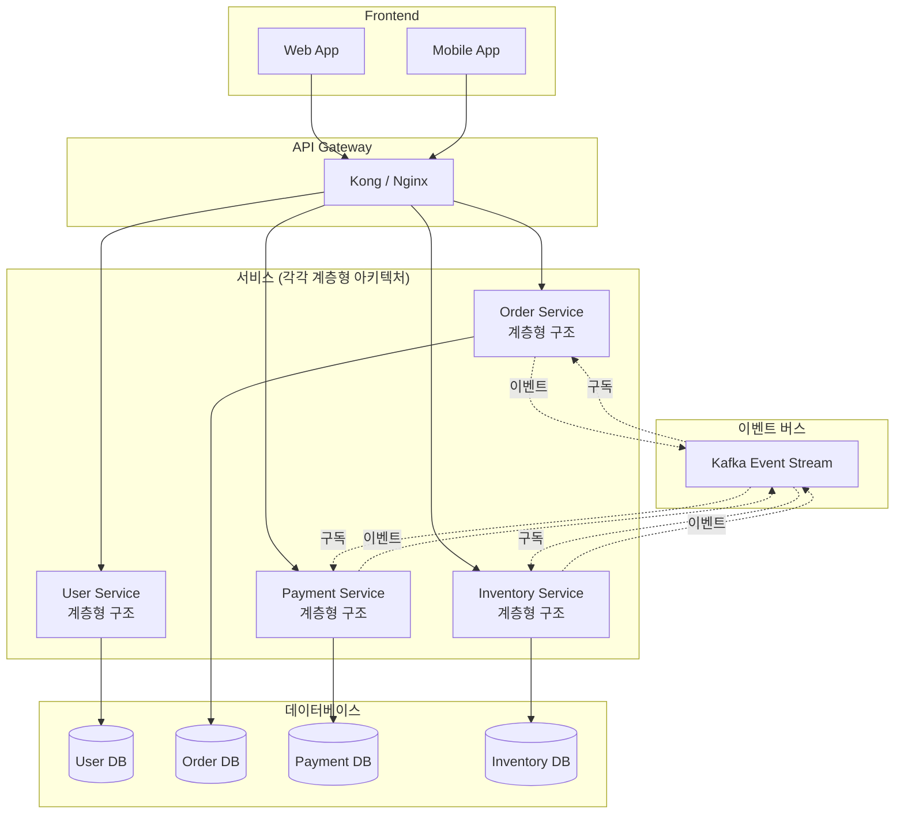

# 웹 아키텍처의 3가지 패턴과 실전 조합법

대부분의 현대 웹 시스템은 단일 아키텍처 패턴만으로 구성되지 않습니다. 프로젝트를 진행하다 보면 "MVC로 시작했는데 어느새 메시지 큐를 도입하고, 일부 서비스를 분리하고..." 하는 경험을 하게 됩니다. 이는 자연스러운 진화 과정입니다.

이번 글에서는 웹 아키텍처의 3가지 핵심 패턴인 계층형 아키텍처(Layered Architecture), 이벤트 기반 아키텍처(Event-Driven Architecture), 마이크로서비스 아키텍처(Microservices Architecture)를 살펴보고, 실무에서 이들을 어떻게 조합하는지 알아보겠습니다.

<Callout type='info' title='이 글의 대상 독자'>
  백엔드 개발을 시작했거나, 시스템 설계를 고민하고 있는 개발자를 대상으로
  합니다. 각 아키텍처의 이론보다는 실무에서의 적용 방법과 조합 전략에 초점을
  맞췄습니다.
</Callout>

## 계층형 아키텍처 (Layered Architecture)

계층형 아키텍처는 가장 전통적이면서도 여전히 강력한 패턴입니다. 시스템을 수평적인 계층으로 나누고, 각 계층은 명확한 책임을 가집니다.

### 기본 구조

일반적으로 3\~4개의 계층으로 구성됩니다:



### Node.js에서의 구현

전형적인 Express.js 애플리케이션의 구조를 보면:

```typescript
// routes/user.routes.ts - Presentation Layer
router.post('/users', userController.createUser);

// controllers/user.controller.ts
class UserController {
  async createUser(req: Request, res: Response) {
    const user = await userService.createUser(req.body);
    res.json(user);
  }
}

// services/user.service.ts - Business Layer
class UserService {
  async createUser(data: CreateUserDto) {
    // 비즈니스 로직: 유효성 검증, 이메일 중복 확인 등
    const hashedPassword = await bcrypt.hash(data.password, 10);
    return await userRepository.create({
      ...data,
      password: hashedPassword,
    });
  }
}

// repositories/user.repository.ts - Persistence Layer
class UserRepository {
  async create(data: User) {
    return await prisma.user.create({ data });
  }
}
```

<Callout type='note' title='왜 계층을 나눌까?'>
  계층 분리의 핵심은 **관심사의 분리(Separation of Concerns)**입니다.
  데이터베이스를 PostgreSQL에서 MongoDB로 바꾸더라도, Repository 계층만 수정하면
  됩니다. 비즈니스 로직은 영향을 받지 않죠.
</Callout>

### 장점과 한계

<div className='grid grid-cols-1 md:grid-cols-2 gap-4 my-6'>
  <Card title='장점' className='border-green-200 bg-green-50/50'>
    - **명확한 구조**: 새로운 팀원도 쉽게 이해 
    - **테스트 용이**: 각 계층을 독립적으로 테스트
    - **재사용성**: 비즈니스 로직을 여러 컨트롤러에서 재사용 
    - **유지보수**: 변경 영향도가 제한적
  </Card>

  <Card title='한계' className='border-amber-200 bg-amber-50/50'>
    - **확장성**: 수직 확장(Scale-up)에 의존 
    - **의존성**: 계층 간 결합도가 높아질 수 있음 
    - **비동기 처리**: 긴 작업에 대한 처리가 어려움 
    - **복잡한 로직**: 계층이 너무 많아지면 오히려 복잡
  </Card>
</div>

### 실무 팁

<Steps>
  <Step title="계층을 3개로 유지하세요">
    처음부터 계층을 너무 세분화하면 오버엔지니어링이 됩니다. Controller - Service - Repository 3계층으로 시작하고, 필요할 때 세분화하세요.
  </Step>
  
  <Step title="DTOs를 활용하세요">
    각 계층 간 데이터 전달에는 DTO(Data Transfer Object)를 사용합니다. 이는 계층 간 결합도를 낮추고 타입 안정성을 높입니다.
    
    ```typescript
    // dtos/create-user.dto.ts
    export class CreateUserDto {
      email: string;
      password: string;
      name: string;
    }
    ```
  </Step>
  
  <Step title="의존성 주입을 고려하세요">
    계층 간 의존성을 명확히 하고 테스트를 쉽게 하려면 DI(Dependency Injection)를 활용합니다. NestJS나 tsyringe 같은 도구를 사용할 수 있습니다.
  </Step>
</Steps>

## 이벤트 기반 아키텍처 (Event-Driven Architecture)

이벤트 기반 아키텍처는 시스템 컴포넌트들이 **이벤트**를 통해 통신하는 패턴입니다. 한 컴포넌트가 이벤트를 발행(Publish)하면, 관심 있는 다른 컴포넌트들이 구독(Subscribe)해서 처리합니다.

### 왜 필요한가?

계층형 아키텍처만으로는 다음과 같은 상황이 어렵습니다:

```typescript
// 문제 상황: 회원가입 후 해야 할 일이 많음
async createUser(data: CreateUserDto) {
  const user = await userRepository.create(data);

  // 이메일 전송 (3초 소요)
  await emailService.sendWelcomeEmail(user.email);

  // 통계 업데이트 (1초 소요)
  await analyticsService.trackSignup(user);

  // 추천 콘텐츠 생성 (2초 소요)
  await recommendationService.generateForNewUser(user);

  return user; // 사용자는 6초를 기다려야 함!
}
```

이런 경우 이벤트 기반으로 전환하면:

```typescript
async createUser(data: CreateUserDto) {
  const user = await userRepository.create(data);

  // 이벤트 발행만 하고 바로 응답
  await eventBus.publish('user.created', { userId: user.id });

  return user; // 즉시 응답!
}

// 다른 곳에서 비동기 처리
eventBus.subscribe('user.created', async (event) => {
  await emailService.sendWelcomeEmail(event.userId);
});

eventBus.subscribe('user.created', async (event) => {
  await analyticsService.trackSignup(event.userId);
});
```

### 구현 패턴

이벤트 기반 아키텍처는 규모에 따라 다양하게 구현할 수 있습니다:



<Tabs defaultValue="simple">
  <TabsList>
    <TabsTrigger value="simple">간단한 구현</TabsTrigger>
    <TabsTrigger value="queue">메시지 큐</TabsTrigger>
    <TabsTrigger value="kafka">이벤트 스트림</TabsTrigger>
  </TabsList>
  
  <TabsContent value="simple">
    Node.js의 EventEmitter를 활용한 간단한 구현:
    
    ```typescript
    import { EventEmitter } from 'events';
    
    class DomainEventBus extends EventEmitter {
      async publish(eventName: string, data: any) {
        this.emit(eventName, data);
      }
    }
    
    export const eventBus = new DomainEventBus();
    
    // 사용
    eventBus.on('user.created', async (data) => {
      console.log('New user:', data.userId);
    });
    ```
    
    <Callout type="warning" title="주의사항">
      EventEmitter는 단일 프로세스 내에서만 동작합니다. 서버가 재시작되면 처리되지 않은 이벤트는 손실됩니다.
    </Callout>
  </TabsContent>
  
  <TabsContent value="queue">
    BullMQ를 사용한 Redis 기반 메시지 큐:
    
    ```typescript
    import { Queue, Worker } from 'bullmq';
    
    // 큐 생성
    const emailQueue = new Queue('email', {
      connection: { host: 'localhost', port: 6379 }
    });
    
    // 작업 추가
    await emailQueue.add('welcome', {
      email: user.email,
      name: user.name
    });
    
    // 워커로 처리
    const worker = new Worker('email', async (job) => {
      if (job.name === 'welcome') {
        await sendWelcomeEmail(job.data);
      }
    });
    ```
    
    이 방식은 **재시도**, **우선순위**, **지연 실행** 등을 지원합니다.
  </TabsContent>
  
  <TabsContent value="kafka">
    Kafka를 사용한 대규모 이벤트 스트리밍:
    
    ```typescript
    import { Kafka } from 'kafkajs';
    
    const kafka = new Kafka({
      clientId: 'my-app',
      brokers: ['localhost:9092']
    });
    
    // Producer
    const producer = kafka.producer();
    await producer.send({
      topic: 'user-events',
      messages: [
        { 
          key: userId,
          value: JSON.stringify({ type: 'created', userId })
        }
      ]
    });
    
    // Consumer
    const consumer = kafka.consumer({ groupId: 'email-service' });
    await consumer.subscribe({ topic: 'user-events' });
    await consumer.run({
      eachMessage: async ({ message }) => {
        const event = JSON.parse(message.value);
        // 이벤트 처리
      }
    });
    ```
    
    Kafka는 **이벤트 순서 보장**, **영구 저장**, **다중 구독자**를 지원합니다.
  </TabsContent>
</Tabs>

### 이벤트 설계 원칙

<Callout type="success" title="좋은 이벤트 설계">
  **과거형 이름 사용**: `UserCreatedEvent`, `OrderCompletedEvent`처럼 "이미 일어난 일"을 표현합니다.
  
  **충분한 정보 포함**: 구독자가 추가 조회 없이 처리할 수 있도록 필요한 데이터를 포함합니다.
  
  ```typescript
  interface UserCreatedEvent {
    userId: string;
    email: string;
    createdAt: Date;
    metadata: {
      source: string;
      version: string;
    };
  }
  ```
  
  **버전 관리**: 이벤트 스키마가 변경될 수 있으므로 버전 정보를 포함합니다.
</Callout>

### 장점과 도전과제

<div className='grid grid-cols-1 md:grid-cols-2 gap-4 my-6'>
  <Card title='장점' className='border-green-200 bg-green-50/50'>
    - **느슨한 결합**: 서비스 간 직접 의존성 제거 - **확장성**: 구독자를
    독립적으로 확장 가능 - **유연성**: 새로운 기능을 기존 코드 수정 없이 추가 -
    **복원력**: 일부 서비스 장애가 전체에 영향 없음
  </Card>

  <Card title='도전과제' className='border-amber-200 bg-amber-50/50'>
    - **디버깅 어려움**: 비동기 처리로 인한 추적 복잡도 - **일관성**: 데이터
    정합성 보장이 어려움 - **순서 보장**: 이벤트 순서가 중요한 경우 복잡 -
    **운영 복잡도**: 메시지 큐, 모니터링 등 인프라 필요
  </Card>
</div>

## 마이크로서비스 아키텍처 (Microservices Architecture)

마이크로서비스는 시스템을 **독립적으로 배포 가능한 작은 서비스들**로 분해하는 아키텍처입니다. 각 서비스는 특정 비즈니스 기능에 집중하며, 자체 데이터베이스를 가질 수 있습니다.

### 모놀리스 vs 마이크로서비스



<Callout type="warning" title="언제 마이크로서비스가 필요한가?">
마이크로서비스는 은탄환(Silver Bullet)이 아닙니다. 다음 상황에서 고려하세요:

- **팀이 여러 개**: 독립적인 팀들이 독립적으로 배포하고 싶을 때
- **확장성 불균형**: 특정 기능만 트래픽이 많아 독립적으로 확장해야 할 때
- **기술 다양성**: 서비스마다 다른 기술 스택을 사용하고 싶을 때
- **배포 독립성**: 한 서비스의 변경이 다른 서비스에 영향을 주지 않아야 할 때

스타트업이나 소규모 팀이라면 **모놀리스로 시작**하는 것을 강력히 권장합니다.

</Callout>

### 서비스 분리 기준

서비스를 어떻게 나눌지는 가장 어려운 결정입니다. DDD(Domain-Driven Design)의 Bounded Context를 참고하세요:

```typescript
// 잘못된 분리: 기술적 계층 기준
- api-gateway
- business-logic-service
- database-service

// 올바른 분리: 비즈니스 도메인 기준
- user-service (회원 관리)
  - 회원가입, 로그인, 프로필 관리

- order-service (주문 관리)
  - 주문 생성, 주문 조회, 주문 취소

- payment-service (결제 처리)
  - 결제 요청, 결제 승인, 환불

- inventory-service (재고 관리)
  - 재고 조회, 재고 감소, 재고 보충
```

### 서비스 간 통신

마이크로서비스는 네트워크를 통해 통신합니다. 주요 패턴:

<Steps>
  <Step title="동기 통신: REST API">
    가장 직관적인 방법입니다.
    
    ```typescript
    // order-service에서 user-service 호출
    const userResponse = await fetch(
      `http://user-service/api/users/${userId}`
    );
    const user = await userResponse.json();
    ```
    
    **단점**: user-service가 다운되면 주문도 실패합니다.
  </Step>
  
  <Step title="동기 통신: gRPC">
    성능이 중요한 내부 통신에 적합합니다.
    
    ```protobuf
    // user.proto
    service UserService {
      rpc GetUser (GetUserRequest) returns (User);
    }
    ```
    
    HTTP/2 기반으로 빠르고, 타입 안정성이 보장됩니다.
  </Step>
  
  <Step title="비동기 통신: 이벤트">
    서비스 간 결합도를 낮춥니다.
    
    ```typescript
    // order-service
    eventBus.publish('order.created', {
      orderId: order.id,
      userId: order.userId,
      items: order.items
    });
    
    // inventory-service
    eventBus.subscribe('order.created', async (event) => {
      await reduceInventory(event.items);
    });
    ```
    
    **장점**: 서비스가 독립적으로 동작하고, 장애가 격리됩니다.
  </Step>
</Steps>

### API Gateway 패턴

클라이언트가 여러 마이크로서비스를 직접 호출하지 않도록, API Gateway가 중간에서 라우팅합니다:

```typescript
// Express.js 기반 간단한 API Gateway
import express from 'express';
import { createProxyMiddleware } from 'http-proxy-middleware';

const app = express();

// 사용자 관련 요청은 user-service로
app.use(
  '/api/users',
  createProxyMiddleware({
    target: 'http://user-service:3001',
    changeOrigin: true,
  })
);

// 주문 관련 요청은 order-service로
app.use(
  '/api/orders',
  createProxyMiddleware({
    target: 'http://order-service:3002',
    changeOrigin: true,
  })
);

// 인증, 로깅, Rate Limiting 등 공통 기능
app.use(authMiddleware);
app.use(rateLimitMiddleware);

app.listen(3000);
```

### 데이터 관리의 어려움

마이크로서비스에서 가장 어려운 부분은 **데이터 정합성**입니다:

<Callout type="error" title="분산 트랜잭션 문제">
주문 생성 시나리오를 생각해보세요:

1. order-service: 주문 생성
2. payment-service: 결제 처리
3. inventory-service: 재고 감소

이 3개 작업 중 하나라도 실패하면? 전통적인 DB 트랜잭션으로는 해결할 수 없습니다.

</Callout>

**해결 방법: Saga 패턴**



각 단계가 성공/실패 시 **보상 트랜잭션(Compensating Transaction)**을 실행합니다.

### 장점과 도전과제

<div className='grid grid-cols-1 md:grid-cols-2 gap-4 my-6'>
  <Card title='장점' className='border-green-200 bg-green-50/50'>
    - **독립 배포**: 팀이 독립적으로 개발/배포 - **기술 자유도**: 서비스마다
    최적의 기술 선택 - **장애 격리**: 한 서비스 장애가 전체에 파급 안 됨 -
    **확장성**: 필요한 서비스만 선택적으로 확장
  </Card>

  <Card title='도전과제' className='border-amber-200 bg-amber-50/50'>
    - **복잡도**: 분산 시스템의 복잡성 증가 - **데이터 정합성**: 트랜잭션 관리의
    어려움 - **네트워크**: 지연, 장애 처리 필요 - **운영**: 모니터링, 로깅, 배포
    등 인프라 비용
  </Card>
</div>

## 실전: 아키텍처 조합하기

이제 핵심입니다. 실무에서는 이 3가지 패턴을 **함께** 사용합니다.

### 진화하는 아키텍처

대부분의 프로젝트는 다음과 같은 여정을 거칩니다:

### Phase 1: 계층형 모놀리스

초기에는 단순한 3-tier 아키텍처로 시작합니다.

```
[Express App]
  ├── controllers/
  ├── services/
  ├── repositories/
  └── database (PostgreSQL)
```

**장점**: 빠른 개발, 간단한 배포, 팀원 온보딩 쉬움

**한계**: 모든 기능이 동일한 리소스를 공유, 하나의 배포 단위

### Phase 2: 이벤트 도입

비동기 처리가 필요한 부분부터 이벤트를 도입합니다.

```
[Express App]
  ├── controllers/
  ├── services/
  │   └── eventBus.publish()
  ├── repositories/
  ├── database (PostgreSQL)
  └── [Redis Queue]
        └── workers/
            ├── email-worker.js
            ├── notification-worker.js
            └── analytics-worker.js
```

**개선점**: 응답 속도 향상, 리소스 집약적 작업 분리

**새로운 과제**: 워커 프로세스 관리, 실패 처리

### Phase 3: 서비스 분리

특정 도메인이 독립성을 필요로 할 때 마이크로서비스로 분리합니다.

```
[API Gateway]
  ├── /api/users → [User Service] (Monolith의 일부)
  ├── /api/orders → [Order Service] (분리된 서비스)
  ├── /api/payments → [Payment Service] (분리된 서비스)
  └── /api/analytics → [Analytics Service] (분리된 서비스)

[Event Bus (Kafka)]
  └── 서비스 간 비동기 통신
```

각 서비스는 내부적으로 **계층형 아키텍처**를 유지하고, 서비스 간에는 **이벤트 기반**으로 통신합니다.

### 실전 예제: E-Commerce 시스템

실제 전자상거래 시스템에서 3가지 패턴이 어떻게 조합되는지 봅시다:



**주문 생성 흐름**:

1. **동기 호출** (REST API)

   ```typescript
   // order-service의 계층형 구조
   POST /api/orders
   → OrderController.createOrder()
   → OrderService.createOrder() // 비즈니스 로직
   → OrderRepository.save()     // 데이터 저장
   ```

2. **이벤트 발행** (비동기 처리)

   ```typescript
   // order-service
   await kafka.publish('order.created', {
     orderId: order.id,
     userId: order.userId,
     items: order.items,
     totalAmount: order.totalAmount,
   });
   ```

3. **다른 서비스들이 반응**

   ```typescript
   // inventory-service
   kafka.subscribe('order.created', async (event) => {
     await inventoryService.reserveItems(event.items);
     await kafka.publish('inventory.reserved', { orderId: event.orderId });
   });

   // payment-service
   kafka.subscribe('inventory.reserved', async (event) => {
     const result = await paymentService.processPayment(event);
     if (result.success) {
       await kafka.publish('payment.completed', { orderId: event.orderId });
     } else {
       await kafka.publish('payment.failed', { orderId: event.orderId });
     }
   });

   // order-service (최종 상태 업데이트)
   kafka.subscribe('payment.completed', async (event) => {
     await orderService.completeOrder(event.orderId);
   });
   ```

<Callout type="success" title="이것이 실전 아키텍처입니다">
- **마이크로서비스**: 서비스 단위로 분리
- **계층형 아키텍처**: 각 서비스 내부 구조
- **이벤트 기반**: 서비스 간 통신

3가지 패턴이 각자의 강점을 발휘하며 조화를 이룹니다.

</Callout>

### 조합 전략 가이드

프로젝트 상황에 따른 추천 조합:

#### 1. 스타트업 단계

**팀 규모**: 1\~5명  
**트래픽**: \~1,000 req/s  
**우선순위**: 빠른 개발, 단순한 운영

**추천 구조**:

```
계층형 모놀리스 + 간단한 이벤트 처리

[Express/NestJS App]
  ├── controllers/
  ├── services/
  ├── repositories/
  └── [PostgreSQL]

[Optional: Redis + Bull]
  └── workers/ (이메일, 이미지 처리 등)
```

**선택 이유**:

- 단일 코드베이스로 빠른 개발
- 배포가 간단 (Docker 컨테이너 하나)
- 디버깅이 쉬움
- 팀원 온보딩이 빠름

**나중에 고민할 것**: 아직은 마이크로서비스 불필요

#### 2. 성장 단계

**팀 규모**: 5\~20명  
**트래픽**: 1,000\~10,000 req/s  
**우선순위**: 확장성, 팀 독립성

**추천 구조**:

```
모듈러 모놀리스 + 이벤트 기반 + 선택적 마이크로서비스

[Main App - 모놀리스]
  ├── user-module/
  ├── product-module/
  └── order-module/

[분리된 서비스]
  ├── [Analytics Service] (독립 배포 필요)
  ├── [Search Service] (ElasticSearch)
  └── [Notification Service] (Push, Email, SMS)

[Kafka / RabbitMQ]
  └── 서비스 간 이벤트 통신
```

**선택 이유**:

- 코어 기능은 모놀리스로 유지 (트랜잭션 간편)
- 특수 요구사항이 있는 기능만 분리
- 이벤트로 느슨한 결합 유지

**주의사항**: 무분별한 서비스 분리 지양

#### 3. 대규모 서비스

**팀 규모**: 20명 이상  
**트래픽**: 10,000+ req/s  
**우선순위**: 확장성, 안정성, 팀 자율성

**추천 구조**:

```
완전한 마이크로서비스 + 이벤트 기반

[API Gateway]

[Domain Services - 각각 계층형 구조]
  ├── User Service
  ├── Product Service
  ├── Order Service
  ├── Payment Service
  ├── Inventory Service
  ├── Notification Service
  ├── Analytics Service
  └── Search Service

[Kafka Cluster]
  └── 이벤트 스트리밍

[Infrastructure]
  ├── Kubernetes (배포/오케스트레이션)
  ├── Service Mesh (Istio)
  ├── Distributed Tracing (Jaeger)
  └── Centralized Logging (ELK)
```

**선택 이유**:

- 팀별로 독립적인 개발/배포 사이클
- 서비스별 기술 스택 선택 가능
- 트래픽에 따라 선택적 확장
- 장애 격리

**필수 요소**:

- 강력한 DevOps 팀
- 자동화된 CI/CD
- 모니터링 및 알림 시스템

## 의사결정 가이드

아키텍처를 선택할 때 다음 질문들을 스스로에게 해보세요:

<Callout type='note' title='아키텍처 체크리스트'>
  ### 팀과 조직 - [ ] 팀 규모는? (1\~5명 / 5\~20명 / 20명 이상) - [ ] 여러 팀이
  독립적으로 일하는가? - [ ] DevOps 역량이 있는가? ### 기술적 요구사항 - [ ]
  예상 트래픽은? - [ ] 특정 기능만 고부하인가? - [ ] 실시간 처리가 필요한가,
  비동기 처리로 충분한가? - [ ] 데이터 정합성이 얼마나 중요한가? ### 비즈니스
  요구사항 - [ ] 빠른 출시가 중요한가, 안정성이 중요한가? - [ ] 배포 빈도는? (일
  1회 / 주 1회 / 수시) - [ ] 장애 허용도는? ### 진화 가능성 - [ ] 6개월 후 팀
  규모는? - [ ] 1년 후 트래픽 예상은? - [ ] 마이그레이션 비용을 감당할 수
  있는가?
</Callout>

## 마치며: 점진적 진화

아키텍처는 한 번에 완벽하게 설계하는 것이 아니라, **점진적으로 진화**시키는 것입니다.

<Blockquote author='Martin Fowler' cite='Microservices Guide'>
  "You shouldn't start with microservices. Almost all the successful
  microservice stories have started with a monolith that got too big and was
  broken up."
</Blockquote>

### 핵심 원칙

1. **단순하게 시작하세요**  
   오버엔지니어링은 독입니다. 계층형 모놀리스로 시작해서 문제가 생기면 진화시키세요.

2. **측정하고 결정하세요**  
   "마이크로서비스가 유행이니까"가 아니라, 실제 병목과 문제를 측정하고 그에 맞는 해결책을 선택하세요.

3. **팀의 역량을 고려하세요**  
   아무리 좋은 아키텍처도 팀이 운영할 수 없으면 무용지물입니다.

4. **비즈니스 가치에 집중하세요**  
   아키텍처는 수단이지 목적이 아닙니다. 사용자에게 가치를 전달하는 것이 최우선입니다.

### 다음 단계

이제 각 아키텍처의 기본을 이해했다면:

- **계층형 아키텍처**: DDD(Domain-Driven Design) 학습
- **이벤트 기반**: CQRS, Event Sourcing 패턴 탐구
- **마이크로서비스**: 서비스 메시(Service Mesh), 분산 트랜잭션 심화 학습

<ReferenceList title='참고 자료'>
  <Reference
    title='Building Microservices'
    description='Sam Newman의 마이크로서비스 아키텍처 바이블'
    href='https://www.oreilly.com/library/view/building-microservices-2nd/9781492034018/'
    type='documentation'
    author='Sam Newman'
  />
  <Reference
    title='Domain-Driven Design'
    description='Eric Evans의 DDD 원서'
    href='https://www.domainlanguage.com/ddd/'
    type='documentation'
    author='Eric Evans'
  />
  <Reference
    title='Event-Driven Architecture'
    description='Martin Fowler의 이벤트 기반 아키텍처 가이드'
    href='https://martinfowler.com/articles/201701-event-driven.html'
    type='article'
    author='Martin Fowler'
  />
  <Reference
    title='Microservices.io'
    description='마이크로서비스 패턴 모음집'
    href='https://microservices.io/patterns/'
    type='tutorial'
    author='Chris Richardson'
  />
</ReferenceList>

---

아키텍처는 정답이 없습니다. 당신의 상황, 팀, 비즈니스에 맞는 **최선의 선택**을 하세요. 그리고 그것이 더 이상 맞지 않을 때, 주저 없이 진화시키세요.
