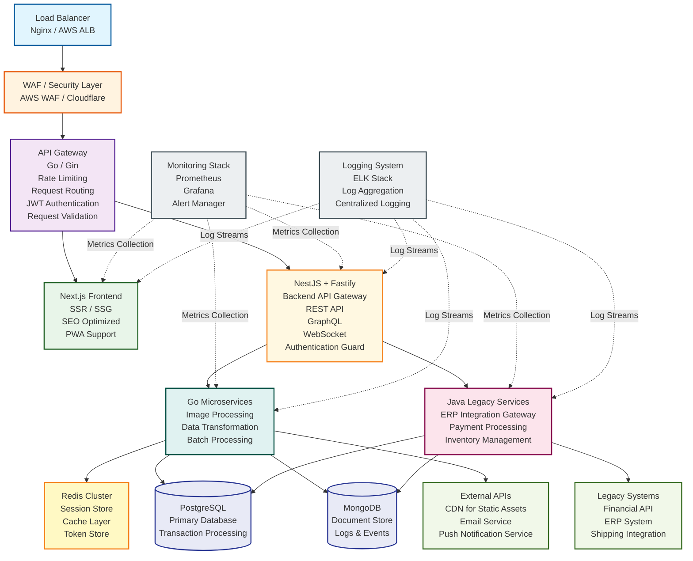

# Node 기반 SI 웹 아키텍처 선택에 대한 생각

## TL;DR

Next.js 풀스택으로 시작했다가 인증, 권한, AOP, 스케일아웃에서 고통받았다면, **NestJS + Fastify**가 답입니다.

최근 들어 드는 생각은 기업용 웹 시스템은 결국 `Next.js (Frontend) + NestJS (Backend) + 필요시 Go/Gin (병렬처리) + SDK 의존성에 의한 Java 등의 레거시 프레임워크`가 안전한 정답 같아요.

---

## 1. Next.js 풀스택의 함정

### 겪었던 실제 문제들

Next.js App Router의 Server Actions와 API Routes로 풀스택을 구축하면 초기에는 빠르지만, 곧 다음 문제들에 직면합니다:

#### **인증/권한 관리의 악몽**

```typescript
// 모든 API Route마다 이런 코드 반복
export async function GET(request: Request) {
  const session = await getServerSession(authOptions);
  if (!session) return new Response('Unauthorized', { status: 401 });
  if (!hasPermission(session.user, 'READ_USERS')) {
    return new Response('Forbidden', { status: 403 });
  }
  // 실제 로직...
}
```

- 세션 체크, 권한 검증 로직이 모든 엔드포인트에 중복
- 일관성 있는 에러 처리가 불가능
- 권한 체계가 복잡해지면 유지보수 불가

#### **Cross-cutting Concerns (AOP) 처리 불가**

```typescript
// 로깅, 모니터링, 트랜잭션을 어디에?
export async function POST(request: Request) {
  // 로깅 시작
  console.log('Request started');
  try {
    // 트랜잭션 시작?
    const data = await request.json();
    // 검증?
    // 비즈니스 로직
    // 로깅 끝
    console.log('Request ended');
  } catch (e) {
    // 에러 로깅
    console.error(e);
  }
}
```

- 로깅, 모니터링, 트랜잭션 관리를 매번 수동으로
- Interceptor, Guard, Pipe 같은 개념이 없음
- 관심사 분리(Separation of Concerns) 불가능

#### **Scale-out의 한계**

```typescript
// Next.js 서버는 Frontend + Backend가 결합
// - SEO 최적화를 위한 SSR
// - API 로직
// - 정적 에셋 서빙

// 이 중 어느 하나만 부하가 커져도 전체를 스케일해야 함
// Backend API만 따로 스케일할 수 없음
```

- Frontend와 Backend가 분리되지 않아 독립적 스케일링 불가
- API 부하 때문에 SSR 성능이 저하되는 역설
- 캐싱 전략을 세밀하게 조정하기 어려움

---

## 2. 왜 NestJS인가?

### 엔터프라이즈급 아키텍처 패턴 내장

NestJS는 "Node.js의 Spring Framework"입니다. 실제로 Spring의 설계 철학을 많이 차용했습니다.

#### **의존성 주입 (Dependency Injection)**

```typescript
@Injectable()
export class UserService {
  constructor(
    private readonly userRepository: UserRepository,
    private readonly emailService: EmailService,
    private readonly logger: Logger
  ) {}
}

// 테스트도 쉬워짐
const mockEmailService = { send: jest.fn() };
const service = new UserService(repo, mockEmailService, logger);
```

- 느슨한 결합, 높은 테스트 가능성
- 순환 의존성 자동 감지
- 싱글톤, 스코프드, 트랜지언트 라이프사이클 관리

#### **AOP (Aspect-Oriented Programming) 완벽 지원**

```typescript
// Guards: 인증/권한
@UseGuards(JwtAuthGuard, RolesGuard)
@Roles('admin')
@Get('users')
getUsers() { }

// Interceptors: 로깅, 변환, 캐싱
@UseInterceptors(LoggingInterceptor, CacheInterceptor)
@Get('posts')
getPosts() { }

// Pipes: 검증, 변환
@Post('users')
createUser(@Body(ValidationPipe) dto: CreateUserDto) { }

// Exception Filters: 전역 에러 처리
@Catch(HttpException)
export class HttpExceptionFilter implements ExceptionFilter {
  catch(exception: HttpException, host: ArgumentsHost) { }
}
```

**Cross-cutting Concerns를 비즈니스 로직과 완전히 분리**:

- 인증/권한: Guards
- 로깅/모니터링: Interceptors
- 데이터 검증: Pipes
- 에러 처리: Exception Filters

#### **모듈 시스템으로 확장 가능한 구조**

```typescript
@Module({
  imports: [
    ConfigModule.forRoot(),
    DatabaseModule,
    AuthModule,
    UsersModule,
    OrdersModule,
  ],
})
export class AppModule {}

// 각 도메인을 독립적인 모듈로
@Module({
  imports: [TypeOrmModule.forFeature([User])],
  providers: [UserService, UserRepository],
  controllers: [UserController],
  exports: [UserService], // 다른 모듈에서 사용 가능
})
export class UsersModule {}
```

- 도메인별로 모듈 분리
- 마이크로서비스로 쉽게 전환 가능
- 공통 기능을 Dynamic Module로 재사용

#### **TypeScript 퍼스트 클래스 지원**

```typescript
// DTO 자동 검증 + 타입 안전성
export class CreateUserDto {
  @IsEmail()
  email: string;

  @IsString()
  @MinLength(8)
  password: string;

  @IsOptional()
  @IsEnum(UserRole)
  role?: UserRole;
}

// 컴파일 타임 + 런타임 검증 모두 확보
```

---

## 3. 왜 Fastify를 내부 프레임워크로?

### Express vs Fastify: 실전 비교

| 항목             | Express | Fastify        |
| ---------------- | ------- | -------------- |
| 처리량 (req/s)   | ~15,000 | ~30,000-45,000 |
| 메모리 효율      | 보통    | 우수           |
| JSON 스키마 검증 | 수동    | 내장 (ajv)     |
| 타입 안전성      | 약함    | 강함           |
| 플러그인 시스템  | 간단    | 강력 (캡슐화)  |
| 생태계           | 압도적  | 성장 중        |
| 학습 곡선        | 낮음    | 중간           |

### Fastify를 선택해야 하는 이유

#### **1. 성능이 실제로 중요한 시나리오**

```typescript
// 대량의 실시간 데이터 처리
// - IoT 센서 데이터 수집 API
// - 실시간 알림 시스템
// - 높은 트래픽의 모바일 API

// Fastify는 2-3배 높은 처리량
// 16GB 메모리로 더 많은 동시 연결 처리 가능
```

**실제 케이스**:

- 1Gbps 네트워크, NVMe SSD 환경
- 메모리 16GB 제약
- 수만 명의 동시 사용자

→ Fastify의 낮은 메모리 사용량과 높은 처리량이 빛을 발함

#### **2. JSON 스키마 기반 타입 안전성**

```typescript
// Fastify는 JSON Schema로 요청/응답 검증
const createUserSchema = {
  body: {
    type: 'object',
    required: ['email', 'password'],
    properties: {
      email: { type: 'string', format: 'email' },
      password: { type: 'string', minLength: 8 },
    },
  },
  response: {
    200: {
      type: 'object',
      properties: {
        id: { type: 'string' },
        email: { type: 'string' },
      },
    },
  },
};

// NestJS와 결합하면 DTO + Schema 동시 활용
```

- 런타임 검증 자동화
- API 문서 자동 생성
- 타입 추론으로 개발 생산성 향상

#### **3. NestJS 전환이 쉬움**

```typescript
// 어댑터만 교체
// main.ts
import { FastifyAdapter } from '@nestjs/platform-fastify';

const app = await NestFactory.create(AppModule, new FastifyAdapter());
```

- NestJS 코드는 거의 수정 불필요
- 플랫폼 특정 API만 확인하면 됨
- 점진적 마이그레이션 가능

#### **4. 프로덕션 검증 사례**

- **Mercari** (일본 최대 중고거래 플랫폼): Node.js 백엔드에 Fastify 사용
- **Red Hat**: OpenShift에서 Fastify 채택
- **Siemens**: IoT 플랫폼에 활용

---

## 4. Go는 언제 도입하나?

### Go/Gin은 특정 영역에만 하이브리드로

전체 백엔드를 Go로 작성하는 것은 **오버엔지니어링**입니다.

#### **Go를 도입해야 하는 경우**

```go
// 1. CPU-bound 병렬 처리
// - 대용량 이미지/동영상 처리
// - 복잡한 데이터 변환 배치 작업
// - 고성능 실시간 분석

// 2. 초고성능 프록시/게이트웨이
// - API Gateway
// - WebSocket 서버 (수십만 동시 연결)
// - 실시간 스트리밍 서버

// 예: 이미지 리사이징 마이크로서비스
func ResizeImage(ctx *gin.Context) {
    // Goroutine으로 병렬 처리
    var wg sync.WaitGroup
    for _, size := range sizes {
        wg.Add(1)
        go func(s int) {
            defer wg.Done()
            resizeToSize(img, s)
        }(size)
    }
    wg.Wait()
}
```

#### **대부분의 비즈니스 로직은 NestJS로 충분**

```typescript
// 일반적인 CRUD, 인증, 권한, 트랜잭션 처리는
// NestJS의 풍부한 생태계와 타입 안전성이 훨씬 생산적

@Injectable()
export class OrderService {
  async createOrder(userId: string, dto: CreateOrderDto) {
    return this.db.transaction(async (em) => {
      const order = await em.save(Order, { userId, ...dto });
      await this.emailService.sendOrderConfirmation(order);
      await this.eventBus.publish(new OrderCreatedEvent(order));
      return order;
    });
  }
}

// Go로 이걸 구현하려면 훨씬 더 많은 코드와 보일러플레이트
```

#### **실무 아키텍처 예시**

```
Frontend (Next.js)
    ↓
API Gateway (Go/Gin) - 라우팅, Rate Limiting
    ↓
├─ NestJS (비즈니스 로직, CRUD, 인증)
├─ Go Service (이미지 처리)
└─ Java Service (레거시 ERP 연동... 어쩔 수 없음)
    ↓
Redis (캐싱) + PostgreSQL + MongoDB
```

---

## 5. 최종 추천 아키텍처

### 기업용 웹 시스템의 현실적인 스택



### 각 레이어의 역할

#### **Frontend: Next.js**

- SSR/SSG로 SEO 최적화
- React 생태계 활용
- API 호출만 담당 (비즈니스 로직 없음)

#### **Backend: NestJS + Fastify**

- 모든 비즈니스 로직
- 인증/권한 관리
- 데이터베이스 트랜잭션
- 이벤트 기반 아키텍처

#### **Specialized Services: Go/Java**

- Go: CPU-bound 병렬 처리
- Java: 레거시 시스템 연동 (어쩔 수 없음)

#### **Data Layer**

- Redis: 세션, 캐싱, Rate Limiting
- PostgreSQL: 관계형 데이터
- MongoDB: 비정형 데이터, 로그

---

## 6. 실전 체크리스트

### NestJS + Fastify로 시작하기 전에

#### ✅ **이런 경우 적합**

- [ ] API 서버가 주 목적 (REST, GraphQL, gRPC)
- [ ] 인증/권한이 복잡함
- [ ] 여러 도메인 로직을 체계적으로 관리해야 함
- [ ] 마이크로서비스로 확장 가능성
- [ ] 팀이 TypeScript에 익숙함

#### ⚠️ **이런 경우 재고**

- [ ] 단순 CRUD 프로토타입 (Express로도 충분)
- [ ] 팀 전체가 JavaScript만 가능 (학습 비용)
- [ ] 레거시 Express 미들웨어에 강하게 의존

### 마이그레이션 단계

```typescript
// 1단계: 새 프로젝트 생성
$ npm i -g @nestjs/cli
$ nest new project-name

// 2단계: Fastify 어댑터 설치
$ npm i @nestjs/platform-fastify

// 3단계: main.ts 수정
import { FastifyAdapter } from '@nestjs/platform-fastify';

async function bootstrap() {
  const app = await NestFactory.create(
    AppModule,
    new FastifyAdapter({ logger: true })
  );
  await app.listen(3000, '0.0.0.0');
}

// 4단계: 도메인별 모듈 구성
// - AuthModule
// - UsersModule
// - OrdersModule
// ...

// 5단계: Guards, Interceptors 설정
// 6단계: 점진적으로 기능 이전
```

---

## 7. 결론

### Next.js 풀스택의 교훈

Next.js는 훌륭한 프론트엔드 프레임워크지만, **백엔드까지 담당하기에는 한계**가 명확합니다:

- 인증/권한 관리의 복잡성
- AOP 처리 불가
- Scale-out 제약

### NestJS + Fastify가 정답인 이유

1. **엔터프라이즈 패턴 내장**: DI, AOP, 모듈화
2. **높은 생산성**: TypeScript, 풍부한 생태계
3. **뛰어난 성능**: Fastify의 속도 + NestJS의 구조
4. **확장 가능성**: 마이크로서비스로 쉽게 전환
5. **유지보수성**: 관심사 분리, 테스트 용이성

### 현실적인 기업 스택

```txt
Next.js (Frontend)
  + NestJS + Fastify (Backend Core)
  + Go/Gin (병렬처리, 필요시)
  + Java (레거시, 어쩔 수 없이...)
  + Redis + PostgreSQL/MongoDB
  + API Gateway + Load Balancer
```

---

## 참고 자료

- [NestJS 공식 문서](https://docs.nestjs.com)
- [Fastify 공식 문서](https://www.fastify.io)
- [NestJS Fastify 어댑터](https://docs.nestjs.com/techniques/performance)
- [엔터프라이즈 Node.js 패턴](https://github.com/goldbergyoni/nodebestpractices)

---

**시작은 간단합니다. 하지만 확장은 체계적이어야 합니다.**  
**NestJS + Fastify로 지속 가능한 백엔드를 구축하세요.**
