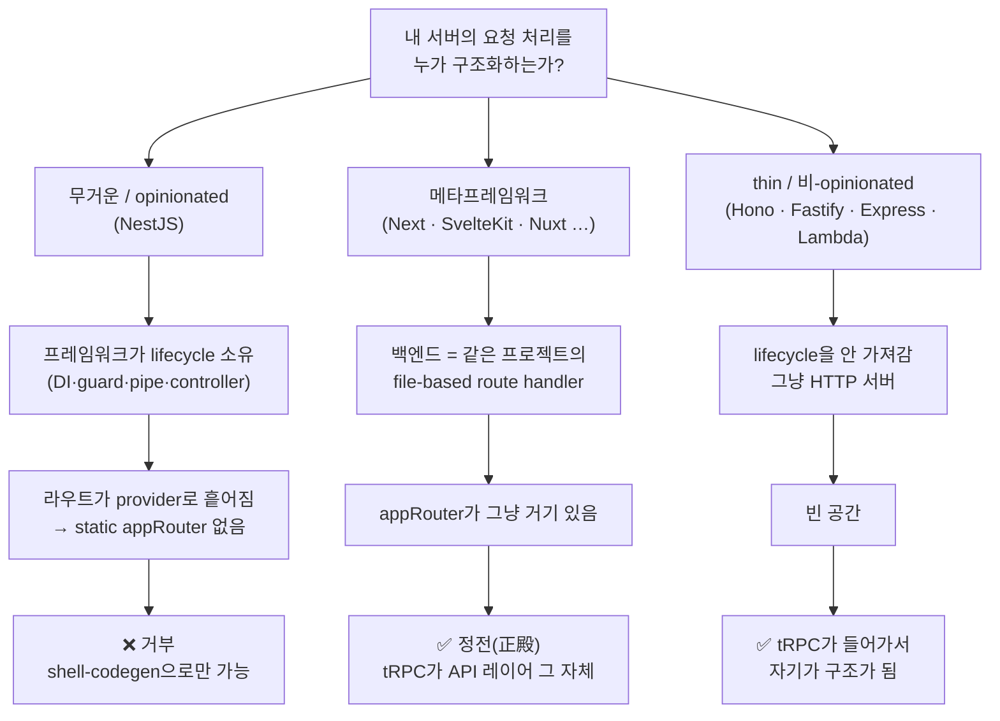

"tRPC를 쓸까, REST를 쓸까"는 거의 항상 잘못 던진 질문이다. 더 나쁜 변형은 "어떤 프레임워크가 tRPC를 지원하지?"다. tRPC가 잘 붙고 안 붙고는 프레임워크 *이름*의 문제가 아니라 **서버의 구조적 형태**의 문제이기 때문이다.

이 글은 그 형태를 가르는 경계선을 딱 한 줄까지 내려가서 짚는다. tRPC가 어떤 곳에서는 마법처럼 동작하고 어떤 곳에서는 어색한 어댑터에 영원히 의존하는지 — 그 갈림이 사실은 코드 한 줄에서 시작한다.

## 들어가기 전에 — 이 글의 최소 배경

초보자용 발판이다. tRPC와 REST가 이미 손에 익었으면 [다음 절](#typeof-approuter--한-줄이-전부다)로 건너뛰어도 된다.

**무슨 문제를 푸는 기술인가.** 웹 앱은 보통 프론트엔드(브라우저)와 백엔드(서버)로 나뉘고, 둘은 네트워크 너머로 데이터를 주고받는다. 골치는 — 백엔드가 응답의 모양을 바꾸면(필드 이름을 `name` → `fullName`으로) 프론트엔드는 그걸 *런타임에, 화면이 깨지고 나서야* 안다는 것이다. 컴파일러가 미리 잡아주지 못한다. tRPC도 REST도 결국 이 "양쪽의 데이터 모양을 어떻게 어긋나지 않게 맞출까"라는 한 문제를 서로 다른 방식으로 푼다.

**REST — 자원을 URL로 다루는 관례.** `GET /users/1`, `POST /users`처럼 HTTP 메서드 + URL로 "무엇을 어떻게"를 표현한다. 여기서 계약(서버와 클라이언트가 합의한 데이터 모양)은 기본적으로 *문서와 사람의 약속*이라, 코드가 자동으로 지켜주지는 않는다. 그래서 보통 별도 도구로 타입을 맞춘다.

<Callout type="info" title="🌱 처음이라면 — codegen(코드 생성)이란">
API 명세(예: OpenAPI 문서)를 읽어서 클라이언트가 쓸 **타입과 호출 함수를 자동으로 찍어내는 것**이다. 명세가 바뀌면 다시 돌려서 타입을 갱신한다. "사람이 손으로 타입을 베껴 적지 않게 해주는 자동화"라고 보면 된다. 본문에서 계속 나오는 `nestjs-trpc`의 `shell-codegen`도 이 codegen의 한 종류다.
</Callout>

**RPC / tRPC — 서버 함수를 그냥 호출하듯.** RPC는 "원격 함수 호출(Remote Procedure Call)"이다. 서버에 있는 함수를 클라이언트에서 마치 로컬 함수처럼 부른다. **tRPC**는 여기에 TypeScript를 얹어서, 서버 함수의 타입을 클라이언트가 *그대로* 알게 만든다. 그래서 백엔드 타입을 바꾸면 프론트엔드 코드에 즉시 빨간 줄(컴파일 에러)이 뜬다 — 이게 **end-to-end 타입 안전성**이다. 중간의 codegen 단계조차 없다. 타입이 저절로 흘러간다. 이 글은 바로 그 "저절로"가 *언제 가능하고 언제 불가능한지*를 따진다.

**"1급 시민(first-class citizen)"이란.** 이 글에서 "tRPC가 1급 시민이다"는 *억지로 끼워 맞추는 게 아니라, 그 환경에서 가장 자연스러운 주인공처럼 동작한다*는 뜻이다. 반대는 "객(客) — 어댑터로 겨우 얹은 손님."

## typeof appRouter — 한 줄이 전부다

tRPC의 end-to-end 타입 안전성은 codegen이 아니라 **타입 추론**에서 나온다. 그 추론의 토대 전체가 이 두 줄, 정확히는 두 번째 줄에 얹혀 있다.

```ts
export const appRouter = router({ /* ...procedures... */ });
export type AppRouter = typeof appRouter; // ← 이게 전부다
```

클라이언트는 `AppRouter` 타입을 그대로 import해서 서버의 모든 procedure 시그니처를 추론한다. 그래서 codegen 없이, 계약 파일 없이, 타입 그 자체가 계약이 된다.

문제는 `typeof appRouter`가 성립하려면 **`appRouter`라는 단일 static 객체가 module scope에 실재해야 한다**는 것이다. `typeof`는 런타임이 아니라 컴파일 타임에 *이미 거기 있는* 값에서 타입을 떠낸다. 떠낼 대상이 없으면 마법도 없다.

여기서 모든 게 갈린다. **서버의 라우트 전체가 정적으로 알 수 있는 하나의 객체로 수렴하는가?**

- **수렴한다** → `typeof`가 그냥 된다. tRPC는 손님이 아니라 API 레이어 그 자체가 된다.
- **흩어진다** → `typeof`를 뜰 객체가 존재하지 않는다. 누군가 그 객체를 *인위적으로 재구성*해줘야 한다.

NestJS가 정확히 후자다. NestJS의 라우트는 `@Controller`/`@Injectable` provider 클래스들로 흩어져 있고, **DI 컨테이너가 런타임에 조립한다.** 컴파일 타임에 `typeof`를 떠올릴 단일 `appRouter` 객체가 *구조적으로 존재하지 않는다.*

<Callout type="info" title="🌱 처음이라면 — DI(의존성 주입)란">
NestJS에서는 객체(서비스)를 직접 `new`로 만들지 않는다. 클래스에 "나는 이런 부품이 필요해"라고 선언만 해두면, **DI 컨테이너**가 프로그램이 켜질 때 부품들을 알아서 만들어 끼워준다(주입). 코드는 깔끔해지지만 대가가 있다 — *"전체 그림(라우트 목록 전체)"이 코드 한 곳에 정적으로 적혀 있지 않고, 런타임 조립이 끝나야 비로소 완성된다.* 위에서 `typeof`를 막는 게 바로 이 성질이다. `typeof`는 코드에 미리 적혀 있는 값만 읽을 수 있는데, 그 값이 실행 전에는 존재하지 않으니까.
</Callout>

<Callout type="warning" title="nestjs-trpc의 shell-codegen은 우회가 아니라 '구조적 불가능'을 메우는 것">
`nestjs-trpc`는 옆에 빈 tRPC shell을 **codegen으로 생성**해서 타입 안전성을 재현한다. 이게 영리한 해킹처럼 보이지만, 핵심은 — 그게 *유일하게 가능한 방법*이라는 점이다. 떠낼 static 객체가 없으니 가짜로 하나 만들어줄 수밖에 없다.

대가가 따른다. tRPC DX의 본질은 frontend에서 `cmd+click`으로 backend 핸들러까지 바로 점프하는 **코드 네비게이션**이다. 그런데 shell은 타입만 재현하지 실제 핸들러로 연결되지 않는다 — 라우터가 provider라서 네비게이션이 죽는다. 타입 체크는 되는데 점프가 안 되는 순간, tRPC는 "타입 안전한 REST codegen"과 본질적으로 같아진다. **tRPC를 쓸 유일한 이유가 사라지는 것이다.**
</Callout>

## request lifecycle을 누가 소유하는가

<Callout type="info" title="🌱 처음이라면 — request lifecycle(요청 생명주기)이란">
요청 하나가 서버에 들어와서 응답으로 나가기까지 거치는 **단계들의 사슬**이다 — 예: 인증 검사 → 입력값 검증·변환 → 실제 처리 → 응답 가공. 프레임워크마다 이 단계를 자기 방식으로 정의한다. 이 글의 핵심 갈림이 바로 "이 단계들을 *누가* 정의하고 소유하느냐"다.
</Callout>

`typeof appRouter`는 증상의 *기계적 근원*이고, 그 위에 더 일반적인 원리가 있다. tRPC가 1급 시민이 되는 조건은 정확히 둘이다.

1. **tRPC가 request lifecycle을 직접 소유한다** — 위에서 무거운 프레임워크가 controller/guard/pipe/DI로 그걸 먼저 가져가지 않아야 한다.
2. **consumer가 `AppRouter` 타입을 직접 import할 수 있다** — 같은 프로젝트이거나 모노레포 패키지 경계 안.

①이 왜 결정적인가. tRPC는 `context → middleware → procedure`라는 자기만의 요청 처리 모델을 가진다. NestJS는 `guard → interceptor → pipe → controller`라는 자기만의 모델을 가진다. 이 둘은 **같은 질문에 대한 경쟁하는 답**이다 — "내 서버의 요청 처리를 어떻게 구조화하지?" 한 질문에 답이 두 개일 수는 없으니 마찰이 난다. NestJS가 나빠서가 아니라, 둘이 같은 자리를 두고 다투기 때문이다.

그리고 ①이 성립하는 곳에서는 ②(단일 static 객체)도 자연히 따라온다. lifecycle을 tRPC가 소유한다는 건 라우트가 DI로 흩어지지 않고 `router({...})` 하나로 수렴한다는 뜻이기 때문이다. 결국 앞 절의 `typeof appRouter`는 이 lifecycle 소유권의 *기계적 그림자*였던 셈이다.

## 세 진영 — 거부 / 환대 / 빈자리

이 기준으로 보면 세계는 프레임워크 이름이 아니라 **lifecycle 소유 형태**로 셋으로 갈린다.



**거부 — 무거운 프레임워크 (NestJS).** lifecycle을 프레임워크가 통째로 소유한다. 앞에서 본 그대로다. tRPC를 끼우려면 영원히 서드파티 어댑터 + shell-codegen에 의존하고, 그 순간 tRPC의 우위가 깎인다. 덧붙여 tRPC 메인테이너들 자신이 "NestJS는 tRPC와 같이 쓸 물건으로 보지 않는다"고 못박았다 — 구조적 마찰을 만든 쪽이 인정한 셈이다.

**환대 — 메타프레임워크 (Next.js, SvelteKit, SolidStart, TanStack Start, Nuxt, Astro).** 여기선 "백엔드"가 그냥 같은 TS 프로젝트의 route handler / server component다. `appRouter` 객체가 같은 프로젝트에 *그냥 있다.* 그래서 `typeof`가 마법처럼 된다. tRPC가 손님이 아니라 API 레이어 그 자체다. tRPC의 영적 고향(T3 스택)이 Next인 것도 이래서다.

**빈자리 — thin 프레임워크 (Hono, Fastify, Express, Lambda).** 얘네는 "HTTP 서버"일 뿐 controller/DI/decorator 생명주기를 *소유하지 않는다.* 싸울 상대가 없으니 tRPC가 빈 공간에 들어가 자기가 구조가 된다. 공식 adapter가 다 있고, standalone adapter로 얇은 HTTP shell만 두면 그 안은 전부 tRPC 세상이다.

<Callout type="note" title="🔍 진짜 reframe — tRPC는 통합 도구가 아니라 '선택지' 그 자체">
정리하면 tRPC는 "백엔드 프레임워크에 끼워넣는 통합 도구"가 아니라 **"무거운 백엔드 프레임워크를 두지 않겠다는 선택"** 그 자체다. 그래서 NestJS와 충돌하는 게 당연하다 — 둘은 트레이드오프 관계가 아니라 *애초에 다른 아키텍처 분기*다. tRPC를 1급으로 쓰고 싶었다면 backend를 메타프레임워크나 thin으로 가져갔어야 하는 거고, 무거운 프레임워크를 확정한 순간 tRPC는 후보가 아니었던 게 맞다.
</Callout>

## 좁아지는 niche

여기에 지금 시점의 구도가 하나 더 얹힌다. tRPC가 살던 자리가 **양쪽에서 동시에 좁아지고 있다.**

- **무거운 쪽은 거부한다** — 위에서 본 구조적 마찰. NestJS류는 자기 lifecycle을 양보하지 않는다.
- **가벼운 쪽은 자체 흡수한다** — thin 진영의 반전이다. 예컨대 **Hono는 자체 type-safe RPC(`hc` 클라이언트)를 내장**한다. Hono로 가면 tRPC를 굳이 안 써도 비슷한 end-to-end 타입 안전을 얻는다. tRPC가 채우려던 "빈자리"를 thin 프레임워크들이 점점 자기가 메워버리는 중이다.

즉 tRPC의 niche는 "무거운 쪽은 안 받아주고, 가벼운 쪽은 더 이상 필요로 하지 않는" 사이로 좁혀진다. 가장 순수하게 tRPC가 빛나는 곳은 여전히 남아 있다 — **메타프레임워크 + 양쪽 다 TS 모노레포 + 외부 소비자 0**. 하지만 그 바깥에서는 "tRPC여야만 하는 이유"가 매년 조금씩 줄어든다.

## 그래서 너의 결정은

이 분기 지도를 손에 쥐면 순서가 분명해진다. 흔히 "tRPC를 쓸까 REST를 쓸까?"부터 묻는데, 그건 *마지막에* 거의 자동으로 답이 나오는 질문이다. 먼저 던져야 할 건 둘이다 — **(1) 누가 이 API를 소비하는가, (2) backend를 어떤 형태로 둘 것인가.** 이 둘이 정해지면 tRPC 여부는 따라 나온다.

### 첫 질문 — consumer가 누구인가

tRPC의 타입 마법은 *consumer가 `AppRouter` 타입을 직접 import할 수 있을 때만* 작동한다. 그래서 가장 먼저 "누가 이 API를 부르는가"를 봐야 한다.

- **내 프론트엔드 하나뿐**(같은 레포 또는 모노레포, 양쪽 다 TS) → tRPC가 빛나는 전제가 충족된다. 타입이 import 한 줄로 흘러간다.
- **외부 시스템·서드파티·모바일·비-TS 클라이언트가 붙는다** → tRPC의 약점이 정면으로 드러난다. tRPC는 query/mutation에 통합 input payload 하나뿐이고, **portable한 스키마 산출물**(누구나 읽을 수 있는 명세 파일)이 없다. 타입 그 자체가 계약이라, TS를 모르는 소비자에게는 건네줄 게 없다. 이런 경계에서는 명시적 **OpenAPI 계약 + codegen**이 오히려 자산이다 — 어떤 언어의 클라이언트든, 아직 존재하지 않는 미래의 소비자든 다 받아준다.

특히 **외부 노출이 예외가 아니라 기본값인 도메인**이라면 이 한 질문으로 공개 경계는 거의 결판난다. 거긴 REST + OpenAPI다.

### 둘째 질문 — backend의 형태

consumer가 내부로 좁혀졌다면, 이제 backend 형태가 tRPC의 운명을 정한다.

- **메타프레임워크(Next 단독, SvelteKit 등).** tRPC가 가장 자연스럽다. 얻는 것 — codegen 없는 즉시 타입 동기화, `cmd+click` 네비게이션, react-query 통합 DX. 잃는 것은 거의 없다. 유일한 단서는, 나중에 외부 소비자가 생기면 tRPC는 그대로 두고 *공개용 REST 경계만 따로 덧대면* 된다는 점이다. 여기선 망설일 이유가 없다.
- **thin(Hono, Fastify 등).** tRPC도 잘 붙지만, 결정 전에 **프레임워크 내장 RPC를 먼저 보라.** Hono의 `hc` 클라이언트는 비슷한 end-to-end 타입 안전을 *의존성 추가 없이* 준다. "tRPC가 주는 걸 내장 기능이 이미 충분히 주는가?"를 묻고, 충분하면 의존성 하나를 아껴라. tRPC 고유의 미들웨어·생태계(특정 어댑터, 구독 등)가 꼭 필요할 때만 얹으면 된다.
- **무거운 프레임워크(NestJS 등)로 확정.** tRPC는 사실상 후보가 아니다. "프레임워크의 구조(DI·guard·pipe)를 유지하면서 tRPC급 타입 안전을 원한다"는 요구는 본문에서 본 대로 *구조적으로 모순*이다 — `typeof`를 뜰 단일 객체가 없기 때문이다. 이 모순을 푸는 길은 둘이다.

무거운 프레임워크에서의 두 갈래를 조금 더 풀면:

| 선택 | 무엇을 얻나 | 무엇을 잃나 | 언제 |
|------|------------|------------|------|
| **contract-first** (ts-rest 등) | Zod 계약 하나에서 타입 안전 클라이언트 + OpenAPI 동시 산출. controller와 안 싸움. tRPC DX의 상당 부분 | tRPC만큼의 "타입이 저절로" 매끄러움은 아님(계약을 명시적으로 적어야) | 내부 DX와 외부 계약을 *둘 다* 원할 때. 밸런스 최적 |
| **순수 REST + OpenAPI codegen** | 가장 boring & robust. OpenAPI 문서가 그대로 산출물·납품물로 남음 | react-query 통합 DX가 살짝 손해 | 외부 노출이 지배적이거나, 비-TS 소비자가 많을 때 |

대략 **외부 노출이 많을수록 순수 REST로, 내부 위주일수록 contract-first로** 기운다.

### 현실은 한 색으로 칠해지지 않는다

큰 시스템은 보통 한 가지 답으로 끝나지 않는다. *내부 전용 BFF는 tRPC(또는 `hc`)로 빠르게, 외부 공개 경계는 REST + OpenAPI로 견고하게* — 한 제품 안에서 경계마다 다른 답이 정답일 수 있다. "전사 표준 하나"를 강요하기보다, **각 경계의 consumer와 형태를 보고 거기서 따로 결정**하는 게 이 글의 실천적 결론이다.

<Callout type="warning" title="나중에 갈아타는 비용은 공짜가 아니다 — 가장 오래 가는 축으로 결정하라">
오늘의 DX가 좋다고 골랐다가 뒤집으면 대가가 크다. **tRPC → REST**로 가려면 통합 input payload 하나를 url params / query string / body로 다시 쪼개 표현해야 하고, **REST → tRPC**로 가려면 portable한 명세를 포기해야 한다. 그래서 "지금 어느 쪽 DX가 더 좋은가"(가장 빨리 바뀌는 축)가 아니라, **consumer가 누구이고 앞으로 누가 더 붙을 것인가**(가장 오래 가는 축)를 기준으로 정하는 게 후회를 줄인다.
</Callout>

핵심은 하나다. **"tRPC냐 REST냐"는 기능 토글이 아니라 아키텍처 분기다.** `typeof appRouter` 한 줄이 떠지는 형태의 서버를 고른 것인가 — 그 질문에 답하면 나머지는 거의 자동으로 정해진다.
