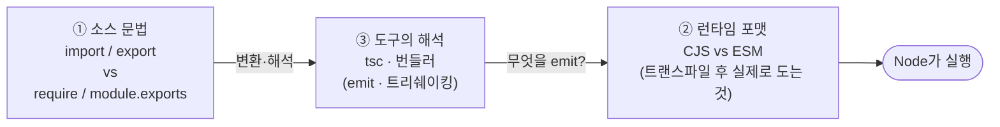

`require`로 잘 돌아가던 코드에 `import` 하나 끼워 넣었더니 `Cannot use import statement outside a module`이 터진다. `package.json`에 `"type": "module"`을 박았더니 이번엔 `__dirname is not defined`. 겨우 고쳤더니 TypeScript가 `TS1479`로 빨간 줄을 긋고, 정작 `bun build`는 멀쩡히 통과한다. 분명 같은 "모듈"인데 왜 도구마다 말이 다른가.

대부분의 혼란은 **서로 다른 세 가지를 하나로 뭉뚱그려서** 생긴다. 이 시리즈는 그 셋을 분리하는 데서 시작한다. 한 번 분리하고 나면, 위의 에러들이 각각 "어느 축에서 난 문제"인지 즉시 보이기 시작한다.

## 글을 관통하는 척추: 세 개의 축

1. **소스에 뭘 쓰는가** — `import`/`export` 문법인가, `require`/`module.exports`인가. 내가 손으로 타이핑하는 것.
2. **런타임에 뭐가 도는가** — 트랜스파일이 끝난 뒤 Node가 실제로 실행하는 포맷이 CJS인가 ESM인가. 소스가 ESM이어도 런타임은 CJS일 수 있다.
3. **도구가 어떻게 해석하는가** — TypeScript의 `module`/`moduleResolution`, 번들러의 자체 해석. 이건 ①을 ②로 바꾸는 변환기일 뿐, Node가 런타임에 하는 일과 별개다.

핵심 문장 하나만 가져가자.

> **"TS에서 ESM을 쓴다"와 "Node에서 ESM이 돈다"는 다른 얘기다.**

각 편에서 "지금 우리는 어느 축을 얘기하는 중인가"를 계속 짚을 것이다. 이 프레임만 잡혀 있으면 나머지는 디테일이다.

<Callout type="note" title="🔍 이 박스에 대하여">
🔍 표시가 붙은 `더 깊이` 박스는 **초보용으로 한정하면 놓치는** 심화 내용이다. 본문만 따라가도 "코드를 돌리는 데 필요한 것"은 완결된다. 중·고급 독자는 이 박스만 골라 읽어도 된다. 처음 보는 거라면 박스는 건너뛰고 본문 흐름만 따라가길 권한다.
</Callout>

## 전체 목차

### 1부 — 기초: 모듈이라는 발명

1. [왜 모듈이 필요한가](/docs/dev/nodejs/module/1.why-modules) — 전역 오염의 시대와 CJS·ESM의 기본 문법
2. [둘의 진짜 차이](/docs/dev/nodejs/module/2.cjs-vs-esm) — 동기/비동기, 정적/동적, live binding, 순환 참조

### 2부 — 중급: 해석과 경계

3. [모듈 해석과 package.json](/docs/dev/nodejs/module/3.resolution-package-json) — Node가 파일을 찾는 법, `exports` 필드, dual package 함정
4. [ESM에만 있는 것 / 사라진 것](/docs/dev/nodejs/module/4.esm-only-features) — top-level await, `import.meta`, import attributes

### 3부 — 고급: 충돌 지점

5. [상호운용 (interop)](/docs/dev/nodejs/module/5.interop) — ESM↔CJS, `require(esm)`, 트랜스파일러가 만드는 가짜 interop
6. [도구 레이어](/docs/dev/nodejs/module/6.tooling-layer) — TS의 `module`/`moduleResolution`과 번들러가 런타임과 헷갈리는 이유

### 4부 — 실전: 문제 해결

7. [디버깅 치트시트](/docs/dev/nodejs/module/7.debugging-cheatsheet) — 에러 메시지 → 어느 축 → 한 줄 처방
8. [마이그레이션 의사결정](/docs/dev/nodejs/module/8.migration) — 무엇을 ship하는지 읽는 법, 의사결정 트리, ESM-only 사례
9. [케이스 스터디 — NestJS](/docs/dev/nodejs/module/9.nestjs-case-study) — 데코레이터가 모듈 포맷을 인질로 잡는 법, 그리고 `require(esm)`이 푼 빗장

---

준비됐으면 [1편: 왜 모듈이 필요한가](/docs/dev/nodejs/module/1.why-modules)부터 시작하자.
