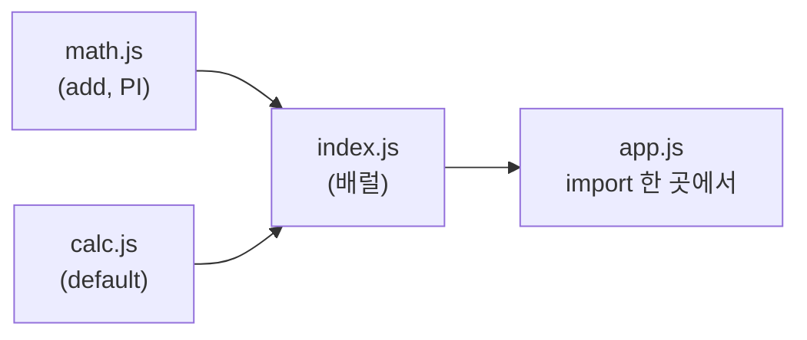

모듈이 *어떻게* 동작하는지 외우기 전에, 모듈이 *무슨 문제를 풀려고* 태어났는지부터 봐야 한다. 그래야 `require`와 `import`의 온갖 비대칭이 "왜 굳이 이렇게?"가 아니라 "아 그래서 이렇게 푸는구나"로 읽힌다. 이 시리즈의 [세 개의 축](/docs/dev/nodejs/module) 중 이번 편은 **① 소스 문법**과 **② 런타임 포맷**의 기초를 다룬다.

## 모듈 이전: 전역(global)이라는 공유지의 비극

옛날 브라우저 JavaScript에는 모듈이 없었다. 파일을 나눠도 모든 `<script>`는 **하나의 전역 스코프**를 공유했다.

```html
<script src="utils.js"></script>
<script src="app.js"></script>
```

```js
// utils.js
var formatDate = function (d) { /* ... */ };

// app.js
// formatDate가 그냥 보인다. import한 적도 없는데.
formatDate(new Date());
```

편해 보이지만 지뢰밭이다. 문제는 셋이다.

- **전역 스코프 오염** — `utils.js`와 다른 라이브러리가 똑같이 `formatDate`를 정의하면, 나중에 로드된 쪽이 앞을 덮어쓴다. 누가 누구를 깨뜨렸는지 아무도 모른다.
- **`<script>` 순서 의존** — `app.js`가 `utils.js`보다 먼저 로드되면 `formatDate is not defined`. 의존 관계가 코드가 아니라 **HTML의 줄 순서**에 숨어 있다.
- **의존성이 보이지 않음** — `app.js`만 봐서는 이게 무엇에 의존하는지 알 수 없다. 전역에 있겠거니 할 뿐이다.

당시 개발자들은 이걸 **IIFE(즉시 실행 함수)**로 틀어막았다. 함수 스코프로 감싸서 전역 노출을 딱 하나로 줄이는 패턴이다.

```js
var MyApp = (function () {
  // 이 안의 변수는 전역으로 새어 나가지 않는다
  var privateState = 0;
  function formatDate(d) { /* ... */ }

  // 내보낼 것만 객체로 노출
  return { formatDate: formatDate };
})();
```

지금 보면 `require`/`import`가 자동으로 해주는 일 — **스코프 격리**와 **명시적 export** — 을 손으로 한 것이다. 모듈 시스템은 결국 이 IIFE 패턴을 언어/런타임 차원에서 정식화한 것이라고 봐도 된다.

<Callout type="note" title="🔍 더 깊이: 그 시절의 모듈 표준들 — AMD와 UMD">
Node의 CommonJS가 서버에서 자리 잡는 동안, 브라우저에는 동기 `require`가 맞지 않았다(네트워크로 파일을 받아야 하니까). 그래서 비동기 로딩을 전제한 **AMD**(`define(deps, factory)`, RequireJS가 대표)가 나왔다. 라이브러리 저자 입장에선 "CJS도 AMD도 전역도 다 지원해야 하나" 싶었고, 그 셋을 한 파일에서 분기 처리하는 **UMD**(Universal Module Definition) 보일러플레이트가 유행했다. 지금도 오래된 라이브러리 빌드 결과물 맨 위에서 `typeof define === 'function' && define.amd` 같은 분기를 보게 되는데, 그게 UMD의 흔적이다. ESM이 표준 모듈을 언어에 박아 넣으면서 이 전쟁은 사실상 끝났지만, [5편 interop](/docs/dev/nodejs/module/5.interop)에서 "둘 다 지원하려는" 시도가 어떻게 부활하는지 보게 된다.
</Callout>

## CommonJS (CJS) — Node가 처음 택한 방식

Node.js는 서버 환경이라 파일을 디스크에서 동기로 읽을 수 있었고, 그래서 **CommonJS**를 채택했다. 핵심은 두 개의 마법 객체, `require`와 `module.exports`다.

```js
// math.js
function add(a, b) {
  return a + b;
}

module.exports = { add };
```

```js
// app.js
const { add } = require('./math.js');

console.log(add(1, 2)); // 3
```

`require('./math.js')`는 그 자리에서 즉시 `math.js`를 실행하고, `module.exports`에 담긴 값을 **반환하는 함수**다. 그냥 함수 호출이라는 점이 중요하다 — 조건문 안에서도, 함수 한복판에서도 부를 수 있다.

### `exports` vs `module.exports`의 함정

여기서 거의 모두가 한 번은 데인다. 모듈 안에는 사실 두 가지가 있다.

```js
// Node가 모듈을 감싸기 전, 대략 이런 상태로 시작한다
module.exports = {};
let exports = module.exports; // exports는 module.exports를 가리키는 "별명"일 뿐
```

`exports`는 `module.exports`를 가리키는 **참조(별명)**다. 그래서 **속성을 추가**하는 건 양쪽 다 통한다.

```js
exports.add = (a, b) => a + b;        // OK — module.exports.add 와 같음
module.exports.sub = (a, b) => a - b; // OK
```

그런데 `exports`에 **새 값을 통째로 재할당**하면, 별명이 다른 곳을 가리키게 될 뿐 `module.exports`는 그대로 `{}`다. **실제로 반환되는 건 `module.exports`** 이므로, 이 모듈은 빈 객체를 내보낸다.

```js
// 🚫 함정: 이렇게 하면 아무것도 export되지 않는다
exports = { add: (a, b) => a + b };

// ✅ 통째로 바꿀 땐 반드시 module.exports에
module.exports = { add: (a, b) => a + b };
```

규칙은 단순하다. **속성만 붙일 땐 `exports`도 되지만, 통째로 바꿀 땐 무조건 `module.exports`.** 헷갈리면 그냥 항상 `module.exports`만 쓰면 된다.

## ES Modules (ESM) — 언어 표준 모듈

2015년 ES2015(ES6)에서 JavaScript는 드디어 **언어 차원의 표준 모듈**을 갖게 됐다. 문법이 키워드(`import`/`export`)로 바뀐 게 핵심이다.

```js
// math.js
export function add(a, b) {
  return a + b;
}

export const PI = 3.14159;
```

```js
// app.js
import { add, PI } from './math.js';

console.log(add(1, 2)); // 3
```

### named export vs default export

ESM은 내보내는 방식이 두 가지다.

```js
// named export — 이름을 그대로 가져다 쓴다 (여러 개 가능)
export function add(a, b) { return a + b; }
export const PI = 3.14159;

// default export — 모듈당 하나, import 쪽에서 이름을 자유롭게 붙인다
export default function multiply(a, b) { return a * b; }
```

```js
import multiply, { add, PI } from './math.js';
//     ^^^^^^^^ default        ^^^^^^^^^ named
// default는 중괄호 없이, named는 중괄호 안에. 둘을 한 줄에 섞을 수도 있다.
```

named import는 **이름이 정확히 일치**해야 한다(`{ add }`). default는 import하는 쪽이 아무 이름이나 붙일 수 있다 — 단지 위치(중괄호 밖)로 식별된다.

### 재(re)export — 배럴 파일의 기초

여러 모듈을 한 입구로 모아 다시 내보낼 수 있다. 흔히 말하는 "배럴(barrel) 파일"이다.

```js
// index.js — 여러 모듈을 한 곳에서 다시 내보낸다
export * from './math.js';        // math의 모든 named export를 그대로 통과
export { add } from './math.js';  // 골라서 통과
export { default as Calc } from './calc.js'; // default를 named로 이름 붙여 통과
```



<Callout type="warning" title="배럴 파일은 공짜가 아니다">
`export *`로 모든 걸 모으는 배럴 파일은 편하지만, 번들러가 트리쉐이킹으로 안 쓰는 코드를 걷어내기 어렵게 만들고, 큰 프로젝트에서는 불필요한 모듈까지 줄줄이 로드해 빌드·시작 시간을 늘릴 수 있다. ESM의 정적 구조 덕에 트리쉐이킹이 *가능은* 하지만, 배럴이 깊게 중첩되면 그 이점이 깎인다. 이유는 [2편의 정적/동적 구조](/docs/dev/nodejs/module/2.cjs-vs-esm)에서 다룬다.
</Callout>

## 한눈 정리

| | CommonJS (CJS) | ES Modules (ESM) |
|---|---|---|
| 가져오기 | `const x = require('...')` | `import x from '...'` |
| 내보내기 | `module.exports = ...` | `export` / `export default` |
| 정체 | 즉시 실행되는 **함수** | 정적으로 분석되는 **키워드** |
| 등장 | Node 초창기 | ES2015 표준 |

여기까지는 "문법이 다르다" 수준이다. 진짜 흥미로운 — 그리고 실전 버그를 만드는 — 차이는 **이 둘이 동작하는 방식 자체가 다르다**는 데 있다. 동기냐 비동기냐, 정적이냐 동적이냐, 그리고 import한 값이 "복사본"이냐 "살아있는 참조"냐.

다음 편에서 그 차이를 파고든다.

→ [2편: 둘의 진짜 차이](/docs/dev/nodejs/module/2.cjs-vs-esm)
