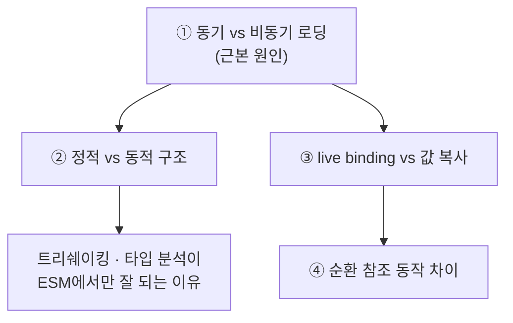
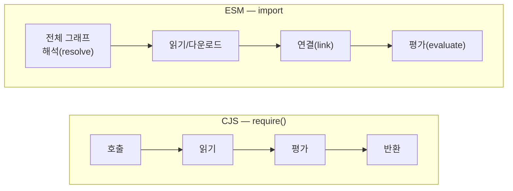
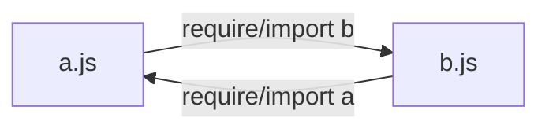

[1편](/docs/dev/nodejs/module/1.why-modules)에서 본 건 "문법이 다르다"였다. `require` 대신 `import`를 쓴다는 정도. 하지만 그건 표면이다. CJS와 ESM은 **동작 방식 자체가 다르고**, 실전에서 사람을 잡는 버그는 전부 거기서 나온다.

차이는 네 겹이다. 그리고 네 개가 따로 노는 게 아니라, **첫 번째 차이(동기 vs 비동기) 하나가 나머지 셋을 연쇄적으로 만들어낸다.** 이 인과의 사슬을 따라가는 게 이번 편의 목표다.



세 개의 축으로 보면, 이번 편은 전부 **② 런타임 포맷**의 이야기다. 소스 문법이 아니라 "런타임이 실제로 모듈을 어떻게 다루는가".

## ① 동기 vs 비동기 로딩 — 모든 비대칭의 뿌리

`require`는 **그 자리에서 즉시** 파일을 읽고, 평가하고, 결과를 반환한다. 동기다. 한 줄 안에서 전부 끝난다.

```js
const fs = require('fs');
// 이 줄이 끝나는 순간 fs는 완전히 로드되어 있다. 디스크 읽기든 평가든 다 끝났다.
console.log(typeof fs.readFile); // 'function'
```

ESM은 다르다. `import`는 모듈 **그래프 전체를 먼저 비동기로 해석(resolve)하고, 다운로드/읽기하고, 그다음 평가**한다. 단계가 나뉘어 있다.



ESM이 굳이 단계를 나눈 이유는 브라우저다. 브라우저는 파일을 디스크가 아니라 네트워크로 받아야 해서, "필요한 모듈을 다 받을 때까지 메인 스레드를 멈추는" 동기 방식이 애초에 불가능했다. 그래서 ESM은 **실행 전에 의존성 그래프를 통째로 파악**하고, 비동기로 다 받아온 뒤에야 평가한다.

이 한 가지 결정 — "실행 전에 그래프를 안다" — 이 나머지 차이 셋을 전부 만들어낸다.

## ② 정적 vs 동적 구조

ESM이 실행 전에 그래프를 파악할 수 있는 건, `import`/`export`가 **정적(static)**이기 때문이다. 코드를 실행하지 않고 텍스트만 분석해도 "이 모듈이 무엇을 가져오고 무엇을 내보내는지" 알 수 있다. 그래서 `import` 문에는 제약이 있다.

```js
// ✅ ESM import는 모듈 최상단에만, 정적인 문자열 경로로
import { add } from './math.js';

// 🚫 조건문 안에 둘 수 없다 — 정적 분석이 깨지므로
if (condition) {
  import { add } from './math.js'; // SyntaxError
}
```

`import` 선언은 코드 순서와 무관하게 **호이스팅**되어 그 파일에서 가장 먼저 처리된다. 반면 CJS의 `require`는 그냥 함수 호출이라 어디에나 둘 수 있다.

```js
// CJS — require는 실행 시점에 평가되는 평범한 함수
if (process.env.NODE_ENV === 'production') {
  const logger = require('./prod-logger'); // 완전히 합법
}

const name = 'math';
const mod = require(`./${name}.js`); // 경로를 런타임에 조립해도 됨
```

이 차이가 실무에 미치는 영향은 크다.

- **트리쉐이킹** — 번들러는 ESM의 정적 구조를 보고 "이 export는 아무도 안 쓰니 결과물에서 빼자"를 *코드를 실행하지 않고* 판단할 수 있다. CJS는 `module.exports`가 런타임에 무엇이 될지 실행 전엔 알 수 없어서, 안 쓰는 코드를 안전하게 걷어내기 어렵다.
- **타입 분석 / 자동완성** — 도구가 정적으로 export 목록을 알 수 있으니 IDE 자동완성과 타입 추론이 정확해진다.
- **명시적 의존성 그래프** — 빌드 타임에 의존 관계 전체가 그려진다.

<Callout type="note" title="🔍 더 깊이: 그럼 ESM에선 동적 로딩을 못 하나 — dynamic import">
정적 `import`만 있으면 "런타임에 경로를 정해 가져오기"가 불가능할 것 같지만, ESM에는 **동적 import**가 따로 있다.

```js
// 함수처럼 호출하고, Promise를 반환한다 (비동기!)
const name = 'math';
const mod = await import(`./${name}.js`);
mod.add(1, 2);
```

`import(...)`(괄호를 붙인 형태)는 정적 `import` 선언과 완전히 다른 물건이다. 함수처럼 호출되고, 조건문 안에도 들어가며, **`Promise`를 반환**한다. CJS의 동기 `require`와 달리 `await`가 필요한 이유는 ① 동기/비동기 차이 그대로다.

이 동적 import는 두 가지 실전 용도가 있다. (1) 코드 스플리팅 — 무거운 모듈을 실제로 필요할 때만 로드, (2) **CJS에서 ESM 모듈을 가져오는 유일한 길** — 이건 [5편 interop](/docs/dev/nodejs/module/5.interop)의 핵심 도구가 된다.
</Callout>

## ③ live binding vs 값 복사 — 대부분의 글이 빠뜨리는 핵심

여기가 진짜다. 대부분의 입문 글이 "import는 require랑 비슷한 거"라고 넘어가는데, 동작이 근본적으로 다르다.

**CJS의 `require`는 그 시점의 `module.exports`를 받는다. 사실상 스냅샷이다.** 특히 구조분해하면 그 순간의 값이 **복사**된다.

```js
// counter.js (CJS)
let count = 0;
function increment() { count += 1; }
module.exports = { count, increment };
```

```js
// app.js (CJS)
const { count, increment } = require('./counter.js');

console.log(count); // 0
increment();
console.log(count); // 0 ❗ — 여전히 0
```

`count`는 require 시점의 값 `0`을 복사해온 지역 변수다. `counter.js` 내부에서 `count`가 1로 바뀌어도, 내가 복사해온 `count`와는 아무 상관이 없다. 별개의 변수다.

**ESM의 import는 다르다. export된 변수에 대한 살아있는 참조(live binding)다.** export 쪽이 값을 재할당하면, import 쪽도 **바뀐 값을 본다.**

```js
// counter.js (ESM)
export let count = 0;
export function increment() { count += 1; }
```

```js
// app.js (ESM)
import { count, increment } from './counter.js';

console.log(count); // 0
increment();
console.log(count); // 1 ✅ — 바뀐 값이 보인다!
```

같은 코드, 같은 의도, 정반대 결과. ESM의 `count`는 값의 복사본이 아니라 `counter.js`의 `count`를 **들여다보는 창**이다.

<Callout type="warning" title="단, import한 binding은 읽기 전용이다">
live binding이라고 해서 import 쪽에서 그 값을 바꿀 수 있는 건 아니다. import한 이름에 재할당하면 에러다.

```js
import { count } from './counter.js';
count = 5; // ❌ TypeError: Assignment to constant variable
```

값을 바꾸는 건 **export한 모듈 자신만** 할 수 있다(위의 `increment`처럼). import 쪽은 변화를 *관찰*할 뿐 *변경*하지 못한다. 단방향 창문이다.
</Callout>

이 차이를 머릿속에 정확히 새겨두자. **CJS = 복사본(스냅샷), ESM = 살아있는 참조.** 다음 ④번은 이 한 줄에서 곧장 따라 나온다.

## ④ 순환 참조 — 같은 구조, 다른 운명

순환 참조(circular dependency)는 A가 B를 import하고 B가 다시 A를 import하는 상황이다. 설계상 피하는 게 맞지만, 큰 코드베이스에서는 의도치 않게 생긴다. 그리고 **CJS와 ESM이 이걸 다르게 처리한다.**



### CJS의 순환 참조 — "아직 안 채워진" 부분 export

CJS는 동기로 즉시 평가하므로, 순환이 생기면 **아직 실행이 끝나지 않은 모듈의 `module.exports`를 그 순간 상태 그대로** 돌려준다.

```js
// a.js (CJS)
console.log('a 시작');
exports.done = false;
const b = require('./b.js'); // 여기서 b.js로 넘어간다
console.log('a: b.done =', b.done);
exports.done = true;
console.log('a 끝');
```

```js
// b.js (CJS)
console.log('b 시작');
exports.done = false;
const a = require('./a.js'); // a.js는 아직 실행 중! 미완성 exports를 받는다
console.log('b: a.done =', a.done); // false — a가 아직 done=true에 도달 못 함
exports.done = true;
console.log('b 끝');
```

`node a.js` 실행 결과:

```text
a 시작
b 시작
b: a.done = false   ← a.js가 아직 exports.done = true에 도달하기 전이라 false
b 끝
a: b.done = true
a 끝
```

`b.js`가 받은 `a`는 **미완성 스냅샷**이다. `a.done`이 나중에 `true`가 되어도, `b`가 이미 복사해 본 값은 영원히 `false`다. CJS 순환 참조 버그의 전형이다 — "분명 export했는데 `undefined`/옛날 값이 온다."

### ESM의 순환 참조 — live binding이 구해준다

ESM은 평가 전에 그래프를 다 연결(link)해두고, **import는 live binding**이다. 그래서 평가 순서상 아직 값이 안 채워진 시점에 접근하면 위험하지만(TDZ), 일단 채워지고 나면 **나중 값을 본다.**

```js
// a.mjs (ESM)
import { bDone } from './b.mjs';
console.log('a: bDone =', bDone);
export let aDone = false;
aDone = true;
```

```js
// b.mjs (ESM)
import { aDone } from './a.mjs';
export let bDone = false;
bDone = true;
// aDone은 live binding이라, a.mjs가 나중에 aDone=true로 바꾸면 그 값이 보인다
export function checkA() { return aDone; }
```

차이의 핵심: CJS에서 `b`가 받은 `a.done`은 **그 시점에 박제된 복사본**이라 영원히 옛날 값이다. ESM에서 `b`가 참조하는 `aDone`은 **살아있는 창**이라, `a`의 평가가 끝나 `aDone = true`가 되면 (그 이후 `checkA()`를 호출하는 시점에) 최신 값을 본다.

<Callout type="note" title="🔍 더 깊이: ESM 순환이 'TDZ로 터지는' 경우">
ESM의 live binding이 만능은 아니다. **평가 순서상 아직 초기화되지 않은 binding에 접근하면** `ReferenceError: Cannot access 'x' before initialization`(Temporal Dead Zone)이 난다.

위 예제에서 `a.mjs`의 첫 줄 `console.log('a: bDone =', bDone)`은 위험하다. `a.mjs`를 먼저 평가하기 시작하면, `b.mjs`가 아직 평가되지 않아 `bDone`이 초기화 전일 수 있기 때문이다. 그래서 ESM 순환에서는 **모듈 최상단(top-level)에서 순환 상대의 값을 즉시 읽지 말고, 함수 안에서 늦게 접근**하는 게 안전하다. 함수는 호출 시점에 평가되니, 그때쯤이면 그래프 평가가 끝나 있다.

정리하면 — CJS 순환은 "조용히 틀린 값", ESM 순환은 "시끄럽게 터지거나(TDZ) 늦게 접근하면 올바른 값". 어느 쪽이든 순환 자체를 설계로 없애는 게 정답이지만, 디버깅할 때 이 차이를 알면 원인을 훨씬 빨리 짚는다.
</Callout>

## 네 겹을 한 장으로

| | CommonJS (CJS) | ES Modules (ESM) |
|---|---|---|
| ① 로딩 | 동기 — 그 자리에서 평가·반환 | 비동기 — 그래프 해석 → 평가 |
| ② 구조 | 동적 — 어디서나 `require`, 경로 런타임 조립 | 정적 — 최상단·고정 경로, 호이스팅 |
| ③ 바인딩 | 값 복사 (require 시점 스냅샷) | live binding (살아있는 참조, 읽기 전용) |
| ④ 순환 | 미완성 export의 박제된 복사본 | live binding으로 나중 값 관찰 (단 TDZ 주의) |
| 결과 | — | 트리쉐이킹·정적 분석이 ESM에서만 잘 됨 |

다음 편은 한 단계 아래로 내려간다. 지금까지는 "런타임이 모듈을 어떻게 다루는가"였다면, 다음은 **"Node가 애초에 그 모듈 파일을 어떻게 찾고, CJS인지 ESM인지 어떻게 판정하는가"** — 모듈 해석(resolution)과 `package.json`의 세계다.

→ [3편: 모듈 해석과 package.json](/docs/dev/nodejs/module/3.resolution-package-json)
