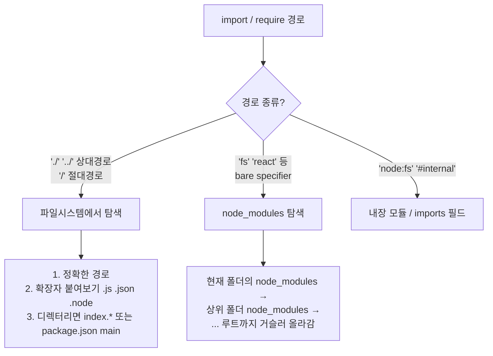
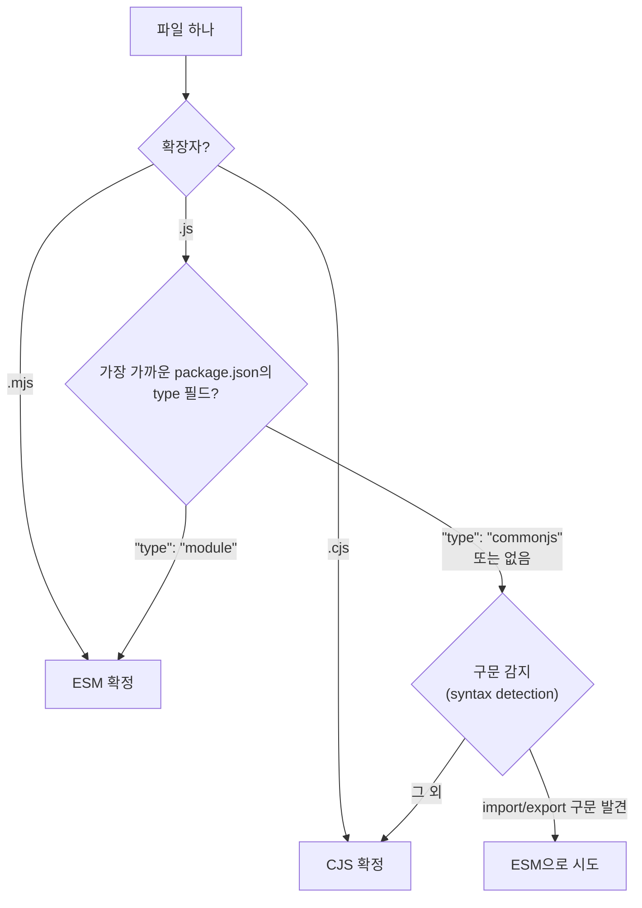
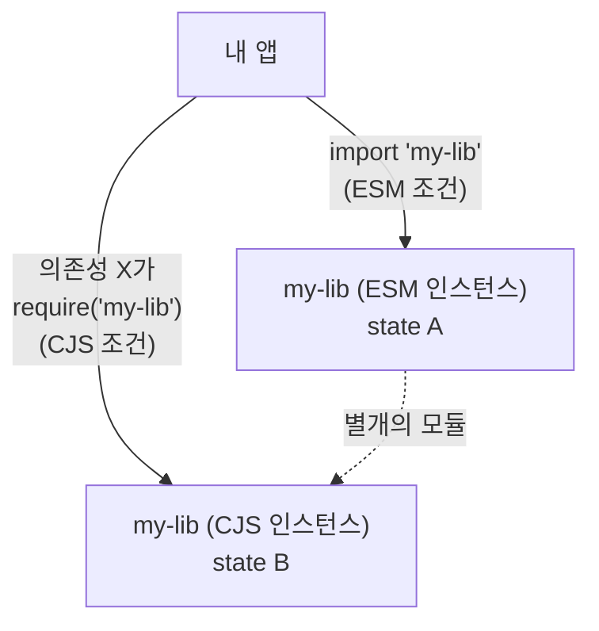

[2편](/docs/dev/nodejs/module/2.cjs-vs-esm)까지는 "런타임이 모듈을 어떻게 다루는가"였다. 이번 편은 한 단계 앞으로 간다 — **Node가 애초에 그 모듈 파일을 어떻게 찾고(resolution), 찾은 파일을 CJS로 읽을지 ESM으로 읽을지 무엇을 보고 판정하는가.** 세 축 중에서는 **② 런타임 포맷**의 결정 과정이다.

거의 모든 "왜 내 import가 안 되지" 부류의 버그가 이 두 가지 — **해석**과 **판정** — 중 하나에서 난다.

## Node는 모듈을 어떻게 찾는가 (resolution)

`require('./utils')` 또는 `import './utils'`를 만나면 Node는 정해진 순서로 실제 파일을 찾아 나선다. 경로 종류에 따라 갈린다.



### 상대 경로 — 확장자와 index

`require('./utils')`처럼 확장자를 생략하면, CJS는 친절하게 추론해준다.

1. `./utils`가 그대로 파일인가?
2. 아니면 `./utils.js`, `./utils.json`, `./utils.node` 순으로 붙여본다.
3. 그래도 없으면 `./utils`를 **디렉터리**로 보고, 그 안의 `index.js`(또는 `package.json`의 `main`)를 찾는다.

이 "알아서 확장자 붙여주기"가 CJS의 편의 기능이었는데, **ESM에서는 사라진다.** ESM은 확장자를 명시해야 한다(`import './utils.js'`). 이유는 [6편 도구 레이어](/docs/dev/nodejs/module/6.tooling-layer)에서 `nodenext`와 함께 다룬다 — 지금은 "ESM은 확장자를 직접 써야 한다"만 기억하면 된다.

### bare specifier — node_modules 거슬러 오르기

`require('react')`처럼 `./`도 `/`도 아닌 이름을 **bare specifier**라 한다. Node는 현재 파일이 있는 폴더의 `node_modules`를 먼저 보고, 없으면 한 단계 위 폴더의 `node_modules`, 또 없으면 그 위… 루트에 닿을 때까지 거슬러 올라간다. 이 탐색 끝에 패키지를 찾으면, 그 패키지의 `package.json`을 열어 **"이 패키지의 진입점은 어디인가"** 를 읽는다. 그게 다음 주제다.

<Callout type="note" title="🔍 더 깊이: node: 접두사와 # imports 필드">
두 가지 특수 경로가 있다.

- **`node:` 접두사** — `import fs from 'node:fs'`처럼 내장 모듈임을 명시한다. 그냥 `'fs'`도 되지만, `node:`를 붙이면 "이건 node_modules의 어떤 패키지가 아니라 확실히 내장 모듈"임이 분명해지고, 같은 이름의 npm 패키지와 헷갈릴 여지가 없다. 최신 코드베이스가 `node:` 접두사를 선호하는 이유다.
- **`#` 접두사 (subpath imports)** — `package.json`의 `imports` 필드로 **패키지 내부 전용 별칭**을 정의한다. `import db from '#db'` 같은 식으로, 상대 경로 `../../../lib/db.js` 지옥을 피하면서도 외부에는 노출되지 않는 내부 경로를 만든다. `exports`(외부 공개용)의 대칭 짝이다.
</Callout>

## CJS냐 ESM냐 — Node의 판정 규칙

파일을 찾았다. 이제 핵심 질문 — **Node는 이 파일을 CJS로 파싱할까, ESM으로 파싱할까?** 같은 `.js` 파일이라도 둘 중 하나로 해석되고, 그에 따라 [2편의 모든 동작 차이](/docs/dev/nodejs/module/2.cjs-vs-esm)가 갈린다. 판정은 우선순위가 있는 규칙들로 이뤄진다.



규칙은 위에서부터 순서대로 적용된다.

1. **확장자가 명시적이면 그걸로 끝.** `.mjs`는 무조건 ESM, `.cjs`는 무조건 CJS. 헷갈릴 일이 없어서 가장 확실한 방법이다.
2. **`.js`는 `package.json`의 `type` 필드를 본다.** 그 파일에서 위로 올라가며 만나는 가장 가까운 `package.json`의 `type`이 `"module"`이면 ESM, `"commonjs"`이거나 아예 없으면 CJS가 **기본값**이다. 그래서 프로젝트 루트 `package.json`에 `"type": "module"` 한 줄을 넣으면 **그 아래 모든 `.js`가 ESM으로 바뀐다** — 이게 [7편 디버깅](/docs/dev/nodejs/module/7.debugging-cheatsheet)에 나올 사고의 단골 원인이다.
3. **구문 감지(syntax detection).** 비교적 최신 Node(22.7+에서 기본 활성, 23+에서 안정)는 `type`이 명시되지 않은 `.js`/확장자 없는 입력에서 `import`/`export` 구문이 보이면 ESM으로 파싱을 시도한다. 다만 이건 안전망이지 **의존하면 안 되는 기능**이다 — 명시적인 `type`이나 확장자가 항상 우선이고 더 빠르다.

<Callout type="warning" title="실무 규칙: 모호함을 남기지 마라">
판정 규칙이 여러 겹이라는 건, 뒤집어 말하면 **명시하지 않으면 Node가 추측한다**는 뜻이다. 추측이 틀리면 `SyntaxError`나 [`ERR_REQUIRE_ESM`](/docs/dev/nodejs/module/7.debugging-cheatsheet)으로 터진다. 그래서 실무 규칙은 하나다 — **`package.json`에 `type`을 명시하고, 예외 파일은 `.mjs`/`.cjs` 확장자로 못 박아라.** 구문 감지에 기대지 말 것. 라이브러리라면 더더욱, 소비자의 Node 버전을 통제할 수 없으니 명시가 필수다.
</Callout>

## package.json 진입점 — main, module, exports

bare specifier로 패키지를 찾았을 때, Node는 그 패키지의 `package.json`에서 "진입점"을 읽는다. 진입점을 선언하는 필드가 셋 있고, 역사적 순서로 등장했다.

```json
{
  "name": "my-lib",
  "type": "module",
  "main": "./dist/index.cjs",
  "module": "./dist/index.mjs",
  "exports": {
    ".": {
      "import": "./dist/index.mjs",
      "require": "./dist/index.cjs",
      "default": "./dist/index.cjs"
    }
  }
}
```

- **`main`** — 가장 오래된 필드. "이 패키지의 기본 진입 파일." CJS 시절부터 있었다.
- **`module`** — 번들러들이 만든 비공식 관례. "ESM 버전 진입점은 여기." **Node는 `module` 필드를 보지 않는다** — 오직 번들러(webpack/Rollup 등)만 참고한다. 이게 [6편의 도구 레이어](/docs/dev/nodejs/module/6.tooling-layer)와 런타임이 갈라지는 지점 중 하나다.
- **`exports`** — 현대적 표준. `main`/`module`을 대체하며, **조건별로 다른 파일을 내보낼 수 있고**, 동시에 **공개 범위를 제한**한다. 아래에서 자세히 본다.

`exports`가 있으면 Node는 `main`보다 `exports`를 **우선**한다.

### 🔍 conditional exports — "ESM이면 이 파일, CJS면 저 파일"

`exports` 필드의 진짜 힘은 **조건부 내보내기(conditional exports)** 다. 같은 패키지를 가져오는 쪽이 ESM인지 CJS인지에 따라 **다른 파일을 돌려줄 수 있다.**

```json
{
  "exports": {
    ".": {
      "import": "./dist/index.mjs",
      "require": "./dist/index.cjs",
      "types": "./dist/index.d.ts",
      "default": "./dist/index.cjs"
    },
    "./utils": {
      "import": "./dist/utils.mjs",
      "require": "./dist/utils.cjs"
    }
  }
}
```

- `import` 조건 — `import`로 가져오면 이 파일. (ESM)
- `require` 조건 — `require`로 가져오면 이 파일. (CJS)
- `types` 조건 — TypeScript가 타입 정의를 찾을 때. (조건 순서상 보통 맨 위에 둔다)
- `default` 조건 — 어느 것에도 안 걸리면 폴백. **항상 마지막**에 둬야 한다(위에서부터 매칭하므로).

이렇게 라이브러리 저자는 "이 패키지를 ESM으로 가져오면 `.mjs`를, CJS로 가져오면 `.cjs`를 주겠다"를 한 파일에 선언한다. 이게 한 패키지가 두 세계를 동시에 지원하는 **dual package**의 기반이다(바로 다음 절).

<Callout type="warning" title="exports는 deep import를 '막는다' — 초보가 자주 막히는 지점">
`exports` 필드의 또 다른 효과는 **캡슐화**다. `exports`에 명시되지 않은 내부 경로는 **밖에서 가져올 수 없게 차단된다.**

```js
// 패키지가 exports에 "./utils"만 공개했다면:
import x from 'my-lib/utils';            // ✅ 허용
import y from 'my-lib/dist/internal.js'; // ❌ ERR_PACKAGE_PATH_NOT_EXPORTED
```

예전엔 `node_modules/my-lib/` 안의 아무 파일이나 직접 deep import할 수 있었다. `exports`가 생긴 뒤로는 저자가 공개한 경로만 접근 가능하다. "분명 그 파일이 패키지 안에 있는데 import가 안 된다"면 십중팔구 이것이다 — 패키지가 `exports`로 막아둔 것이다. 해결은 (1) 패키지가 공개한 정식 경로를 쓰거나, (2) 정말 필요하면 패키지에 이슈를 올려 export 추가를 요청하는 것이지, 내부 경로를 우회로 뚫는 게 아니다.
</Callout>

## 🔍 dual package hazard — 같은 패키지가 둘로 쪼개질 때

`exports`의 conditional로 CJS와 ESM 둘 다 ship하는 패키지를 **dual package**라 한다. 편리하지만 고약한 함정이 있다. **한 프로세스 안에서 같은 패키지가 CJS 인스턴스와 ESM 인스턴스로 동시에 로드될 수 있다.**



내 앱은 `my-lib`을 `import`(ESM)하는데, 내 의존성 중 하나는 같은 `my-lib`을 `require`(CJS)하면, Node 입장에선 **서로 다른 두 파일(`.mjs`와 `.cjs`)을 로드한 것**이라 **별개의 모듈 인스턴스 두 개**가 메모리에 생긴다. 결과는:

- **싱글톤이 깨진다** — 모듈 레벨 상태(설정, 캐시, 등록부)가 두 벌이 된다. 한쪽에 등록한 게 다른 쪽엔 없다.
- **`instanceof`가 깨진다** — ESM 인스턴스가 만든 클래스와 CJS 인스턴스의 클래스는 **다른 함수 객체**라, `x instanceof SomeClass`가 `false`가 된다. "분명 그 타입인데 instanceof가 false"라는 미스터리 버그의 정체다.
- **상태 공유 실패** — 두 인스턴스가 같은 전역 상태를 공유한다고 가정한 코드가 조용히 틀린다.

이 위험 때문에 **라이브러리 저자들이 점점 CJS를 버리고 ESM-only로 가는 것**이다. dual을 유지하는 비용과 위험보다, "우리는 ESM 하나만 ship한다"가 깔끔하기 때문이다. [8편의 ESM-only 사례](/docs/dev/nodejs/module/8.migration)와 [9편 NestJS](/docs/dev/nodejs/module/9.nestjs-case-study)가 정확히 이 동기에서 나온 결정들이다.

<Callout type="note" title="🔍 더 깊이: dual package hazard를 피하는 패턴">
dual을 꼭 해야 한다면, 위험을 줄이는 정석은 **"상태를 가진 코드를 한 포맷에만 두고, 다른 포맷은 얇은 래퍼로 그쪽을 재export"** 하는 것이다. 예를 들어 실제 구현·상태는 ESM(`.mjs`)에 두고, CJS 진입점(`.cjs`)은 내부에서 그 ESM을 동적 import해 다시 내보내기만 한다. 그러면 인스턴스가 하나로 유지된다.

다만 [5편에서 볼](/docs/dev/nodejs/module/5.interop) `require(esm)`이 안정화되면서, "굳이 dual로 만들지 말고 ESM 하나만 내보내라"는 쪽이 점점 정답이 되고 있다. CJS 사용자도 이제 `require`로 그 ESM을 그대로 불러올 수 있기 때문이다. dual package hazard는 그 자체로 "ESM-only로 가야 하는 이유" 목록의 상단에 있다.
</Callout>

## 한눈 정리

| 질문 | 보는 곳 |
|---|---|
| 상대 경로 파일 찾기 | 정확한 경로 → 확장자 → 디렉터리 index/main (ESM은 확장자 필수) |
| bare specifier 찾기 | node_modules를 루트까지 거슬러 올라감 |
| CJS냐 ESM이냐 | `.mjs`/`.cjs` → `package.json` `type` → 구문 감지 |
| 패키지 진입점 | `exports`(우선) → `main`. `module`은 번들러만 봄 |
| 포맷별 다른 파일 | `exports`의 conditional (`import`/`require`/`types`/`default`) |
| deep import 차단 | `exports`에 없는 경로는 `ERR_PACKAGE_PATH_NOT_EXPORTED` |

다음 편은 ESM만의 영토로 들어간다. CJS에는 없고 ESM에만 생긴 것(top-level await, `import.meta`), 그리고 ESM으로 오면서 사라진 것(`__dirname`, `require`)을 정리한다.

→ [4편: ESM에만 있는 것 / 사라진 것](/docs/dev/nodejs/module/4.esm-only-features)
