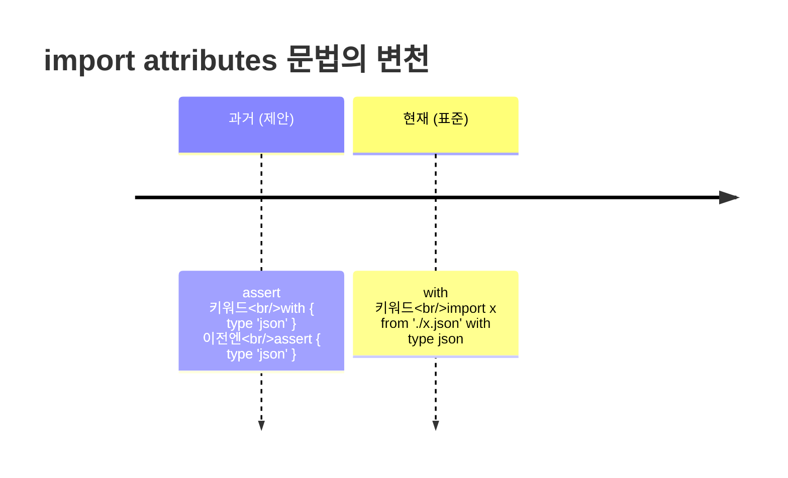

[3편](/docs/dev/nodejs/module/3.resolution-package-json)에서 Node가 파일을 ESM으로 판정하는 규칙을 봤다. 그렇게 ESM으로 들어서면, **CJS에는 없던 능력이 생기고 당연하던 것들이 사라진다.** 이번 편은 그 교환의 목록이다.

이 차이들도 뿌리는 [2편의 ① 동기 vs 비동기](/docs/dev/nodejs/module/2.cjs-vs-esm)다. ESM이 모듈을 비동기로 평가하기 때문에 생긴 것(top-level await)이 있고, ESM이 "함수로 감싼 스코프"가 아니기 때문에 사라진 것(`__dirname`)이 있다.

## ESM에 생긴 것 ①: top-level await

CJS에서 `await`는 `async` 함수 안에서만 쓸 수 있었다. 모듈 최상단에서 바로 `await`를 쓰면 문법 에러다. ESM은 다르다 — **모듈 최상단에서 바로 `await`를 쓸 수 있다.** 이걸 top-level await(TLA)라 한다.

```js
// data.mjs (ESM) — async 함수로 감쌀 필요 없이 최상단에서 바로
const res = await fetch('https://api.example.com/config');
export const config = await res.json();
```

이게 가능한 이유가 정확히 [2편의 비동기 평가](/docs/dev/nodejs/module/2.cjs-vs-esm)다. ESM은 모듈을 비동기로 평가하므로, 모듈 자체가 "완료될 때까지 기다릴 수 있는 것(awaitable)"이 된다. 이 모듈을 import하는 쪽은 `config`가 준비될 때까지 자동으로 기다린다.

CJS는 동기 평가라 이게 원천적으로 불가능하다. `require`는 그 자리에서 즉시 값을 돌려줘야 하는데, "비동기로 기다린 결과"를 동기로 돌려줄 방법이 없기 때문이다.

<Callout type="warning" title="top-level await는 공짜가 아니다 — 그리고 require(esm)의 분기점이다">
TLA는 강력하지만 대가가 있다. **TLA를 쓰는 모듈은 그것을 import하는 모든 모듈의 평가를 지연시킨다.** 그래서 애플리케이션 초기화 경로에 무거운 TLA를 두면 시작이 느려질 수 있다.

더 중요한 건 [5편](/docs/dev/nodejs/module/5.interop)에서 다룰 결정적 영향이다 — **TLA가 들어있는 ESM은 `require(esm)`으로 불러올 수 없다.** Node 22+의 `require(esm)`은 동기 require가 동기적으로 완료 가능한 ESM만 받는데, TLA가 있으면 그 모듈은 본질적으로 비동기라 `ERR_REQUIRE_ASYNC_MODULE`로 거부된다. 즉 **TLA 하나가 "이 모듈은 CJS에서 require로 못 가져온다"를 결정**한다. 라이브러리 진입점에 TLA를 둘지 말지는 그래서 신중해야 한다.
</Callout>

## ESM에 사라진 것: __dirname, __filename, require

CJS 모듈에는 Node가 자동으로 넣어주는 변수들이 있었다. 사실 CJS 모듈은 Node가 보이지 않게 함수로 감싸서 실행하는데, 그 함수의 인자로 이것들이 주어졌다.

```js
// CJS — 이 다섯은 그냥 어디서나 쓸 수 있었다
console.log(__dirname);   // 이 파일이 있는 디렉터리 절대경로
console.log(__filename);  // 이 파일의 절대경로
require('./x');           // 동기 로드
module.exports = ...;     // 내보내기
exports;                  // module.exports의 별명
```

**ESM에는 이 다섯이 전부 없다.** ESM은 함수로 감싸지 않고 표준 모듈로 직접 평가되므로, 그 함수 인자였던 `__dirname`/`__filename`/`require`/`module`/`exports`가 존재하지 않는다. ESM에서 `__dirname`을 쓰면 `__dirname is not defined`다 — [7편 디버깅](/docs/dev/nodejs/module/7.debugging-cheatsheet)의 단골 손님이다.

대체재는 `import.meta`다.

## ESM에 생긴 것 ②: import.meta

`import.meta`는 ESM에만 있는 객체로, "현재 모듈에 대한 메타정보"를 담는다. 가장 많이 쓰는 건 `import.meta.url` — 현재 모듈의 URL(파일이면 `file://...`)이다.

```js
// 사라진 __dirname/__filename을 import.meta.url로 복원하는 고전 패턴
import { fileURLToPath } from 'node:url';
import { dirname } from 'node:path';

const __filename = fileURLToPath(import.meta.url);
const __dirname = dirname(__filename);
```

이 보일러플레이트가 오래 ESM의 통과의례였다. 하지만 **최신 Node에서는 훨씬 짧아졌다.** Node 20.11/21.2부터 `import.meta`에 직접 들어왔다.

```js
// 최신 Node — 보일러플레이트 없이 바로
console.log(import.meta.dirname);   // __dirname 대체
console.log(import.meta.filename);  // __filename 대체
```

| CJS | ESM (구) | ESM (최신, Node 20.11+) |
|---|---|---|
| `__dirname` | `dirname(fileURLToPath(import.meta.url))` | `import.meta.dirname` |
| `__filename` | `fileURLToPath(import.meta.url)` | `import.meta.filename` |
| `require()` | `import` / 동적 `import()` | (동일) |

<Callout type="note" title="🔍 더 깊이: ESM에서 require가 필요하면 — createRequire">
드물게 ESM 안에서 CJS식 `require`가 꼭 필요할 때가 있다(예: `require.resolve`로 패키지 경로만 알아내거나, CJS 전용 API를 쓸 때). `node:module`의 `createRequire`로 만들 수 있다.

```js
import { createRequire } from 'node:module';
const require = createRequire(import.meta.url);

const pkg = require('./package.json'); // CJS식 require 부활
```

`createRequire(import.meta.url)`은 "이 위치 기준으로 동작하는 require 함수"를 돌려준다. 다만 이건 탈출구지 일상 도구가 아니다 — ESM에서는 가능하면 `import`(JSON은 아래의 import attributes)를 쓰고, `createRequire`는 CJS 생태계와 다리를 놓아야 할 때만 꺼낸다.
</Callout>

## 🔍 import.meta.resolve — 경로를 미리 알아내기

`import.meta.resolve(specifier)`는 모듈을 **실제로 로드하지 않고** 그 모듈이 해석될 URL만 돌려준다. CJS의 `require.resolve`에 대응하는 ESM판이다.

```js
// 'lodash'가 실제로 어느 파일로 해석되는지, 로드는 안 하고 경로만
const url = import.meta.resolve('lodash');
console.log(url); // 'file:///.../node_modules/lodash/lodash.js'
```

[3편의 해석 규칙](/docs/dev/nodejs/module/3.resolution-package-json)을 코드에서 직접 질의하는 창구다. 플러그인 로더나 빌드 도구가 "이 패키지가 어디 있는지"를 알아낼 때 쓴다. (한동안 실험적·비동기였다가 최신 Node에서 동기 함수로 안정화됐다.)

## 🔍 JSON/wasm import와 import attributes

ESM에서 JS가 아닌 것 — JSON, wasm — 을 import하는 건 별도의 문법을 요구한다. 그냥 `import data from './data.json'`은 보안·명확성 이유로 그대로 허용되지 않고, **import attributes**로 "이건 JSON이다"를 명시해야 한다.

```js
// import attributes — with 절로 모듈 타입을 명시
import config from './config.json' with { type: 'json' };

// 동적 import에서도
const data = await import('./data.json', { with: { type: 'json' } });
```



<Callout type="warning" title="assert는 죽었다 — with를 쓸 것">
초기 제안은 `assert { type: 'json' }`(import assertions)였고 한동안 그 문법으로 퍼졌다. 하지만 TC39가 방향을 틀어 **`with` 키워드(import attributes)로 표준화**했고, `assert` 문법은 폐기 수순이다. 오래된 블로그·코드에서 `assert`를 보더라도 새 코드에는 **`with { type: 'json' }`** 를 쓴다. 런타임 버전에 따라 둘 중 하나만 지원할 수 있으니, 대상 Node 버전을 확인할 것.

wasm import(`with { type: 'webassembly' }` 류)는 더 실험적이라 환경별 지원 편차가 크다. JSON import는 비교적 널리 안정화됐지만, 역시 대상 런타임에서 지원되는지 확인하고 쓰는 게 안전하다.
</Callout>

## 한눈 정리

| | CJS | ESM |
|---|---|---|
| top-level await | ❌ (async 함수 안에서만) | ✅ (단 require(esm) 불가 유발) |
| `__dirname`/`__filename` | ✅ 내장 | ❌ → `import.meta.dirname`/`filename` |
| `require` | ✅ 내장 | ❌ → `import` / `createRequire` |
| `import.meta` | ❌ | ✅ (`url`/`dirname`/`filename`/`resolve`) |
| JSON 가져오기 | `require('./x.json')` | `import x from './x.json' with { type: 'json' }` |

생긴 것과 사라진 것을 정리했으니, 이제 둘이 만나는 경계로 간다. **ESM과 CJS가 서로를 가져올 때** 무슨 일이 벌어지는가 — 이 시리즈에서 실무 충돌이 가장 잦은 영역, interop이다.

→ [5편: 상호운용 (interop)](/docs/dev/nodejs/module/5.interop)
