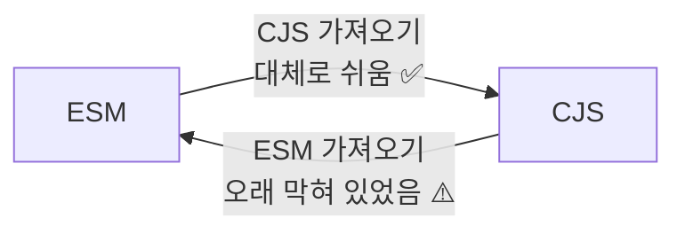
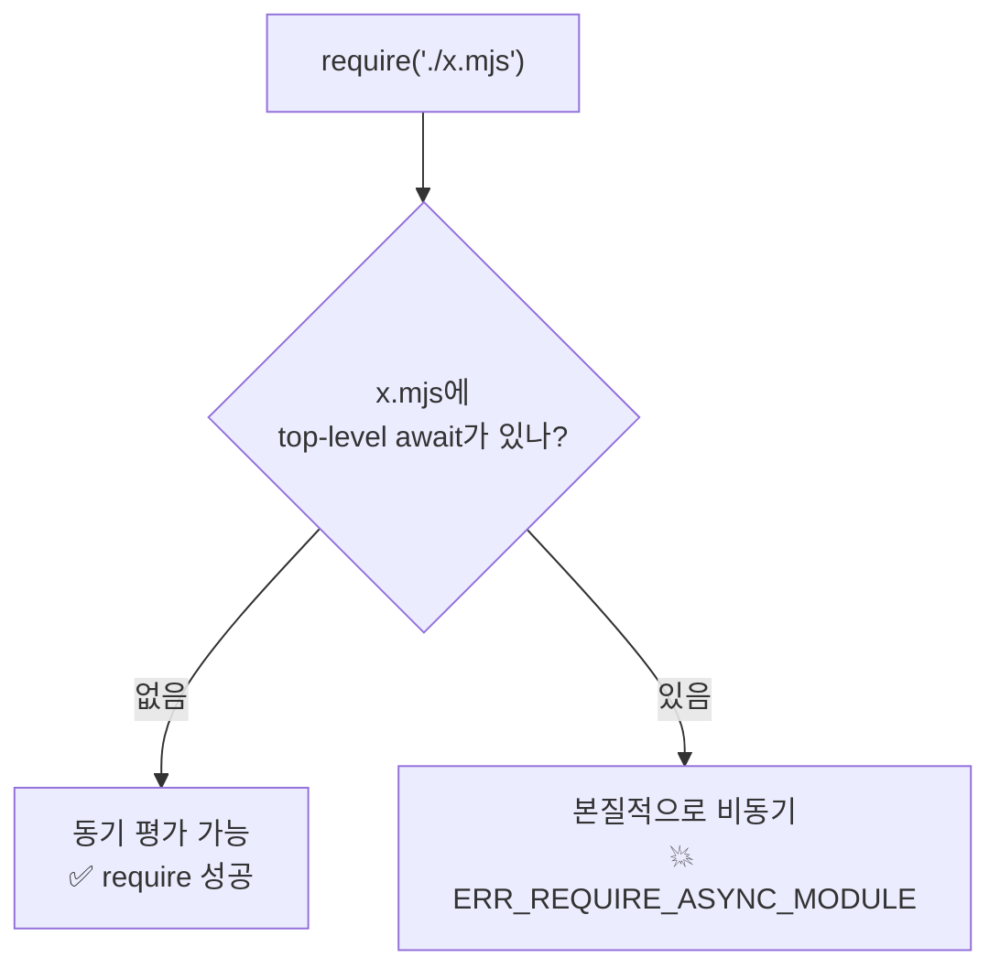
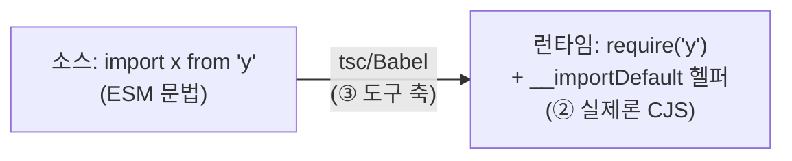

여기가 이 시리즈의 클라이맥스다. 실무에서 모듈 때문에 욕이 나오는 순간의 9할은 이 한 영역 — **ESM과 CJS가 서로를 가져올 때** — 에서 나온다. 그리고 그 어려움은 전부 [2편의 ① 동기 vs 비동기](/docs/dev/nodejs/module/2.cjs-vs-esm) 한 줄로 환원된다.

방향이 두 개다. 그리고 **두 방향의 난이도가 완전히 비대칭**이다.



## 방향 ①: ESM → CJS (대체로 쉬움)

ESM이 CJS를 가져오는 건 잘 된다. CJS는 동기로 즉시 평가 가능하고, ESM은 그 결과를 기다릴 수 있기 때문이다. **CJS 모듈의 `module.exports` 전체가 ESM에서 default import로 들어온다.**

```js
// legacy.cjs (CJS)
module.exports = { add: (a, b) => a + b, PI: 3.14 };
```

```js
// app.mjs (ESM)
import legacy from './legacy.cjs';   // module.exports 전체 = default
console.log(legacy.add(1, 2)); // 3
```

규칙 하나만 외우면 된다 — **CJS의 `module.exports`는 ESM 쪽에서 `default`가 된다.**

### 🔍 그런데 named import도 된다 — cjs-module-lexer의 마법

흥미로운 건 이것도 흔히 된다는 점이다.

```js
// app.mjs — CJS인데 named import가 먹는다?!
import { add, PI } from './legacy.cjs';
```

CJS에는 ESM 같은 정적 named export가 없다. `module.exports = {...}`는 런타임에 만들어지는 평범한 객체일 뿐이다. 그런데 어떻게 Node가 `add`, `PI`를 named로 꺼내줄까?

답은 **cjs-module-lexer**다. Node는 CJS 파일을 ESM에서 가져올 때, 이 작은 정적 분석기로 소스를 훑어 **`module.exports`에 어떤 이름이 붙는지 정적으로 "추정"** 한다. `exports.add = ...`, `module.exports = { add, PI }` 같은 흔한 패턴을 인식해서, 그 이름들을 named export처럼 노출해준다.

<Callout type="warning" title="정적 추정이라 — 동적으로 만든 export는 놓친다">
cjs-module-lexer는 코드를 **실행하지 않고** 텍스트 패턴만 본다. 그래서 **런타임에 동적으로 만들어지는 export는 추정에 실패한다.**

```js
// dynamic.cjs — 이름을 런타임에 조립
const names = ['add', 'sub'];
names.forEach((n) => {
  module.exports[n] = (a, b) => (n === 'add' ? a + b : a - b);
});
```

```js
// app.mjs
import { add } from './dynamic.cjs'; // ❌ SyntaxError: add를 정적으로 못 찾음
import pkg from './dynamic.cjs';     // ✅ default로는 됨
pkg.add(1, 2);                       //    그래서 default로 받아 꺼내 쓴다
```

규칙: **named import가 CJS에서 깨지면, default로 받아서 속성을 꺼내라.** 라이브러리가 export를 동적으로 만들면 lexer가 못 보기 때문이다. 이게 "타입은 named로 import되는데 런타임에 `undefined`"인 미스터리의 한 원인이다(트랜스파일러까지 끼면 더 복잡해진다 — 아래 가짜 interop 참조).
</Callout>

## 방향 ②: CJS → ESM (오래 막혀 있던 방향)

반대 방향이 진짜 문제였다. **CJS에서 ESM을 동기 `require`로 가져오는 건 원칙적으로 불가능**했다.

```js
// app.cjs (CJS)
const esm = require('./modern.mjs'); // ❌ ERR_REQUIRE_ESM
```

이유는 [2편](/docs/dev/nodejs/module/2.cjs-vs-esm) 그대로다. `require`는 **동기**다 — 그 자리에서 값을 즉시 돌려줘야 한다. 그런데 ESM은 **비동기로 그래프를 해석·평가**한다. 동기 함수가 비동기 작업의 완료를 기다릴 방법이 없으니, Node는 차라리 `ERR_REQUIRE_ESM`으로 막았다.

오랜 회피책은 [2편에서 본](/docs/dev/nodejs/module/2.cjs-vs-esm) **동적 import** 였다. 동적 `import()`는 Promise를 반환하므로 비동기를 받아낼 수 있다.

```js
// app.cjs — CJS 안에서 ESM을 가져오는 고전적 유일 통로
async function main() {
  const esm = await import('./modern.mjs'); // ✅ Promise 기반이라 OK
  esm.doSomething();
}
main();
```

이게 [9편 NestJS](/docs/dev/nodejs/module/9.nestjs-case-study)에서 본 "lifecycle 훅 안에서 dynamic import" 패턴의 정체다. CJS 프레임워크가 ESM-only 패키지를 끌어오는 거의 유일한 길이었다.

## 🔍 전환점: Node 22.12+의 require(esm)

여기가 최근 가장 큰 변화다. **Node 22.12+(그리고 23+)에서는 `require`로 ESM을 직접 불러올 수 있다.** `--experimental-require-module` 플래그가 **기본 활성화**되면서다.

```js
// app.cjs — Node 22.12+ 에서는 이게 그냥 된다
const esm = require('./modern.mjs'); // ✅ (단, 조건 있음 — 아래)
```

"동기는 비동기를 못 기다린다"던 원칙이 어떻게 풀렸나? Node가 **"동기적으로 평가 완료가 가능한 ESM"에 한해** require를 허용하도록 바꿨기 때문이다. 대부분의 ESM 모듈은 사실 비동기 작업 없이 동기적으로 평가가 끝난다(그냥 함수·상수를 export할 뿐). 그런 모듈이라면 Node가 내부적으로 동기 평가해 require에 돌려줄 수 있다.



<Callout type="warning" title="한계: top-level await가 있으면 여전히 막힌다">
`require(esm)`에는 명확한 한계가 있다 — **[4편의 top-level await](/docs/dev/nodejs/module/4.esm-only-features)가 들어있는 ESM은 require로 못 가져온다.** TLA가 있으면 그 모듈은 동기적으로 평가를 끝낼 수 없으니, `ERR_REQUIRE_ASYNC_MODULE`로 거부된다. 이 경우엔 여전히 동적 `import()`를 써야 한다.

그래서 라이브러리 저자에게 "진입점에 TLA를 두는가"는 [4편에서 예고한 대로](/docs/dev/nodejs/module/4.esm-only-features) 단순한 스타일 문제가 아니라 **"CJS 사용자가 require로 우리를 쓸 수 있는가"를 가르는 호환성 결정**이다. 이 require(esm)의 등장이 [9편 NestJS v12](/docs/dev/nodejs/module/9.nestjs-case-study)가 전면 ESM 전환을 "실용적"이라 판단한 결정적 조각이었다.
</Callout>

## 🔍 가짜 interop — 트랜스파일러가 만드는 또 다른 층

지금까지는 전부 **Node 런타임**의 이야기였다(② 런타임 포맷 축). 그런데 현실의 대부분은 TypeScript나 Babel을 거친다(③ 도구 축). 여기서 또 하나의 interop 층이 생긴다 — **소스는 ESM인데 트랜스파일 결과는 CJS**인 경우다.

TypeScript/Babel이 `import x from 'y'`를 CJS로 컴파일하면, 대략 `const y = require('y')` 비슷하게 바뀐다. 그런데 문제가 있다 — ESM의 `default import`와 CJS의 `module.exports`가 정확히 안 맞는다. 그래서 트랜스파일러는 **런타임에 "이게 ESM 출신인지" 표시하는 마커와 변환 헬퍼**를 끼워 넣는다.

- **`__esModule` 마커** — 트랜스파일된 모듈에 `exports.__esModule = true`를 박아, "이건 원래 ESM이었다"를 런타임에 알린다.
- **`esModuleInterop`(TS 옵션)** — 이게 켜져 있으면, CJS 모듈을 default import할 때 `__esModule` 마커를 확인해서, 마커가 없는 순수 CJS면 `module.exports` 전체를 default로 감싸주는 헬퍼(`__importDefault`)를 넣는다. 이 옵션이 없던 시절 `import express from 'express'`가 깨지던 게 이것 때문이다.



<Callout type="note" title="🔍 더 깊이: 에러 양상이 달라지는 이유">
핵심은 이거다 — **소스에 `import`라고 썼다고 런타임이 ESM인 건 아니다.** tsc가 CJS로 emit했다면, 런타임에서 도는 건 `require`와 헬퍼 함수다. 그래서:

- 런타임 에러 메시지가 ESM스럽지 않고 CJS스럽게 나온다(`require`가 스택에 보이는 등).
- `import` 문법으로 썼는데 [위에서 본](/docs/dev/nodejs/module/5.interop) live binding이 아니라 CJS의 값 복사처럼 동작한다(트랜스파일이 그렇게 바꿨으니까).
- `esModuleInterop` 설정이 프로젝트마다 달라, "내 레포에선 되는데 저 레포에선 안 되는" `default` import 문제가 생긴다.

이게 [세 축](/docs/dev/nodejs/module)을 분리해야 하는 가장 실전적인 이유다. "소스 문법(①)"이 ESM이어도 "런타임 포맷(②)"은 도구(③)가 정하는 대로 CJS일 수 있고, interop 동작은 **②와 ③ 둘 다**에 의존한다. 어느 축에서 난 문제인지 모르면 디버깅이 미궁에 빠진다. [6편](/docs/dev/nodejs/module/6.tooling-layer)에서 이 도구 축을 본격적으로 분리한다.
</Callout>

## 한눈 정리

| 상황 | 결과 |
|---|---|
| ESM → CJS (default) | ✅ `module.exports`가 `default`로 |
| ESM → CJS (named) | ⚠️ cjs-module-lexer가 정적 추정. 동적 export면 실패 → default로 받기 |
| CJS → ESM (`require`) | ❌ 전통적으로 `ERR_REQUIRE_ESM` |
| CJS → ESM (동적 `import()`) | ✅ Promise 기반, 항상 가능 |
| CJS → ESM (`require`, Node 22.12+) | ✅ 단 TLA 있으면 `ERR_REQUIRE_ASYNC_MODULE` |
| 트랜스파일된 "ESM" | ⚠️ 런타임은 CJS일 수 있음. `esModuleInterop`/`__esModule` 확인 |

런타임의 interop을 다 봤으니, 이제 그 위에서 모든 혼란을 가중시키는 마지막 층 — **도구가 모듈을 어떻게 해석하는가**(③ 축)로 간다. TypeScript의 `module`/`moduleResolution`과 번들러가 Node 런타임과 어떻게 다른지.

→ [6편: 도구 레이어](/docs/dev/nodejs/module/6.tooling-layer)
