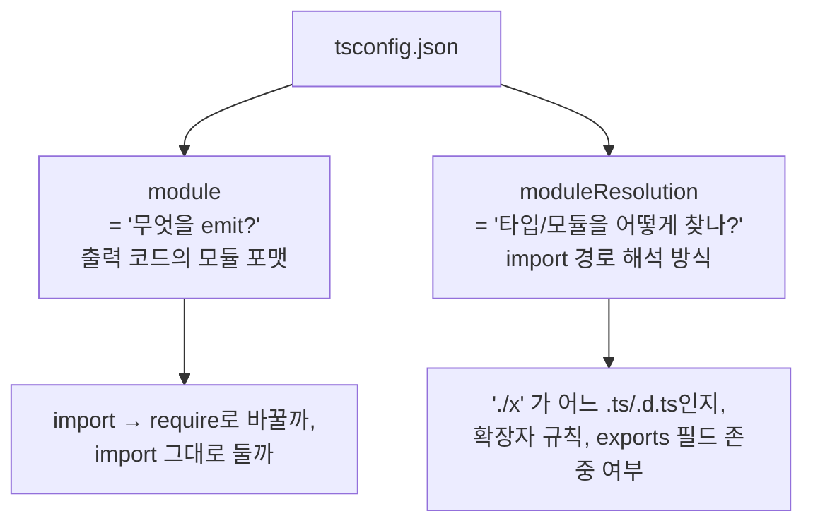
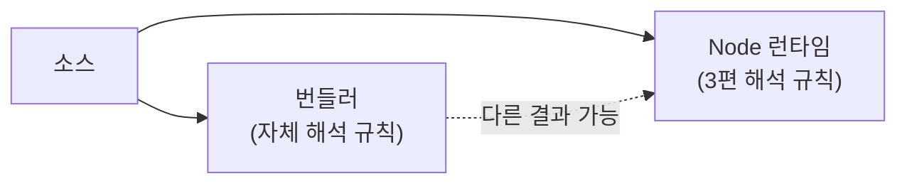

지금까지 다룬 [interop의 혼란](/docs/dev/nodejs/module/5.interop) 위에, 마지막으로 한 층이 더 얹힌다. **도구** — TypeScript 컴파일러와 번들러다. [세 축](/docs/dev/nodejs/module) 중 **③ 도구의 해석**. 그리고 이 축이 가장 자주 ② 런타임 포맷과 헷갈린다.

이 편 전체를 관통하는 문장 하나.

> **TypeScript의 `module`/`moduleResolution`은 "TS가 무엇을 emit하고, 타입을 어떻게 찾느냐"의 문제일 뿐, Node가 런타임에 하는 것과 별개다.**

"TS 설정에서 ESM 쓰기로 했는데 왜 Node에서 안 돌지?"의 답은 거의 항상 — **그 둘은 다른 축이기 때문**이다.

## module vs moduleResolution — 둘은 다른 질문이다

TypeScript의 두 옵션이 자주 한 덩어리로 오해받는데, 답하는 질문이 다르다.



- **`module`** — tsc가 **출력**할 코드의 모듈 포맷. `commonjs`면 `import`를 `require`로 바꿔 emit하고, `esnext`면 `import`를 그대로 둔다. 이게 [5편의 "가짜 interop"](/docs/dev/nodejs/module/5.interop)을 만드는 바로 그 설정이다 — 소스는 `import`인데 `module: commonjs`면 런타임엔 `require`가 돈다.
- **`moduleResolution`** — tsc가 `import './x'`를 보고 **어느 파일/타입 정의를 가리키는지 찾는 방식**. `node`(구식 CJS 스타일), `bundler`, `nodenext` 등이 있다. 이건 타입 체크 단계의 일이라 **출력 코드에는 영향이 없다.**

핵심 — **이 둘 다 "타입 체크와 emit"의 문제다. 실제 런타임에서 Node가 [3편의 규칙](/docs/dev/nodejs/module/3.resolution-package-json)으로 파일을 찾고 [판정](/docs/dev/nodejs/module/3.resolution-package-json)하는 것과는 완전히 별개의 레이어다.** tsc는 "내가 이렇게 emit하면 런타임이 잘 돌 것"이라고 가정하고 코드를 뱉을 뿐, 런타임을 대신 돌려주지 않는다.

<Callout type="warning" title="가장 흔한 착각: tsconfig가 런타임을 바꾼다는 오해">
`tsconfig.json`을 아무리 바꿔도, **`.js` 출력 결과물과 `package.json`의 `type`이 안 맞으면 Node에서 깨진다.** 예를 들어 `module: esnext`로 `import` 문을 그대로 emit해놓고, 정작 그 출력 디렉터리에 `"type": "module"`이 없으면 — Node는 [3편 판정 규칙](/docs/dev/nodejs/module/3.resolution-package-json)에 따라 그 `.js`를 CJS로 읽고 `Cannot use import statement outside a module`로 터진다.

tsconfig는 "TS 세계"의 설정이고, `package.json type`은 "Node 런타임 세계"의 설정이다. **둘을 항상 일치시켜야 한다.** 이게 안 맞아서 나는 게 [7편](/docs/dev/nodejs/module/7.debugging-cheatsheet)의 대표적 에러들이다.
</Callout>

## 🔍 nodenext와 .js 확장자 강제 — 왜 .ts인데 .js라고 쓰나

`module`/`moduleResolution`을 `nodenext`(또는 `node16`)로 두면, TypeScript가 가장 당황스럽게 만드는 규칙이 발동한다 — **상대 경로 import에 `.js` 확장자를 직접 써야 한다.** 소스 파일은 `utils.ts`인데도.

```ts
// nodenext 모드에서
import { add } from './utils';     // ❌ 에러: 확장자가 필요하다
import { add } from './utils.ts';  // ❌ 에러: .ts로는 못 쓴다
import { add } from './utils.js';  // ✅ .js로 써야 한다 (실제 파일은 utils.ts인데도!)
```

처음 보면 버그 같지만, 의도된 설계다. 이유는 [4편에서 본](/docs/dev/nodejs/module/4.esm-only-features) ESM 런타임 규칙이다 — **Node ESM은 확장자 생략을 허용하지 않는다.** TypeScript는 타입 체크만 하고 **import 경로 문자열은 손대지 않은 채 그대로 emit**하므로(`module: nodenext`), 소스에 쓴 경로가 런타임에 그대로 들어간다. 그렇다면 소스에 미리 **런타임에 존재할 파일명(`utils.js`)** 을 써둬야 Node가 컴파일된 `utils.js`를 찾을 수 있다.

즉 `.js`는 "내가 emit할 결과물의 이름"이다. TS가 경로를 안 고치니, 개발자가 "출력 기준"으로 미리 써주는 것이다. ③ 도구 축이 ② 런타임 축에 자신을 맞추는 셈이다.

## 🔍 verbatimModuleSyntax와 import type

또 하나 헷갈리는 영역 — **타입 전용 import가 emit에 미치는 영향**이다. TypeScript에서 어떤 import는 "값"을 가져오고(런타임에 필요), 어떤 import는 "타입"만 가져온다(런타임엔 불필요, 컴파일 후 사라져야 함).

```ts
import { createServer } from 'node:http'; // 값 — 런타임에 남아야 함
import { type Server } from 'node:http';  // 타입 — emit 후 사라져야 함
import type { Config } from './config.js'; // 타입 전용 import 문 — 통째로 사라짐
```

문제는, tsc가 "이 import가 타입인지 값인지" 자동 판단하려다 틀리면 — 런타임에 불필요한 `require`를 남기거나(부작용 유발), 반대로 필요한 걸 지워버릴 수 있다. **`verbatimModuleSyntax: true`** 는 이 추측을 끄고 규칙을 단순화한다 — **`import type`/`export type`으로 명시한 것만 지우고, 나머지는 쓴 그대로(verbatim) emit한다.**

<Callout type="note" title="🔍 더 깊이: import type을 명시해야 하는 진짜 이유 — 부작용과 순환">
`verbatimModuleSyntax`가 중요한 이유는 단순한 깔끔함이 아니다.

1. **부작용(side effect) 보존** — 어떤 모듈은 import만 해도 부작용이 있다(전역 등록, 폴리필 등). tsc가 "안 쓰는 것 같으니 import를 지우자"고 잘못 판단하면 그 부작용이 사라진다. verbatim 모드는 쓴 대로 두니 이 문제가 없다.
2. **타입과 값 구분이 명확해짐** — `import type`을 쓰면 그 import는 [3편의 dual package](/docs/dev/nodejs/module/3.resolution-package-json)나 [순환 참조](/docs/dev/nodejs/module/2.cjs-vs-esm)에 런타임 의존을 추가하지 않는다. 타입만 빌려오고 런타임 그래프에는 엣지를 안 만든다.
3. **단일 파일 트랜스파일러 호환** — 바로 아래 `isolatedModules`와 직결된다. 한 파일만 보고 컴파일하는 도구는 "이 import가 타입인지" 다른 파일을 봐야 알 수 있으면 곤란하다. `import type`으로 명시돼 있으면 한 파일만 보고도 안전하게 지운다.

그래서 최신 TS 프로젝트는 `verbatimModuleSyntax: true`를 켜고, 타입만 쓰는 import에는 `import type`을 붙이는 게 표준이 되어간다.
</Callout>

## 🔍 isolatedModules와 단일 파일 트랜스파일 (esbuild/SWC)

`tsc`는 프로젝트 **전체**를 보며 타입을 체크하고 emit한다. 그런데 esbuild·SWC 같은 빠른 트랜스파일러는 속도를 위해 **파일 하나씩 독립적으로** 변환한다. 다른 파일을 안 본다. 이 차이가 제약을 만든다.

`isolatedModules: true`는 tsc에게 "한 파일만 보고도 안전하게 변환 가능한 코드인지 검사하라"고 지시하는 옵션이다. 켜면 단일 파일 트랜스파일러가 오해할 만한 패턴을 tsc가 미리 에러로 잡아준다. 예:

```ts
// isolatedModules에서 문제되는 패턴 — re-export가 타입인지 값인지 한 파일만으론 모호
export { SomeType } from './types.js';      // ❌ 값인지 타입인지 단일 파일론 불명
export type { SomeType } from './types.js'; // ✅ 타입임을 명시
```

[9편 NestJS](/docs/dev/nodejs/module/9.nestjs-case-study)에서 본 "esbuild 단독으로는 데코레이터 메타데이터가 안 나온다"가 바로 이 **단일 파일 트랜스파일의 한계**의 한 사례다. 한 파일만 보는 도구는 타입 정보를 런타임 메타데이터로 심는 작업처럼 "전체 맥락이 필요한 변환"을 못 하거나 부분적으로만 한다.

## 🔍 번들러는 Node 런타임 규칙을 따르지 않는다

마지막으로 가장 큰 오해. **번들러(Vite/esbuild/webpack/Rollup)는 Node의 [모듈 해석 규칙](/docs/dev/nodejs/module/3.resolution-package-json)을 그대로 따르지 않는다.** 자기만의 해석·트리쉐이킹·변환을 한다.

- `package.json`의 [`module` 필드](/docs/dev/nodejs/module/3.resolution-package-json)를 본다(Node는 무시하는 그 필드). `browser` 필드, 자체 `resolve.alias`도 본다.
- 확장자 생략을 너그럽게 허용한다(Node ESM은 안 되는데).
- CJS/ESM을 자기 그래프 안에서 알아서 섞어 처리한다.
- 트리쉐이킹으로 코드를 [2편의 정적 구조](/docs/dev/nodejs/module/2.cjs-vs-esm)에 기대 걷어낸다.



<Callout type="warning" title="'내 머신에선 되는데 Node에선 안 됨'의 정체">
프런트엔드 개발자가 자주 겪는 함정이다. Vite 개발 서버에서는 멀쩡히 돌던 코드가, Node로 직접 실행하거나 SSR 환경에 올리면 깨진다. 이유는 — **번들러가 너그럽게 봐주던 것**(확장자 생략, `module` 필드, CJS/ESM 혼용)을 **Node 런타임은 [3편 규칙](/docs/dev/nodejs/module/3.resolution-package-json)대로 깐깐하게** 따지기 때문이다.

그래서 "어디서 도는 코드인가"를 항상 의식해야 한다. 번들러를 거쳐 브라우저에서 도는 코드와, Node가 직접 실행하는 코드는 **같은 소스라도 해석 주체가 다르다.** 라이브러리를 만든다면 번들러 없이 순수 Node로도 한 번 돌려보는 게 안전하다.
</Callout>

## 한눈 정리

| 도구 설정 | 무엇을 정하나 | 런타임에 미치는 영향 |
|---|---|---|
| `module` | emit할 모듈 포맷 (import↔require) | ② 런타임 포맷을 직접 만듦 |
| `moduleResolution` | 타입/모듈 경로 찾는 방식 | 없음 (타입 체크 단계) |
| `nodenext` `.js` 강제 | 출력 기준 경로를 미리 쓰게 함 | Node ESM 확장자 규칙에 맞춤 |
| `verbatimModuleSyntax` | import를 쓴 그대로 emit | 부작용·타입 import 정확해짐 |
| `isolatedModules` | 단일 파일 변환 안전성 검사 | esbuild/SWC 호환 |
| 번들러 | 자체 해석·트리쉐이킹 | Node 규칙과 다를 수 있음 |

세 축을 다 분리했고, interop과 도구의 함정도 봤다. 이제 이 모든 지식을 **에러 메시지에서 거꾸로 원인을 짚는** 실전 도구로 압축할 차례다.

→ [7편: 디버깅 치트시트](/docs/dev/nodejs/module/7.debugging-cheatsheet)
