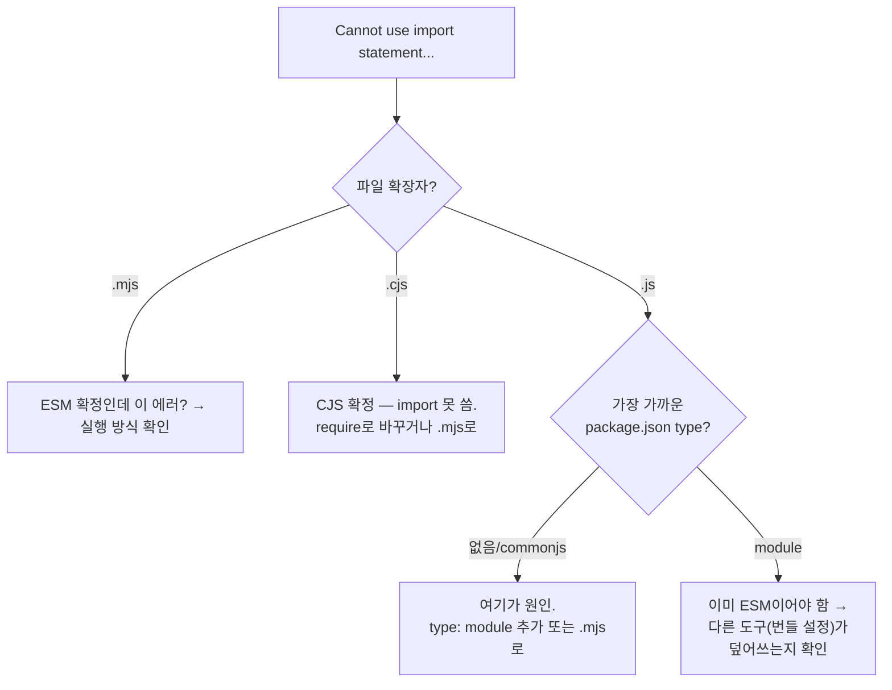
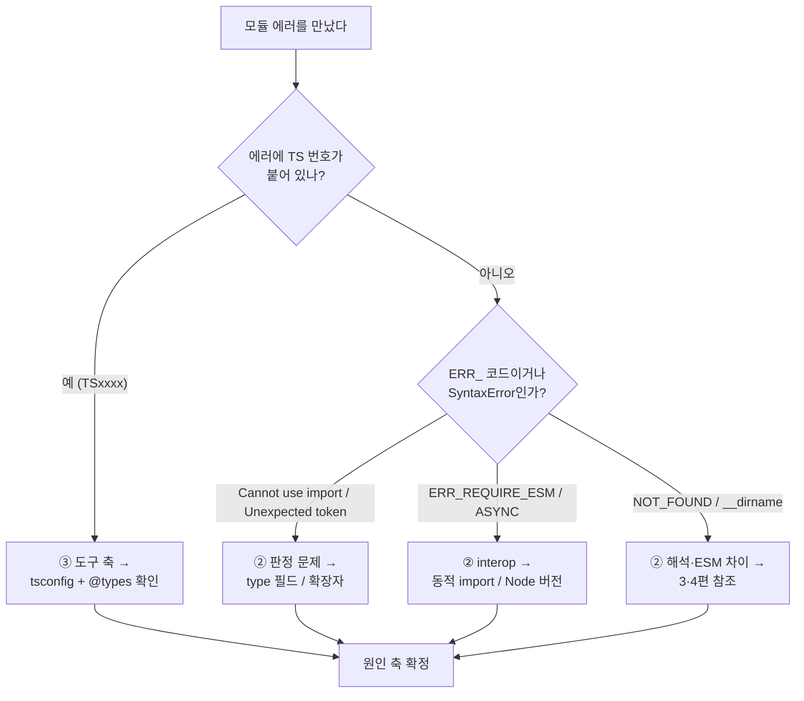

여기까지 [세 축](/docs/dev/nodejs/module) — 소스 문법(①), 런타임 포맷(②), 도구의 해석(③) — 을 분리해왔다. 이번 편은 그 지식을 **거꾸로** 쓴다. 에러 메시지를 던져주면, **그게 어느 축에서 난 문제인지 즉시 짚고 한 줄로 처방**하는 표다.

핵심 원칙: **에러 메시지의 출처가 누구인가**를 먼저 보라. Node가 던졌나(런타임, ② 축), TypeScript가 던졌나(`TSxxxx` 번호, ③ 축)? 이 한 가지 구분이 디버깅의 절반이다.

## 마스터 표 — 에러 → 축 → 처방

| 에러 | 던진 주체 | 어느 축 | 한 줄 원인 | 한 줄 처방 |
|---|---|---|---|---|
| `Cannot use import statement outside a module` | Node (런타임) | ② | 이 파일을 Node가 **CJS로 판정**했는데 `import` 문이 있다 | `package.json`에 `"type": "module"` 추가 또는 파일을 `.mjs`로 |
| `Unexpected token 'export'` | Node (런타임) | ② | 위와 같은 원인(export 쪽). CJS로 읽히는 파일에 `export` | 동일 — `type` 명시 또는 `.mjs` |
| `ReferenceError: require is not defined` | Node (런타임) | ② | ESM으로 도는데 CJS의 `require`를 씀 | `import` 사용, 또는 `createRequire` ([4편](/docs/dev/nodejs/module/4.esm-only-features)) |
| `__dirname is not defined` | Node (런타임) | ② | ESM에는 `__dirname`이 없음 | `import.meta.dirname` ([4편](/docs/dev/nodejs/module/4.esm-only-features)) |
| `ERR_REQUIRE_ESM` | Node (런타임) | ② | CJS에서 `require`로 ESM을 가져옴 | 동적 `import()`, 또는 Node 22.12+로 올림 ([5편](/docs/dev/nodejs/module/5.interop)) |
| `ERR_REQUIRE_ASYNC_MODULE` | Node (런타임) | ② | `require(esm)`인데 대상에 top-level await가 있음 | 동적 `import()`로 전환 ([5편](/docs/dev/nodejs/module/5.interop)) |
| `ERR_PACKAGE_PATH_NOT_EXPORTED` | Node (런타임) | ② | 패키지가 `exports`로 막은 내부 경로를 deep import | 공개된 정식 경로 사용 ([3편](/docs/dev/nodejs/module/3.resolution-package-json)) |
| `ERR_MODULE_NOT_FOUND` (확장자) | Node (런타임) | ② | ESM인데 import 경로에 확장자를 안 씀 | 경로에 `.js` 명시 ([3편](/docs/dev/nodejs/module/3.resolution-package-json)) |
| `TS1479` | TypeScript | ③ | CJS로 emit하는 설정인데 ESM-only 패키지를 정적 import | 동적 `import()` 또는 `module` 설정 변경 (아래) |
| `TS2307: Cannot find module 'node:fs'` | TypeScript | ③ | `@types/node` 누락 또는 `moduleResolution` 부적합 | `@types/node` 설치 + `moduleResolution: nodenext` |
| `Cannot find name 'process'` | TypeScript | ③ | Node 전역 타입(`@types/node`) 미설치 | `@types/node` 설치, `tsconfig`의 `types`/`lib` 확인 |
| default import가 `undefined` | 트랜스파일러/런타임 | ②+③ | `esModuleInterop` 불일치 또는 CJS named 추정 실패 | `esModuleInterop: true`, 또는 default로 받기 ([5편](/docs/dev/nodejs/module/5.interop)) |

## ② 런타임 축 에러 — Node가 던진 것

### `Cannot use import statement outside a module` / `Unexpected token 'export'`

둘은 같은 병의 두 증상이다. **Node가 이 파일을 [CJS로 판정](/docs/dev/nodejs/module/3.resolution-package-json)했는데, 파일 안에 ESM 문법(`import`/`export`)이 있다.** Node의 CJS 파서는 `import`/`export` 키워드를 모르므로 문법 에러로 토한다.

진단 순서:

처방은 [3편의 판정 규칙](/docs/dev/nodejs/module/3.resolution-package-json) 그대로다 — `type`을 명시하거나 확장자를 `.mjs`로 못 박는다.

### `ERR_REQUIRE_ESM` vs `ERR_REQUIRE_ASYNC_MODULE`

둘 다 "`require`로 ESM을 가져오려 할 때" 나지만 원인이 다르다.

- **`ERR_REQUIRE_ESM`** — 구버전 Node에서 `require`로 ESM을 부른 경우. [5편](/docs/dev/nodejs/module/5.interop) 그대로, 동기 require가 비동기 ESM을 못 기다려서다. 처방: 동적 `import()`로 바꾸거나, Node를 22.12+로 올려 `require(esm)`을 활성화.
- **`ERR_REQUIRE_ASYNC_MODULE`** — Node 22.12+에서 `require(esm)`은 됐는데, **대상 ESM에 [top-level await](/docs/dev/nodejs/module/4.esm-only-features)가 있어서** 거부된 경우. TLA가 있으면 동기 평가가 불가능하니까. 처방: 그 모듈은 동적 `import()`로만 가져온다.

<Callout type="note" title="🔍 더 깊이: 같은 에러, 다른 Node 버전">
`ERR_REQUIRE_ESM`을 만났을 때 가장 먼저 확인할 건 **Node 버전**이다(`node -v`).

- **22.12 미만** — `require(esm)`이 없다. 동적 `import()`가 정답.
- **22.12 이상** — `require(esm)`이 기본 활성. 그런데도 `ERR_REQUIRE_ESM`이 난다면, 실행 환경이 정말 그 버전인지(여러 Node가 깔린 경우 `nvm`/`volta`로 엉뚱한 버전이 잡혔는지) 확인. 그리고 `ERR_REQUIRE_ESM`이 아니라 `ERR_REQUIRE_ASYNC_MODULE`로 바뀌었다면, 그건 진전이다 — TLA만 제거하면(또는 동적 import로 그 부분만 떼면) 풀린다.

이 시리즈가 거듭 말한 **"Node 런타임이 모든 축의 앵커"**가 여기서 가장 실감 난다. 같은 코드, 같은 에러 이름이라도 Node 버전이 결과를 가른다.
</Callout>

## ③ 도구 축 에러 — TypeScript가 던진 것 (`TSxxxx`)

`TS`로 시작하는 번호가 붙으면 **그건 런타임 에러가 아니라 타입 체크 단계의 에러다.** Node를 아무리 만져도 안 사라진다 — `tsconfig.json`을 봐야 한다.

### `TS1479` — CJS로 emit하는데 ESM-only를 정적 import

> `The current file is a CommonJS module whose imports will produce 'require' calls; however, the referenced file is an ECMAScript module...`

[6편의 `module` 설정](/docs/dev/nodejs/module/6.tooling-layer)이 CJS로 emit하도록 돼 있는데(`import`을 `require`로 바꿔 출력), 가져오려는 패키지가 ESM-only라 그렇게 하면 런타임에 [`ERR_REQUIRE_ESM`](/docs/dev/nodejs/module/5.interop)이 날 것을 TS가 미리 경고하는 것이다. 즉 **③ 도구가 ② 런타임 문제를 컴파일 타임에 예언**하는 셈이다.

처방 세 갈래:
1. 그 패키지만 **동적 `import()`** 로 가져온다(가장 안전한 국소 해결).
2. 프로젝트를 ESM으로 전환한다(`module: nodenext` + `package.json` `type: module`).
3. Node 22.12+ 대상이면 `require(esm)`을 전제로 설정을 조정한다.

### `TS2307: Cannot find module 'node:fs'` / `Cannot find name 'process'`

이건 모듈 포맷 문제가 **아니다.** **Node의 타입 정의가 없는** 것이다.

- `@types/node`가 설치 안 됐거나,
- `moduleResolution`이 `node:` 접두사를 이해 못 하는 구식이거나(→ `nodenext`/`node16`로),
- `tsconfig`의 `types`/`lib` 배열이 Node 타입을 배제하고 있거나.

처방: `@types/node` 설치 → `moduleResolution: nodenext` 확인 → `types` 배열을 좁혀놨다면 거기에 `node` 포함. **런타임에선 멀쩡히 도는데 TS만 빨간 줄**이라면 거의 항상 이 부류다 — 코드가 아니라 타입 환경 문제.

<Callout type="warning" title="런타임 에러와 타입 에러를 헷갈리지 마라">
가장 흔한 시간 낭비가 이거다. `TS2307`을 보고 `package.json` `type`을 바꾸거나 import 문법을 고치며 헤맨다. 하지만 `TS`로 시작하는 에러는 **타입 체크 단계**의 일이라 런타임 설정(`type` 필드, 확장자)과 무관하다. 반대로 `ERR_REQUIRE_ESM`은 **런타임** 에러라 `tsconfig`를 백날 고쳐도 안 사라진다(이미 emit된 `.js`를 Node가 실행하는 단계니까).

**번호(`TSxxxx`)가 붙었으면 tsconfig, `ERR_`로 시작하면 런타임/package.json.** 이 한 줄이 [세 축 분리](/docs/dev/nodejs/module)의 가장 실전적인 보상이다.
</Callout>

## 빠른 자가진단 흐름도

축을 짚었으면 해당 편으로 — 판정은 [3편](/docs/dev/nodejs/module/3.resolution-package-json), ESM 차이는 [4편](/docs/dev/nodejs/module/4.esm-only-features), interop은 [5편](/docs/dev/nodejs/module/5.interop), 도구는 [6편](/docs/dev/nodejs/module/6.tooling-layer).

이제 마지막 편이다. 개별 에러를 끄는 걸 넘어, **프로젝트 전체를 어느 포맷으로 가져갈지** 결정하는 법 — 마이그레이션 의사결정으로 마무리한다.

→ [8편: 마이그레이션 의사결정](/docs/dev/nodejs/module/8.migration)
