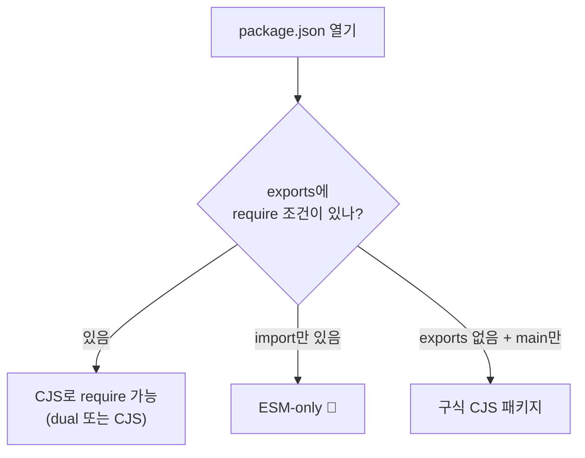
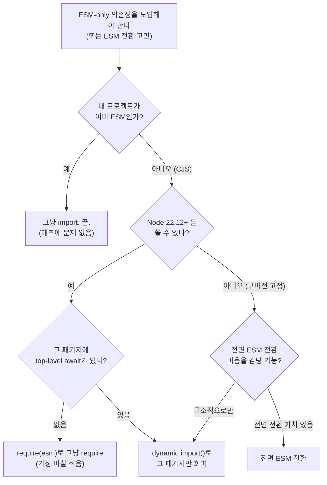

마지막 편이다. [7편의 디버깅](/docs/dev/nodejs/module/7.debugging-cheatsheet)이 개별 에러를 끄는 거였다면, 이번엔 한 단계 위 — **프로젝트(또는 라이브러리)를 통째로 어느 포맷으로 가져갈지** 결정하는 법이다.

## 먼저: 패키지가 무엇을 ship하는지 읽는 법

마이그레이션 결정의 출발점은 "내가 의존하는 패키지가 무엇을 내보내는가"를 정확히 읽는 것이다. [3편](/docs/dev/nodejs/module/3.resolution-package-json)에서 본 `package.json` 필드를 거꾸로 독해한다.

```json
{
  "type": "module",
  "exports": {
    ".": {
      "types": "./dist/index.d.ts",
      "import": "./dist/index.js",
      "require": "./dist/index.cjs"
    }
  }
}
```

읽는 순서:

1. **`exports`에 `require` 조건이 있나?** — 있으면 CJS로 가져올 수 있다(dual 또는 CJS 지원). 없고 `import`만 있으면 **ESM-only**다.
2. **`type` 필드** — `"module"`이면 이 패키지의 `.js`는 ESM. 없으면 CJS 기본.
3. **`exports`가 아예 없고 `main`만 있나?** — 구식 CJS 패키지일 가능성이 높다.



한 줄 명령으로도 빠르게 본다 — `npm view <패키지> exports` 또는 설치 후 `node_modules/<패키지>/package.json`을 직접 열어 `exports`/`type`을 확인한다.

## 의사결정 트리 — 세 갈래

ESM-only 패키지를 만났거나 ESM 전환을 고민할 때, 선택지는 본질적으로 셋이다.



세 갈래를 풀어 쓰면.

- **CJS 유지 + dynamic import 국소 회피** — 가장 보수적. 프로젝트는 CJS 그대로 두고, ESM-only 패키지만 [동적 `import()`](/docs/dev/nodejs/module/5.interop)로 가져온다. [9편 NestJS](/docs/dev/nodejs/module/9.nestjs-case-study)의 lifecycle 훅 패턴이 이것. 비용 최소, 단 코드가 약간 부자연스러워진다.
- **`require(esm)` 전제 (Node 22.12+)** — Node를 올릴 수 있다면, [5편의 `require(esm)`](/docs/dev/nodejs/module/5.interop) 덕에 CJS를 유지하면서도 ESM 패키지를 그냥 `require`할 수 있다(TLA 없는 경우). 최근 가장 마찰이 적은 길.
- **전면 ESM 전환** — `package.json`에 `type: module`, 모든 import에 `.js` 확장자([6편](/docs/dev/nodejs/module/6.tooling-layer)), `__dirname` → `import.meta.dirname`([4편](/docs/dev/nodejs/module/4.esm-only-features)). 일이 많지만 트리쉐이킹·정적 분석 이점을 온전히 얻고, 미래의 기본값에 올라탄다.

<Callout type="note" title="🔍 더 깊이: 라이브러리 저자라면 결정이 다르다">
지금까지는 "애플리케이션" 관점이었다. **라이브러리**를 만든다면 고려가 뒤집힌다 — 너는 소비자의 Node 버전과 모듈 포맷을 통제할 수 없다.

- **ESM-only로 ship** — 가장 깔끔하고 [dual package hazard](/docs/dev/nodejs/module/3.resolution-package-json)가 없다. 하지만 아직 CJS에 묶인 소비자(구버전 Node, [9편 같은 프레임워크](/docs/dev/nodejs/module/9.nestjs-case-study))를 배제한다. `require(esm)`이 보편화될수록 이 비용은 줄어든다.
- **dual로 ship** — 최대 호환성. 하지만 [dual package hazard](/docs/dev/nodejs/module/3.resolution-package-json)(인스턴스 둘, `instanceof` 깨짐)와 빌드 복잡도를 떠안는다.
- **CJS-only 유지** — ESM 소비자도 [default import로 가져갈 수 있으니](/docs/dev/nodejs/module/5.interop) 의외로 호환성이 넓다. 다만 트리쉐이킹 이점을 소비자에게 못 준다.

`require(esm)`이 바꾼 게 바로 이 계산이다. 예전엔 "CJS 소비자를 버릴 수 없으니 dual을 유지"가 정석이었는데, 이제 "ESM-only로 내도 CJS 소비자가 require로 쓸 수 있다"가 되면서 **ESM-only의 비용이 극적으로 낮아졌다.**
</Callout>

## ESM-only 사례 — 그리고 일부의 후퇴

"ESM-only가 강제하는" 유명 사례들이 있다. 의존성을 올리다가 갑자기 [`ERR_REQUIRE_ESM`](/docs/dev/nodejs/module/7.debugging-cheatsheet)을 만나는 단골들이다.

이 흐름의 방아쇠는 **2021년 Sindre Sorhus의 선언** — 자신의 모든 패키지를 앞으로 ESM-only로 내겠다 — 이었다. 그의 패키지(chalk, got, execa 등)는 수백만 프로젝트의 의존성 트리에 박혀 있어서, 이 결정이 CJS→ESM 이행에서 가장 파괴적인 단일 사건이 됐다.

| 패키지 | ESM-only가 된 버전 | 비고 (2026 기준) |
|---|---|---|
| **chalk** | v5 | ESM-only 유지 (v4가 마지막 CJS) |
| **node-fetch** | v3 | ESM-only |
| **uuid** | v12 | v11이 마지막 CJS 지원, 최신은 v14 (아래 케이스 스터디) |
| **nanoid** | v4 | ⚠️ **v5에서 CJS 복원** |
| **execa** | v6 | ⚠️ **v8에서 CJS 복원** |
| **got** | v12 | ⚠️ **v14에서 dual로 복귀** |

<Callout type="warning" title="중요: ESM-only 물결은 부분적으로 되돌아왔다">
원래 "ESM-only로 갔다"고 알려진 패키지 상당수가 **다시 CJS를 복원했다.** execa는 v8에서, got은 v14에서 dual로, nanoid는 v5에서, p-queue는 v8에서 CJS를 되살렸다.

이유는 둘이다. (1) ESM-only 강행이 일으킨 생태계 마찰·반발이 컸고, (2) [Node의 `require(esm)`](/docs/dev/nodejs/module/5.interop)이 등장하면서 "ESM-only로 강제하지 않아도 CJS 소비자가 알아서 require할 수 있는" 환경이 됐기 때문이다. 즉 **순수주의적 ESM-only 압박이 완화되는 국면**이다.

그래서 이 표는 **시점에 민감하다.** "이 패키지는 ESM-only"라는 오래된 블로그 글을 믿고 대응하기 전에, **지금 그 메이저 버전의 `package.json` `exports`를 직접 확인**하라(위의 "읽는 법"). 복원됐을 수 있다. 이 글도 2026년 기준이며, 정확한 현재 상태는 항상 패키지의 최신 `exports`가 정답이다.
</Callout>

## 케이스 스터디 — uuid 11 → 14 (실전)

실제로 겪은 사례다. CJS 기반 백엔드에서 `uuid`를 **11 → 14**로 올렸더니 빌드가 깨졌다. uuid는 [v12에서 CommonJS 지원이 사라졌고](/docs/dev/nodejs/module/3.resolution-package-json)(v11이 마지막 CJS), v14는 당연히 ESM-only다. 한 줄 import에 이 시리즈의 거의 모든 축이 동시에 얽혔다.

증상은 런타임이 아니라 **타입 체크에서 먼저** 터졌다. 내부 패키지 `@project/db`가 CJS로 emit되는데(③ 도구 축), 거기서 ESM-only인 uuid를 정적 import하니 tsc가 [`TS1479`](/docs/dev/nodejs/module/7.debugging-cheatsheet)로 막았다.

```text
TS1479: The current file is a CommonJS module whose imports will produce
'require' calls; however, the referenced file 'uuid' is an ECMAScript module...
```

[7편의 진단](/docs/dev/nodejs/module/7.debugging-cheatsheet)대로 — `TS1479`는 ③ 도구가 "이대로 `require`로 emit하면 런타임에 [`ERR_REQUIRE_ESM`](/docs/dev/nodejs/module/5.interop) 난다"를 미리 예언한 것이다. `@project/db`(CJS)가 uuid를 require할 수 없다는 게 핵심이었다.

<Callout type="warning" title="탈출구가 막혀 있었다 — UUIDv7과 crypto.randomUUID()">
보통 이럴 때 가장 쉬운 회피는 "외부 패키지를 버리고 [Node 내장](/docs/dev/nodejs/module/4.esm-only-features)으로 대체"다. UUID라면 `crypto.randomUUID()`가 내장돼 있으니 의존성 자체를 없애면 그만이다.

**그런데 이 경우엔 그게 안 됐다.** 우리가 쓰던 건 **UUIDv7(시간 정렬 가능 UUID)** 였다. `crypto.randomUUID()`는 **v4만** 생성한다 — 시간 정렬이 되는 v7은 못 만든다. DB 인덱스 지역성(시간순으로 단조 증가하는 키) 때문에 v7이 필요했으므로, **"내장으로 대체"라는 가장 싼 탈출구가 닫혀 있었다.** uuid 패키지를 계속 써야 했고, 그래서 ESM-only라는 사실을 정면으로 마주해야 했다.

교훈: "그냥 Node 내장 쓰면 되잖아"가 항상 통하는 건 아니다. 내장이 *어떤 변형까지* 제공하는지(여기선 v4만)를 확인해야 한다. 의존성을 못 버리면, 그 의존성의 모듈 포맷을 받아들이는 수밖에 없다.
</Callout>

탈출구가 막혔으니, 남은 건 위 의사결정 트리의 두 갈래였다 — **`@project/db`와 서버를 ESM으로 전환**하거나, **그 import만 동적 `import()`로 국소 회피**하거나.

```js
// 막힌 길 — @project/db(CJS)에서 정적 require/import
const { v7: uuidv7 } = require('uuid'); // 💥 TS1479 → 런타임 ERR_REQUIRE_ESM

// 갈래 1 — 국소 회피: 그 호출부만 동적 import (db/server는 CJS 유지)
async function newRowId() {
  const { v7: uuidv7 } = await import('uuid'); // ✅ Promise 기반이라 CJS에서도 OK
  return uuidv7();
}

// 갈래 2 — db/server를 ESM으로 전환 후: 그냥 named import
import { v7 as uuidv7 } from 'uuid'; // ✅ (uuid는 v8부터 named export만 제공)
```

판단 기준은 **"Node 런타임을 올릴 수 있는가"** 였다. Node 22.12+를 쓸 수 있다면 [`require(esm)`](/docs/dev/nodejs/module/5.interop)이 갈래 1조차 필요 없게 만든다(uuid는 TLA가 없어 `require`로 그냥 받아진다). 올릴 수 없는 환경이면 동적 import로 그 한 곳만 막고, 여유가 될 때 ESM 전환을 계획한다. 한 패키지의 메이저 업그레이드가 **판정(②)·interop(②)·도구 emit(③)·named export 규칙·런타임 버전**을 한꺼번에 끌고 온, 이 시리즈 전체의 축소판이었다.

이 사례는 [9편 NestJS](/docs/dev/nodejs/module/9.nestjs-case-study)의 상황과 정확히 겹친다 — CJS 프레임워크가 ESM-only 의존성을 만나는 그 지점. NestJS의 권장 회피책(lifecycle 훅 안 동적 import)이 위 "갈래 1"과 같은 패턴이다.

## 성능·생산성 트레이드오프 — "왜 다들 ESM으로 가나"

마지막으로, 포맷 선택의 성능적 함의를 정리한다. 초보에겐 "왜 ESM인가"의 답이고, 고급에겐 트레이드오프 논의다.

**ESM이 유리한 쪽 (정적 구조 덕):**

- **트리쉐이킹** — [2편의 정적 구조](/docs/dev/nodejs/module/2.cjs-vs-esm) 덕에 번들러가 안 쓰는 export를 걷어낸다. 프런트엔드 번들 크기가 줄어든다. CJS는 동적이라 이게 어렵다.
- **정적 분석·타입체크·자동완성** — 도구가 실행 없이 import/export 그래프를 안다. IDE 경험과 빌드 타임 검증이 좋아진다.
- **표준** — 브라우저·Node·번들러가 공유하는 단일 표준. 미래의 기본값.

**ESM의 비용:**

- **해석 워터폴** — ESM은 [그래프를 비동기로 해석·평가](/docs/dev/nodejs/module/2.cjs-vs-esm)하므로, 깊은 의존성 그래프에서 해석 단계가 순차적 왕복(워터폴)을 만들 수 있다. 다만 **번들링이 이를 상쇄**한다 — 빌드 타임에 그래프를 하나로 합쳐버리면 런타임 해석 비용이 사라진다.
- **전환 비용** — 위에서 본 마이그레이션 노동(확장자, `__dirname`, interop).

핵심 통찰 — **번들링하는 프런트엔드에서는 ESM의 정적 이점(트리쉐이킹)은 온전히 얻고 런타임 해석 비용은 번들러가 흡수**하므로 ESM이 거의 항상 유리하다. 반면 번들링 없이 Node가 직접 실행하는 서버에서는 해석 워터폴이 실재하지만, `require(esm)`과 캐싱으로 현실적 영향은 작고, 정적 분석·표준화 이점이 보통 그 비용을 넘어선다.

## 시리즈를 마치며 — 세 축으로 돌아가기

[처음에 깐 프레임](/docs/dev/nodejs/module)으로 돌아가자.

1. **소스에 뭘 쓰는가** (`import` vs `require`) — [1편](/docs/dev/nodejs/module/1.why-modules)
2. **런타임에 뭐가 도는가** (CJS vs ESM, [판정](/docs/dev/nodejs/module/3.resolution-package-json)·[동작](/docs/dev/nodejs/module/2.cjs-vs-esm)·[interop](/docs/dev/nodejs/module/5.interop))
3. **도구가 어떻게 해석하는가** ([TS·번들러](/docs/dev/nodejs/module/6.tooling-layer))

이 셋을 분리해서 보면, 처음의 그 혼란 — `import` 하나 끼웠더니 터지고, tsconfig 고쳤더니 Node가 안 돌고 — 이 각각 **어느 축의 문제인지** 즉시 보인다. 그리고 모든 축의 **앵커는 Node 런타임**이다. tsconfig도 번들러도 결국 "Node가 무엇을 실행할 것인가"에 자신을 맞춘다. [9편 NestJS](/docs/dev/nodejs/module/9.nestjs-case-study)가 그 앵커(`require(esm)`)가 움직이자 비로소 전환에 나선 것이 이 결론의 가장 큰 증거다.

모듈 포맷은 `import`냐 `require`냐의 문법 취향이 아니다. 그 뒤엔 늘 **런타임과 도구가 함께 끌려온다.** 세 축을 분리할 줄 알면, 그 끌림을 통제할 수 있다.

---

<ReferenceList title='참고자료'>
  <Reference
    title='uuid — npm'
    description='v12부터 CommonJS 미지원, v11이 마지막 CJS. exports/type 확인용 1차 출처'
    href='https://www.npmjs.com/package/uuid'
    type='documentation'
    author='uuidjs'
  />
  <Reference
    title='Drop CommonJS Support — uuid Issue #881'
    description='uuid의 CJS 지원 종료 논의'
    href='https://github.com/uuidjs/uuid/issues/881'
    type='documentation'
    author='uuidjs/uuid'
  />
  <Reference
    title='The Great Migration: CJS to ESM in the npm ecosystem'
    description='Sindre Sorhus의 2021 ESM-only 선언과 이후 execa·got·nanoid 등의 CJS 복원 흐름'
    href='https://www.pkgpulse.com/guides/great-migration-cjs-to-esm-npm-ecosystem-2026'
    type='article'
    author='PkgPulse'
  />
  <Reference
    title='Node.js require(esm) — 공식 문서 (Modules: CommonJS)'
    description='require로 ESM 로드의 조건과 한계'
    href='https://nodejs.org/api/modules.html'
    type='documentation'
    author='Node.js'
  />
</ReferenceList>
