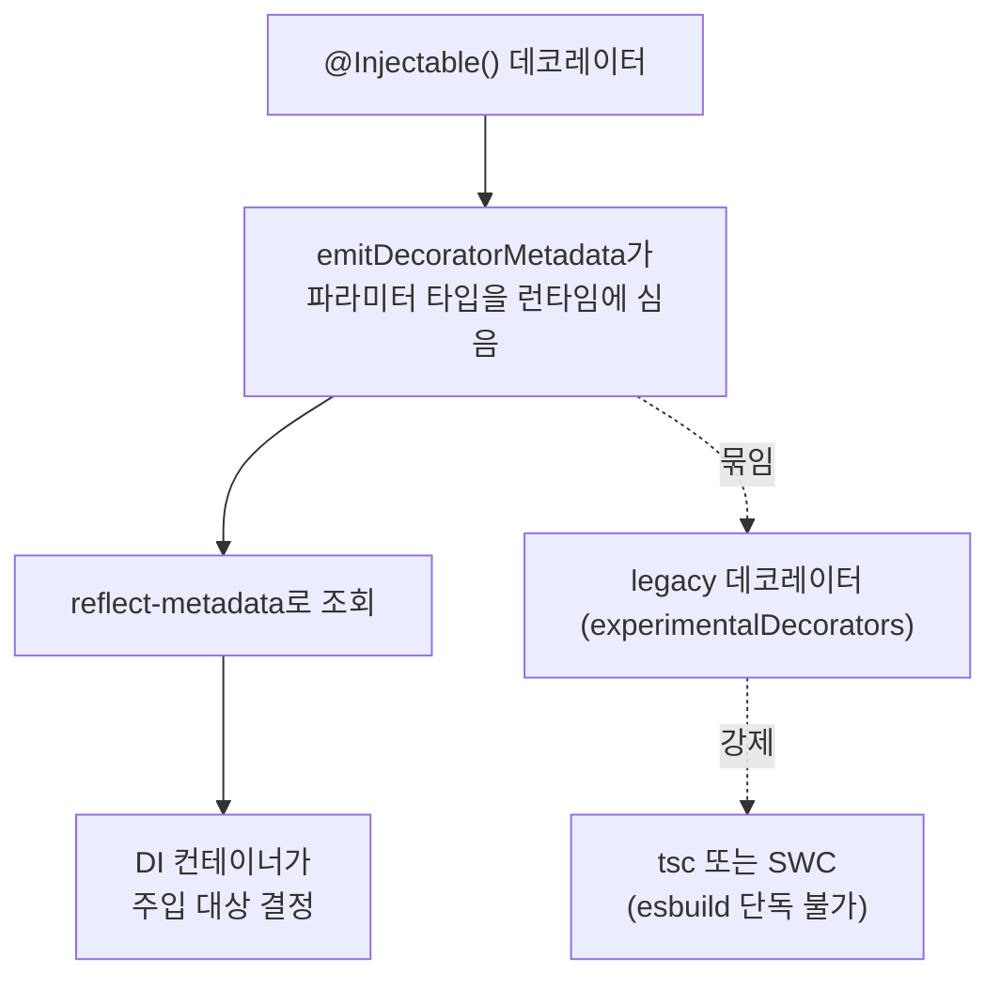
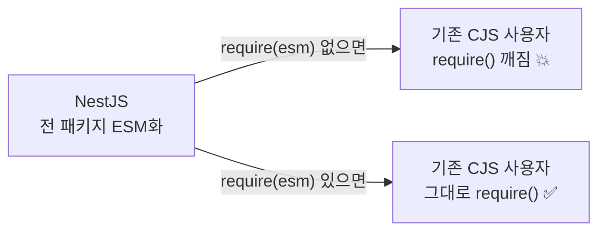

이 시리즈를 관통한 [세 개의 축](/docs/dev/nodejs/module) — 소스 문법, 런타임 포맷, 도구의 해석 — 이 한 프레임워크 안에서 전부 충돌하는 사례가 있다. **NestJS**다.

NestJS는 그냥 "CJS를 쓰는 프레임워크 중 하나"가 아니다. ESM으로 *못* 가는 **구조적 이유**가 있었고, 그 이유는 모듈 시스템이 아니라 엉뚱하게도 **데코레이터**에 있었다. 그리고 그 빗장을 푼 게 [5편에서 본 `require(esm)`](/docs/dev/nodejs/module/5.interop)이다. "왜 갇혔나 → 무엇이 풀었나 → 어떻게 나가나"가 CJS/ESM 서사 전체를 압축한다.

<Callout type="warning" title="시점 주의 — 2026-06-03 기준">
이 글의 NestJS **v12** 관련 내용은 아직 **정식 릴리스 전**이다. v12.0.0은 draft PR(#16391)과 로드맵 단계이며 **2026년 Q3 초**를 목표로 한다. 정식 출시 전 `next` npm 태그로 패키지가 먼저 공개될 예정이다. 지금 운영에서 의지할 stable은 **v11(CommonJS)**이다. 일정·toolchain 세부는 출시까지 바뀔 수 있으니, 실제 적용 시점에 [공식 마이그레이션 가이드](https://docs.nestjs.com/migration-guide)를 다시 확인할 것. 반면 "**왜** CJS에 묶였나"의 메커니즘(아래)은 시점과 무관하게 유효하다.
</Callout>

## 왜 NestJS는 CJS에 묶여 있었나 — 범인은 데코레이터

NestJS의 의존성 주입(DI)은 **런타임에 타입 메타데이터를 읽어서** 동작한다. `@Injectable()`이 붙은 클래스의 생성자 파라미터 타입을 보고 "여기엔 이 서비스를 주입하면 되겠군"을 결정한다.

```ts
@Injectable()
export class UserService {
  // NestJS는 이 생성자의 파라미터 "타입"을 런타임에 읽어서 주입 대상을 정한다
  constructor(private readonly config: ConfigService) {}
}
```

문제는 **타입은 런타임에 사라진다**는 것이다. TypeScript 타입은 컴파일 후 증발하는데, 어떻게 런타임에 `ConfigService`라는 타입을 알아낼까? 답은 `tsconfig.json`의 `emitDecoratorMetadata` 옵션이다. 이 옵션을 켜면 컴파일러가 데코레이터가 붙은 선언의 타입 정보를 `reflect-metadata`를 통해 **런타임 메타데이터로 심어준다.** NestJS의 DI는 전적으로 이 메타데이터에 기댄다.



여기서 사슬이 시작된다.

- `emitDecoratorMetadata`는 **legacy 데코레이터**(`experimentalDecorators: true`)에 묶여 있다.
- TS 5.0에서 표준화된 **TC39 stage 3 데코레이터는 `emitDecoratorMetadata`를 지원하지 않는다.** 그래서 NestJS는 표준 데코레이터로 넘어가지 못한다.
- 이 메타데이터 변환을 해주는 컴파일러도 제한된다. `tsc`나 SWC는 해주지만, **순수 esbuild는 데코레이터 메타데이터를 방출하지 않아 DI가 통째로 깨진다.**

**"데코레이터 → 메타데이터 → legacy 데코레이터 → 특정 컴파일러"** 라는 이 사슬이, 모듈 시스템과 무관해 보이는데도 NestJS를 오래 CJS 세계에 고정시킨 진짜 이유다. 모듈 포맷을 건드리면 이 연약한 사슬이 같이 흔들리기 때문이다.

<Callout type="note" title="🔍 더 깊이: 데코레이터가 모듈 포맷을 '인질로 잡는' 일반 원리">
NestJS만의 문제가 아니다. **런타임 리플렉션에 의존하는 프레임워크**(TypeORM의 엔티티 메타데이터, class-validator의 검증 데코레이터, Angular의 과거 DI 등)는 전부 같은 제약을 공유한다. 핵심은 이렇다 — 컴파일 타임에 사라지는 타입 정보를 런타임으로 끌고 오려면 특정 컴파일러 동작(`emitDecoratorMetadata`)에 의존해야 하고, 그 동작이 legacy 데코레이터에 묶여 있으면, **"어떤 빌드 도구를 쓸 수 있는가"가 제한되고, 그게 다시 "어떤 모듈 포맷으로 갈 수 있는가"를 제한한다.**

[6편 도구 레이어](/docs/dev/nodejs/module/6.tooling-layer)에서 본 "③ 도구의 해석" 축이 여기서 ② 런타임 포맷 축을 끌고 다니는 셈이다. 세 축은 독립이라고 했지만, 데코레이터 메타데이터는 ③이 ②를 인질로 잡는 드문 교차점이다. 그래서 "ESM 전환"이 단순한 `import` 문법 교체가 아니라 toolchain 전체 교체 문제가 된다.
</Callout>

## 현재(v11, CJS) 실무에서 부딪히는 지점

지금 stable인 NestJS는 여전히 CommonJS 기반이다. 그래서 [5편에서 본 비대칭](/docs/dev/nodejs/module/5.interop) — CJS는 동기 `require`로 비동기 ESM을 곧바로 못 불러온다 — 에 정면으로 부딪힌다. uuid 최신 메이저, chalk v5, node-fetch v3 같은 **ESM-only 의존성**을 도입하려는 순간 `ERR_REQUIRE_ESM`을 만난다([8편의 ESM-only 사례](/docs/dev/nodejs/module/8.migration) 참조).

흔한 실패 시나리오는 이렇다. ESM-only 패키지를 쓰려고 NestJS 백엔드를 통째로 ESM으로 비틀어 옮기다가, **부팅 시점에 `ConfigService` 주입이 깨져 크래시**가 난다. 모듈 포맷을 바꾸자 위에서 본 데코레이터 메타데이터 사슬이 함께 흔들린 것이다.

공식 가이드의 회피책은 이 시리즈 내내 권한 것과 동일하다 — **lifecycle 훅 안에서 dynamic import.** 프레임워크 전체를 ESM으로 바꾸지 말고, ESM-only 패키지만 국소적으로 비동기로 끌어온다.

```ts
@Injectable()
export class NotificationService implements OnModuleInit {
  private superjson!: typeof import('superjson').default;

  async onModuleInit() {
    // CJS 안에서 ESM-only 패키지를 가져오는 유일하게 안전한 길:
    // 동적 import (Promise 반환) + default export는 .default로 받기
    const mod = await import('superjson');
    this.superjson = mod.default;
  }
}
```

국소적이라 안전하지만, 모듈 로드 타이밍이 NestJS lifecycle(`onModuleInit`)에 묶여 부자연스러워진다. 생성자에서 바로 못 쓰고, 초기화가 끝나기 전엔 `undefined`라는 점을 항상 신경 써야 한다.

## 전환점 — `require(esm)`가 빗장을 풀었다

여기가 시의성 있는 부분이다. [5편의 `require(esm)`](/docs/dev/nodejs/module/5.interop)(Node 22.12+에서 기본 활성)은 NestJS에게 단순한 편의 기능이 아니라 **전환을 가능케 한 결정적 조각**이었다.

프레임워크 창시자 Kamil Myśliwiec은 Node의 `require(esm)` 지원이 *"ESM으로의 이동을 실용적으로 만든 빠진 조각(the missing piece that made the move to ESM practical)"* 이었고, 그것이 없었다면 *"마이그레이션이 별 의미가 없었을 것"* 이라고 밝혔다.

논리는 이렇다. NestJS가 모든 패키지를 ESM으로 바꾸면, **여전히 CJS인 수많은 기존 사용자 프로젝트**가 `require('@nestjs/common')`을 못 하게 될 위험이 있었다. 그런데 `require(esm)` 덕분에 CJS 코드가 ESM 패키지를 `require`로 그대로 불러올 수 있게 되면서, **"프레임워크를 전부 ESM으로 바꿔도 기존 CJS 프로젝트가 안 깨진다"** 는 마이그레이션 경로가 처음으로 현실화됐다.



## 그래서 v12 — 서사가 닫힌다

그 결과가 **NestJS v12**다. (다시 강조 — 2026-06-03 기준 draft PR/로드맵 단계, Q3 초 목표.) 로드맵의 핵심은 셋이다.

1. **전면 ESM 전환** — 모든 공식 패키지를 CommonJS에서 ESM으로 이전. `require(esm)` 덕에 기존 프로젝트 마찰은 최소로 본다.
2. **toolchain 현대화** — Jest → **Vitest**(ESM 프로젝트 기본; CJS 프로젝트는 Jest 유지), ESLint → **oxlint**, Webpack → **Rspack**. 그리고 앞서 막혀 있던 데코레이터 메타데이터 처리는 **OXC**가 TypeScript 데코레이터 지원을 담당하면서 새 toolchain으로 풀어낸다. "특정 컴파일러에 묶인 사슬"을, Rust 기반 차세대 도구가 메타데이터를 지원하며 끊어내는 그림이다.
3. **Standard Schema 검증** — `@Body`/`@Query`/`@Param` 등 라우트 데코레이터가 새 `schema` 옵션을 받아 **Zod·Valibot·ArkType** 같은 Standard Schema 호환 라이브러리를 `class-validator`의 직접적 대안으로 쓸 수 있게 된다(serializer interceptor에도 확장).

세 축으로 정리하면 — **③ 도구(OXC/Rspack/Vitest)** 가 데코레이터 메타데이터를 지원하게 되자, 비로소 **② 런타임 포맷**을 ESM으로 옮길 수 있게 됐고, 그 이행을 **`require(esm)`(② 축의 interop)** 이 사용자 쪽 충격 없이 받쳐준다. 세 축이 한 프레임워크 안에서 동시에 정렬되는 순간이다.

## 실무 정리

소규모 팀·SI 관점의 결론.

- **지금 신규로 NestJS를 시작한다면** — v11 기준 CJS로 가되, ESM-only 의존성은 위의 lifecycle 훅 dynamic import로 국소 처리하는 게 안전하다. 굳이 v11을 수동으로 ESM으로 비틀어 넣는 건(위 크래시 사례) 비용 대비 위험이 크다.
- **곧 ESM 전환을 염두에 둔다면** — Node 런타임을 `require(esm)`가 안정적으로 도는 라인(22.12+ / 23+)으로 먼저 올려두는 게 v12 이행의 사전 작업이다. 이건 이 시리즈의 결론 — **"Node 런타임이 모든 축의 앵커"** — 와 그대로 맞물린다.
- **마이그레이션을 미리 검증하려면** — 정식 출시 전 `next` 태그로 풀리는 패키지로 사이드 프로젝트에서 먼저 돌려보고, 데코레이터 메타데이터(DI)가 새 toolchain에서 안 깨지는지부터 확인하라.

NestJS는 이 시리즈가 다룬 거의 모든 개념 — live binding, interop, `require(esm)`, 도구 레이어, 데코레이터 메타데이터 — 이 한 프레임워크 안에서 어떻게 얽히는지 보여주는 완벽한 마무리 사례다. **데코레이터 의존성이 모듈 포맷 선택을 제약한다**는 건 다른 모듈 글에서 거의 다루지 않는 각도다. 모듈 포맷은 결코 `import`냐 `require`냐의 문법 취향 문제가 아니다. 그 뒤엔 늘 도구와 런타임이 함께 끌려온다.

---

<ReferenceList title='참고자료'>
  <Reference
    title='NestJS v12 Roadmap: Full ESM Migration, Standard Schema Validation and Modernised Toolchain'
    description='v12 로드맵 정리 + Kamil Myśliwiec의 require(esm) "missing piece" 발언 (2026-04-30)'
    href='https://www.infoq.com/news/2026/04/nestjs-12-roadmap-esm/'
    type='article'
    author='InfoQ'
  />
  <Reference
    title='release: v12.0.0 major release (approx. Q3 2026) — PR #16391'
    description='NestJS v12 릴리스 draft PR (목표 일정·범위)'
    href='https://github.com/nestjs/nest/pull/16391'
    type='documentation'
    author='Kamil Myśliwiec / nestjs'
  />
  <Reference
    title='Node.js to support ESM Require: What this means for NestJS developers'
    description='require(esm)가 NestJS·CommonJS 프레임워크에 갖는 의미'
    href='https://blog.arcjet.com/nodejs-22-support-esm-require-for-nestjs/'
    type='article'
    author='Arcjet'
  />
  <Reference
    title='NestJS Migration Guide'
    description='버전 간 마이그레이션 공식 가이드 (적용 시점에 재확인)'
    href='https://docs.nestjs.com/migration-guide'
    type='documentation'
    author='NestJS'
  />
</ReferenceList>
