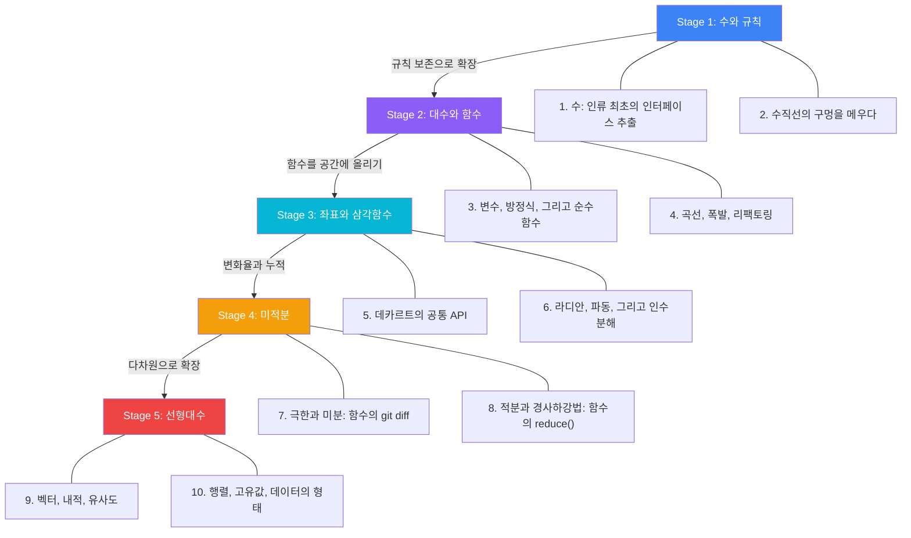

# Math Re:Loaded

## 프로그래밍으로 수학을 다시 이해하다

<Callout type="info" title="이 시리즈는">
수학을 처음 배우는 게 아니라 **다시 이해하는** 시리즈야. 12년간 정규교육을 받았지만 "왜?"를 건너뛰었던 것들을, 프로그래머의 시선으로 재구성해. 공식 암기가 아니라 **구조와 직관**을 잡는 게 목표야.
</Callout>

---

## 핵심 테제

수학과 프로그래밍은 다른 학문이 아니야. 둘 다 **논리학이라는 같은 뿌리**에서 나온 같은 활동이거든. 규칙을 정의하고, 보존하며 확장하고, 복잡한 것을 단순한 것으로 분해한다 -- 이건 수학자가 하는 일이기도 하고, 프로그래머가 매일 하는 일이기도 해.

이 시리즈는 그 연결고리를 따라간다.

---

## 로드맵

---

## 5대 반복 테마

이 시리즈에는 수학 전체를 관통하는 5가지 패턴이 반복 등장해. 글을 읽다 보면 `Callout`으로 마킹해놓을 거야.

| 테마 | 수학에서 | 프로그래밍에서 |
|------|----------|---------------|
| **규칙 보존** | 기존 공리를 깨지 않으면서 수 체계를 확장 | 인터페이스를 확장하되 기존 동작은 유지 |
| **연산 ↔ 역연산** | 덧셈↔뺄셈, 곱셈↔나눗셈, 미분↔적분 | encode↔decode, push↔pop, undo/redo |
| **분해** | 인수분해, 소인수분해, 고유값 분해 | 리팩토링, 관심사 분리, 마이크로서비스 |
| **직교성** | 독립적인 축, 직교 벡터, 편미분 | zero coupling, 단일 책임 원칙 |
| **코드 동형** | 수학 구조 = 프로그래밍 패턴의 1:1 대응 | 함수=함수, 행렬=변환, 미분=diff |

---

## Stage별 미리보기

### Stage 1: 수와 규칙 (Article 1-2)

수는 구체적 사물에서 **인터페이스를 추출**한 것이야. 사과 3개, 돌 3개, 사람 3명에서 "개수"라는 공통 속성만 뽑아낸 게 "3"이라는 숫자거든. 여기서 출발해서, 왜 음수 곱하기 음수가 양수인지, 왜 나눗셈은 뒤집어서 곱하는지를 "규칙 보존"이라는 단 하나의 원리로 풀어.

### Stage 2: 대수와 함수 (Article 3-4)

구체적인 수에서 **구조 자체**를 다루기 시작해. 변수는 미지수의 placeholder이고, 방정식은 문제 명세서이고, 함수는 입력→출력 매핑이야. 수학의 함수가 프로그래밍의 순수함수와 정확히 같다는 걸 확인하고, 인수분해가 왜 리팩토링인지를 본다.

### Stage 3: 좌표와 삼각함수 (Article 5-6)

데카르트가 대수와 기하를 하나로 통합한 건, 두 시스템의 **공통 API**를 만든 거야. 삼각함수는 "삼각형 공식"이 아니라 회전과 주기를 표현하는 도구이고, 푸리에 변환은 파동의 인수분해야.

### Stage 4: 미적분 (Article 7-8)

미분은 함수의 `git diff`야 -- 각 지점에서 "얼마나 변했는가"를 새 함수로 만들어내는 것. 적분은 `reduce()` -- 잘게 쪼개서 누적하는 것. 이 둘이 정확한 역관계라는 게 미적분의 기본정리이고, 편미분과 그래디언트가 선형대수로의 다리를 놓아줘.

### Stage 5: 선형대수 (Article 9-10)

벡터는 배열이고, 행렬은 함수의 구현체야. 내적은 "두 벡터가 얼마나 같은 방향인가"이고, 고유벡터는 변환의 자연스러운 축이야. 여기까지 오면 그래픽스, ML, 검색 엔진이 전부 같은 수학 위에서 돌아가고 있다는 게 보여.

---

## 시리즈 목차

  <Card href="/docs/math/1.numbers-and-rules" title="1. 수: 인류 최초의 인터페이스 추출">
    곱셈의 확장, 음수의 발명, 나눗셈 = undo, 멱등성과 항등원
  </Card>
  <Card href="/docs/math/2.extending-the-number-line" title="2. 수직선의 구멍을 메우다">
    무리수의 발견, 실수의 완성, 차원의 확장, 거듭제곱과 로그
  </Card>
  <Card href="/docs/math/3.algebra-and-functions" title="3. 변수, 방정식, 그리고 순수함수">
    변수의 두 얼굴, 역연산 체인, 순수성 vs 멱등성, 함수 합성
  </Card>
  <Card href="/docs/math/4.curves-and-explosions" title="4. 곡선, 폭발, 리팩토링">
    이차함수와 가속도, 인수분해 = 리팩토링, 지수함수와 e
  </Card>
  <Card href="/docs/math/5.coordinates-and-trig" title="5. 데카르트의 공통 API">
    좌표계 통합, 직교성, 거리와 중점, 원과 삼각비
  </Card>
  <Card href="/docs/math/6.waves-and-fourier" title="6. 라디안, 파동, 그리고 인수분해">
    라디안의 필연성, 사인파의 해부, 푸리에 변환
  </Card>
  <Card href="/docs/math/7.limits-and-derivatives" title="7. 극한과 미분: 함수의 git diff">
    극한의 정의, 미분의 세 규칙, 연쇄 법칙 = 역전파
  </Card>
  <Card href="/docs/math/8.integration-and-gradient" title="8. 적분과 경사하강법: 함수의 reduce()">
    적분의 의미, 미적분 기본정리, 편미분, 경사하강법
  </Card>
  <Card href="/docs/math/9.vectors-and-similarity" title="9. 벡터, 내적, 유사도">
    벡터의 세 얼굴, 내적의 의미, 코사인 유사도
  </Card>
  <Card href="/docs/math/10.matrices-and-eigenvalues" title="10. 행렬, 고유값, 데이터의 형태">
    행렬 = 함수, 행렬곱 = 합성, 고유값 분해, PCA와 PageRank
  </Card>

---

## 이 시리즈의 약속

- 공식 먼저 ❌ → **직관과 "왜?"를 먼저**, 공식은 나중에 자연스럽게
- 코드와 시각적 비유로 설명
- 외우지 말고 **도출**하기 -- 규칙 보존에서 결론이 필연적으로 따라오는 과정을 체험

시작해보자.
