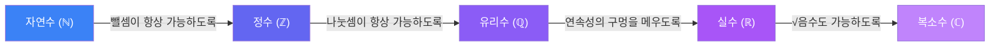

# 수: 인류 최초의 인터페이스 추출

프로그래머라면 인터페이스 추출(Extract Interface)을 해본 적이 있을 거야. 여러 클래스에서 공통된 행위를 뽑아내서 하나의 계약으로 정의하는 것. 인류가 "수"를 발명한 과정이 정확히 이거야.

---

## "3"이 뭐야?

사과 3개, 돌 3개, 사람 3명 -- 이것들은 전혀 다른 물건이지만, 우리는 거기서 공통된 무언가를 뽑아냈어. 그게 "3"이라는 숫자야.

```
사과 3개  ─┐
돌 3개    ─┼─→ 추상화 → "3" (개수라는 속성)
사람 3명  ─┘
```

이 추상화가 왜 대단하냐면, "사과에 대한 규칙"과 "돌에 대한 규칙"을 따로 만들 필요 없이, **수에 대한 규칙 하나로 모든 걸 다룰 수 있게** 됐거든. 코드 재사용의 원조라고 할 수 있지.

<MathCodeBridge title="추상화: 구체 → 인터페이스" connections="구체적 사물 :: 구체적 클래스 | 수 (추상화) :: 인터페이스 | 산술 규칙 :: 공통 메서드">

```math
사과 3개 + 사과 5개 = 사과 8개
돌 3개 + 돌 5개 = 돌 8개
사람 3명 + 사람 5명 = 사람 8명

→ 공통 규칙 추출: 3 + 5 = 8
```

```ts
// 구체적 클래스마다 로직을 만드는 대신
apple.add(3, 5)  // 8
stone.add(3, 5)  // 8
person.add(3, 5) // 8

// 인터페이스를 추출한다
Number.add(3, 5) // 8
```

</MathCodeBridge>

### 덧셈의 규칙

덧셈은 "합치기"야. 두 무더기를 하나로 모으면 몇 개인지 세는 행위. 여기서 중요한 성질이 따라와:

- **교환법칙**: `3 + 5 = 5 + 3` → 어느 무더기를 먼저 놓든 결과는 같아
- **결합법칙**: `(2 + 3) + 4 = 2 + (3 + 4)` → 어떤 순서로 합치든 같아

"당연한 거 아냐?"라고 생각할 수 있는데, 곱셈으로 가면 당연하지 않은 것도 있어. 행렬곱은 교환법칙이 안 돼 -- Article 10에서 만나게 될 거야.

---

## 곱셈: 반복 덧셈을 넘어서

`3 × 4 = 3 + 3 + 3 + 3 = 12`. 곱셈은 반복 덧셈이라고 배웠을 텐데, 이건 반만 맞아.

`3 × 0.5`는? "3을 0.5번 더한다"는 말이 안 되잖아.

그래서 수학자들이 한 건, 곱셈을 재정의한 게 아니라 **확장**한 거야. TypeScript에서 인터페이스를 처음에 `number`만 다루게 만들었는데, 나중에 `float`도 처리해야 할 때 기존 동작을 깨지 않으면서 확장하잖아. 수학도 똑같아.

### 규칙 보존으로 도출하기

자연수에서 성립하는 핵심 규칙 두 가지:

1. `a × 1 = a` (1을 곱하면 안 변한다)
2. `a × (b + c) = a×b + a×c` (분배법칙)

<Steps>
<Step title="출발점">
`3 × 1 = 3` -- 규칙 1에 의해 자명
</Step>
<Step title="1을 분해">
`3 × (0.5 + 0.5) = 3 × 1 = 3` -- 0.5 + 0.5 = 1이니까
</Step>
<Step title="분배법칙 적용">
`3 × 0.5 + 3 × 0.5 = 3` -- 규칙 2를 적용
</Step>
<Step title="필연적 결론">
**`3 × 0.5 = 1.5`** -- 이게 "선택"이 아니라 "필연"
</Step>
</Steps>

`3 × 0.5 = 1.5`인 건 누가 정한 게 아니라, **기존 규칙을 깨지 않으려면 이 값일 수밖에 없어서** 그렇게 된 거야.

<Callout type="note" title="반복 테마: 규칙 보존">
이게 수학 전체에서 반복되는 패턴이야. 음수의 곱셈도, 거듭제곱의 확장도 전부 이 원리로 돌아가. **"기존 규칙이 깨지지 않으려면 이렇게 될 수밖에 없다"**는 논리. 프로그래밍에서 인터페이스를 확장할 때 기존 계약을 깨면 안 되는 것과 같아.
</Callout>

---

## 음수의 발명: 방향이 추가되다

### 왜 음수가 필요했을까?

자연수만 있으면 `3 - 5 = ?`에 답할 수 없어. 가진 게 3개인데 5개를 빼라니. 자연수 세계에서는 이게 에러야.

그런데 현실에서는 이런 상황이 필요해 -- 빚, 온도, 해수면 아래 깊이. "없는 것보다 더 적은 상태"를 표현해야 했어.

```
... -3  -2  -1   0   1   2   3 ...
◄────────────────┼────────────────►
    반대쪽         │         원래 자연수
```

음수는 별도의 새로운 종류의 수가 아니라, **"방향"이라는 개념이 수에 추가된 것**이야. 양수가 오른쪽이면, 음수는 왼쪽. 같은 수직선 위에서 부호가 방향을 나타내는 거지.

### (-1) × (-1) = 1, 왜?

음수의 덧셈은 직관적이야. `-3 + 5 = 2` -- 왼쪽으로 3 갔다가 오른쪽으로 5 가면 결국 오른쪽 2에 있어.

문제는 곱셈이야. 음수 × 음수 = 양수, 왜?

아까 배운 "규칙 보존" 원리를 그대로 적용해보자. 우리가 지키고 싶은 규칙: **분배법칙**.

<Steps>
<Step title="0을 만든다">
`-1 × (1 + (-1)) = -1 × 0 = 0` -- 괄호 안이 0이니까 결과는 0
</Step>
<Step title="분배법칙 적용">
`-1 × 1 + (-1) × (-1) = 0` -- 분배법칙으로 전개
</Step>
<Step title="알려진 값 대입">
`-1 + (-1) × (-1) = 0` -- `-1 × 1 = -1`은 자연스러우니까
</Step>
<Step title="필연적 결론">
**`(-1) × (-1) = 1`** -- 분배법칙이 성립하려면 이 값일 수밖에 없다
</Step>
</Steps>

이건 선택이 아니야. 분배법칙이 계속 성립하려면, `(-1) × (-1)`은 1일 수밖에 없어. 다른 값이면 분배법칙이 깨져.

<Callout type="info" title="찜찜함에 대해">
"근데 왜 하필 그 규칙을 보존해야 하는데?"라는 질문이 남을 수 있어. 솔직히 말하면 그건 **선택**이야 -- 분배법칙을 포기하는 수 체계를 만들 수도 있어. 다만 그러면 쓸모가 급격히 떨어져서 아무도 안 쓰는 거지. 수학의 "필연"은 사실 **"이게 가장 유용한 선택"**에 가까워.
</Callout>

### 확장의 패턴

여기서 패턴이 보여:

1. 기존 수 체계에서 못 하는 연산이 생김 (`3 - 5 = ?`)
2. 새로운 수를 도입 (음수)
3. 기존 규칙이 깨지지 않도록 새로운 수의 연산을 정의
4. 그 정의에서 "의외의" 성질이 필연적으로 따라옴 (음수 × 음수 = 양수)

이 패턴은 분수, 무리수, 복소수까지 전부 반복돼.

---

## 나눗셈: 곱셈의 Undo

### 나눗셈의 본질

곱셈이 "반복 덧셈"이었다면, 나눗셈은 "반복 뺄셈"으로 시작할 수 있어. `12 ÷ 3 = ?` → 12에서 3을 몇 번 뺄 수 있나? 4번.

근데 이것도 자연수에서만 깔끔해. `7 ÷ 3`은 딱 안 떨어지잖아. 그래서 분수가 필요해져.

### 분수: 새로운 데이터 타입

`3/4`을 "3 나누기 4"라고 배웠겠지만, 더 근본적인 의미는 **"1을 4등분한 것 중 3조각"**이야.

프로그래밍으로 비유하면, 분수는 연산이 아니라 **데이터 타입**이야. 정수로 표현 못 하는 값을 담기 위해 `(분자, 분모)` 페어로 수를 표현하는 새로운 자료구조인 거지.

```
정수: 3        → 하나의 값
분수: (3, 4)   → 두 값의 쌍으로 하나의 수를 표현
```

### 왜 뒤집어서 곱하는가

나눗셈의 정의부터 다시 보자. `a ÷ b`는 **"b를 곱하면 a가 되는 수"**야.

즉, `a ÷ b = x`라 함은 `x × b = a`라는 뜻이야. 나눗셈은 독립적인 연산이 아니라, **곱셈의 역질문**이야.

<Steps>
<Step title="문제 설정">
`(2/3) ÷ (4/5) = ?` → `x × (4/5) = 2/3`을 만족하는 x를 찾아라
</Step>
<Step title="역수를 곱한다">
양변에 `(4/5)`의 역수 `(5/4)`를 곱하면: `x = (2/3) × (5/4)`
</Step>
<Step title="결론">
**"뒤집어서 곱하기"는 공식이 아니라, "나눗셈 = 곱셈의 역"이라는 정의에서 자동으로 나오는 결과**
</Step>
</Steps>

<Callout type="note" title="반복 테마: 연산 ↔ 역연산">
모든 연산에는 그걸 되돌리는 역연산이 있어. 곱셈의 역연산이 "역수를 곱하기"이고, 우리가 그걸 편의상 "나눗셈"이라고 부르는 것뿐이야. 프로그래밍의 `encrypt ↔ decrypt`, `encode ↔ decode`와 같은 구조야.
</Callout>

### 역연산 쌍 테이블

| 연산 | 역연산 | 관계 |
|------|--------|------|
| 덧셈 (+3) | 뺄셈 (-3) | 더한 걸 되돌림 |
| 곱셈 (×4/5) | 역수를 곱함 (×5/4) | 곱한 걸 되돌림 |
| 거듭제곱 (2³=8) | 로그 (log₂8=3) | "몇 번?"의 역질문 |
| 미분 | 적분 | 변화율 ↔ 누적 |
| 행렬곱 | 역행렬 | 변환 ↔ 역변환 |

나눗셈은 별도의 연산이 아니라 **곱셈의 undo**야. 이 "연산 ↔ 역연산" 쌍은 앞으로 계속 나와.

---

## 역수와 항등원: 구조의 언어

여기서 잠깐 멈추고, 연산의 구조를 분류하는 도구들을 짚고 가자. 이게 나중에 선형대수까지 쭉 써먹히거든.

### 항등원 (Identity Element)

연산해도 상대방이 안 변하게 하는 특별한 값:

| 연산 | 항등원 | 의미 |
|------|--------|------|
| 덧셈 | 0 | `a + 0 = a` |
| 곱셈 | 1 | `a × 1 = a` |
| 합집합 | ∅ (공집합) | `A ∪ ∅ = A` |
| 행렬곱 | I (단위행렬) | `A × I = A` |

아까 "역수를 곱하면 1이 된다"고 했잖아. 그 1이 바로 곱셈의 항등원이야. **역연산이란 결국 항등원으로 되돌리는 것**이지.

<MathCodeBridge title="항등원의 프로그래밍 대응" connections="항등원 :: no-op 값 | 역원 :: undo 연산">

```math
a + 0 = a       (덧셈의 항등원)
a × 1 = a       (곱셈의 항등원)
A ∪ ∅ = A       (합집합의 항등원)
A × I = A       (행렬곱의 항등원)
```

```ts
arr.concat([])    // 빈 배열 concat = 그대로
str + ""           // 빈 문자열 concat = 그대로
x * 1              // 1 곱하기 = 그대로
compose(f, id)     // id 함수와 합성 = 그대로
```

</MathCodeBridge>

### 역원 (Inverse)

연산하면 항등원이 되는 짝꿍:

```
3 + (-3) = 0      → -3은 3의 덧셈 역원
4/5 × 5/4 = 1     → 5/4는 4/5의 곱셈 역원
A × A⁻¹ = I       → A⁻¹은 A의 행렬곱 역원
```

**항등원 → 역원 → 역연산**, 이 세 개는 한 세트야.

### 멱등성 (Idempotency)

같은 연산을 여러 번 해도 결과가 안 변하는 성질.

<Tabs defaultValue="code">
  <TabsList>
    <TabsTrigger value="code">Code</TabsTrigger>
    <TabsTrigger value="math">Math</TabsTrigger>
  </TabsList>
  <TabsContent value="code">

```javascript
// 멱등한 것
Math.abs(Math.abs(-3)) === Math.abs(-3)   // true
Set.add(x).add(x)  // x가 한 번만 들어감
// HTTP PUT 여러 번 보내도 결과 동일

// 멱등하지 않은 것
x + 1을 두 번 하면 x + 2  // 결과 달라짐
// HTTP POST 여러 번 → 리소스 여러 개
```

  </TabsContent>
  <TabsContent value="math">

```
멱등한 연산:
  A ∪ A = A    (자기 자신과 합집합 = 자기 자신)
  A ∩ A = A    (자기 자신과 교집합 = 자기 자신)
  ||-3|| = |-3| = 3  (절댓값 두 번 = 한 번)

멱등하지 않은 연산:
  3 + 3 ≠ 3   (덧셈은 누적하는 연산)
  3² = 9 ≠ 3  (거듭제곱도 누적)
```

  </TabsContent>
</Tabs>

<Callout type="warning" title="순수성 ≠ 멱등성">
이 두 개를 혼동하기 쉬운데, 분명히 다른 개념이야.

- **순수성** (Referential Transparency): 같은 입력 → 항상 같은 출력. 부수효과 없음. 수학의 함수는 **항상** 만족.
- **멱등성** (Idempotency): `f(f(x)) = f(x)`. 한 번 적용한 것과 두 번 적용한 결과가 같다. **일부** 함수만 만족.

`f(x) = x²`는 완벽한 순수함수이지만 `f(f(3)) = f(9) = 81 ≠ 9`이므로 멱등하지 않아. **순수하지만 멱등하지 않은** 거야.
</Callout>

---

## 역/이/대우: 논리적 추론의 도구

원래 명제가 **"P이면 Q이다" (P → Q)**일 때:

| 이름 | 형태 | 예시 ("비가 오면 땅이 젖는다") |
|------|------|------|
| 원명제 | P → Q | 비가 오면 → 땅이 젖는다 |
| 역 (Converse) | Q → P | 땅이 젖으면 → 비가 왔다 |
| 이 (Inverse) | ¬P → ¬Q | 비가 안 오면 → 땅이 안 젖는다 |
| 대우 (Contrapositive) | ¬Q → ¬P | 땅이 안 젖었으면 → 비가 안 왔다 |

핵심: **원명제와 대우는 항상 진리값이 같다.** 역과 이도 서로 같다. 하지만 원명제와 역은 독립이야.

<MathCodeBridge title="역/이/대우의 프로그래밍 대응" connections="원명제 (P→Q) :: if (P) then Q | 대우 (¬Q→¬P) :: if (!Q) then !P">

```math
원명제: P → Q          (참)
역:    Q → P          (독립)
이:    ¬P → ¬Q        (독립)
대우:  ¬Q → ¬P        (참, 원명제와 동치)
```

```ts
// 원명제: input이 null이면 → 에러가 난다 (참)
if (input === null) throw Error()

// 역: 에러가 나면 → input이 null이었다 (거짓!)
// 다른 이유로도 에러 가능

// 이: input이 null 아니면 → 에러 안 난다 (거짓!)
// 다른 에러 가능

// 대우: 에러가 안 났으면 → input이 null 아니었다 (참!)
// 원명제와 동치
```

</MathCodeBridge>

대우가 왜 유용하냐면, 직접 증명하기 어려울 때 대우를 증명하면 되기 때문이야. "A이면 B다"를 보이기 힘들면, "B가 아니면 A가 아니다"를 보여도 같은 거거든. 이건 다음 글에서 √2의 무리수 증명에 바로 써먹어.

---

## 수학의 확장 패턴: 정리

지금까지 다룬 걸 관통하는 하나의 원리:

> **수학은 "연산을 정의하고, 규칙을 보존하면서 확장하고, 역연산을 만드는" 과정의 반복이다.**



| 확장 | 해결한 문제 | 보존한 규칙 |
|------|------------|------------|
| 자연수 → 정수 | `3 - 5 = ?` | 덧셈의 교환/결합법칙 |
| 정수 → 유리수 | `7 ÷ 3 = ?` | 곱셈의 교환/결합/분배법칙 |
| 유리수 → 실수 | 수직선의 구멍 (√2) | 모든 산술 규칙 + 연속성 |
| 실수 → 복소수 | `x² + 1 = 0` | 모든 기존 규칙 + 대수적 완비 |

<Callout type="note" title="반복 테마: 코드 동형">
수 체계의 확장은 프로그래밍의 타입 시스템 확장과 구조적으로 동일해.

- `int` → `float` → `complex` -- 기존 연산을 깨지 않으면서 표현 범위를 넓히는 과정.
- 각 확장에서 기존 규칙(인터페이스)이 보존되어야 한다는 제약이 새로운 타입의 행위를 **필연적으로** 결정한다.
</Callout>

---

## 다음 글 미리보기

다음 글에서는 **유리수에서 실수로의 확장** -- 수직선의 구멍을 메우는 이야기를 해. √2가 분수로 표현 불가능하다는 충격적인 사실을 귀류법으로 증명하고, 점·선·면의 차원 확장, 거듭제곱과 로그까지 다뤄.

그리고 방금 배운 "대우"가 바로 써먹히는 순간이 와.
