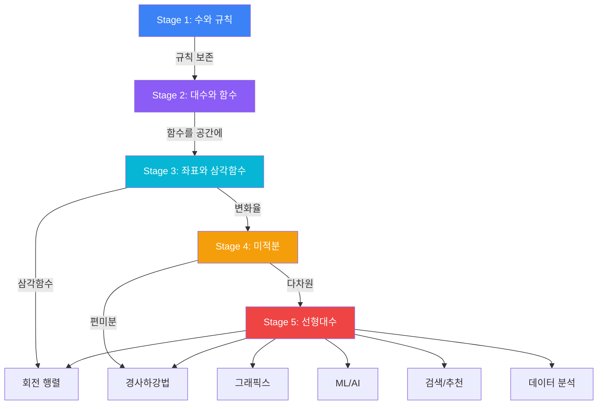

# 행렬, 고유값, 그리고 데이터의 형태

행렬을 처음 보면 그냥 숫자를 사각형으로 배열한 것 같아. 근데 이걸 "숫자 테이블"로 보면 본질을 놓쳐. 행렬의 진짜 정체는:

> **행렬은 벡터를 다른 벡터로 보내는 함수다.**

---

## 행렬 = 변환

<MathCodeBridge title="행렬 = 함수의 구현체" connections="행렬 :: LinearTransform 구현체 | 행렬 × 벡터 :: transform.apply(v) | 행렬 크기 (m×n) :: 타입 시그니처">

```math
A = | 2  0 |
    | 0  3 |

A * [1, 1] = [2, 3]

"x 방향으로 2배, y 방향으로 3배 늘리기"

f: ℝ² → ℝ², f(v) = Av
```

```ts
interface LinearTransform {
  apply(input: Vector): Vector
}

class Matrix implements LinearTransform {
  // the numbers = how to transform
  // each column = where each basis goes
  apply(v: Vector): Vector {
    return this.multiply(v);
  }
}

// 행렬 크기 = 타입 시그니처
// 3×2 matrix: (v: Vec2) => Vec3
```

</MathCodeBridge>

그리고 행렬이 표현하는 함수는 아무 함수나 되는 게 아니라 **선형 함수**만 돼:

```
A(u + v) = A(u) + A(v)      preserves addition
A(cv) = c * A(v)            preserves scaling
```

직선은 직선으로, 원점은 원점으로, 평행선은 평행선으로 보내. 공간을 "찌그러뜨릴" 순 있지만, "구부리진" 않아.

### 행렬의 열 = 기저벡터의 목적지

```
A = | a  b |
    | c  d |

first column [a, c]:  where [1, 0] (x-axis) goes
second column [b, d]: where [0, 1] (y-axis) goes
```

좌표축이 어디로 이동하는지를 알면, 공간 전체의 변환이 결정돼. **이게 행렬을 읽는 법이야.**

### 다양한 변환 예시

| 변환 | 행렬 | 설명 |
|------|------|------|
| 스케일링 | `[[2,0],[0,3]]` | x 2배, y 3배 |
| 90° 회전 | `[[0,-1],[1,0]]` | 반시계 회전 |
| 반사 (x축) | `[[1,0],[0,-1]]` | y 뒤집기 |
| 전단 (shear) | `[[1,1],[0,1]]` | x축은 고정, y축 기울임 |

---

## 행렬곱 = 함수 합성

행렬곱의 규칙이 이상해 보이는 이유가 있어:

```
"why rows times columns??"
"why not just multiply element by element??"
```

답: **행렬은 함수이고, 행렬곱은 함수 합성이니까.**

```
v  --[B]-->  Bv  --[A]-->  A(Bv)

"first B, then A" = A × B
```

Article 3에서 함수 합성 `g(f(x))`가 "f 먼저, g 다음"이었잖아. 행렬곱도 같아.

### 왜 교환법칙이 안 되는가

```
A * B ≠ B * A  (in general)

"scale then rotate" ≠ "rotate then scale"
```

이건 결함이 아니야. 현실의 변환이 순서에 의존하기 때문에 그걸 정확히 반영하는 거야. 셔츠를 입고 재킷을 입는 것과 재킷을 입고 셔츠를 입는 건 다르잖아.

### 행 × 열 규칙이 자동으로 나오는 이유

```
AB의 column 1 = A * (column 1 of B)
AB의 column 2 = A * (column 2 of B)

B sends [1,0] to its first column
A then transforms that result
→ this gives the first column of AB
```

**"기저벡터를 추적한 결과"에서 자동으로 나와.** 누가 임의로 정한 게 아니야.

---

## 행렬식 (Determinant): 넓이/부피 배율

한 문장 정의:

> **"이 변환이 공간의 넓이(부피)를 몇 배로 바꾸는가"**

```
2x2 matrix:
   unit square (area = 1)  -- A -->  parallelogram (area = |det(A)|)

det(A) = ad - bc  (for 2x2)
```

### det의 부호가 말해주는 것

| det | 의미 |
|-----|------|
| det > 0 | 방향 보존 (시계→시계) |
| det < 0 | 방향 뒤집힘 (거울 반사) |
| **det = 0** | **공간이 찌그러짐 (차원 축소)** |

### det = 0: 가장 중요한 경우

```
| 2  4 |    column 2 = 2 * column 1
| 1  2 |    both columns point same direction!

det = 2*2 - 4*1 = 0

this matrix sends ALL of 2D onto a single line
area goes to zero → information lost → not invertible
```

| det ≠ 0 | det = 0 |
|---------|---------|
| 역행렬 존재 | 역행렬 없음 |
| `Ax = b` 유일한 해 | 해 없음 또는 무한 |
| 정보 보존 | 정보 손실 |
| 공간 늘어남 | 공간 찌그러짐 |

---

## 고유값과 고유벡터: 선형대수의 클라이맥스

### 핵심 질문

행렬은 벡터를 변환해. 대부분의 벡터는 방향이 바뀌어. 근데 **어떤 벡터는 변환해도 방향이 안 바뀌고 크기만 달라져.**

```
A = | 2  1 |
    | 0  3 |

A * [1, 0] = [2, 0] = 2 * [1, 0]   ← direction unchanged! scale = 2
A * [1, 1] = [3, 3] = 3 * [1, 1]   ← direction unchanged! scale = 3
A * [0, 1] = [1, 3]                 ← direction CHANGED
```

그런 특별한 벡터가 **고유벡터(eigenvector)**, 크기가 변하는 배율이 **고유값(eigenvalue)**:

```
A * v = λ * v

A: transformation
v: eigenvector     (direction unchanged)
λ: eigenvalue      (scale factor)
```

### 왜 "고유한(eigen)"인가

모든 행렬에는 그 행렬의 본질적인 성격을 드러내는 특별한 방향이 있어. 아무리 복잡한 변환이라도, 고유벡터 방향에서 보면 그냥 "늘이기/줄이기"일 뿐이야.

```
complex transformation = rotation + stretch + shear + ...

viewed from eigenvector directions:
  = just scaling in each direction

eigenvectors DIAGONALIZE the transformation
  = find the "natural axes" of the transformation
```

<Callout type="note" title="반복 테마: 분해">
복잡한 변환을 고유벡터 방향에서 보면 단순한 스케일링들의 조합이 돼. 인수분해, 푸리에 변환과 같은 철학 -- **복잡한 것을 기본 단위로 분해**하는 거야.
</Callout>

### det = 고유값의 곱

```
eigenvalues of | 2  1 | are 2 and 3
               | 0  3 |

det = 2 * 3 = 6

if any eigenvalue = 0 → det = 0 → not invertible
```

**행렬식이 고유값의 곱이야.** "넓이 배율 = 각 고유 방향 배율의 곱". 모든 것이 연결돼.

---

## 응용: 전부 연결된다

### 그래픽스: 행렬 = 화면에 보이는 모든 것

```
3D graphics pipeline:
  model → [Model Matrix] → world
  world → [View Matrix]  → camera
  camera → [Projection]  → 2D screen pixels

every frame, every vertex, multiplied by matrices
GPU exists because of this: massively parallel matrix math
```

```javascript
// a 3D rotation is just a matrix multiplication
const rotateY = (angle) => [
  [Math.cos(angle),  0, Math.sin(angle)],
  [0,                1, 0              ],
  [-Math.sin(angle), 0, Math.cos(angle)]
];
// Stage 3의 삼각함수가 회전 행렬 안에!
```

### 머신러닝: 전부 행렬 연산

```
neural network = matrix multiplications + activations

layer 1:  h1 = activate(W1 * input + b1)
layer 2:  h2 = activate(W2 * h1 + b2)
output:   y  = activate(W3 * h2 + b3)

W1, W2, W3 = weight matrices (learned by gradient descent)
```

Stage 4의 편미분 + Stage 5의 행렬 = **딥러닝의 수학적 기반**.

### PCA: 데이터의 형태를 읽다

```
PCA (Principal Component Analysis):

1. compute covariance matrix of data
2. find eigenvectors and eigenvalues
3. eigenvectors with LARGEST eigenvalues
   = directions where data varies most
4. project data onto those directions

1000D data → top 2 eigenvectors → 2D visualization
             (captures most important patterns)
```

고유벡터가 **"데이터에서 가장 중요한 방향"**을 찾아주는 거야.

### SVD: 행렬의 인수분해

```
SVD (Singular Value Decomposition):

any matrix M = U × S × V^T

"decompose any transformation into:
 rotate → scale → rotate"

like prime factorization, but for matrices
```

Netflix 추천 시스템이 바로 이거야. 사용자-영화 평점 행렬을 SVD로 분해하면, 빈 칸(아직 안 본 영화)을 예측할 수 있어.

---

## 전체 시리즈 연결 지도



---

## 시리즈 마무리

이 여정에서 계속 반복된 하나의 원리:

> **"규칙을 정의하고, 보존하면서 확장하고, 복잡한 것을 단순한 것으로 분해한다."**

수학이든 프로그래밍이든 이게 근간이야.

| 반복 테마 | 등장한 곳 |
|----------|----------|
| 규칙 보존 | 음수의 곱셈, 거듭제곱의 확장, 삼각비→삼각함수 |
| 연산 ↔ 역연산 | 덧셈↔뺄셈, 곱셈↔나눗셈, 미분↔적분, 행렬↔역행렬 |
| 분해 | 인수분해, 푸리에 변환, 고유값 분해, SVD |
| 직교성 | 좌표축, 편미분, 내적=0, 기저벡터 |
| 코드 동형 | 함수=함수, 타입=정의역, 행렬=변환, diff=미분 |

각 글에서 다룬 것은 전체의 1회 훑기에 가까워. 특정 토픽을 더 깊이 파고 싶다면 언제든 다시 돌아와도 돼. 외운 값은 까먹지만, 이해한 구조는 남으니까.
