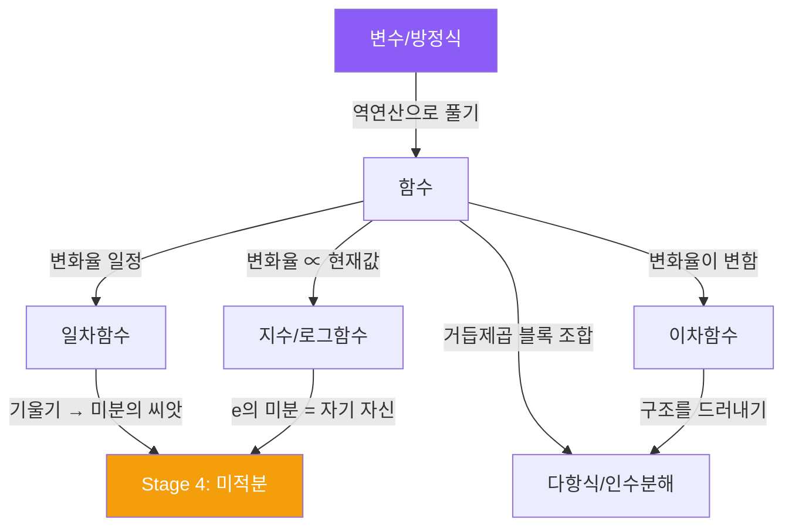

# 곡선, 폭발, 리팩토링

일차함수는 기울기가 일정했어. 매번 같은 양만큼 변하는, 예측 가능한 세계. 이제 **기울기 자체가 변하는** 세계로 넘어간다.

---

## 이차함수: 변화율의 변화율

```
f(x) = x²

x=0 → 0
x=1 → 1    (1 증가)
x=2 → 4    (3 증가)
x=3 → 9    (5 증가)
x=4 → 16   (7 증가)
```

출력의 증가량이 1, 3, 5, 7로 점점 커지고 있어. 변화율 자체가 변하는 거야.

근데 재밌는 게 있어. **증가량의 증가량**을 보면:

```
증가량:         1, 3, 5, 7
증가량의 증가량:   2, 2, 2     ← 일정!
```

**변화율의 변화율이 일정하다.** 이게 이차함수의 본질이야.

<MathCodeBridge title="일차 vs 이차 = 속도 vs 가속도" connections="일차함수 :: 등속 루프 | 이차함수 :: 가속 루프 | 기울기 (f') :: velocity | 기울기의 기울기 (f'') :: acceleration">

```math
일차: f(x) = ax + b
→ 변화율 = a (일정)
→ "등속 운동"

이차: f(x) = ax² + bx + c
→ 변화율 = 2ax + b (변함)
→ 변화율의 변화율 = 2a (일정)
→ "등가속 운동"
```

```ts
// 등속: 매 프레임 같은 거리 이동
position += velocity;  // velocity 일정

// 등가속: 매 프레임 속도가 변함
velocity += acceleration;  // acceleration 일정
position += velocity;
```

</MathCodeBridge>

공을 위로 던지면 포물선을 그리는 이유가 이거야. 중력이 일정한 가속도를 주니까, 위치가 시간의 이차함수가 되는 거지.

### 꼭짓점 = 최적화 지점

포물선에는 방향이 바뀌는 지점이 딱 하나 있어. 기울기가 양수에서 음수로 (또는 반대로) 바뀌는 순간. 이 점이 **꼭짓점**이야.

```
f(x) = x² - 4x + 7

꼭짓점의 x좌표 = -b/(2a) = 4/2 = 2
f(2) = 4 - 8 + 7 = 3

꼭짓점: (2, 3) → 이 함수의 최솟값은 3
```

왜 이게 중요하냐면, 현실의 최적화 문제가 결국 **"함수의 꼭짓점을 찾아라"**이거든. 비용을 최소화하고 싶다, 이익을 최대화하고 싶다 -- 전부 함수의 극값을 찾는 문제야. 미적분이 강력한 이유가 이거지. 아무 함수에서든 "방향이 바뀌는 점"을 체계적으로 찾을 수 있게 해주니까.

<Callout type="info" title="미리보기: 경사하강법">
머신러닝에서 "손실함수(loss function)를 최소화"하는 것도 정확히 이 문제야. 다만 변수가 수백만 개인 고차원 함수의 최솟값을 찾는 거지. Article 8에서 다시 만나.
</Callout>

---

## 인수분해 = 리팩토링

### 인수분해의 본질

인수분해의 본질은 **"덧셈 형태를 곱셈 형태로 바꾸기"**야.

```
x² - 4x + 3 = (x - 1)(x - 3)
  덧셈 구조        곱셈 구조
```

왜 곱셈 형태가 유용하냐면, **"언제 0이 되는가"가 바로 보이니까.**

```
(x - 1)(x - 3) = 0
→ x = 1 또는 x = 3    ← 즉시 답이 보임
```

곱셈에서 결과가 0이 되려면 인수 중 하나가 0이면 돼. 이 단순한 사실 때문에 인수분해가 강력한 거야.

<Tabs defaultValue="refactor">
  <TabsList>
    <TabsTrigger value="refactor">리팩토링 비유</TabsTrigger>
    <TabsTrigger value="math">수학</TabsTrigger>
  </TabsList>
  <TabsContent value="refactor">

```javascript
// 덧셈 형태 — 전체 구조 파악이 어려움
const f = (x) => x*x - 4*x + 3;

// 인수분해 형태 — "어디서 0인지"가 명확
const f = (x) => (x - 1) * (x - 3);

// 둘은 완전히 같은 함수. 표현만 다름.
// 리팩토링 = 동작은 보존하고 구조를 드러내기
```

  </TabsContent>
  <TabsContent value="math">

```
x² - 4x + 3 = (x - 1)(x - 3)

왼쪽: 구조가 숨겨져 있음 (어디서 0인지 안 보임)
오른쪽: 구조가 드러남 (x=1, x=3에서 0)

3차도 같음:
x³ - 6x² + 11x - 6 = (x-1)(x-2)(x-3)
→ 근이 1, 2, 3이라는 게 한눈에 보임
```

  </TabsContent>
</Tabs>

<Callout type="note" title="반복 테마: 분해">
인수분해 = 리팩토링. 둘 다 목적이 같아 -- **구조를 드러내서 문제를 쉽게 만드는 것**.
</Callout>

### 인수분해 = 소인수분해와 같은 구조

```
숫자:    12 = 2 × 2 × 3                          ← 더 이상 못 쪼갬
다항식:  x³ - 6x² + 11x - 6 = (x-1)(x-2)(x-3)    ← 더 이상 못 쪼갬
```

둘 다 **"더 이상 분해 안 되는 기본 단위까지 쪼개기"**야. 숫자에서 기본 단위가 소수이듯, 다항식에서 기본 단위가 `(x - a)` 같은 일차식이야.

이 "기본 단위까지 분해한다"는 아이디어는 수학 전반에 걸쳐 반복돼:

| 대상 | 분해 방법 | 기본 단위 |
|------|----------|----------|
| 정수 | 소인수분해 | 소수 |
| 다항식 | 인수분해 | 일차식 `(x-a)` |
| 파동 | 푸리에 변환 | 사인파 |
| 행렬 | 고유값 분해 / SVD | 스케일링 변환 |

---

## 지수함수: "많을수록 더 빨리 많아진다"

Stage 1에서 거듭제곱과 로그를 **연산**으로 봤어. 이제 이걸 **함수**로 봐.

```
연산으로:  2³ = 8        (고정된 계산)
함수로:    f(x) = 2ˣ     (x가 변하면 출력이 어떻게 변하는가)
```

### 변화율이 자기 자신에 비례

```
f(x) = 2ˣ

x=0 → 1
x=1 → 2     (1 증가)
x=2 → 4     (2 증가)
x=3 → 8     (4 증가)
x=4 → 16    (8 증가)
x=5 → 32    (16 증가)
```

증가량이 1, 2, 4, 8, 16... **현재 값에 비례해서 증가해.** 이게 지수함수의 본질: **"많을수록 더 빨리 많아진다."**

현실 예시: 복리 이자, 바이러스 확산, 무어의 법칙.

### 지수 vs 다항식: 왜 O(2ⁿ)이 쓸모없는가

```
x = 10일 때:
  x²  = 100
  x³  = 1,000
  2ˣ  = 1,024           ← 비슷해 보임

x = 30일 때:
  x²  = 900
  x³  = 27,000
  2ˣ  = 1,073,741,824   ← 10억 돌파
```

어떤 다항식이든 결국 지수함수한테 진다. x가 충분히 커지면 `2ˣ`이 `x¹⁰⁰⁰`도 이겨. 이게 알고리즘에서 `O(2ⁿ)`이 왜 쓸모없는지의 수학적 근거야.

### 로그함수: 지수의 거울

`g(x) = log₂(x)`는 지수함수의 역함수야. 지수함수가 폭발적으로 커지니까, 로그함수는 반대로 극도로 느리게 커져.

```
log₂(2)          = 1
log₂(4)          = 2
log₂(1024)       = 10
log₂(1,000,000)  ≈ 20
log₂(1,000,000,000) ≈ 30
```

입력이 10억이어도 출력은 고작 30. **거대한 걸 다루기 쉬운 크기로 압축.**

---

## e: 미분해도 자기 자신인 유일한 함수

밑이 2인 지수함수, 10인 지수함수 다 있는데, 수학에서 가장 자연스러운 밑은 **e ≈ 2.718...**이야.

왜 이 이상한 숫자가 "자연스러운가"면:

```
f(x) = eˣ
f'(x) = eˣ    ← 변화율이 자기 자신과 같다!
```

**"현재 값만큼 변한다"**를 가장 순수하게 표현하는 함수가 eˣ야. Stage 4 미적분에서 다시 만나게 될 텐데, 그때 "아 이거" 할 거야.

---

## Stage 2 마무리



Stage 1이 "수와 연산의 규칙"이었다면, Stage 2는 **"함수라는 도구로 변화를 기술하기"**였어. 다음 Stage 3에서는 이 함수들을 **공간 위에 올려놓고** 기하학과 연결해.
