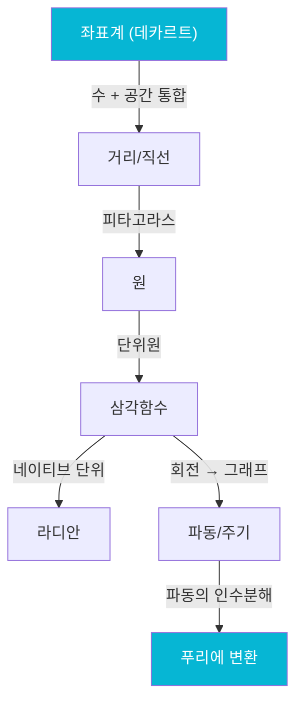

# 라디안, 파동, 그리고 인수분해

360°가 한 바퀴인 건 수학적 필연이 아니야. 바빌로니아 사람들이 60진법을 썼고 360이 약수가 많아서 편했을 뿐이야. 수학적으로 보면 **임의적인 레거시 단위**지.

그러면 "수학적으로 자연스러운 각도 단위"가 있을까?

---

## 라디안: 원 자체가 정의하는 단위

아이디어는 단순해:

> **"반지름 길이만큼 원호를 걸으면, 그때 벌어진 각도를 1라디안으로 하자."**

원의 둘레 = 2πr이니까:

```
360° = 2π rad
180° = π rad
90°  = π/2 rad
```

### 왜 라디안이 "자연스러운가"

도(degree)를 쓰면 공식마다 보정 상수가 붙어. 라디안을 쓰면 깔끔해져:

```
// 도를 쓰면
호의 길이 = (θ/360) × 2πr    ← 변환 필요

// 라디안을 쓰면
호의 길이 = θ × r             ← 깔끔
```

그리고 결정적으로, 미적분에서:

```
// 라디안일 때
sin(x)의 미분 = cos(x)           ← 깔끔

// 도일 때
sin(x°)의 미분 = (π/180)cos(x°)  ← 보정 상수가 계속 따라다님
```

<Callout type="note" title="반복 테마: 코드 동형">
라디안은 "원의 기하학에서 자연스럽게 나오는 단위"라서 다른 수학과 마찰 없이 맞물려. 도를 쓰면 매번 어댑터(`π/180`)가 필요하고. **어댑터 없이 바로 호환되는 네이티브 인터페이스**가 라디안인 셈이야.
</Callout>

---

## 핵심 각도: 외우지 말고 도출하기

단위원에서 핵심 각도들:

| θ | 좌표 (cos θ, sin θ) | 기억법 |
|---|---|---|
| 0 | (1, 0) | 시작점 |
| π/6 (30°) | (√3/2, 1/2) | 정삼각형 반쪽 |
| π/4 (45°) | (√2/2, √2/2) | 정사각형 대각선 |
| π/3 (60°) | (1/2, √3/2) | π/6의 sin, cos 뒤바뀜 |
| π/2 (90°) | (0, 1) | 꼭대기 |

외울 필요 없어. 원리만 알면 돼:

<Steps>
<Step title="π/4 (45°)">
정사각형의 대각선이니까 `x = y`. `x² + y² = 1`이면 `2x² = 1`, `x = √2/2`
</Step>
<Step title="π/6 (30°)과 π/3 (60°)">
정삼각형을 반으로 쪼갠 것. 서로 sin과 cos이 뒤바뀌는 관계.
</Step>
<Step title="나머지">
0과 π/2는 단위원 위에서 자명. π, 3π/2는 대칭.
</Step>
</Steps>

**구조를 알면 값은 도출할 수 있어.** 외운 값은 까먹지만, 도출 과정은 안 까먹어.

---

## cos²θ + sin²θ = 1

단위원 위의 점이 `(cos θ, sin θ)`이고 원의 방정식이 `x² + y² = 1`이니까:

```
cos²θ + sin²θ = 1
```

이건 피타고라스 정리를 삼각함수로 쓴 것일 뿐이야. 새로운 공식이 아니라 **같은 사실의 다른 표현**. 이걸로부터 다른 삼각함수 항등식들이 전부 파생돼.

---

## 회전을 펼치면 사인파

단위원 위의 점이 θ에 따라 회전할 때, y좌표(= sin θ)만 추적해서 그래프로 그리면:

```
단위원:               그래프로 펼치면:

    * <- y좌표 추적     sin theta
   /                  1 |  /\
  / theta                | /  \
 *----              0 ---/-----\--/--- theta
                        |       \/
                   -1 |
                        0  pi   2pi  3pi
```

원을 한 바퀴 돌면(θ: 0 → 2π) sin이 0 → 1 → 0 → -1 → 0으로 한 사이클. 계속 돌면 같은 패턴이 무한 반복돼. 이게 **주기성**이야.

### sin과 cos의 관계

```
cos θ = sin(θ + π/2)
```

cos은 sin을 π/2만큼 앞으로 당긴 것일 뿐이야. 같은 파동인데 시작점만 다른 거지. 원 위에서 보면 자명해 -- cos은 x좌표, sin은 y좌표인데, x축이 y축보다 90°(= π/2) 앞서 있잖아.

---

## 파동의 세 가지 속성

일반적인 사인파: `A sin(ωθ + φ)`

| 속성 | 기호 | 의미 | 비유 |
|------|------|------|------|
| 진폭 (Amplitude) | A | 파동의 높이 | 볼륨 조절 |
| 각진동수 (Angular frequency) | ω | 얼마나 빠르게 진동하는가 | 음의 높낮이 |
| 위상 (Phase) | φ | 시작점을 얼마나 옮기는가 | 타이밍 오프셋 |

```
A=1, omega=1: 기본 사인파    ~  ~  ~  ~
A=2, omega=1: 진폭 2배       ~     ~     ~
A=1, omega=2: 주기 절반       ~~~~  ~~~~
```

---

## 푸리에: 파동의 인수분해

세상의 반복적인 현상은 거의 다 사인파로 분해할 수 있어:

- **소리**: 공기의 진동 = 사인파들의 합성
- **빛**: 전자기파 = 사인파
- **교류전기**: 전압이 사인파로 변함
- **심장박동**: 주기적 신호

<Callout type="note" title="반복 테마: 분해">
**"아무리 복잡한 파동도 단순한 사인파들의 합으로 분해할 수 있다"** -- 이게 푸리에 변환이야.

Article 4에서 인수분해가 "구조를 드러내서 문제를 쉽게 만드는 것"이라고 했잖아. 푸리에 변환은 **파동 세계의 인수분해**야.
</Callout>

<Tabs defaultValue="analogy">
  <TabsList>
    <TabsTrigger value="analogy">비유</TabsTrigger>
    <TabsTrigger value="code">Code</TabsTrigger>
  </TabsList>
  <TabsContent value="analogy">

```
정수의 인수분해:
  12 = 2 × 2 × 3    (소수들의 곱)

다항식의 인수분해:
  x²-4x+3 = (x-1)(x-3)   (일차식들의 곱)

파동의 인수분해 (푸리에):
  복잡한 소리 = 440Hz 사인파 + 880Hz 사인파 + ...
  (기본 사인파들의 합)

전부 같은 철학:
  복잡한 것 = 단순한 기본 단위들의 조합
```

  </TabsContent>
  <TabsContent value="code">

```javascript
// MP3 압축의 원리 (개념적)
function compress(audioSignal) {
  // 1. 푸리에 변환: 파동 → 주파수 성분들로 분해
  const frequencies = fourierTransform(audioSignal);

  // 2. 인간이 못 듣는 주파수 제거 (손실 압축)
  const audible = frequencies.filter(f =>
    f.freq > 20 && f.freq < 20000 && f.amplitude > threshold
  );

  // 3. 남은 주파수만 저장
  return encode(audible);
}
// JPEG도 같은 원리: 이미지를 2D 사인파로 분해
```

  </TabsContent>
</Tabs>

음악 파일을 MP3로 압축할 수 있는 것도, 이미지를 JPEG로 압축할 수 있는 것도 이 원리 덕분이야. 복잡한 신호를 기본 사인파로 분해하고, 중요하지 않은 성분을 버리는 거지.

---

## Stage 3 마무리



| 개념 | 핵심 |
|------|------|
| 좌표계 | 수와 공간의 공통 API |
| 직교 | 축간 독립성 = zero coupling |
| 거리 | 피타고라스 = 벡터의 norm |
| 원 | 등거리 = x² + y² = r² |
| 삼각함수 | 원 위의 좌표 = (cos θ, sin θ) |
| 라디안 | 네이티브 인터페이스 |
| 푸리에 | 파동의 인수분해 |

다음은 Stage 4 -- "변화"를 정밀하게 다루기 시작해. 극한과 미분이 등장한다.
