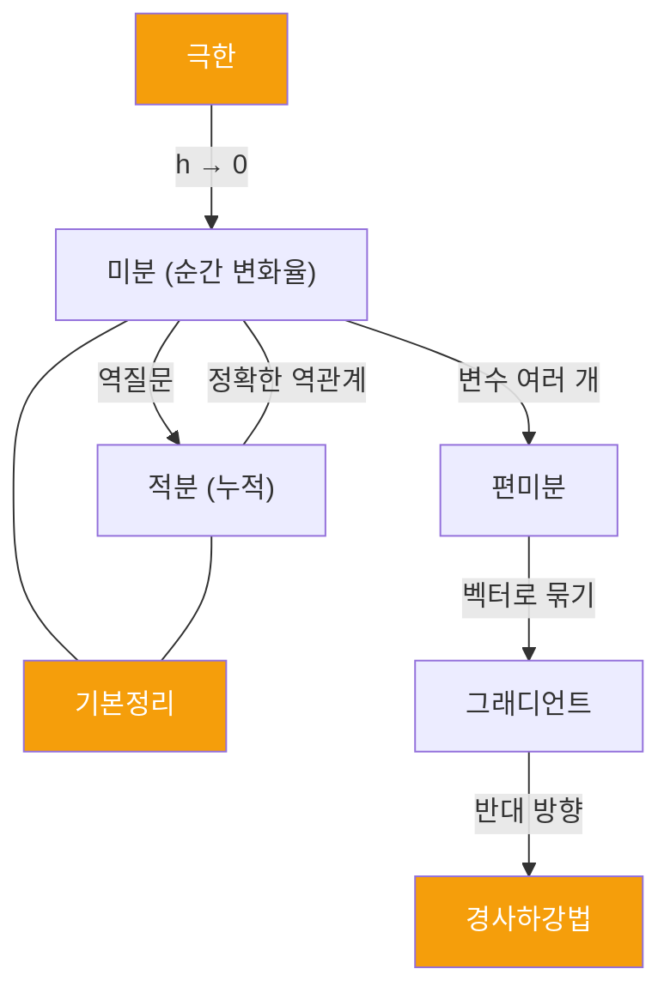

# 적분과 경사하강법: 함수의 reduce()

또 같은 패턴이야:

```
addition   <-> subtraction:   "what was added?"
multiply   <-> division:      "what was multiplied?"
exponent   <-> log:           "how many times?"
derivative <-> integral:      "what was the original?"
```

미분이 "이 함수의 변화율은?"이라는 질문이면, 적분은 **"이 변화율의 원래 함수는?"**이야.

---

## 적분 = 미분의 역질문

```
f(x) = x²   --differentiate-->  f'(x) = 2x
f'(x) = 2x  --integrate------>  f(x) = x² + C
```

그 **C**는 뭐냐면 -- 미분하면 상수가 사라지잖아. `(x² + 5)' = 2x`, `(x² - 3)' = 2x`. 역으로 가면 원래 상수가 뭐였는지 알 수 없어. 그래서 "모르는 상수 C"를 붙이는 거야.

<MathCodeBridge title="적분 = git patch" connections="미분 :: git diff | 적분 :: git patch (apply) | +C (적분상수) :: base commit">

```math
미분: f → f'  (변화율 추출)
적분: f' → f + C (원래 함수 복원)

+C = "원래 상수를 모름"
```

```ts
// git 비유
diff:  tells you what changed    (derivative)
patch: reconstructs the file     (integral)
       but needs a base commit   (+C)

// diff만으로는 "원본 파일"을 못 복원
// 어떤 상태에서 시작했는지 알아야 함
```

</MathCodeBridge>

<Callout type="note" title="반복 테마: 연산 ↔ 역연산">
미분 ↔ 적분. 이 시리즈에서 계속 봤던 그 구조 -- 모든 연산에는 역연산이 있다.
</Callout>

---

## 적분의 또 다른 얼굴: 잘게 쪼개서 합하기

곡선 아래 넓이를 구하고 싶다고 하자:

```
   y
     |         _/|
     |       _/  |
     |     /  :  |    chop into thin rectangles
     |   / :  :  |    width = dx (very small)
     | /  :  :  :  |  height = f(x) at each point
     |/:  :  :  :  |
   --+--+--+--+--+--> x
```

구간을 아주 얇은 직사각형들로 쪼개면, 각 직사각형의 넓이 = `f(x) × dx`. 전부 합하면 전체 넓이에 가까워져. 직사각형을 무한히 얇게 만들면 정확한 넓이가 돼.

```
area ≈ f(x1)*dx + f(x2)*dx + f(x3)*dx + ...
     = sum of f(xi)*dx

as dx -> 0 and number of rectangles -> infinity:
area = integral of f(x) dx
```

사실 적분 기호 `∫` 자체가 S(Sum)를 길게 늘인 거야. 라이프니츠가 "합산"이라는 의미를 기호에 담은 거지.

<Tabs defaultValue="code">
  <TabsList>
    <TabsTrigger value="code">Code</TabsTrigger>
    <TabsTrigger value="analogy">비유</TabsTrigger>
  </TabsList>
  <TabsContent value="code">

```javascript
// numerical integration = literally this idea
function integrate(f, a, b, n = 10000) {
  const dx = (b - a) / n;
  let sum = 0;
  for (let i = 0; i < n; i++) {
    sum += f(a + i * dx) * dx;  // rectangle area
  }
  return sum;
}

integrate(x => x * x, 0, 3);  // ≈ 9
```

  </TabsContent>
  <TabsContent value="analogy">

```
미분이 diff였다면, 적분은 reduce(accumulate)

derivative:  [1, 4, 9, 16] -> diff   -> [3, 5, 7]
             (values)                    (changes)

integral:    [3, 5, 7]     -> reduce -> [1, 4, 9, 16]
             (changes)                   (accumulated + initial C)
```

  </TabsContent>
</Tabs>

---

## 미적분의 기본정리: 가장 아름다운 연결

두 개의 전혀 다른 질문이 있었어:

```
부정적분: "어떤 함수를 미분하면 f(x)가 되나?"  (역미분)
정적분:   "f(x) 곡선 아래 넓이는?"              (합산)
```

하나는 역미분, 하나는 넓이 합산. 전혀 다른 질문 같잖아. **이 둘이 사실 같은 것이라는 게 미적분의 기본정리야.**

### 핵심 통찰

"0부터 x까지의 넓이"를 새로운 함수 `A(x)`로 정의하자:

```
A(x) = area under f from 0 to x
```

x를 조금 늘리면(x에서 x+h로) 넓이가 얼마나 늘어날까?

```
추가된 넓이 ≈ 얇은 직사각형 = f(x) * h

A(x+h) - A(x) ≈ f(x) * h

(A(x+h) - A(x)) / h ≈ f(x)

take limit h -> 0:

A'(x) = f(x)
```

**넓이 함수를 미분하면 원래 함수가 나온다.**

```
         differentiate
    f  ────────────────>  f'
    f  <────────────────  f'
          integrate

"순간의 변화를 다 모으면 전체가 되고,
 전체를 순간으로 쪼개면 변화가 된다."
```

<Callout type="info" title="새로운 공리가 아니다">
미적분의 기본정리는 별도의 새로운 원리가 아니야. **미분의 정의** + "넓이가 얇은 직사각형씩 쌓인다"는 기하학적 직관, 이 둘을 합치면 자동으로 나와. Stage 1에서 계속 봤던 그 패턴 -- 새로운 걸 발명하는 게 아니라, **기존 규칙에서 필연적으로 따라오는 결과를 발견하는 것.**
</Callout>

### 실용적 위력

이 정리 덕분에, 넓이를 구할 때 직사각형을 무한히 쪼갈 필요가 없어져:

```
without the theorem:
  area = lim (sum of millions of tiny rectangles)  <- painful

with the theorem:
  area from a to b = F(b) - F(a)
  where F is any antiderivative of f

  just find F, plug in two numbers, subtract. done.
```

**무한한 합산을 뺄셈 한 번으로 바꿔버린 거야.**

---

## 편미분: 한 방향씩 독립적으로

지금까지 본 함수는 전부 입력이 하나였어. 근데 현실에서는 입력이 여러 개인 경우가 대부분이야:

```
revenue(price, quantity) = price * quantity
loss(w1, w2, w3, ...)   = ML model's error function
```

편미분의 아이디어: **다른 변수를 전부 상수 취급하고, 하나에 대해서만 미분하자.**

```
f(x, y) = x² + 3xy + y²

∂f/∂x = 2x + 3y      (y is treated as constant)
∂f/∂y = 3x + 2y      (x is treated as constant)
```

그게 전부야. **"한 방향으로만 기울기를 본다"**는 거야.

<Callout type="note" title="반복 테마: 직교성">
x 방향 기울기와 y 방향 기울기를 독립적으로 구할 수 있어. 왜? 좌표축이 직교하니까. Article 5에서 "직교 = 축간 독립성"이라고 정리했잖아. 편미분이 가능한 이유가 바로 그 독립성이야.
</Callout>

---

## 그래디언트: 편미분의 벡터

각 방향의 기울기를 하나로 묶으면:

```
gradient of f = (∂f/∂x, ∂f/∂y) = (2x + 3y, 3x + 2y)

this is a VECTOR
- it points in the direction of steepest increase
- its magnitude = how steep that increase is
```

그래디언트 = **"이 지점에서 어느 방향으로 가야 가장 빨리 올라가는가"**

그리고 내려가고 싶으면? **반대 방향으로 가면 돼.** 이게 경사하강법이야.

---

## 경사하강법: ML 학습의 핵심

<Tabs defaultValue="code">
  <TabsList>
    <TabsTrigger value="code">Code</TabsTrigger>
    <TabsTrigger value="math">Math</TabsTrigger>
  </TabsList>
  <TabsContent value="code">

```javascript
// gradient descent pseudocode
// goal: find parameters that minimize loss

let params = randomInit();

for (let step = 0; step < 10000; step++) {
  const grad = computeGradient(loss, params);
  // partial derivatives for each parameter

  params = params.map((p, i) =>
    p - learningRate * grad[i]
  );
  // step downhill (opposite to gradient)
}

// you end up at (or near) the minimum of the loss function
```

  </TabsContent>
  <TabsContent value="math">

```
gradient descent:

1. start at random point
2. compute gradient = (∂L/∂w1, ∂L/∂w2, ..., ∂L/∂wn)
3. update: w_new = w_old - α * gradient
   (α = learning rate, gradient = steepest uphill)
4. repeat until convergence

imagine a hill:
        /\
       /  \
      / you \     gradient = steepest uphill
     /  *--->    negative gradient = steepest downhill
    /____________\
```

  </TabsContent>
</Tabs>

매 스텝마다 "지금 위치에서 가장 가파르게 내려가는 방향"을 편미분으로 계산하고, 그 방향으로 조금 이동. 반복하면 골짜기(최솟값)에 도달해.

### Stage 4에서 Stage 5로의 다리

편미분에서 벡터가 자연스럽게 등장했어. 그래디언트는 **편미분들을 모아놓은 벡터**야.

```
one variable:   derivative = a number (scalar)
many variables: gradient   = a vector (list of partial derivatives)
```

변수가 많아지면 벡터와 행렬이 필수 도구가 돼. 그래서 선형대수가 필요한 거야.

---

## Stage 4 마무리



| 개념 | 핵심 | 비유 |
|------|------|------|
| 극한 | "무한"을 안전하게 다루기 | `while(h > epsilon)` |
| 미분 | 순간 변화율 | `git diff` |
| 적분 | 누적 합산 | `reduce()` |
| 기본정리 | 미분과 적분은 역관계 | `diff ↔ patch` |
| 편미분 | 한 방향씩 독립적으로 | 직교축별 기울기 |
| 그래디언트 | 편미분의 벡터 | 가장 가파른 방향 |
| 경사하강법 | 그래디언트 반대로 이동 | ML 학습 |

다음은 Stage 5 -- 드디어 벡터, 행렬, 변환의 세계. 개발자한테 가장 실용적인 파트이기도 해.
